# Versanddatum berechnen{#computing-the-sending-date}

Sie können eine Formel definieren, um die Nachricht an jeden Empfänger an einem bestimmten Datum und zu einer bestimmten Uhrzeit zu senden.

## Datumsformel anpassen     {#customizing-date-formula}

Die Optimierung des Versandzeitpunkts ist beispielsweise während der Anlaufphase Ihrer Marketingaktivitäten nützlich.

Wenn E-Mails über eine neue Plattform versendet werden, sind ISPs normalerweise misstrauisch gegenüber den neuen IP-Adressen. Das plötzliche Versenden großer Mengen an E-Mails veranlasst ISPs oft dazu, sie als Spam zu qualifizieren.

Um dies zu verhindern, können Sie das Datenvolumen schrittweise erhöhen, indem Sie den Versand von großen Mengen von E-Mails auf mehrere Zeitpunkte aufteilen. Dies gewährleistet eine reibungslose Anlaufphase, da die Gesamtrate ungültiger Adressen verringert wird.

Sie können Ihre Ziel-Audience beliebig aufteilen und Ihren Versand beispielsweise in fünf Teilsendungen versenden. So können Sie die erste Teilsendung von 10 % Ihrer Ziel-Audience am 1. Juni um 10 Uhr durchführen, die zweite Teilsendung von 15 % der Audience 24 Stunden später und so weiter.

Diese Abfolge kann mit einem Workflow terminiert werden.

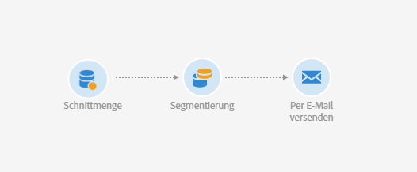

1. Gehen Sie in die Liste der Marketing-Aktivitäten und erstellen Sie einen neuen Workflow. Lesen Sie diesbezüglich auch den Abschnitt [Workflows erstellen](../../automating/using/building-a-workflow.md#creating-a-workflow).
1. Ziehen Sie eine **Abfrage** in den Workflow-Arbeitsbereich und öffnen Sie sie. Siehe den Abschnitt [Abfrage](../../automating/using/query.md).
1. Wählen Sie eine Audience aus, z. B. alle Ihre Gold-Kunden und klicken Sie auf **[!UICONTROL Bestätigen]**, um die Abfrage zu speichern.
1. Ziehen Sie eine **Segmentierung** in den Workflow-Arbeitsbereich und öffnen Sie sie. Siehe den Abschnitt [Segmentierung](../../automating/using/segmentation.md).
1. Definieren Sie fünf Segmente. Gehen Sie für jedes Segment folgendermaßen vor:

   * Füllen Sie das Feld **[!UICONTROL Segmentcode]** aus: Geben Sie manuell den gewünschten Zeitpunkt für den Versand der Nachricht ein.

     Beispiel: Sie möchten den ersten Teilversand am 1. Juni um 10 Uhr (GMT+1) durchführen. Verwenden Sie dazu das folgende Format: **JJJJ-MM-TT hh:mm:ss+tz**.

     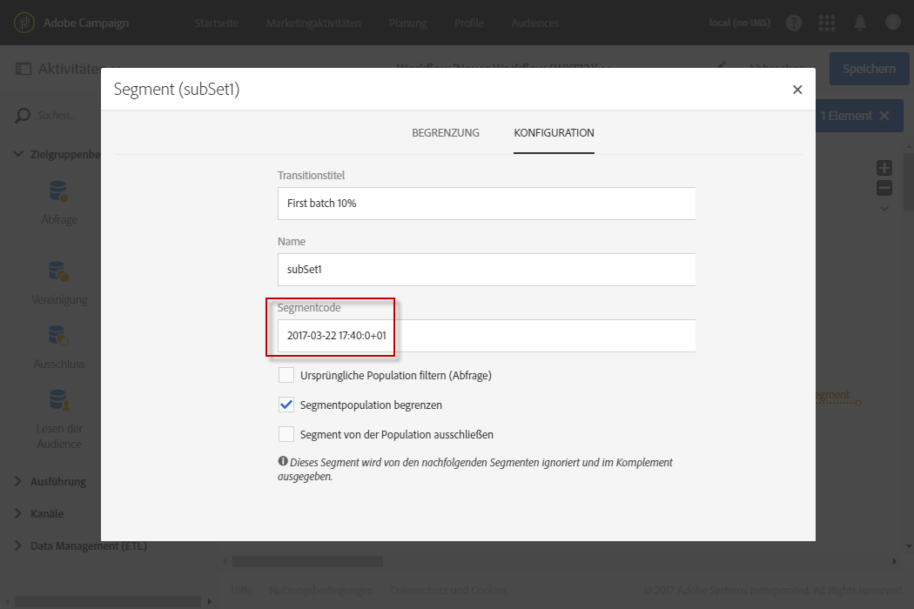

     Um die nächste Teilsendung am nächsten Tag durchzuführen, geben Sie **2017-06-02 10:00:00+01** ein.

     Definieren Sie die nächsten Teilsendungen für die restlichen Segmente folgendermaßen:

      * **2017-06-03 10:00:00+01**
      * **2017-06-04 10:00:00+01**
      * **2017-06-05 10:00:00+01**

   * Wählen Sie die Option **[!UICONTROL Segmentpopulation begrenzen]** aus.

     Wählen Sie im Tab **[!UICONTROL Begrenzung]** die Option **[!UICONTROL Zufällige Auswahl]** aus und geben Sie für jedes Segment den gewünschten Prozentsatz ein: 10 für die erste Teilsendung, 15 für die zweite etc.

     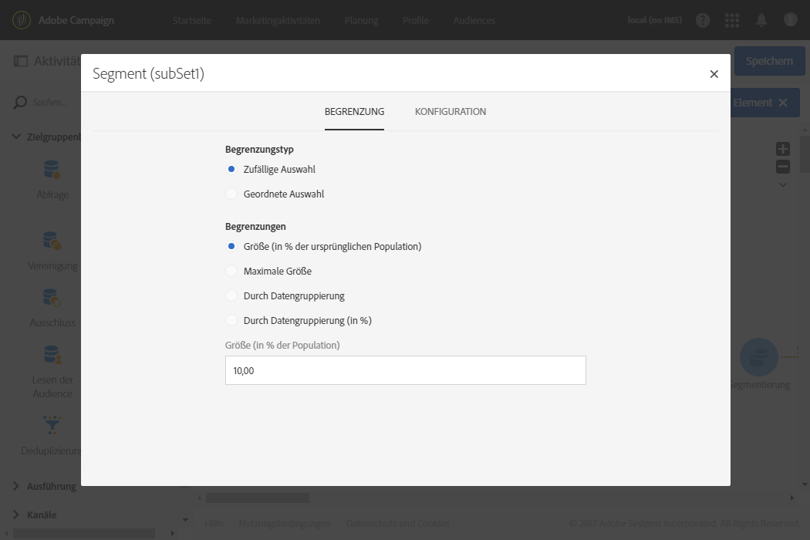

1. Wählen Sie **[!UICONTROL Alle Segmente in derselben Transition erzeugen]** aus und danach **[!UICONTROL Bestätigen]**.

   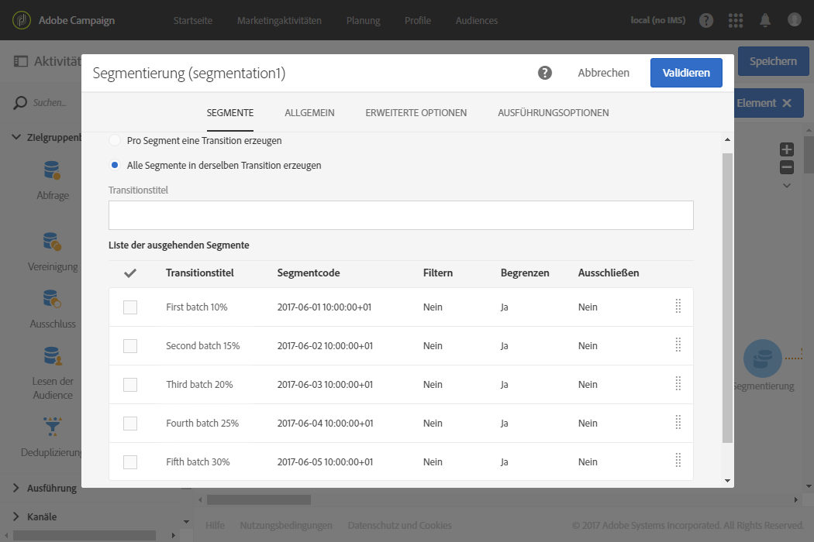

1. Ziehen Sie einen **E-Mail-Versand** in den Workflow-Arbeitsbereich und öffnen Sie ihn. Siehe den Abschnitt [E-Mail-Versand](../../automating/using/email-delivery.md).
1. Wählen Sie den Bereich **[!UICONTROL Planung]** im E-Mail-Dashboard und danach **[!UICONTROL Nachrichten werden automatisch am unten spezifizierten Datum gesendet]** aus.
1. Definieren Sie im Feld **[!UICONTROL Start des Versands am]** ein Kontaktdatum.
1. Wählen Sie aus der Sedezeitoptimierungs-Dropdown-Liste **[!UICONTROL Zu einem durch eine Formel definierten Datum senden]** aus.
1. Wählen Sie die Schaltfläche **[!UICONTROL Ausdruck bearbeiten]** im Feld **[!UICONTROL Benutzerdefinierte Datumsformel]** aus.

   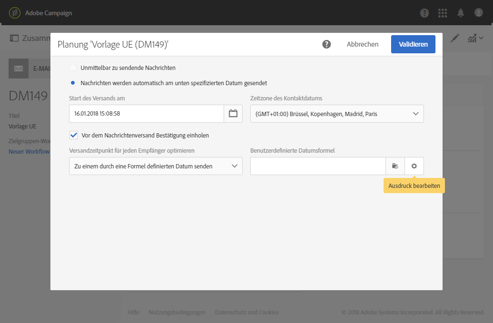

1. Erstellen Sie mit der Funktion **[!UICONTROL ToDateTime]** und dem Feld **[!UICONTROL Segmentcode]** den folgenden Ausdruck. Sie können den Ausdruck auch direkt eingeben. Achten Sie jedoch dabei auf die korrekte Syntax und Schreibweise.

   ```
   ToDateTime([targetData/@segmentCode])
   ```

   Die Funktion **[!UICONTROL ToDateTime]** wandelt den Segmentcode von einem Textstring in einen Datums- und Uhrzeit-Wert um.

   Bestätigen Sie den Ausdruck, um zum vorherigen Bildschirm zurückzukehren.

   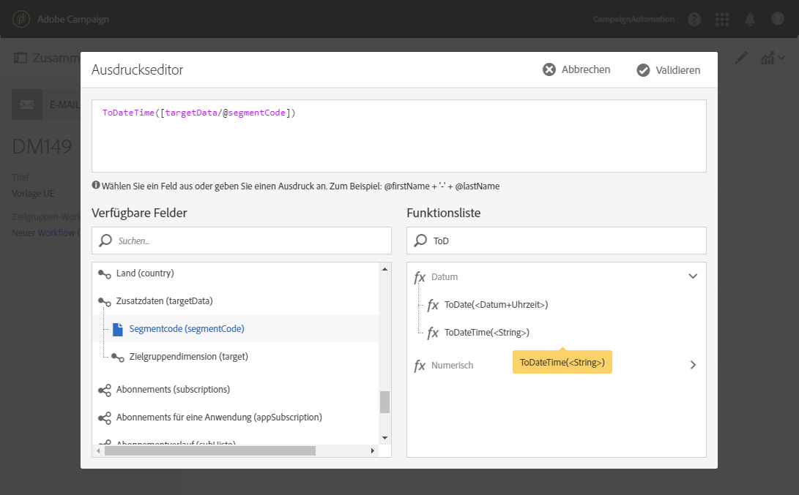

   Im Fenster **[!UICONTROL Planung]** wird die benutzerdefinierte Datumsformel folgendermaßen dargestellt:

   ```
   ToDateTime([targetData/@segmentCode])
   ```

   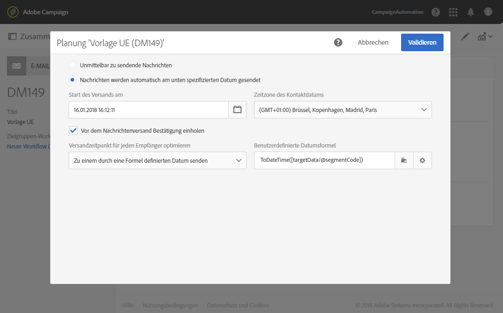

1. Validieren Sie die Planung, speichern Sie den Versand und starten Sie den Workflow.

Der Versand wird auf fünf Tage verteilt an alle Empfänger gesendet.

>[!NOTE]
>
>Achten Sie bei der Validierung des Versands darauf, dass alle Daten in der Zukunft liegen. Ansonsten werden die Nachrichten unmittelbar nach der Validierung gesendet.

## Ausdruck verwenden     {#using-an-expression}

Die Versandzeitoptimierung ist auch für Callcenter-Kampagnen hilfreich. Damit können Sie gewährleisten, dass nicht alle Nachrichten zur selben Zeit beim Empfänger eintreffen. Dadurch kann Ihr Unternehmen die Anzahl der Anrufe entsprechend seiner Kapazität steuern.

Beispiel: Sie laden in einer E-Mail Ihre Kunden ein, das Callcenter zu kontaktieren, um ein Werbeangebot einzulösen. Damit das Callcenter nicht mit Anrufen überflutet wird, segmentieren Sie Ihre Ziel-Audience zufällig und senden Ihre E-Mails in vier Teilsendungen.

Diese Abfolge kann mit einem Workflow terminiert werden.

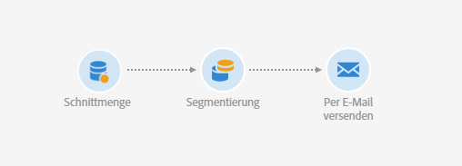

1. Gehen Sie in die Liste der Marketing-Aktivitäten und erstellen Sie einen neuen Workflow. Lesen Sie diesbezüglich auch den Abschnitt [Workflows erstellen](../../automating/using/building-a-workflow.md#creating-a-workflow).
1. Ziehen Sie eine **Abfrage** in den Workflow-Arbeitsbereich und öffnen Sie sie. Siehe den Abschnitt [Abfrage](../../automating/using/query.md).
1. Wählen Sie eine Audience aus, z. B. 35 Profile, und klicken Sie auf **[!UICONTROL Bestätigen]**, um die Abfrage zu speichern.
1. Ziehen Sie eine **Segmentierung** in den Workflow-Arbeitsbereich und öffnen Sie sie. Siehe den Abschnitt [Segmentierung](../../automating/using/segmentation.md).
1. Definieren Sie vier Segmente. Gehen Sie für jedes Segment folgendermaßen vor:

   * Definieren Sie die Segmentcodes:

      * 8:00 - 10:00: **0**. Die Nachricht wird an das erste Viertel der Zielpopulation um 8 Uhr gesendet (Kontaktdatum).
      * 10:00 - 12:00: **2**. Die Nachricht wird an das zweite Viertel der Zielpopulation um 10 Uhr gesendet (Kontaktdatum + 2 Stunden).
      * 14:00 - 16:00: **6**. Da das Callcenter zwischen 12 und 14 Uhr geschlossen ist, wird die Nachricht an das dritte Viertel der Zielpopulation um 14 Uhr gesendet (Kontaktdatum + 6 Stunden).
      * 16:00 - 18:00: **8**. Die Nachricht wird an das letzte Viertel der Zielpopulation um 16 Uhr gesendet (Kontaktdatum + 8 Stunden).

     >[!NOTE]
     >
     >Das Kontaktdatum wird später im Workflow in der E-Mail-Versand-Aktivität definiert.

   * Wählen Sie die Option **[!UICONTROL Segmentpopulation begrenzen]** aus.
   * Wählen Sie im Tab **[!UICONTROL Begrenzung]** die Option **[!UICONTROL Zufällige Auswahl]** aus und geben Sie für jedes Segment den gewünschten Prozentsatz ein: **25**.

1. Wählen Sie **[!UICONTROL Alle Segmente in derselben Transition erzeugen]** aus und danach **[!UICONTROL Bestätigen]**.

   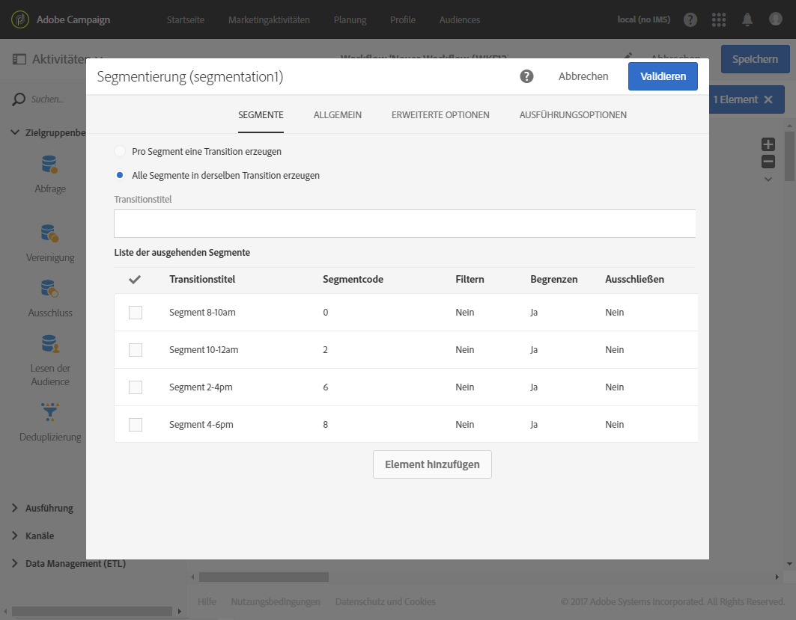

1. Ziehen Sie einen **E-Mail-Versand** in den Workflow-Arbeitsbereich und öffnen Sie ihn. Siehe den Abschnitt [E-Mail-Versand](../../automating/using/email-delivery.md).
1. Wählen Sie im E-Mail-Dashboard den Bereich **[!UICONTROL Planung]** aus.
1. Wählen Sie **[!UICONTROL Nachrichten werden automatisch am unten spezifizierten Datum gesendet]** aus.
1. Definieren Sie im Feld **[!UICONTROL Start des Versands am]** ein Kontaktdatum.

   Wählen Sie für dieses Beispiel den 25. Mai, 8 Uhr aus.

1. Wählen Sie aus der Sedezeitoptimierungs-Dropdown-Liste **[!UICONTROL Zu einem durch eine Formel definierten Datum senden]** aus und klicken Sie auf die Schaltfläche **[!UICONTROL Ausdruck bearbeiten]**.

   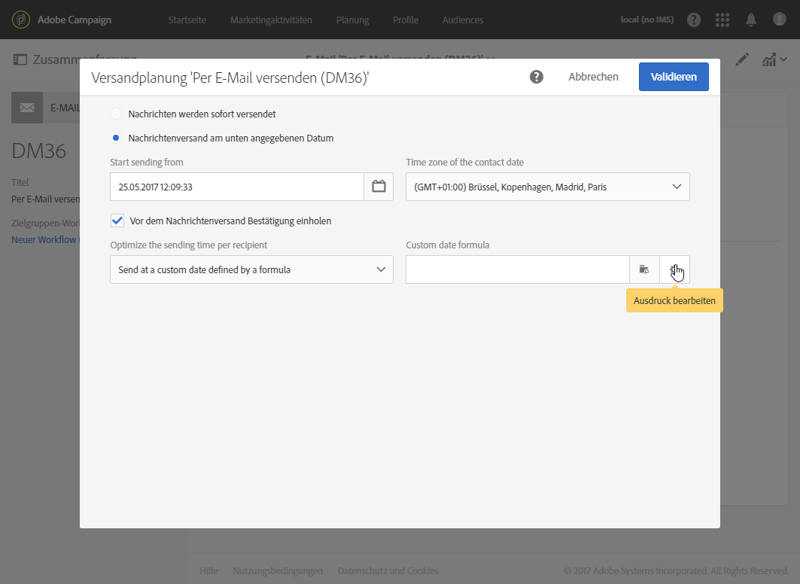

1. Definieren Sie im **[!UICONTROL Ausdruckseditor]** das Datum und die Segmentcodes, um für jeden Kunden das Datum zu berechnen.

   Wählen Sie in der Funktionsliste die Option **[!UICONTROL AddHours aus]**.

   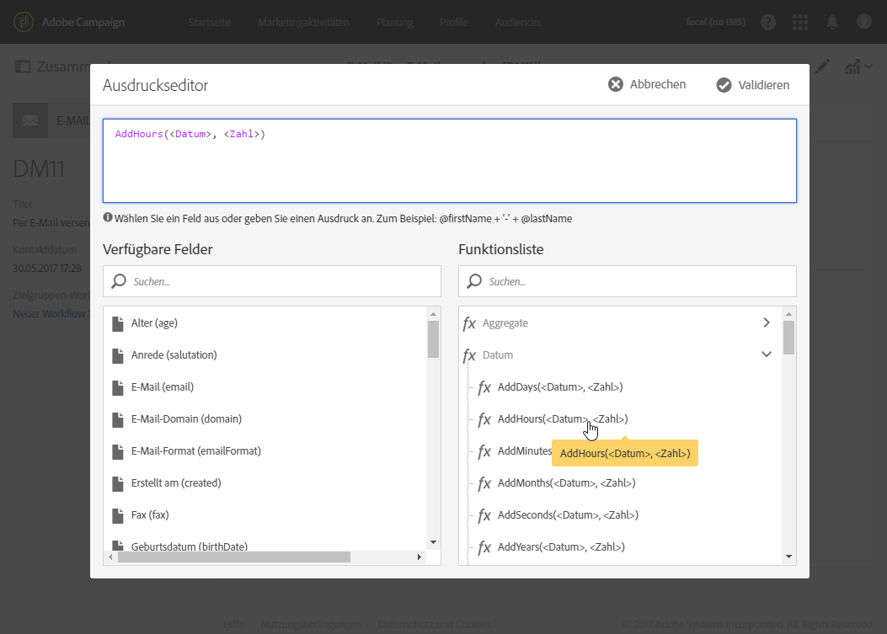

   Wählen Sie in den verfügbaren Feldern **[!UICONTROL Aktueller Versand]** > **[!UICONTROL Versandauslösung]** > **[!UICONTROL Kontaktdatum]** aus.

   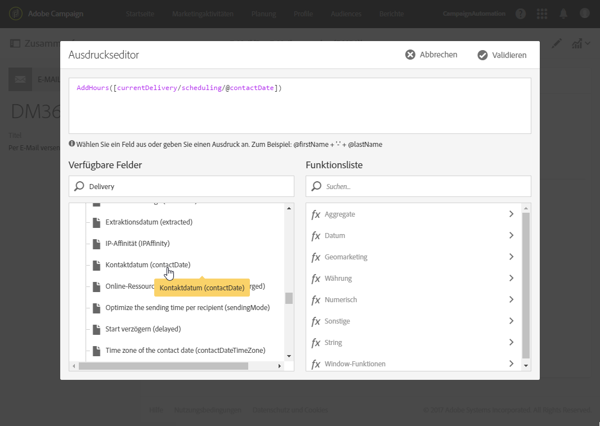

   Dadurch können Sie das im Feld **[!UICONTROL Start des Versands am]** spezifizierte Datum und die Uhrzeit abrufen.

   Wählen Sie in der Funktionsliste die Option **[!UICONTROL ToInteger aus]**. Wählen Sie in den verfügbaren Feldern **[!UICONTROL Zusatzdaten]** > **[!UICONTROL Segmentcode]** aus.

   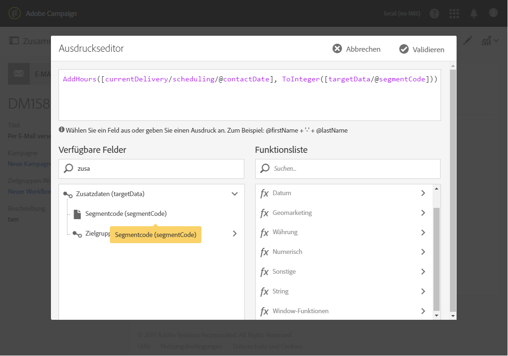

   Dadurch können Sie die in den Segmentcodes spezifizierten Zahlen abrufen.

   Sie erhalten die folgende Formel:

   ```
   AddHours([currentDelivery/scheduling/@contactDate], ToInteger([targetData/@segmentCode]))
   ```

1. Validieren Sie Ihren Ausdruck, um ihn zu speichern. Validieren Sie die Planung, speichern Sie den Versand und starten Sie den Workflow.

* Das erste Segment erhält die Nachricht am Kontaktdatum (25. Mai, 8 Uhr).
* Das zweite Segment erhält die Nachricht zwei Stunden später (25. Mai, 10 Uhr).
* Das dritte Segment erhält die Nachricht sechs Stunden später (25. Mai, 14 Uhr).
* Das vierte Segment erhält die Nachricht acht Stunden später (25. Mai, 16 Uhr).
