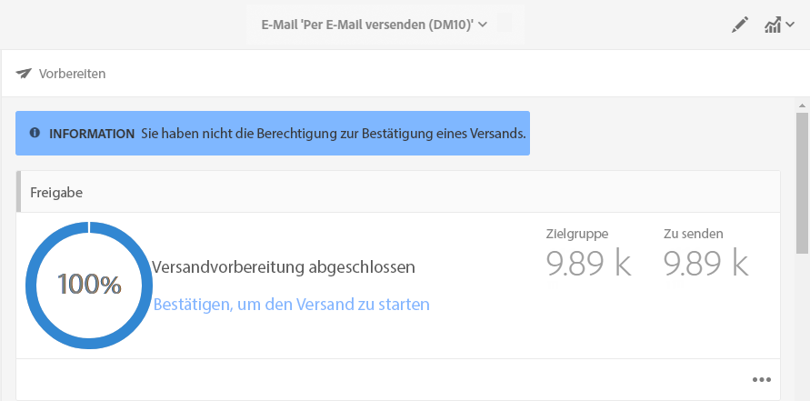
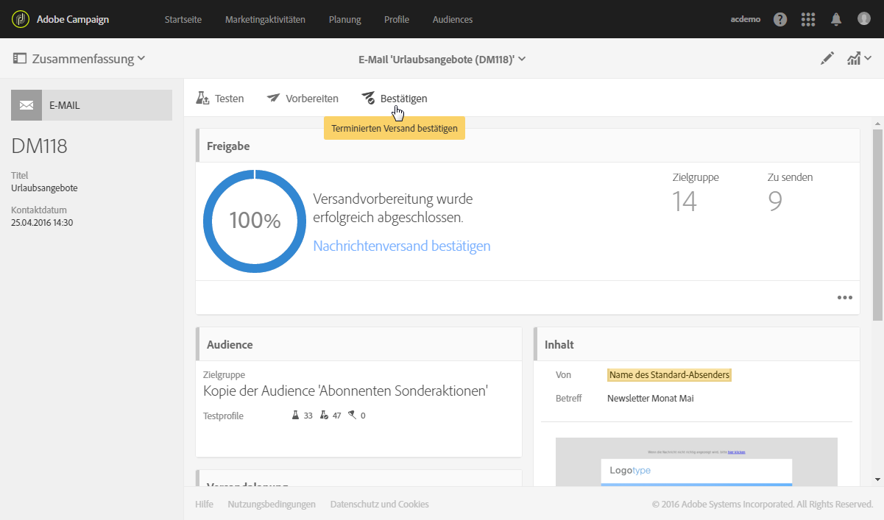
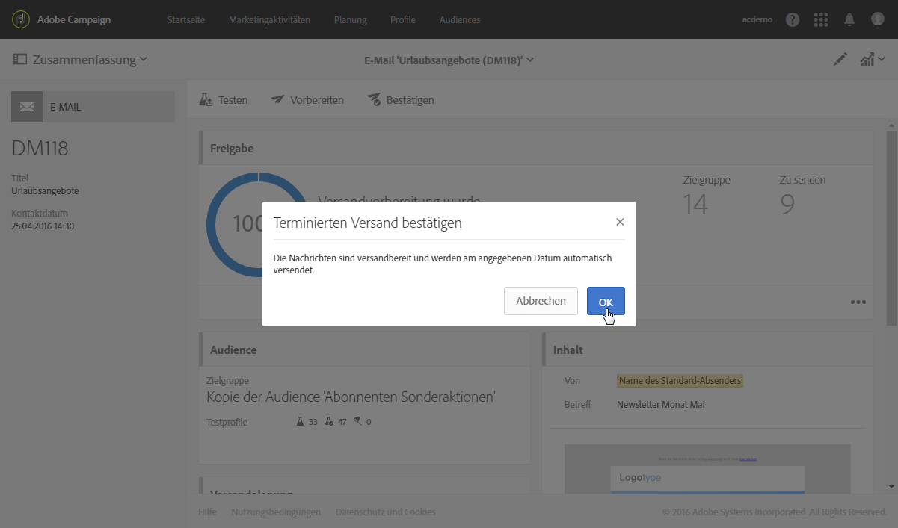
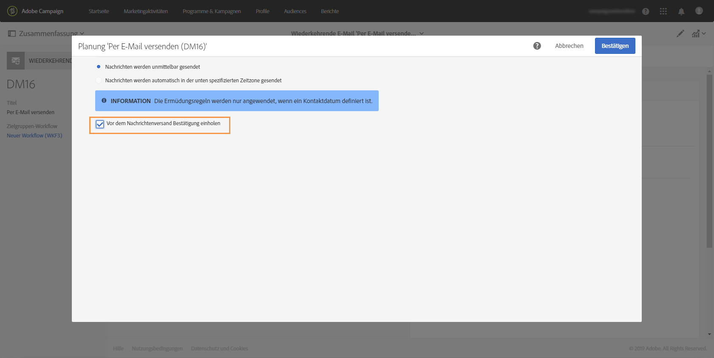
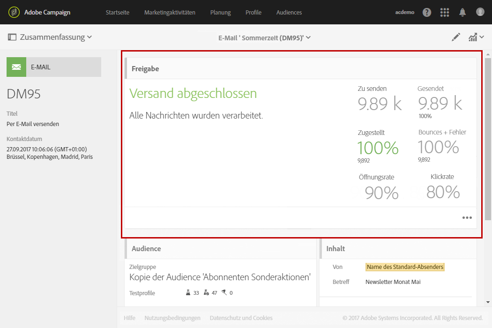
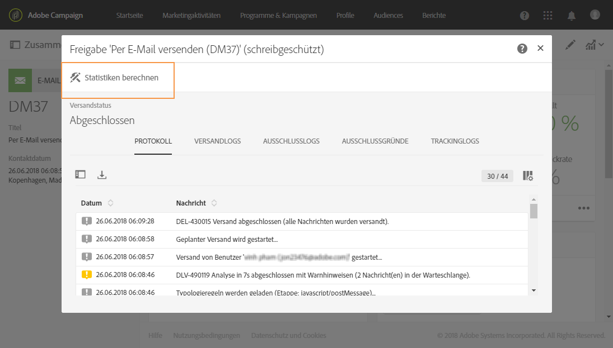
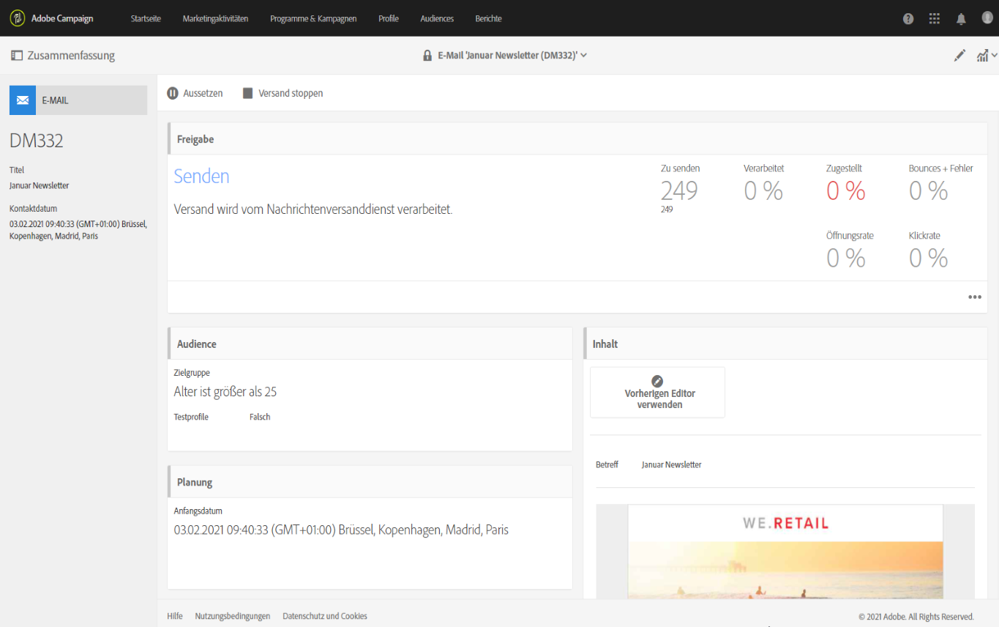
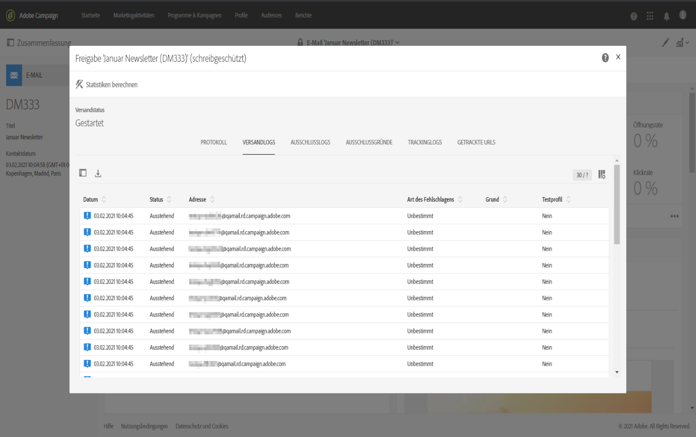

# Versand bestätigen{#confirming-the-send}

Nach erfolgreicher Vorbereitung und Validierung Ihrer Nachrichten können Sie den Versandstart bestätigen. Weiterführende Informationen zur Nachrichtenvorbereitung finden Sie im Abschnitt [Versandvorbereitung](../../sending/using/preparing-the-send.md).

Nur Benutzer mit der Benutzerrolle **[!UICONTROL Sendungen starten]** können den Versand bestätigen. Lesen Sie diesbezüglich auch den Abschnitt [Liste der Rollen](../../administration/using/list-of-roles.md).

<!--Users without this role will see the following message: 

-->

## Nachricht senden {#sending-message}

Nachdem die Vorbereitung abgeschlossen ist, führen Sie die folgenden Schritte aus, um Ihre Nachricht zu senden.

1. Klicken Sie in der Aktionsleiste Ihrer Nachricht auf die Schaltfläche **[!UICONTROL Versand bestätigen]**.

   

1. Schließen Sie den Sendevorgang ab, indem Sie auf die Schaltfläche **[!UICONTROL OK]** klicken.

   

1. Warten Sie, während die Nachricht gesendet wird. Die Kachel **[!UICONTROL Bereitstellung]** zeigt den Verarbeitungsfortschritt an.

>[!NOTE]
>
>Wenn die Meldung geplant ist, wird sie gesendet, sobald die Sendezeit erreicht ist. Weiterführende Informationen zum Planen von Nachrichten finden Sie in [diesem Abschnitt](../../sending/using/about-scheduling-messages.md).

Wenn Sie einen wiederkehrenden Versand ohne Aggregat-Zeitraum verwenden, können Sie vor dem Senden der Nachrichten eine Bestätigung anfordern. Öffnen Sie dazu bei der Konfiguration Ihrer Nachricht im Versand-Dashboard die Kachel **[!UICONTROL Planung]** und aktivieren Sie die entsprechende Option.

## Nachrichtenindikatoren {#message-indicators}

Nach Abschluss des Versands an die Kontakte zeigt die Kachel **[!UICONTROL Bereitstellung]** Ihre KPI-Daten (Key Performance Indicators) an:

* Anzahl zu sendender Nachrichten
* Anzahl gesendeter Nachrichten
* Anteil zugestellter Nachrichten,
* Anteil von Bounces und Fehlern
* Anteil offener Nachrichten
* Anteil an Nachrichten, in denen geklickt wurde (im Fall von E-Mails).

  >[!NOTE]
  >
  >Die **[!UICONTROL Öffnungsrate]** und die **[!UICONTROL Clickthrough-Rate]** werden stündlich aktualisiert.

Wenn die Aktualisierung der KPIs zu lange dauert oder die Ergebnisse aus den Versandlogs nicht berücksichtigt werden, klicken Sie auf die Schaltfläche **[!UICONTROL Statistiken berechnen]** im Fenster **[!UICONTROL Bereitstellung]**.

Die Nachricht kann im Verlauf eines der Zielgruppenprofile angezeigt werden. Näheres wird in Abschnitt [Integriertes Kundenprofil](../../audiences/using/integrated-customer-profile.md) beschrieben.

Nach dem Versand einer Nachricht können Sie das Verhalten des Empfängers verfolgen und beobachten, um die Wirkung der Nachricht zu messen. Lesen Sie diesbezüglich auch diese Abschnitte:

* [Nachrichten tracken](../../sending/using/tracking-messages.md)
* [Sendungen überwachen](../../sending/using/monitoring-a-delivery.md)

### Berichte zum Versanderfolg {#delivered-status-report}

>[!NOTE]
>
>Dieser Abschnitt gilt nur für den E-Mail-Kanal.

In der Ansicht **[!UICONTROL Zusammenfassung]** jeder E-Mail beginnt der Prozentsatz der **[!UICONTROL zugestellten]** Nachrichten bei 100 % und sinkt dann allmählich während des [Gültigkeitszeitraums](../../administration/using/configuring-email-channel.md#validity-period-parameters) des Versands, da die Soft- und Hardbounces zurückgemeldet werden<!--from the Enhanced MTA to Campaign-->.

Alle Nachrichten werden in den [Versandlogs](../../sending/using/monitoring-a-delivery.md#sending-logs) als **[!UICONTROL Gesendet]** angezeigt, sobald sie erfolgreich von Campaign an den erweiterten MTA (Message Transfer Agent) weitergeleitet wurden. Sie bleiben in diesem Status, es sei denn, ein [Bounce](../../sending/using/understanding-delivery-failures.md#delivery-failure-types-and-reasons) wird für diese Nachricht vom erweiterten MTA an Campaign zurückgemeldet.

Wenn vom erweiterten MTA Hardbounces zurückgemeldet werden, ändert sich der Status dieser Nachrichten von **[!UICONTROL Gesendet]** in **[!UICONTROL Fehlgeschlagen]** und der **[!UICONTROL Zugestellt]**-Prozentsatz wird entsprechend verringert.

Wenn vom erweiterten MTA Softbounces zurückgemeldet werden, werden diese Nachrichten weiterhin als **[!UICONTROL Gesendet]** angezeigt und der **[!UICONTROL Zugestellt]**-Prozentsatz wird noch nicht aktualisiert. Nachrichten, bei denen ein Softbounce aufgetreten ist, erhalten dann während des Gültigkeitszeitraums des Versands [einen erneuten Zustellversuch](../../sending/using/understanding-delivery-failures.md#retries-after-a-delivery-temporary-failure):

* Wenn ein erneuter Versuch vor Ende der Gültigkeitszeitraums erfolgreich ist, bleibt der Nachrichtenstatus weiterhin **[!UICONTROL Gesendet]** und der **[!UICONTROL Zugestellt]**-Prozentsatz bleibt unverändert.

* Andernfalls ändert sich der Status in **[!UICONTROL Fehlgeschlagen]** und der **[!UICONTROL Zugestellt]**-Prozentsatz wird entsprechend verringert.

Daher sollten Sie bis zum Ende des Gültigkeitszeitraums warten, um den endgültigen Prozentsatz für **[!UICONTROL Zugestellt]** und die endgültige Anzahl der tatsächlich **[!UICONTROL gesendeten]** sowie der **[!UICONTROL fehlgeschlagenen]** Nachrichten anzuzeigen.

### E-Mail-Feedback-Service (Betaversion) {#email-feedback-service}

Mit der EFS-Funktion (E-Mail-Feedback-Service) wird der Status jeder E-Mail genau gemeldet, da Feedback direkt vom erweiterten MTA (Message Transfer Agent) erfasst wird.

>[!IMPORTANT]
>
>Der E-Mail-Feedback-Service ist derzeit als Funktion der Betaversion verfügbar.

Nachdem der Versand gestartet wurde, ändert sich der **[!UICONTROL Zugestellt]**-Prozentsatz nicht, wenn die Nachricht erfolgreich von Campaign an den erweiterten MTA weitergeleitet wurde.

Die Versandlogs zeigen für jede Zieladresse den Status **[!UICONTROL Ausstehend]** an.

Wenn der Nachrichtenversand an die Zielprofile in Echtzeit vom Enhanced MTA zurückgemeldet wird, zeigen die Versandlogs für jede Adresse, die die Nachricht erfolgreich erhalten hat, den Status **[!UICONTROL Gesendet]** an. Der **[!UICONTROL Zugestellt]**-Prozentsatz wird mit jedem erfolgreichen Versand entsprechend erhöht.

Wenn vom erweiterten MTA Hardbounces zurückgemeldet werden, ändert sich der Status dieser Nachrichten von **[!UICONTROL Ausstehend]** in **[!UICONTROL Fehlgeschlagen]** und der **[!UICONTROL Bounces + Fehler]**-Prozentsatz wird entsprechend erhöht.

Wenn vom erweiterten MTA Softbounces zurückgemeldet werden, ändert sich der Status dieser Nachrichten ebenfalls von **[!UICONTROL Ausstehend]** in **[!UICONTROL Fehlgeschlagen]** und der **[!UICONTROL Bounces + Fehler]**-Prozentsatz wird entsprechend erhöht. Der **[!UICONTROL Zugestellt]**-Prozentsatz bleibt unverändert. Nachrichten, bei denen ein Softbounce aufgetreten ist, erhalten dann während des [Gültigkeitszeitraums](../../administration/using/configuring-email-channel.md#validity-period-parameters) des Versands einen erneuten Zustellversuch:

* Wenn ein erneuter Versuch vor Ende der Gültigkeitszeitraums erfolgreich ist, ändert sich der Nachrichtenstatus in **[!UICONTROL Gesendet]** und der **[!UICONTROL Zugestellt]**-Prozentsatz wird entsprechend erhöht.

* Andernfalls bleibt der Status **[!UICONTROL Fehlgeschlagen]**. Die **[!UICONTROL Zugestellt]**- und **[!UICONTROL Bounces + Fehler]**-Prozentsätze bleiben unverändert.

>[!NOTE]
>
>Weitere Informationen zu Hard- und Softbounces finden Sie in [diesem Abschnitt](../../sending/using/understanding-delivery-failures.md#delivery-failure-types-and-reasons).
>
>Weitere Informationen zu zusätzlichen Zustellversuchen nach einem vorübergehend fehlgeschlagenen Versand finden Sie in [diesem Abschnitt](../../sending/using/understanding-delivery-failures.md#retries-after-a-delivery-temporary-failure).

<!--Soft-bouncing messages increment an error counter. When the error counter reaches the limit threshold or when the validity period is over, the address goes into quarantine and the status remains as **[!UICONTROL Failed]**. For more on conditions for sending an address to quarantine, see [this section](../../help/sending/using/understanding-quarantine-management.md#conditions-for-sending-an-address-to-quarantine).-->

### Durch EFS eingeführte Änderungen {#changes-introduced-by-efs}

Die folgenden Tabellen zeigen die Änderungen der KPIs und Versandlogstatus, die durch die EFS-Funktion eingeführt wurden.

**Mit E-Mail-Feedback-Service**

| Schritt im Versandprozess | KPI-Zusammenfassung | Versandlogstatus |
|--- |--- |--- |
| Nachricht wird erfolgreich von Campaign an den Enhanced MTA weitergeleitet | <ul><li>**[!UICONTROL Zugestellt]**-Prozentsatz beginnt bei 0 %</li><li>**[!UICONTROL Bounces + Fehler]**-Prozentsatz beginnt bei 0 %</li></ul> | Ausstehend |
| Hardbounces werden vom erweiterten MTA zurückgemeldet. | <ul><li>Keine Änderung des **[!UICONTROL Zugestellt]**-Prozentsatzes</li><li>**[!UICONTROL Bounces + Fehler]**-Prozentsatz wird entsprechend erhöht</li></ul> | Fehlgeschlagen |
| Softbounces werden vom erweiterten MTA zurückgemeldet. | <ul><li>Keine Änderung des **[!UICONTROL Zugestellt]**-Prozentsatzes</li><li>**[!UICONTROL Bounces + Fehler]**-Prozentsatz wird entsprechend erhöht</li></ul> | Fehlgeschlagen |
| Weitere Zustellversuche von Nachrichten, bei denen ein Softbounce aufgetreten ist, sind erfolgreich | <ul><li>**[!UICONTROL Zugestellt]**-Prozentsatz wird entsprechend erhöht</li><li>**[!UICONTROL Bounces + Fehler]**-Prozentsatz wird entsprechend verringert</li></ul> | Gesendet |
| Weitere Zustellversuche von Nachrichten, bei denen ein Softbounce aufgetreten ist, schlagen fehl | <ul><li> Keine Änderung des **[!UICONTROL Zugestellt]**-Prozentsatzes </li><li> Keine Änderung des **[!UICONTROL Bounces + Fehler]**-Prozentsatzes </li></ul> | Fehlgeschlagen |

**Ohne E-Mail-Feedback-Service**

| Schritt im Versandprozess | KPI-Zusammenfassung | Versandlogstatus |
|--- |--- |--- |
| Nachricht wird erfolgreich von Campaign an den Enhanced MTA weitergeleitet | <ul><li>**[!UICONTROL Zugestellt]**-Prozentsatz beginnt bei 100 %</li><li>**[!UICONTROL Bounces + Fehler]**-Prozentsatz beginnt bei 0 %</li></ul> | Gesendet |
| Hardbounces werden vom Enhanced MTA zurückgemeldet. | <ul><li>**[!UICONTROL Zugestellt]**-Prozentsatz wird entsprechend verringert</li><li>**[!UICONTROL Bounces + Fehler]**-Prozentsatz wird entsprechend erhöht</li></ul> | Fehlgeschlagen |
| Softbounces werden vom erweiterten MTA zurückgemeldet. | <ul><li>Keine Änderung des **[!UICONTROL Zugestellt]**-Prozentsatzes</li><li>Keine Änderung des **[!UICONTROL Bounces + Fehler]**-Prozentsatzes</li></ul> | Gesendet |
| Weitere Zustellversuche von Nachrichten, bei denen ein Softbounce aufgetreten ist, sind erfolgreich | <ul><li>Keine Änderung des **[!UICONTROL Zugestellt]**-Prozentsatzes</li><li>Keine Änderung des **[!UICONTROL Bounces + Fehler]**-Prozentsatzes</li></ul> | Gesendet |
| Weitere Zustellversuche von Nachrichten, bei denen ein Softbounce aufgetreten ist, schlagen fehl | <ul><li>**[!UICONTROL Zugestellt]**-Prozentsatz wird entsprechend verringert</li><li>**[!UICONTROL Bounces + Fehler]**-Prozentsatz wird entsprechend erhöht</li></ul> | Fehlgeschlagen |
