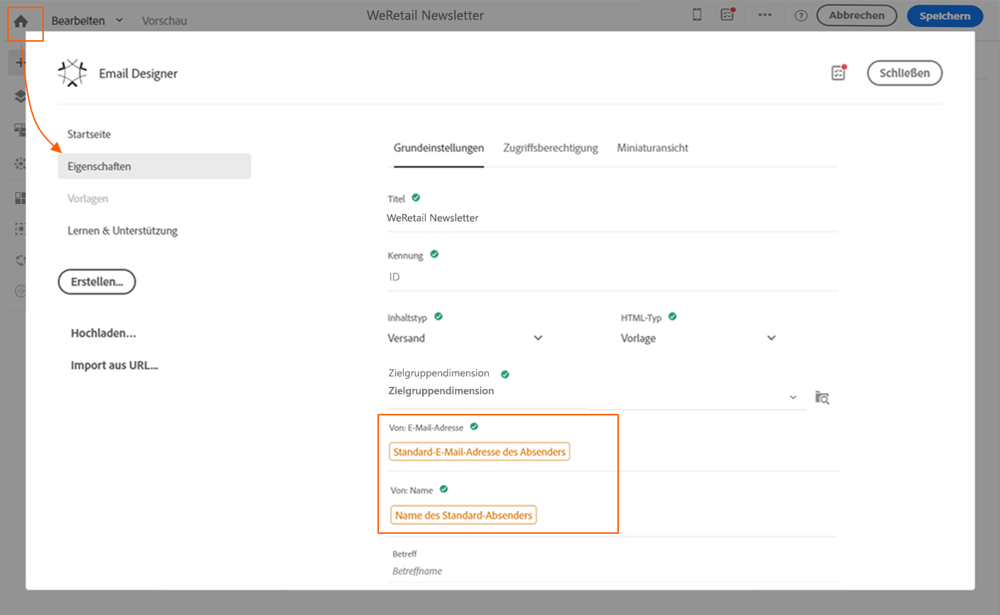
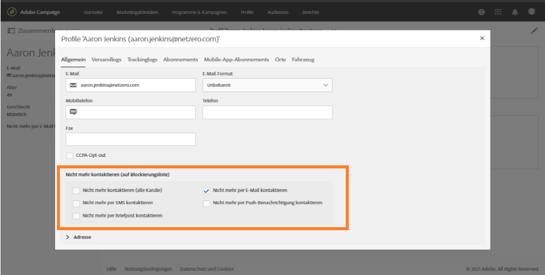
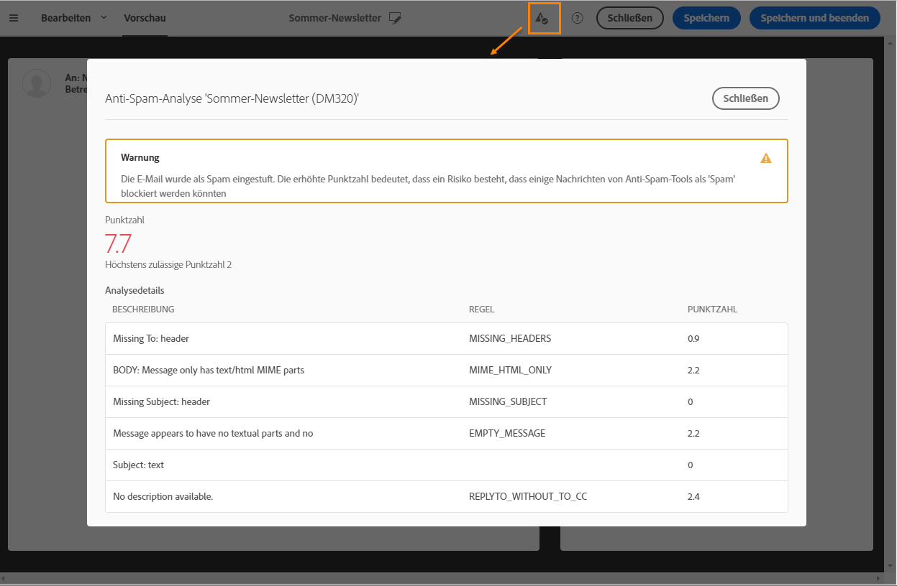
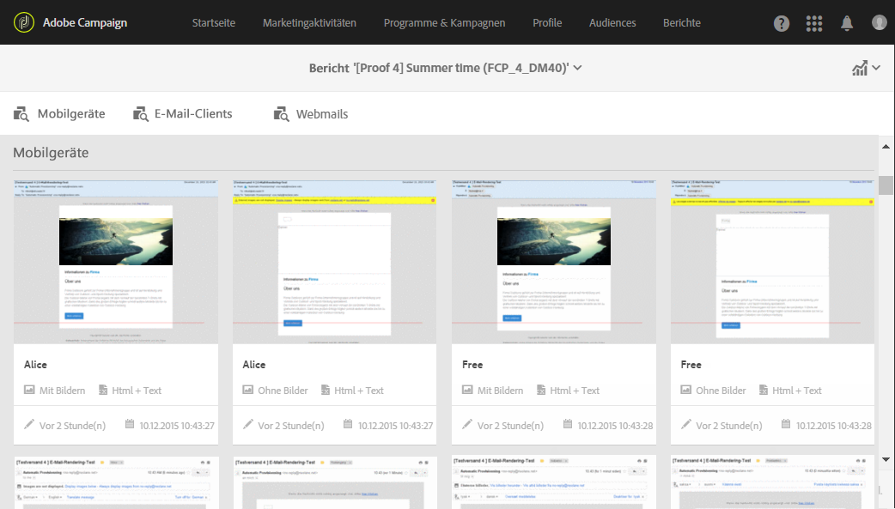

# Kontrollieren von E-Mail-Inhalten{#control-email-content}

<!--TO KEEP because specific to Campaign-->

Um sicherzustellen, dass Ihre E-Mails Ihre Empfänger erreichen und um Ihre E-Mail-Zustellrate zu verbessern, müssen sie eine Reihe von Regeln beachten. Andernfalls kann der Inhalt bestimmter Nachrichten als Spam eingestuft werden. Adobe Campaign stellt Ihnen mehrere Tools zur Verfügung, die Ihnen ermöglichen, Ihre Inhalte entsprechend diesen Regeln zu erstellen.

Befolgen Sie beim Entwerfen Ihrer Nachrichteninhalte die folgenden Grundsätze:

* [Name und Adresse des Absenders](#sender-name) Die Adresse muss die Identität eines Absenders explizit enthalten. Die Domain muss im Besitz des Absenders und auf ihn registriert sein. Die Domain-Registrierung darf nicht anonymisiert sein.
  <!--**Subject**: Avoid excessive capitalization and punctuation, and words that are frequently used by spammers ("Win", "Free", etc.).-->
* [Personalisierung und Optimierung der Sendezeit](#perso-send-time-optimization): Die Personalisierung von Inhalten und das Definieren einer Sendezeit pro Empfänger erhöhen die Wahrscheinlichkeit, dass Ihre Nachricht geöffnet wird.
* Bilder und Text: Achten Sie auf ein angemessenes Verhältnis zwischen Text und Bildern (z. B. 60 % Text und 40 % Bilder).
* [Abmelde-Link](#opt-out) und Landingpage: Ein Abmelde-Link muss unbedingt vorhanden sein. Er muss gut sichtbar und gültig sein; außerdem muss das Formular funktionieren.
* Vorschau: Verwenden Sie die von Adobe Campaign angebotenen Tools, um den Inhalt Ihrer E-Mails zu überprüfen und zu optimieren ([Anti-Spam-Analyse](#anti-spam-analysis), [E-Mail-Rendering](#message-responsiveness)).

Weitere Tipps zur Optimierung der Zustellbarkeit beim Entwerfen von Inhalten finden Sie im [Adobe-Handbuch mit den Best Practices zur Zustellbarkeit](https://experienceleague.adobe.com/docs/deliverability-learn/deliverability-best-practice-guide/content-best-practices-for-optimal-delivery.html?lang=de).

>[!NOTE]
>
>Weitere Informationen zum Bearbeiten von E-Mail-Inhalten finden Sie in der [Übersicht zu Email Designer](../../designing/using/designing-content-in-adobe-campaign.md) und in den [Best Practices zur Nachrichtengestaltung](../../designing/using/designing-content-in-adobe-campaign.md#content-design-best-practices).

## Name und Adresse des Absenders {#sender-name}

Bestimmte Internet-Anbieter überprüfen die Gültigkeit der Absenderadresse (**[!UICONTROL Von]**), bevor sie Nachrichten annehmen. Eine fehlerhafte Adresse kann dazu führen, dass sie vom empfangenden Server abgelehnt wird.

Sie müssen sicherstellen, dass auf Instanzebene oder in den am häufigsten verwendeten Szenarien eine richtige Adresse angegeben wird. Wenden Sie sich dazu an Ihren Administrator.

Weitere Informationen hierzu finden Sie unter [Definieren des Absenders einer E-Mail](../../designing/using/subject-line.md#email-sender).

## Personalisierung und Optimierung der Sendezeit {#perso-send-time-optimization}

Um das Nutzererlebnis zu verbessern und Empfänger dazu zu bewegen, Ihre E-Mail zu öffnen, ermöglicht Adobe Campaign Ihnen, Ihre Nachrichten zu personalisieren. Weiterführende Informationen hierzu finden Sie in [diesem Abschnitt](../../designing/using/personalization.md).

Um die Öffnungsrate Ihrer Nachrichten zu erhöhen, können Sie auch für jeden Empfänger manuell einen Versandzeitpunkt festlegen. Jedes Profil erhält dann die Nachricht zum spezifizierten Zeitpunkt, falls möglich. Weitere Informationen dazu finden Sie unter [Versandzeitpunkt optimieren](../../sending/using/optimizing-the-sending-time.md).

## Ausschluss-Link und -Formular {#opt-out}

Bei der Analyse einer Nachricht wird standardmäßig von einer Typologieregel überprüft, ob ein Abmelde-Link vorhanden ist. Ist dies nicht der Fall, wird ein Warnhinweis erstellt. Weitere Informationen zur Verwaltung von Links finden Sie in [diesem Abschnitt](../../designing/using/links.md).

Sie müssen vor jedem Versand überprüfen, ob der Abmelde-Link korrekt funktioniert. Wenn Sie beispielsweise den [Testversand durchführen](../../sending/using/sending-proofs.md), stellen Sie sicher, dass der Link gültig ist, dass das Formular online ist und dass bei der Validierung die Felder **[!UICONTROL Nicht mehr kontaktieren]** aktiviert werden. Sie sollten diese Überprüfung systematisch durchführen, da menschliches Versagen immer möglich ist, wenn Sie den Link eingeben oder das Formular ändern. Weitere Informationen zur Verwaltung von Opt-in und Opt-out finden Sie in [diesem Abschnitt](../../audiences/using/managing-opt-in-and-opt-out-in-campaign.md).

Wenn ein Abmeldeproblem erkannt wird, nachdem der Versand bereits begonnen hat, können Sie diejenigen, die auf den Abmelde-Link klicken, manuell abmelden (z. B. über die gebündelte Aktualisierung), selbst wenn sie ihre Auswahl nicht bestätigen konnten.

In der Regel sollten Sie Empfängern, die sich abmelden möchten, das nicht erschweren, indem Sie sie etwa dazu verpflichten, Felder wie ihre E-Mail-Adresse oder ihren Namen auszufüllen. Die Landingpage der Abmeldung sollte nur eine Schaltfläche zum Bestätigen enthalten.

Das Anfordern einer zusätzlichen Bestätigung ist keine zuverlässige Methode: Ein Benutzer kann zwei E-Mail-Adressen in dasselbe Postfach umgeleitet haben (z. B. Vorname.Nachname@club.com und Vorname.Nachname@internet-club.com). Wenn das Profil sich nur an die erste Adresse erinnern kann und sich über eine an die andere Adresse gesendete Nachricht abmelden möchte, würde das Formular dies verweigern, da die verschlüsselte Kennung und die eingegebene E-Mail-Adresse nicht übereinstimmen.

## Anti-Spam-Analyse {#anti-spam-analysis}

Der Nachrichteneditor von Adobe Campaign ist mit einer **Anti-Spam-Analyse** ausgestattet, mit der sich für E-Mails das Risiko bestimmen lässt, von Anti-Spam-Tools des Empfängers als Spam eingestuft zu werden. Lesen Sie diesbezüglich auch den Abschnitt [Vorschau der Nachricht erzeugen](../../sending/using/previewing-messages.md).

Wählen Sie im Inhaltseditor für die Nachricht die Option **[!UICONTROL Vorschau]** aus. Wenn die Anti-Spam-Prüfung ein hohes Risiko für die Nachricht feststellt, werden Sie durch eine Mitteilung gewarnt. Klicken Sie auf **[!UICONTROL Anti-Spam-Analyse]**, um Details anzuzeigen.

## E-Mail-Rendering {#message-responsiveness}

Bevor Sie Ihre Nachricht senden, können Sie testen, wie responsiv Ihre Nachricht ist, indem Sie überprüfen, wie sie auf verschiedenen Geräten aussehen wird. So wird sichergestellt, dass sie in unterschiedlichen Webclients, Webmails und Geräten optimal dargestellt wird.

Zu diesem Zweck unterstützt Adobe Campaign das Rendering und stellt dessen Ergebnisse in einem entsprechenden Bericht zur Verfügung. Dadurch können Sie sich ansehen, wie Nachrichten je nach verwendetem Empfangsmedium beim Empfänger dargestellt werden.

Weiterführende Informationen dazu finden Sie im Abschnitt [E-Mail-Rendering](../../sending/using/email-rendering.md).
