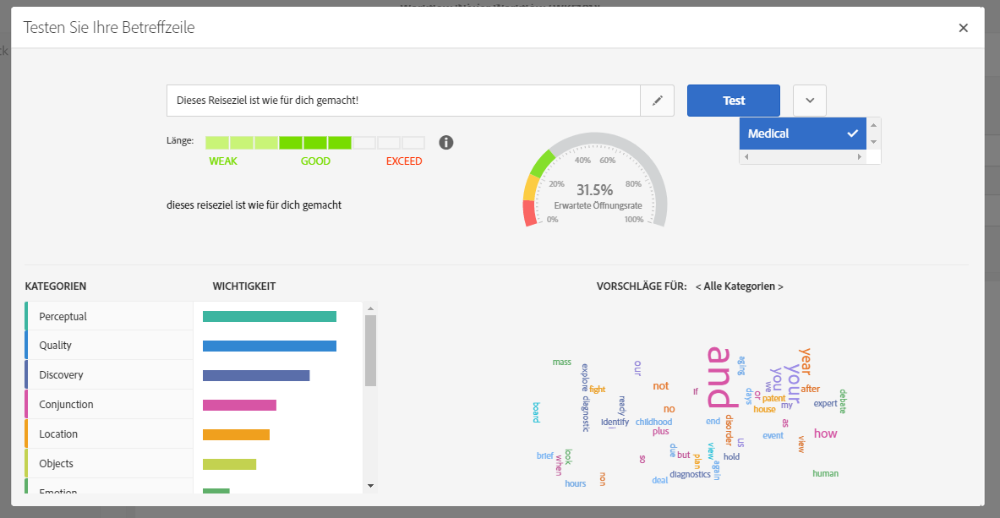

# Steuern von E-Mail-Inhalten{#control-email-content}

Um Ihre E-Mail-Zustellungsrate zu verbessern und sicherzustellen, dass Ihre E-Mails an Ihre Empfänger gelangen, muss die E-Mail eine bestimmte Anzahl von Regeln einhalten.

* **Name und Anschrift** des Absenders: Die Adresse muss den Absender explizit identifizieren. Die Domäne muss sich im Besitz des Absenders befinden und beim Absender registriert sein. Das Domänenregister darf nicht privatisiert werden.
* **Betrifft**: Vermeiden Sie übermäßige Groß- und Kleinschreibung sowie Wörter, die häufig von Spammer ("Win", "Free" usw.) verwendet werden.
* **E-Mail** personalisieren: Die Personalisierung der E-Mail erhöht die Wahrscheinlichkeit, dass Ihre Nachricht geöffnet wird.
* **Bilder und Text**: Achten Sie auf ein angemessenes Verhältnis von Text und Bild (z. B. 60 % Text und 40 % Bilder).
* **Link zum Rückgängigmachen des Abonnements und Einstiegsseite**: Der Link zum Abbestellen des Abonnements ist unbedingt erforderlich. Es muss sichtbar und gültig sein, und das Formular muss funktionsfähig sein.
* **Verwenden Sie die von Adobe Campaign angebotenen Tools** , um den Inhalt Ihrer E-Mail zu optimieren (Auslieferungsanalyse, Spam-Analyse).

Weitere Informationen zum Bearbeiten von E-Mail-Inhalten finden Sie in der Übersicht über den [E-Mail-Designer](../../designing/using/designing-content-in-adobe-campaign.md) und in den Best Practices[zum ](../../designing/using/overview.md#content-design-best-practices)Nachrichtenentwurf.

## Name und Anschrift des Absenders {#sender-name}

Bestimmte ISPs prüfen die Gültigkeit der Absenderadresse (Von), bevor sie Nachrichten annehmen. Eine schlecht geformte Adresse kann dazu führen, dass sie vom empfangenden Server abgelehnt wird. Sie müssen sicherstellen, dass eine richtige Adresse auf Instanzebene oder in den am häufigsten verwendeten Szenarien angegeben wird. Wenden Sie sich an Ihren Administrator.

Weitere Informationen hierzu finden Sie unter [Personalisieren des Absendernamens](../../designing/using/personalization.md#personalizing-the-sender).

## Betreff {#subject-line}

Beim Bearbeiten von E-Mails können Sie verschiedene Betreffzeilen ausprobieren und dabei eine jeweilige Einschätzung der Öffnungsrate erhalten, bevor Sie die E-Mail senden. For more on this, see [Testing the subject line of an email](../../sending/using/testing-subject-line-email.md).

Weitere Informationen zum Definieren der Betreffzeile einer E-Mail finden Sie in [diesem Abschnitt](../../designing/using/subject-line.md).

## Send time optimization {#send-time-optimization}

Zur Verbesserung der Erfolgsrate Ihrer Nachrichten können Sie manuell eine Sendezeit pro Empfänger definieren. Jedes Profil erhält dann die Nachricht zum spezifizierten Zeitpunkt.

Weitere Informationen hierzu finden Sie unter [Optimieren der Sendezeit](../../sending/using/optimizing-the-sending-time.md).

## Ausschluss-Link und Formular {#opt-out}

Wenn die Nachricht analysiert wird, prüft eine Typologieregel standardmäßig, ob ein Ausschluss-Link enthalten ist, und generiert eine Warnung, wenn diese fehlen.

Sie müssen vor jedem Senden überprüfen, ob der Ausschluss-Link korrekt funktioniert. Achten Sie beispielsweise beim Senden des Nachweises darauf, dass der Link gültig ist, dass das Formular online ist und dass bei der Überprüfung dieser Änderung der Wert der Kontrollkästchen "Keine Kontaktfelder mehr"aktiviert ist. Sie sollten diese Überprüfung systematisch durchführen, da menschliches Versagen immer möglich ist, wenn Sie den Link eingeben oder das Formular ändern.

Wenn nach dem Start der Bereitstellung ein Problem beim Rückgängigmachen des Abonnements festgestellt wird, ist es weiterhin möglich, eine Rückmeldung manuell (z. B. über die Funktion für Massenaktualisierung) für die Empfänger durchzuführen, die auf den Ausschluss-Link klicken, auch wenn sie nicht in der Lage waren, ihre Wahl zu bestätigen.

In der Regel sollten Sie Empfänger, die sich für eine Teilnahme entscheiden möchten, nicht daran hindern, Felder wie z. B. ihre E-Mail-Adresse oder ihren Namen auszufüllen. Die Einstiegsseite zum Rückgängigmachen des Abonnements sollte nur eine Überprüfungsschaltfläche enthalten. Die Anforderung zusätzlicher Bestätigung ist nicht zuverlässig: Ein Benutzer kann zwei E-Mail-Adressen in dasselbe Feld umleiten (z. B. firstname.lastname@club.com und firstname.lastname@internet-club.com). Wenn das Profil nur die erste Adresse speichern kann und sich über eine an die andere Adresse gesendete Nachricht abmelden möchte, verweigert das Formular dies, da die verschlüsselte Kennung und die eingegebene E-Mail-Adresse nicht übereinstimmen.

## Anti-Spam-Analyse {#anti-spam-analysis}

Der Nachrichteneditor von Adobe Campaign integriert eine **Anti-Spam-Analyse** , mit der Sie E-Mails bewerten können, um festzustellen, ob eine Nachricht das Risiko birgt, von den bei Erhalt verwendeten Anti-Spam-Tools als Spam betrachtet zu werden. For more on this, see [Previewing messages](../../sending/using/previewing-messages.md).

Klicken Sie im Nachrichteninhalteditor auf **[!UICONTROL Vorschau]**. Eine Meldung warnt Sie, wenn die Anti-Spam-Prüfung ein hohes Risiko für diese Nachricht festgestellt hat. Klicken Sie auf **[!UICONTROL Spam-Analyse]** , um Details anzuzeigen.

## Überprüfen der Reaktionsfähigkeit der Nachricht {#message-responsiveness}

Bevor Sie Ihre Nachricht senden, können Sie überprüfen, wie Ihre Nachricht auf verschiedenen Geräten aussehen wird. Dadurch soll sichergestellt werden, dass es auf einer optimalen Weise auf einer Vielzahl von Web-Clients, Web-Mails und Geräten angezeigt wird.

Zu diesem Zweck unterstützt Adobe Campaign das Rendering und stellt dessen Ergebnisse in einem entsprechenden Bericht zur Verfügung. Dadurch können Sie sich ansehen, wie Nachrichten je nach verwendetem Empfangsmedium beim Empfänger dargestellt werden.

Weiterführende Informationen dazu finden Sie im Abschnitt [E-Mail-Rendering](../../sending/using/email-rendering.md).

