# Hinzufügen einer Kontrollgruppe {#adding-control-group}

Sie können Kontrollgruppen verwenden, um zu vermeiden, dass Nachrichten an einen Teil Ihrer Audience gesendet werden, um die Auswirkungen Ihrer Kampagnen zu messen.

Erstellen Sie dazu beim Definieren der Zielgruppe Ihres Versands eine <b>Kontrollgruppe</b> . Profil werden der Kontrollgruppe zufällig hinzugefügt, gefiltert oder nicht, oder auf der Grundlage von Kriterien.

Sie können dann das Verhalten der Zielgruppe, die die Nachricht erhalten hat, mit dem Verhalten der nicht zielgerichteten Kontakte vergleichen. Auf der Grundlage der gesendeten Protokolle können Sie auch eine Kontrollgruppe in zukünftigen Kampagnen Zielgruppe werden.

<!--The control group is built when the delivery is prepared.-->

## Übersicht {#overview}

Die Kontrollgruppe kann zufällig aus der Hauptpopulation extrahiert und/oder aus einer bestimmten Zielgruppe ausgewählt werden. Daher gibt es zwei Möglichkeiten, eine Kontrollgruppe zu definieren:
* **Extrahieren** Sie eine Reihe von Profilen aus der Hauptversion der Zielgruppe.
* **Schließen Sie** einige Profil basierend auf in einer Abfrage definierten Kriterien aus.

Beim Definieren einer Kontrollgruppe können Sie beide Methoden verwenden.

Alle Profil, die bei der Vorbereitung des Versands in die Kontrollgruppe eingehen, werden aus der Zielgruppe entfernt. Sie erhalten die Nachricht nicht, sobald sie gesendet wurde.

## Extrahierung aus der Zielgruppe {#extraction-target-population}

Um eine Kontrollgruppe zu definieren, können Sie zufällig oder auf der Grundlage einer Sortierung, eines Prozentsatzes oder einer festen Anzahl von Profilen aus der Zielgruppe extrahieren.

### Zielgruppenextraktion {#target-extraction}

Definieren Sie zunächst, wie die Profil aus der Zielgruppe extrahiert werden: **zufällig** oder basierend auf einer **Sortierung**.

Wählen Sie unter **[!UICONTROL Zielgruppe Extraktion]** eine der folgenden Optionen aus:

* **[!UICONTROL Zufallsauswahl]**: Beim Vorbereiten des Versands extrahiert Adobe Campaign zufällig eine Anzahl von Profilen, die dem Prozentwert oder der Maximalzahl entsprechen, die Sie als [Größenbeschränkung](#size-limit)festlegen.

   Wenn Sie den Schwellenwert im Abschnitt &quot; **[!UICONTROL Beschränkungen]** &quot;auf 10 setzen, wird die Kontrollgruppe aus 10 % der Zielpopulation per Zufall ausgewählt.<!--Change screenshot to match example)-->

   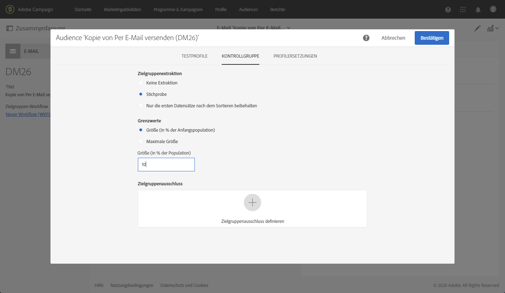

* **[!UICONTROL Nach der Sortierung]** nur die ersten Datensätze speichern: Mit dieser Option können Sie eine Beschränkung festlegen, die auf einer oder mehreren Sortierreihenfolgen basiert.

   Beispiel:

   * Wählen Sie das Feld **[!UICONTROL Alter]** als Sortierkriterium aus.
   * Definieren Sie 100 als Schwellenwert im Abschnitt **[!UICONTROL Grenzwerte]** (siehe [Größenbeschränkung](#size-limit)).
   * Lassen Sie die Option **[!UICONTROL Absteigend sortieren]** aktiviert.

   Die Kontrollgruppe wird aus den 100 ältesten Empfängern bestehen.<!--Change screenshot to match example)-->

   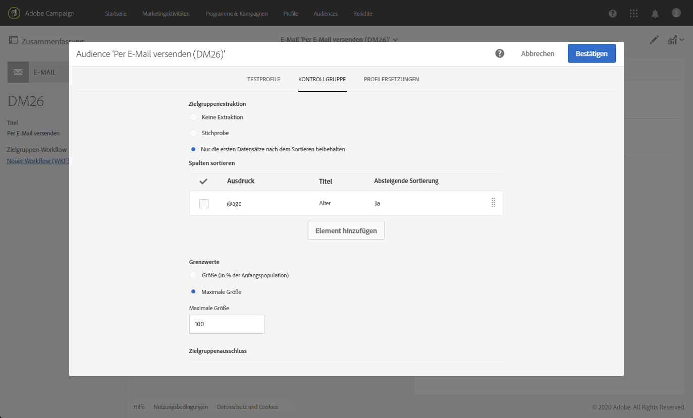

   Es kann interessant sein, eine Kontrollgruppe zu definieren, die Profil umfasst, die wenige oder häufige Käufe tätigen, und ihr Verhalten mit dem der kontaktierten Empfänger zu vergleichen.

>[!NOTE]
>
>Wählen Sie &quot; **[!UICONTROL Keine Extraktion]** &quot;, wenn Sie die Option &quot; **[!UICONTROL Zielgruppe-Extraktion]** &quot;nicht verwenden möchten.

<!---->

### Größenbeschränkung {#size-limit}

Unabhängig davon, ob Sie **[!UICONTROL Random-Sampling]** oder **[!UICONTROL Bewahren Sie nach dem Sortieren]** nur die ersten Datensätze auf, müssen Sie festlegen, wie Sie die Anzahl der Profil begrenzen, die Sie aus der Hauptdatei extrahieren. Führen Sie einen der folgenden Schritte aus:

* Wählen Sie **[!UICONTROL Größe (als Prozentsatz der anfänglichen Population)]** und füllen Sie den entsprechenden Rahmen aus.

   Wenn Sie z. B. 10 festlegen, wird abhängig von der oben ausgewählten Option Folgendes ausgeführt:
   * Zufällig 10 % der Zielgruppe extrahieren.
   * Wenn Sie das Feld **[!UICONTROL Alter]** als Sortierkriterium ausgewählt haben, extrahieren Sie die 10 % ältesten Profil aus der Zielgruppe.

   >[!NOTE]
   >
   >Wenn Sie die Option &quot; **[!UICONTROL Absteigend sortieren]** &quot;deaktivieren, werden die 10 % der kleinsten Profil extrahiert.

* Wählen Sie &quot; **[!UICONTROL Maximale Größe]** &quot;und füllen Sie den entsprechenden Rahmen aus.

   Wenn Sie z. B. 100 festlegen, wird Adobe Campaign entweder:
   * Extrahieren Sie zufällig 100 Profil aus der Zielgruppe.
   * Wenn Sie das Feld **[!UICONTROL Alter]** als Sortierkriterium ausgewählt haben, extrahieren Sie die 100 ältesten Profil aus der Zielgruppe.

   >[!NOTE]
   >
   >Wenn Sie die Option **[!UICONTROL Absteigend sortieren]** deaktivieren, werden die 100 jüngsten Profil extrahiert.

## Ausschließen einer bestimmten Population {#excluding-specific-population}

Eine andere Möglichkeit, eine Kontrollgruppe zu definieren, besteht darin, eine bestimmte Gruppe mithilfe einer Abfrage von der Zielgruppe auszuschließen.

Gehen Sie dazu wie folgt vor:

1. Klicken Sie im Bereich **[!UICONTROL Zielgruppe-Ausschluss]** auf Zielgruppe-Ausschluss **[!UICONTROL definieren]**.

   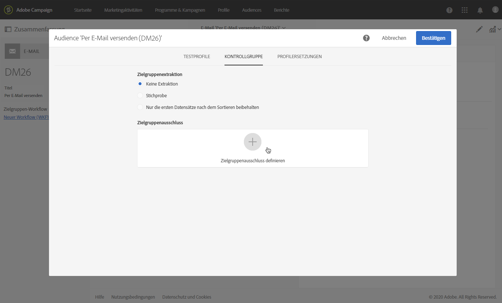

1. Definieren Sie die Ausschlusskriterien mithilfe des [Abfragen-Editors](../../automating/using/editing-queries.md). Sie können auch eine zuvor erstellte [Audience](../../audiences/using/about-audiences.md) auswählen.

   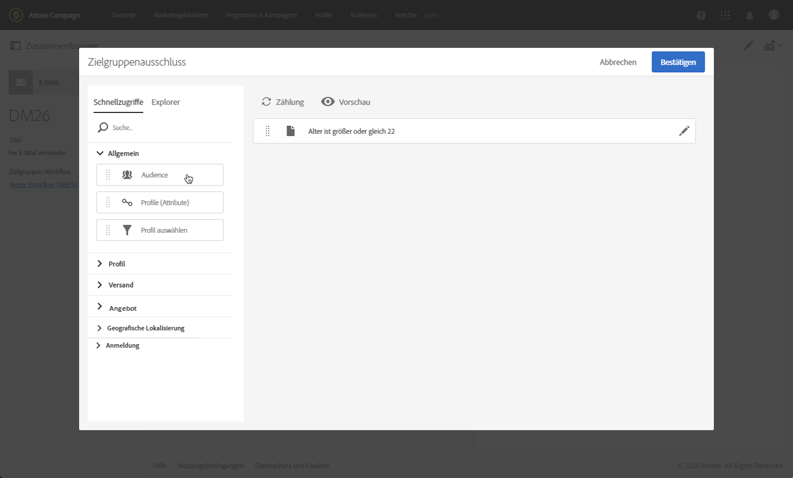

1. Wählen Sie **[!UICONTROL Bestätigen]** aus.

Profil, die dem Ergebnis der Abfrage entsprechen, werden von der Zielgruppe ausgeschlossen.

<!--For more on using the query editor, see the [Editing queries](../../automating/using/editing-queries.md) section.-->

## Verwendungsfall: eine Kontrollgruppe einrichten {#control-group-example}

Nachfolgend sehen Sie ein Beispiel, wie Sie eine Kontrollgruppe mit beiden Methoden definieren: Extrahieren von Profilen aus der Hauptpopulation und Ausschließen einer bestimmten Zielgruppe mithilfe einer Abfrage.

1. Erstellen von Workflows. Die detaillierten Schritte zum Erstellen eines Workflows werden im Abschnitt [Workflow erstellen](../../automating/using/building-a-workflow.md) beschrieben.
1. Ziehen Sie unter **[!UICONTROL Aktivitäten]** > **[!UICONTROL Zielgruppenbestimmung]** eine [Abfrageaktivität](../../automating/using/query.md) in den Arbeitsbereich. Double-click the activity and define your target. <!--For example, in **[!UICONTROL Shortcuts]**, drag and drop **[!UICONTROL Profile]**, select **[!UICONTROL Age]** with the operator **[!UICONTROL Greater than]** and type 25 in the **[!UICONTROL Value]** field.-->

1. In **[!UICONTROL Activities]** > **[!UICONTROL Channels]**, drag and drop an [Email delivery](../../automating/using/email-delivery.md) activity after the main target segment and edit it.
1. Klicken Sie im Versand-Dashboard auf den **[!UICONTROL Audiencen]** -Block.

1. Wählen Sie die Registerkarte **[!UICONTROL Kontrollgruppe]** .

   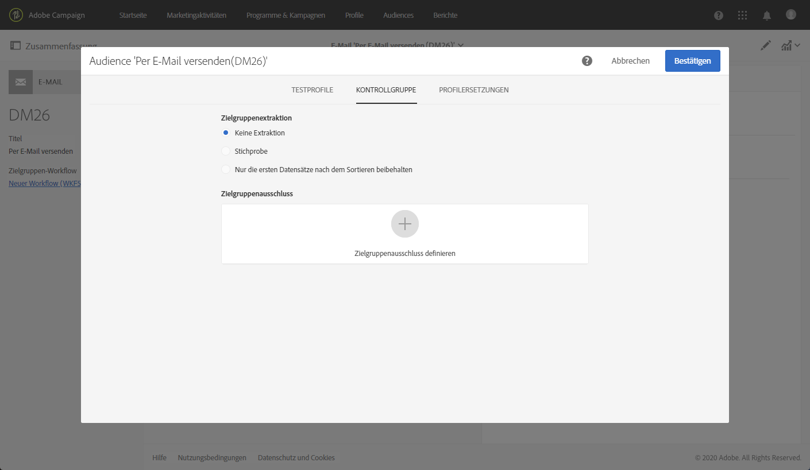

1. Wählen Sie im Abschnitt **[!UICONTROL Zielgruppe Extraktion]** die Option Nur die ersten Datensätze nach dem Sortieren **[!UICONTROL behalten]**.
1. Sortieren Sie nach Alter und lassen Sie die Option **[!UICONTROL Absteigend]** sortieren aktiviert.

   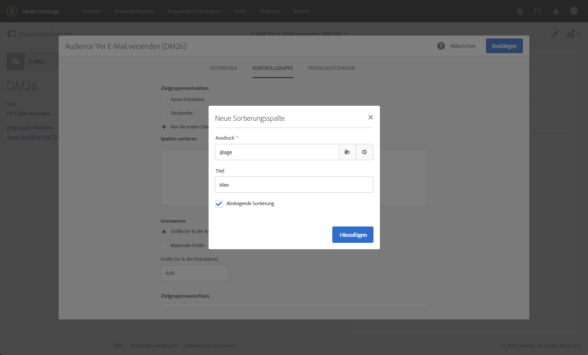

1. Legen Sie die Maximalgröße auf 100 fest. Die 100 ältesten Profil aus Ihrer Zielgruppe werden extrahiert.

1. Definieren Sie im Bereich **[!UICONTROL Zielgruppe-Ausschluss]** die Profil, die von Ihrer Zielgruppe ausgeschlossen werden, basierend auf den Kriterien Ihrer Wahl mithilfe des [Abfrage-Editors](../../automating/using/editing-queries.md). Beispiel: &quot;Alter ist kleiner als 20&quot;.

   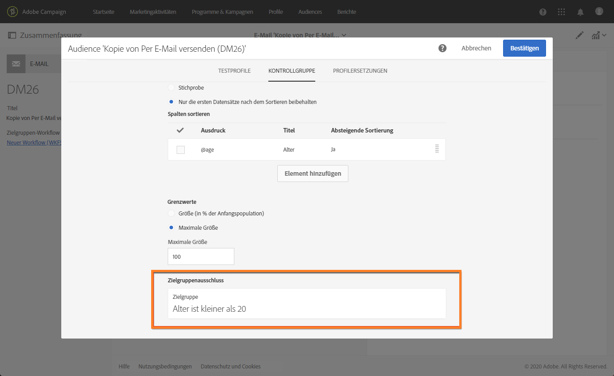

   Profile, deren Alter unter 20 Jahren liegt, werden ausgeschlossen.

1. Starten Sie die Vorbereitung [des](../../sending/using/preparing-the-send.md) Versands und [bestätigen Sie den Versand](../../sending/using/confirming-the-send.md).

Die Profil, die extrahiert wurden (die 100 ältesten Profile) und die, die anhand der Abfrage definiert wurden (Profile unter 20), werden aus der HauptZielgruppe entfernt. Sie erhalten die Nachricht nicht.

## Vergleich der Ergebnisse {#delivery-logs}

Nachdem Sie Ihren Versand geschickt haben, was können Sie mit der Kontrollgruppe machen?

Sie können die **Versandprotokolle** extrahieren, um zu vergleichen, wie die Kontrollgruppe, die die Mitteilung nicht erhalten hat, im Vergleich zur tatsächlichen Zielgruppe gehandelt hat. Sie können die Versandlogs auch zum **Erstellen eines anderen Targeting** verwenden.

>[!IMPORTANT]
>
>Sie benötigen eine [Administratorrolle](../../administration/using/users-management.md#functional-administrators) und müssen Teil der **[!UICONTROL Organisationseinheit]** sein, um eine Verbindung zu Adobe Campaign herstellen zu können  . Wenn Sie den Zugriff auf bestimmte Benutzer oder Benutzergruppen beschränken möchten, verknüpfen Sie diese nicht mit **[!UICONTROL Alle]** Einheiten, um auf Versandlogs zugreifen zu können.

### Überprüfen der Versandlogs {#checking-logs}

Um zu sehen, welche Profil nach dem Senden der Nachricht aus der Zielgruppe entfernt wurden, überprüfen Sie die **[!UICONTROL Versandlogs]**. Weitere Informationen zu den Versandlogs und deren Zugriff finden Sie in [diesem Abschnitt](../../sending/using/monitoring-a-delivery.md#delivery-logs).

* Auf der Registerkarte &quot; **[!UICONTROL Senden von Protokollen]** &quot;werden die extrahierten und ausgeschlossenen Profil angezeigt. Sie haben den **[!UICONTROL Ignorierten]** Status und die **[!UICONTROL Kontrollgruppe]** als Grund für das Scheitern.

   

* Sie können auch die Registerkarte **[!UICONTROL Ausschlussgründe]** überprüfen, um die Anzahl der Profil anzuzeigen, die nicht im Versand enthalten waren.

   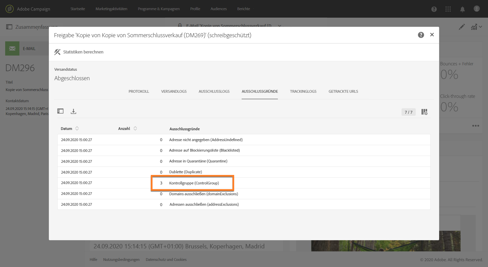

### Verwenden der Kontrollgruppe-Protokolle {#using-logs}

Nach dem Senden des Versands können Sie die Versandlogs verwenden, um nach Profilen zu filtern, die die Nachricht nicht erhalten haben. Gehen Sie wie folgt vor:

1. Erstellen von Workflows. Die detaillierten Schritte zum Erstellen eines Workflows werden im Abschnitt [Workflow erstellen](../../automating/using/building-a-workflow.md) beschrieben.
1. Ziehen Sie unter **[!UICONTROL Aktivitäten]** > **[!UICONTROL Zielgruppenbestimmung]** eine [Abfrageaktivität](../../automating/using/query.md) in den Arbeitsbereich.
1. Legen Sie auf der Registerkarte &quot; **[!UICONTROL Eigenschaften]** &quot; **[!UICONTROL Versandlogs]** als **[!UICONTROL Ressource]** und **[!UICONTROL Profil]** als **[!UICONTROL Zielgruppendimension]** fest.

   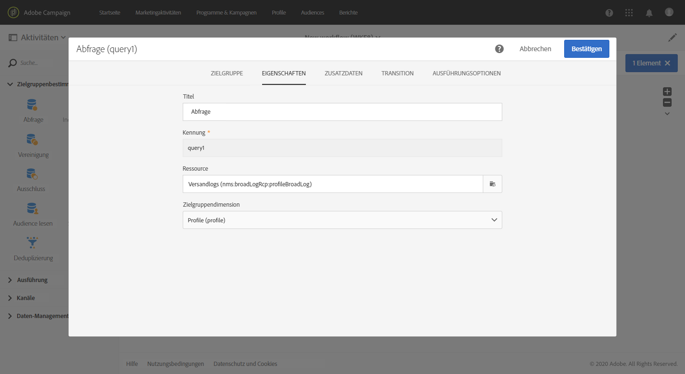

1. Klicken Sie auf der Registerkarte **[!UICONTROL Zielgruppe]** auf **[!UICONTROL Versandlogs]**.
1. Ziehen Sie **[!UICONTROL Status]** per Drag &amp; Drop und wählen Sie **[!UICONTROL Ignoriert]** als Filterbedingung.

   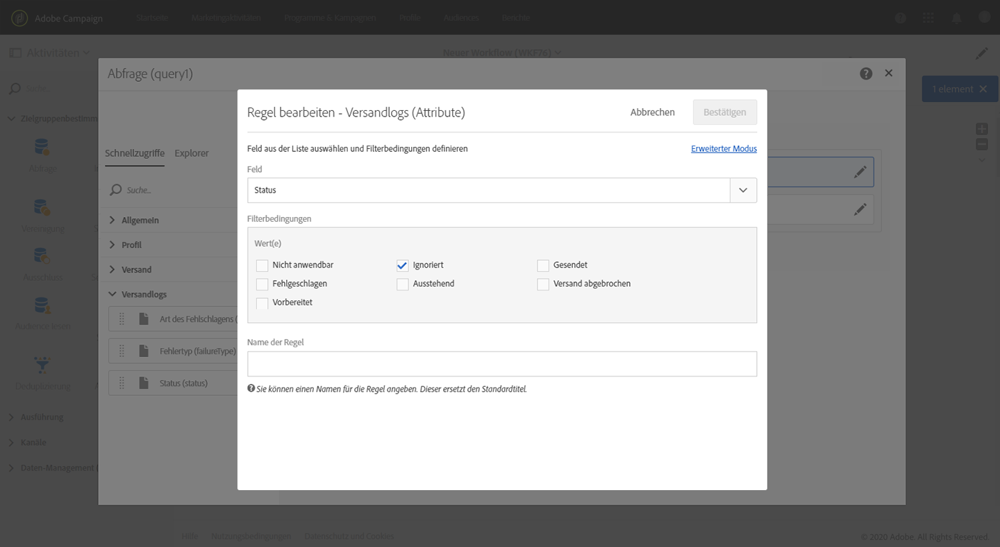

1. Wählen Sie **[!UICONTROL Bestätigen]** aus.

1. Legen Sie auf der Registerkarte &quot; **[!UICONTROL Zielgruppe]** &quot;die **[!UICONTROL Fehlerart]** per Drag &amp; Drop fest und wählen Sie als Filterbedingung die Option &quot; **[!UICONTROL Kontrollgruppe]** &quot;aus.

   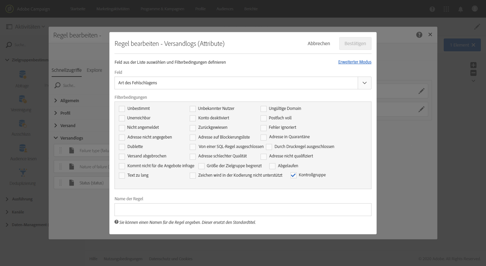

1. Wählen Sie **[!UICONTROL Bestätigen]** aus.

   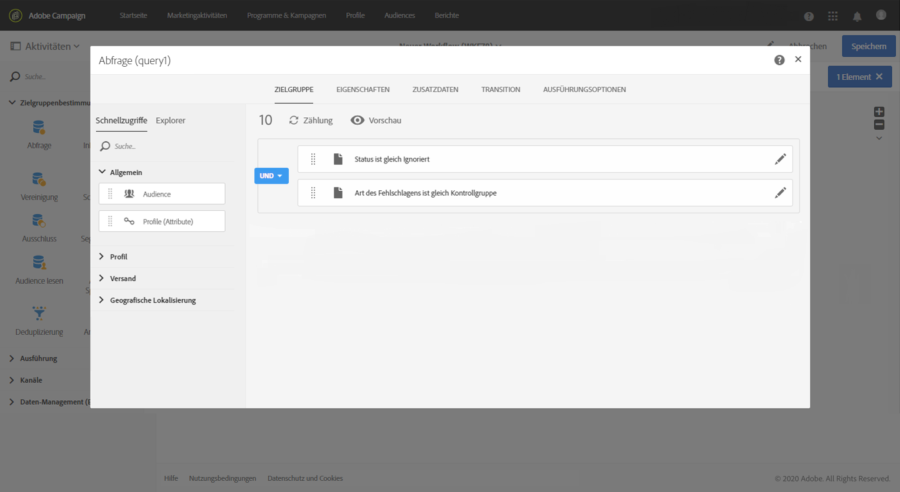

Anschließend können Sie die Protokolldaten mithilfe einer **Extract-Datei** -Aktivität und anschließend beispielsweise einer **Transfer-Datei** -Aktivität exportieren. Auf diese Weise können Sie die Ergebnisse Ihrer Kampagne auf die effektive Zielgruppe im Vergleich zur Kontrollgruppe in Ihrem eigenen Berichte-Tool analysieren. For more on exporting logs, see [this section](../../automating/using/exporting-logs.md).

### Targeting der Kontrollgruppe {#targeting-control-group}

Um ein Targeting auf Grundlage der Profil durchzuführen, die die Nachricht nicht erhalten haben, können Sie auch die Versandlogs verwenden. Gehen Sie wie folgt vor:

1. Erstellen von Workflows. Die detaillierten Schritte zum Erstellen eines Workflows werden im Abschnitt [Workflow erstellen](../../automating/using/building-a-workflow.md) beschrieben.
1. In **[!UICONTROL Activities]** > **[!UICONTROL Targeting]**, drag and drop a first [Query](../../automating/using/query.md) activity.
1. Vergewissern Sie sich, dass auf der Registerkarte &quot; **[!UICONTROL Eigenschaften]** &quot;die **[!UICONTROL Profil]** -Ressource als **[!UICONTROL Ressource]** und **[!UICONTROL Zielgruppendimension]** ausgewählt ist.

   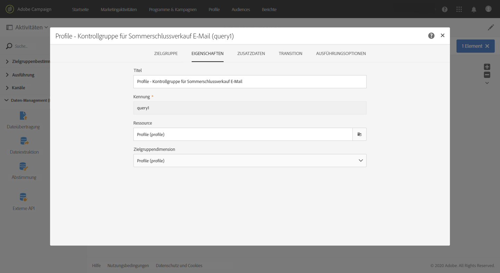

1. Erweitern Sie auf der Registerkarte &quot; **[!UICONTROL Zielgruppe]** &quot;den Eintrag &quot; **[!UICONTROL Versand]** &quot;und ziehen Sie **[!UICONTROL Versandlogs]** per Drag &amp; Drop.

   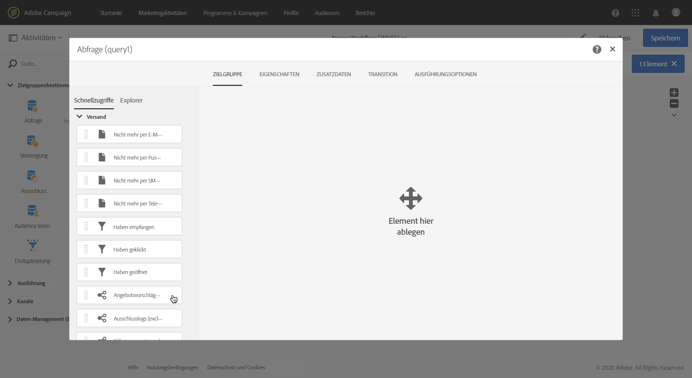

1. Ziehen Sie im **[!UICONTROL Hinzufügen Regelfenster]** den **[!UICONTROL Versand]** per Drag &amp; Drop.

   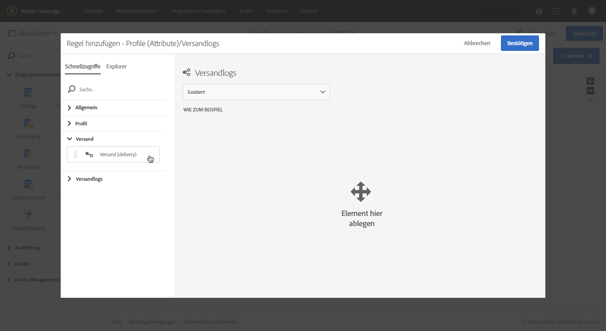

1. Wählen Sie die als Filterbedingung gesendete E-Mail aus. Wählen Sie **[!UICONTROL Bestätigen]** aus.

   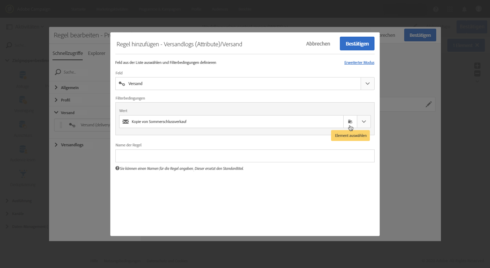

1. Zurück in das Fenster **[!UICONTROL Hinzufügen Regel]** , ziehen Sie **[!UICONTROL Status]** per Drag &amp; Drop und wählen Sie **[!UICONTROL Ignoriert]** als Filterbedingung. Wählen Sie **[!UICONTROL Bestätigen]** aus.

   

1. Ziehen Sie per Drag &amp; Drop die **[!UICONTROL Art des Fehlers]** und wählen Sie **[!UICONTROL Kontrollgruppe]** als Filterbedingung aus. Wählen Sie **[!UICONTROL Bestätigen]** aus.

   

1. Stellen Sie sicher, dass alle Bedingungen mit dem booleschen Operator **AND** übereinstimmen.

   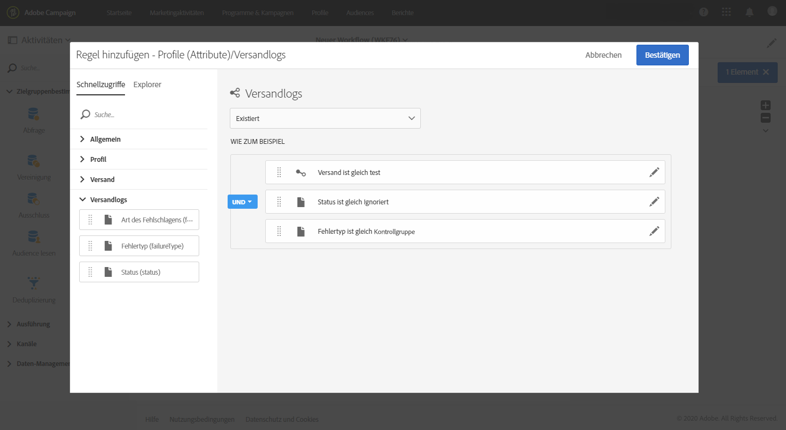

1. Wählen Sie **[!UICONTROL Bestätigen]** aus.

Sie können jetzt die Profil, die Ihre erste Nachricht nicht erhalten haben, weil sie Teil der Kontrollgruppe waren, Zielgruppe und ihnen eine weitere E-Mail senden.

Im selben Arbeitsablauf können Sie auch eine andere Abfrage erstellen, um die Profil, die die E-Mail erhalten haben, Zielgruppe und ihnen eine andere Nachricht zu senden.

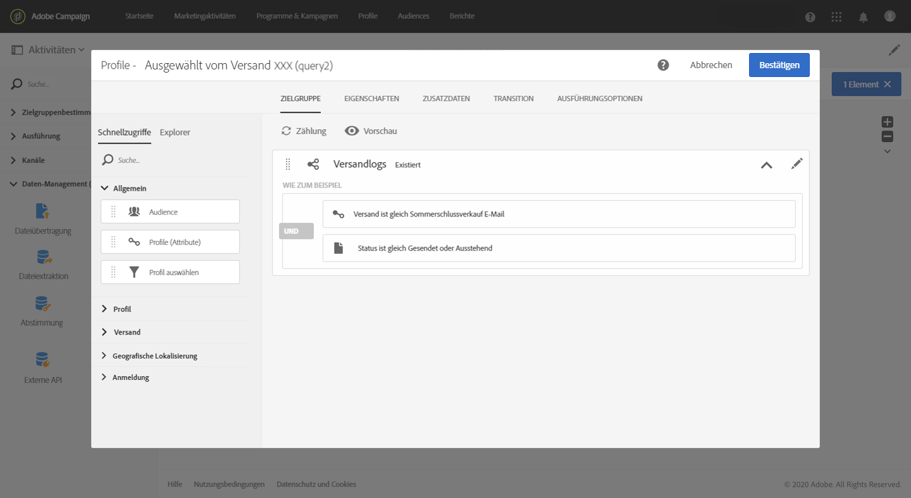