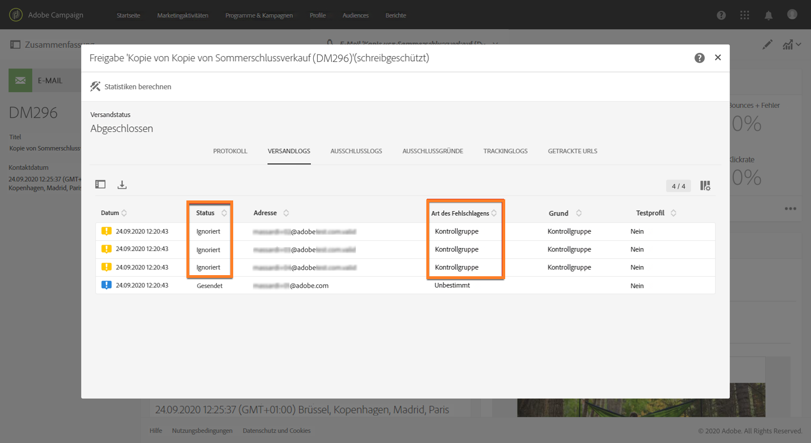

# Kontrollgruppe hinzufügen {#adding-control-group}

Mithilfe von Kontrollgruppen können Sie vermeiden, dass Nachrichten an einen Teil Ihrer Audience gesendet werden, um die Wirkung Ihrer Kampagnen zu messen.

Erstellen Sie dazu in Adobe Campaign eine <b>Kontrollgruppe</b>, wenn Sie die Zielgruppe Ihres Versands definieren. Profile werden der Kontrollgruppe nach dem Zufallsprinzip, gefiltert oder ungefiltert oder auf der Grundlage von Kriterien hinzugefügt.

Sie können dann das Verhalten der Zielpopulation, die die Nachricht erhalten hat, mit dem Verhalten der Kontakte vergleichen, die nicht in der Zielpopulation enthalten waren. Anhand der Versandlogs können Sie auch eine Kontrollgruppe in zukünftigen Kampagnen auswählen.

<!--The control group is built when the delivery is prepared.-->

## Übersicht {#overview}

Die Kontrollgruppe kann nach dem Zufallsprinzip aus der Hauptzielgruppe extrahiert und/oder aus einer bestimmten Population ausgewählt werden. Daher gibt es zwei Möglichkeiten, eine Kontrollgruppe zu definieren:
* **Extrahieren** Sie eine Reihe von Profilen aus der Hauptzielgruppe.
* **Schließen** Sie einige Profile basierend auf in einer Abfrage definierten Kriterien aus.

Beim Definieren einer Kontrollgruppe können Sie beide Methoden verwenden.

Alle Profile, die bei der Vorbereitung des Versands in die Kontrollgruppe eingehen, werden aus der Hauptzielgruppe entfernt. Sie erhalten die Nachricht nicht, nachdem diese gesendet wurde.

## Aus der Zielpopulation extrahieren {#extraction-target-population}

Um eine Kontrollgruppe zu definieren, können Sie nach dem Zufallsprinzip oder basierend auf einer Sortierung, einen Prozentsatz oder eine feste Anzahl von Profilen aus der Zielpopulation extrahieren.

### Zielgruppenextraktion {#target-extraction}

Definieren Sie zunächst, wie die Profile aus der Zielgruppe extrahiert werden: **zufällig** oder basierend auf einer **Sortierung**.

Wählen Sie unter **[!UICONTROL Zielgruppenextraktion]** eine der folgenden Optionen aus:

* **[!UICONTROL Zufällige Auswahl]**: Beim Vorbereiten des Versands extrahiert Adobe Campaign zufällig eine Anzahl von Profilen, die dem Prozentwert oder der Maximalzahl entsprechen, die Sie als [Größenbeschränkung](#size-limit) festlegen.

   Wenn Sie den Schwellenwert im Abschnitt **[!UICONTROL Begrenzungen]** auf 10 setzen, besteht die Kontrollgruppe aus 10 %, die zufällig aus der Zielgruppe ausgewählt werden.<!--Change screenshot to match example)-->

   

* **[!UICONTROL Nur die ersten Datensätze nach dem Sortieren beibehalten]**: Mit dieser Option können Sie eine Begrenzung festlegen, die auf einer oder mehreren Sortierreihenfolgen basiert.

   Beispiel:

   * Wählen Sie das Feld **[!UICONTROL Alter]** als Sortierkriterium aus.
   * Definieren Sie 100 als Schwellenwert im Abschnitt **[!UICONTROL Begrenzungen]** (siehe [Größenbeschränkung](#size-limit)).
   * Lassen Sie die Option **[!UICONTROL Absteigende Sortierung]** aktiviert.

   Die Kontrollgruppe wird folglich aus den 100 ältesten Empfängern bestehen.<!--Change screenshot to match example)-->

   

   Es kann interessant sein, eine Kontrollgruppe zu definieren, die Profile umfasst, die wenige oder häufige Käufe tätigen, und ihr Verhalten mit dem der kontaktierten Empfänger zu vergleichen.

>[!NOTE]
>
>Wählen Sie **[!UICONTROL Keine Extraktion]** aus, wenn Sie die Option **[!UICONTROL Zielgruppenextraktion]** nicht verwenden möchten.

<!---->

### Größenbeschränkung {#size-limit}

Unabhängig davon, ob Sie **[!UICONTROL Zufällige Auswahl]** oder **[!UICONTROL Nur die ersten Datensätze nach dem Sortieren beibehalten]** auswählen, müssen Sie festlegen, wie Sie die Anzahl der Profile begrenzen, die Sie aus der Hauptzielgruppe extrahieren. Führen Sie einen der folgenden Schritte aus:

* Wählen Sie **[!UICONTROL Größe (in % der Anfangspopulation)]** aus und füllen Sie den entsprechenden Rahmen aus.

   Wenn Sie beispielsweise 10 festlegen, führt Adobe Campaign abhängig von der oben ausgewählten Option Folgendes aus:
   * Zufällige Extraktion von 10 % der Zielpopulation.
   * Wenn Sie das Feld **[!UICONTROL Alter]** als Sortierkriterium ausgewählt haben, extrahieren Sie die ältesten 10 % der Profile aus der Zielpopulation.

   >[!NOTE]
   >
   >Wenn Sie die Option **[!UICONTROL Absteigende Sortierung]** deaktivieren, werden die jüngsten 10 % der Profile extrahiert.

* Wählen Sie **[!UICONTROL Maximale Größe]** aus und füllen Sie den entsprechenden Rahmen aus.

   Wenn Sie z. B. 100 festlegen, wird Adobe Campaign:
   * zufällig 100 Profile aus der Zielpopulation extrahieren.
   * Wenn Sie das Feld **[!UICONTROL Alter]** als Sortierkriterium ausgewählt haben, extrahieren Sie die 100 ältesten Profile aus der Zielpopulation.

   >[!NOTE]
   >
   >Wenn Sie die Option **[!UICONTROL Absteigende Sortierung]** deaktivieren, werden die 100 jüngsten Profile extrahiert.

## Eine bestimmte Population ausschließen {#excluding-specific-population}

Eine andere Möglichkeit, eine Kontrollgruppe zu definieren, besteht darin, eine bestimmte Gruppe mithilfe einer Abfrage aus der Zielgruppe auszuschließen.

Gehen Sie dazu wie folgt vor:

1. Klicken Sie im Bereich **[!UICONTROL Zielgruppenausschluss]** auf **[!UICONTROL Zielgruppenausschluss definieren]**.

   

1. Definieren Sie die Ausschlusskriterien mithilfe des [Abfrageeditors](../../automating/using/editing-queries.md). Sie können auch eine zuvor erstellte [Audience](../../audiences/using/about-audiences.md) auswählen.

   

1. Wählen Sie **[!UICONTROL Bestätigen]** aus.

Die Profile, die dem Ergebnis der Abfrage entsprechen, werden aus der Zielgruppe ausgeschlossen.

<!--For more on using the query editor, see the [Editing queries](../../automating/using/editing-queries.md) section.-->

## Anwendungsbeispiel: eine Kontrollgruppe einrichten {#control-group-example}

Im Folgenden finden Sie ein Beispiel für die Definition einer Kontrollgruppe mit beiden Methoden: Extrahieren von Profilen aus der Hauptzielgruppe und Verwenden einer Abfrage zum Ausschließen einer bestimmten Population.

1. Erstellen Sie einen Workflow. Die detaillierten Schritte zum Erstellen eines Workflows werden im Abschnitt [Workflow erstellen](../../automating/using/building-a-workflow.md) beschrieben.
1. Ziehen Sie unter **[!UICONTROL Aktivitäten]** > **[!UICONTROL Zielgruppenbestimmung]** eine [Abfrageaktivität](../../automating/using/query.md) in den Arbeitsbereich. Doppelklicken Sie auf die Aktivität und definieren Sie Ihre Zielgruppe. <!--For example, in **[!UICONTROL Shortcuts]**, drag and drop **[!UICONTROL Profile]**, select **[!UICONTROL Age]** with the operator **[!UICONTROL Greater than]** and type 25 in the **[!UICONTROL Value]** field.-->

1. Ziehen Sie unter **[!UICONTROL Aktivitäten]** > **[!UICONTROL Kanäle]** eine [E-Mail-Versandaktivität](../../automating/using/email-delivery.md) hinter das Hauptzielgruppensegment und bearbeiten Sie es.
1. Klicken Sie im Versand-Dashboard auf den **[!UICONTROL Audience]**-Block.

1. Wählen Sie den Tab **[!UICONTROL Kontrollgruppe]** aus.

   

1. Wählen Sie im Abschnitt **[!UICONTROL Zielgruppenextraktion]** die Option **[!UICONTROL Nur die ersten Datensätze nach dem Sortieren beibehalten]** aus.
1. Sortieren Sie nach Alter und lassen Sie die Option **[!UICONTROL Absteigende Sortierung]** aktiviert.

   

1. Legen Sie die Maximalgröße auf 100 fest. Die 100 ältesten Profile aus Ihrer Zielgruppe werden extrahiert.

1. Definieren Sie im Bereich **[!UICONTROL Zielgruppenausschluss]** die Profile, die aus Ihrer Zielgruppe ausgeschlossen werden. Verwenden Sie dazu Kriterien Ihrer Wahl und den [Abfrageeditor](../../automating/using/editing-queries.md). Beispiel: &quot;Alter unter 20 Jahren&quot;.

   

   Profile, deren Alter unter 20 Jahren liegt, werden ausgeschlossen.

1. Starten Sie die [Versandvorbereitung](../../sending/using/preparing-the-send.md) und [bestätigen Sie den Versand](../../sending/using/confirming-the-send.md).

Die Profile, die extrahiert wurden (die 100 ältesten Profile) und diejenigen, die basierend auf der Abfrage definiert wurden (Profile unter 20), werden aus der Hauptzielgruppe entfernt. Sie erhalten die Nachricht nicht.

## Ergebnisse vergleichen {#delivery-logs}

Was können Sie nach dem Versand mit der Kontrollgruppe machen?

Sie können die **Versandlogs** extrahieren, um zu vergleichen, wie sich die Kontrollgruppe, die die Nachricht nicht erhalten hat, im Vergleich zur tatsächlichen Zielgruppe verhalten hat. Sie können die Versandlogs auch zum **Erstellen einer anderen Zielgruppe** verwenden.

>[!IMPORTANT]
>
>Sie müssen über eine [Administratorrolle](../../administration/using/users-management.md#functional-administrators) verfügen und Teil der [Organisationseinheit](../../administration/using/organizational-units.md) **[!UICONTROL Alle]** sein, um eine Verbindung zu Adobe Campaign herstellen zu können. Wenn Sie den Zugriff auf bestimmte Benutzer oder Benutzergruppen beschränken möchten, verknüpfen Sie diese nicht mit **[!UICONTROL Alle]**-Einheiten, um auf Versandlogs zugreifen zu können.

### Versandlogs überprüfen {#checking-logs}

Um zu sehen, welche Profile nach dem Senden der Nachricht aus der Zielgruppe entfernt wurden, überprüfen Sie die **[!UICONTROL Versandlogs]**. Weitere Informationen zu den Versandlogs und deren Zugriff finden Sie in [diesem Abschnitt](../../sending/using/monitoring-a-delivery.md#delivery-logs).

* Im Tab **[!UICONTROL Versandlogs]** werden die extrahierten und ausgeschlossenen Profile angezeigt. Sie haben den Status **[!UICONTROL Ignoriert]** und **[!UICONTROL Kontrollgruppe]** als Ursache des Fehlschlagens.

   

* Sie können auch den Tab **[!UICONTROL Ausschlussgründe]** überprüfen, um die Anzahl der Profile anzuzeigen, die nicht im Versand enthalten waren.

   

### Kontrollgruppenprotokolle verwenden {#using-logs}

Nach dem Versand können Sie die Versandlogs verwenden, um nach Profilen zu filtern, die die Nachricht nicht erhalten haben. Gehen Sie wie folgt vor:

1. Erstellen Sie einen Workflow. Die detaillierten Schritte zum Erstellen eines Workflows werden im Abschnitt [Workflow erstellen](../../automating/using/building-a-workflow.md) beschrieben.
1. Ziehen Sie unter **[!UICONTROL Aktivitäten]** > **[!UICONTROL Zielgruppenbestimmung]** eine [Abfrageaktivität](../../automating/using/query.md) in den Arbeitsbereich.
1. Legen Sie im Tab **[!UICONTROL Eigenschaften]** **[!UICONTROL Versandlogs]** als **[!UICONTROL Ressource]** und **[!UICONTROL Profil]** als **[!UICONTROL Zielgruppendimension]** fest.

   

1. Klicken Sie im Tab **[!UICONTROL Zielgruppe]** auf **[!UICONTROL Versandlogs]**.
1. Ziehen Sie **[!UICONTROL Status]** per Drag-and-Drop in den Arbeitsbereich und wählen Sie **[!UICONTROL Ignoriert]** als Filterbedingung aus.

   

1. Wählen Sie **[!UICONTROL Bestätigen]** aus.

1. Ziehen Sie im Tab **[!UICONTROL Zielgruppe]** die Option **[!UICONTROL Art des Fehlschlagens]** per Drag-and-Drop in den Arbeitsbereich und wählen Sie als Filterbedingung **[!UICONTROL Kontrollgruppe]** aus.

   

1. Wählen Sie **[!UICONTROL Bestätigen]** aus.

   

Anschließend können Sie die Protokolldaten beispielsweise mithilfe der Aktivität **Dateiextraktion** und der Aktivität **Dateiübertragung** exportieren. Auf diese Weise können Sie die Wirkung Ihrer Kampagne auf die effektive Zielgruppe im Vergleich zur Kontrollgruppe in Ihrem eigenen Reporting-Tool analysieren. Weiterführende Informationen zum Exportieren von Protokollen finden Sie in [diesem Abschnitt](../../automating/using/exporting-logs.md).

### Zielgruppenbestimmung mithilfe der Kontrollgruppe {#targeting-control-group}

Um eine Zielgruppe anhand der Profile zu bestimmen, die die Nachricht nicht erhalten haben, können Sie auch die Versandlogs verwenden. Gehen Sie wie folgt vor:

1. Erstellen Sie einen Workflow. Die detaillierten Schritte zum Erstellen eines Workflows werden im Abschnitt [Workflow erstellen](../../automating/using/building-a-workflow.md) beschrieben.
1. Ziehen Sie unter **[!UICONTROL Aktivitäten]** > **[!UICONTROL Zielgruppenbestimmung]** eine erste [Abfrageaktivität](../../automating/using/query.md) in den Arbeitsbereich.
1. Vergewissern Sie sich, dass im Tab **[!UICONTROL Eigenschaften]** die Ressource **[!UICONTROL Profil]** als **[!UICONTROL Ressource]** und **[!UICONTROL Zielgruppendimension]** ausgewählt ist.

   

1. Erweitern Sie im Tab **[!UICONTROL Zielgruppe]** den Eintrag **[!UICONTROL Versand]** und ziehen Sie **[!UICONTROL Versandlogs]** per Drag-and-Drop in den Arbeitsbereich.

   

1. Ziehen Sie im Fenster **[!UICONTROL Regel hinzufügen]** die Option **[!UICONTROL Versand]** per Drag-and-Drop in den Arbeitsbereich.

   

1. Wählen Sie die von Ihnen gesendete E-Mail als Filterbedingung aus. Wählen Sie **[!UICONTROL Bestätigen]** aus.

   

1. Ziehen Sie im Fenster **[!UICONTROL Regel hinzufügen]** **[!UICONTROL Status]** per Drag-and-Drop in den Arbeitsbereich und wählen Sie **[!UICONTROL Ignoriert]** als Filterbedingung aus. Wählen Sie **[!UICONTROL Bestätigen]** aus.

   

1. Ziehen Sie die Option **[!UICONTROL Art des Fehlschlagens]** per Drag-and-Drop in den Arbeitsbereich und wählen Sie als Filterbedingung **[!UICONTROL Kontrollgruppe]** aus. Wählen Sie **[!UICONTROL Bestätigen]** aus.

   

1. Stellen Sie sicher, dass alle Bedingungen mit dem booleschen Operator **AND** verbunden sind.

   

1. Wählen Sie **[!UICONTROL Bestätigen]** aus.

Sie können nun die Profile ansprechen, die Ihre erste Nachricht nicht erhalten haben, weil sie zur Kontrollgruppe gehörten, und ihnen eine weitere E-Mail senden.

Im selben Workflow können Sie auch eine weitere Abfrage erstellen, um die Profile, die die E-Mail erhalten haben, anzusprechen und ihnen eine andere Nachricht zu senden.

