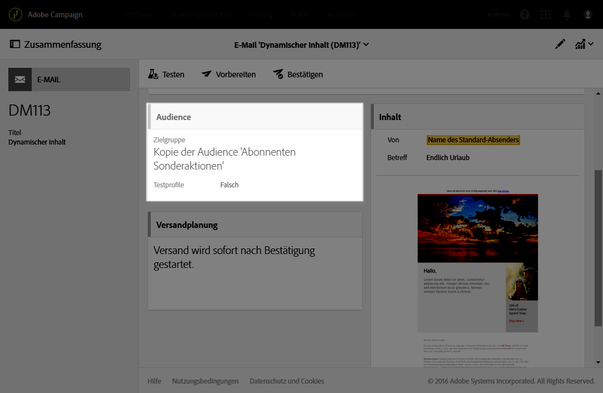
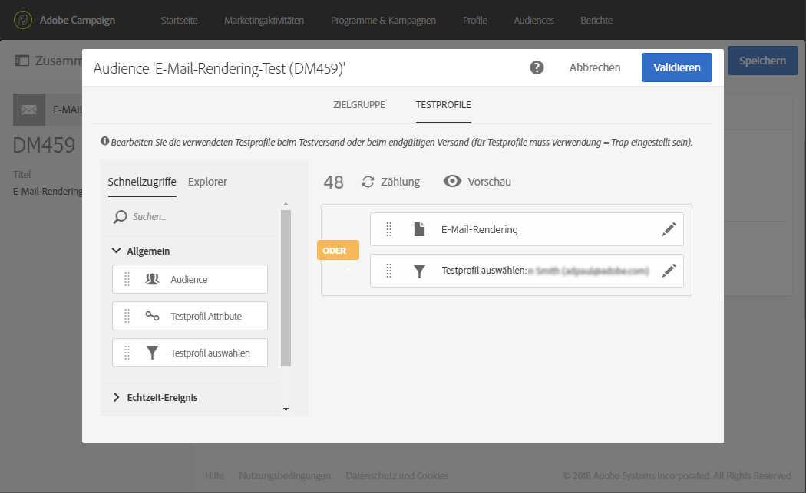
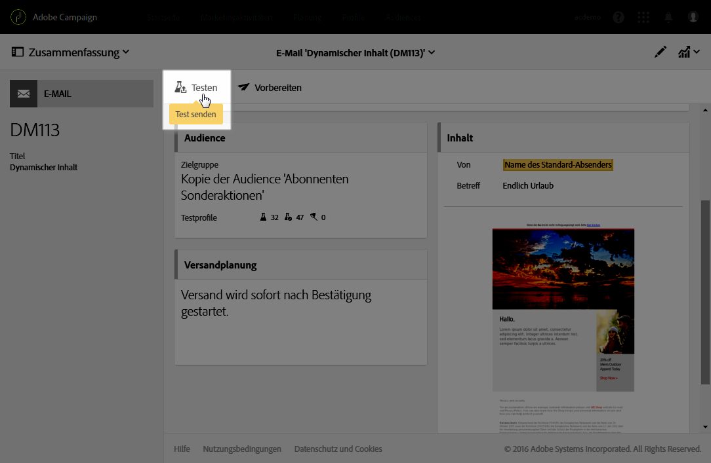
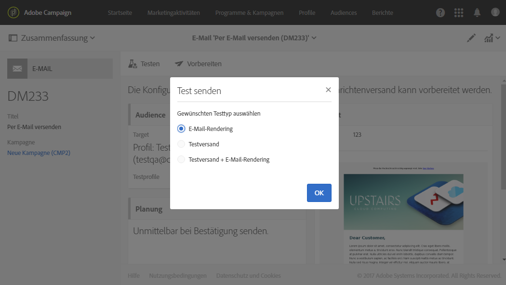
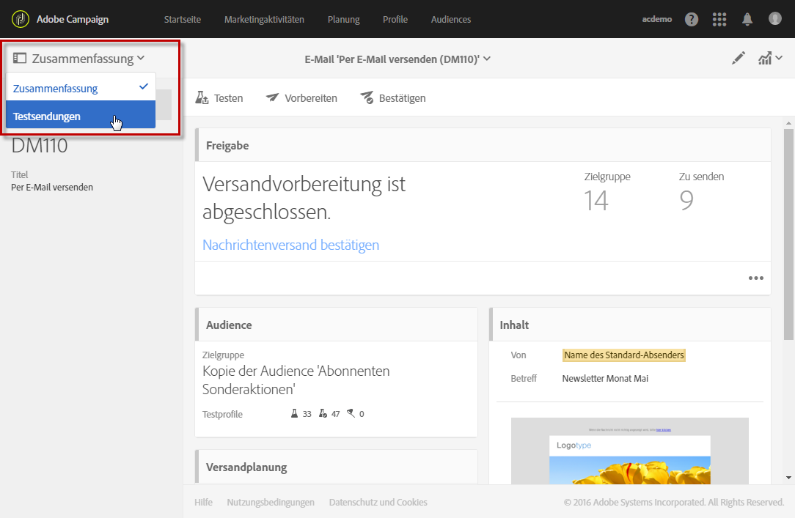
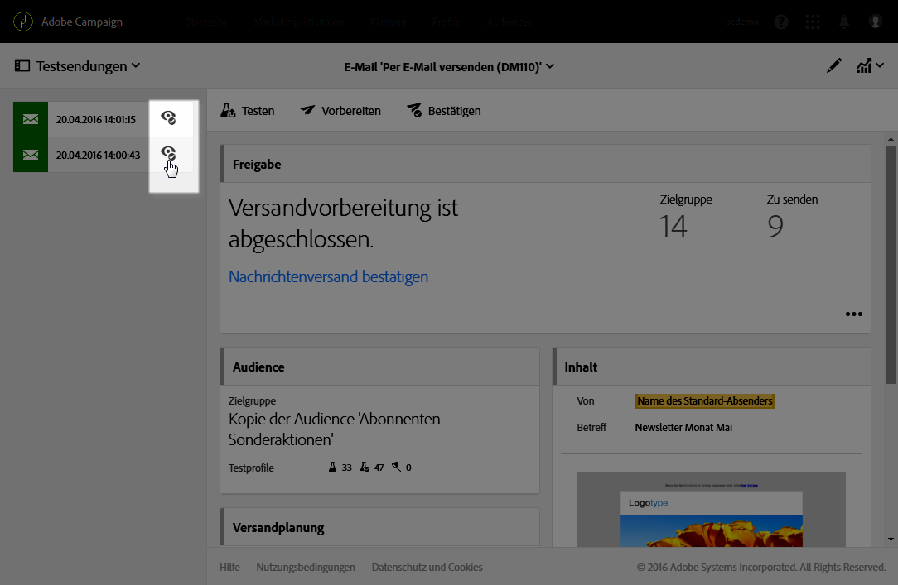
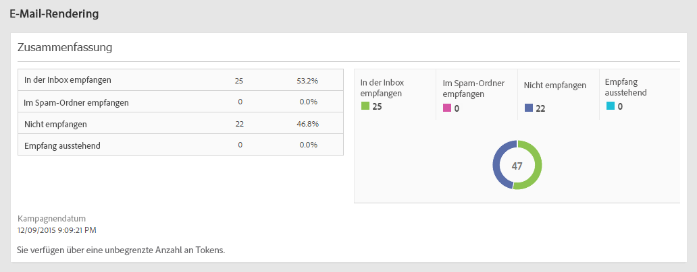
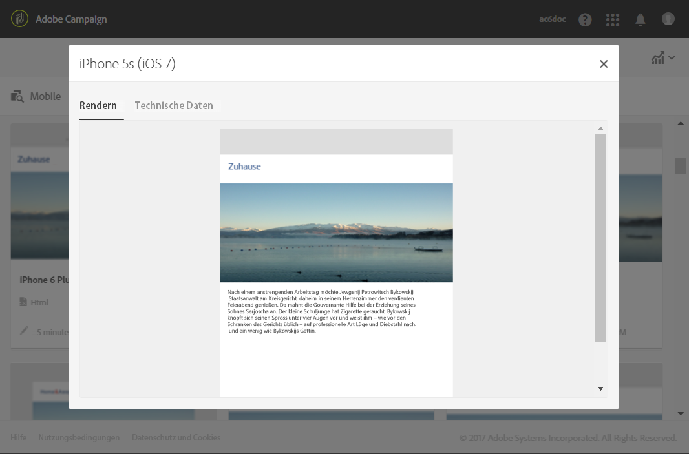

# E-Mail-Rendering{#email-rendering}

Bevor Sie die Schaltfläche **[!UICONTROL Senden]** betätigen, sollten Sie sicherstellen, dass Ihre Nachricht in unterschiedlichen Web-Clients, Web-Mails und Geräten optimal dargestellt wird.

Zu diesem Zweck unterstützt Adobe Campaign das Rendering und stellt dessen Ergebnisse in einem entsprechenden Bericht zur Verfügung. Dadurch können Sie sich ansehen, wie Nachrichten je nach verwendetem Empfangsmedium beim Empfänger dargestellt werden.

Die für das **E-Mail-Rendering** in Adobe Campaign verfügbaren Clients für Mobilgeräte, SMS und Webmail finden Sie auf der Litmus-[Website](https://litmus.com/email-testing) (wählen Sie dazu die Option zum **Ansehen aller E-Mail-Clients** aus).

## E-Mail-Rendering-Bericht prüfen {#checking-the-email-rendering-report}

Nachdem Sie Ihren E-Mail-Versand erstellt und seinen Inhalt sowie die Zielpopulation definiert haben, folgen Sie den unten stehenden Schritten.

1. Wählen Sie **Audience** aus, um den Tab **[!UICONTROL Testprofile]** zu öffnen.

   

1. Definieren Sie über den Abfrageeditor die Testprofile, die Sie verwenden möchten, einschließlich der Testprofile für das **E-Mail-Rendering**. Siehe [Über Testprofile](../../audiences/using/managing-test-profiles.md).

   

1. Bestätigen Sie Ihre Abfrage und speichern Sie Ihre Änderungen.
1. Verwenden Sie hierzu die Schaltfläche **[!UICONTROL Testen]** in der Symbolleiste.

   

1. Wählen Sie die Option **[!UICONTROL E-Mail-Rendering]** aus und bestätigen Sie Ihre Auswahl mit der Schaltfläche **[!UICONTROL OK]**.

   

   >[!NOTE]
   >
   >Mit der Option **[!UICONTROL Testversand + E-Mail-Rendering]** können Sie gleichzeitig den Testversand und die E-Mail-Rendering-Funktion ausführen. Ihre Nachricht wird von den Empfängern des Testversands validiert und gleichzeitig können Sie auch feststellen, wie Ihre Nachricht in der Inbox des Empfängers dargestellt wird. In diesem Fall müssen Sie auch Testprofile mit der Proof-Funktion auswählen. Siehe [Über Testprofile](../../audiences/using/managing-test-profiles.md).

   Der Testversand wird durchgeführt.

1. Die Rendering-Miniaturansichten sind einige Minuten nach dem Versand der Nachrichten verfügbar. Um sie zu öffnen, wählen Sie **[!UICONTROL Testsendungen]** in der Dropdown-Liste **[!UICONTROL Zusammenfassung]** aus.

   

1. Wählen Sie in der Liste **[!UICONTROL Testsendungen]** das Symbol **[!UICONTROL Zugriff auf das E-Mail-Rendering]** aus.

   

Der E-Mail-Rendering-Bericht wird angezeigt. Siehe [Beschreibung des E-Mail-Rendering-Berichts](#email-rendering-report-description).

**Verwandte Themen**:

* [E-Mails erstellen](../../channels/using/creating-an-email.md)
* [Testversand durchführen](../../sending/using/sending-proofs.md)
* [Abfrageeditor](../../automating/using/editing-queries.md#about-query-editor)

## Beschreibung des E-Mail-Rendering-Berichts      {#email-rendering-report-description}

Dieser Bericht enthält Informationen zum E-Mail-Rendering, d. h. zur Darstellung der E-Mail in der Inbox des Empfängers. E-Mail-Renderings können unterschiedlich aussehen, je nachdem ob die E-Mail in einem Browser, auf einem Mobilgerät oder über eine E-Mail-Anwendung geöffnet wird.

>[!NOTE]
>
>Die Anzahl der verfügbaren Renderings ist in Ihrem Lizenzvertrag vermerkt. Mit jedem Versand, bei dem die Option **E-Mail-Rendering** aktiviert ist, werden Ihre verfügbaren Renderings (auch Token genannt) um eins verringert.
>
>Token gelten für jedes einzelne Rendering, und nicht für den gesamten E-Mail-Rendering-Bericht. Das bedeutet:
>
>**Jedes Mal**, wenn ein Inbox-Rendering-Bericht erstellt wird, wird pro E-Mail-Client ein Token abgezogen: ein Token für das Rendering in Outlook 2000, einer für das Rendering in Outlook , einer für das Rendering in Apple Mail usw.
>
>Wenn Sie **für denselben Versand** das E-Mail-Rendering wiederholen, wird die Anzahl der verfügbaren Token nochmals um die Anzahl der erzeugten Renderings reduziert.

Die Zusammenfassung des Berichts zeigt die Anzahl an empfangenen, als Spam gekennzeichneten und nicht empfangenen Nachrichten oder die Anzahl an Nachrichten, deren Empfang ausstehend ist.

Der Bericht ist in drei Bereiche unterteilt: **[!UICONTROL Mobilgeräte]**, **[!UICONTROL E-Mail-Clients]** und **[!UICONTROL Webmails]**. Scrollen Sie im Bericht nach unten, um alle in diese drei Kategorien eingeteilten Renderings anzusehen.

Klicken Sie auf eine der Karten, um das entsprechende Rendering im Detail anzusehen. Das Rendering wird für das jeweils ausgewählte Empfangsmedium angezeigt.

Mithilfe des Tabs **[!UICONTROL Technische Daten]** lassen sich weitere Informationen wie die Daten des Empfangs und der Rendering-Aufnahme sowie die vollständigen Header von E-Mails abrufen.
