# Ermüdungsregeln{#fatigue-rules}

## Über Ermüdungsregeln {#about-fatigue-rules}

Mit Ermüdungsregeln können Marketer globale, kanalübergreifende Geschäftsregeln festlegen, mit denen Profile, die bereits zu oft angesprochen wurden, automatisch von Kampagnen ausgeschlossen werden.

Um Ermüdungsregeln zu implementieren, müssen Sie eine Höchstzahl von Nachrichten pro Profil definieren und einen Zeitraum auswählen, in dem die Regel angewendet werden soll. Bei der Versandvorbereitung werden Profile vom Versand ausgeschlossen, wenn sie bereits eine bestimmte Anzahl an Nachrichten erhalten haben.

>[!NOTE]
>
>Damit Ermüdungsregeln angewendet werden können, müssen Sie ein Kontaktdatum für den Versand festlegen. Wenn Sie Nachrichten sofort senden möchten, wird die Ermüdungsregel nicht angewendet.

Verwandte Themen:

* [Vorbereitung](../../administration/using/configuring-email-channel.md#preparation)
* [Typologien verwalten](../../sending/using/managing-typologies.md)
* [Typologieregeln](../../sending/using/managing-typology-rules.md)
* [Kommunikationsfrequenz zur Vermeidung von Kontaktmüdigkeit optimieren](https://helpx.adobe.com/de/campaign/kb/simplify-campaign-management.html#Engageyourcustomersateverystep)

## Ermüdungsregel erstellen   {#creating-a-fatigue-rule}

Um eine Typologieregel vom Typ **[!UICONTROL Ermüdung]** zu erstellen und zu konfigurieren, gehen Sie folgendermaßen vor:

1. Der Zugriff auf das entsprechende Menü erfolgt über das Adobe-Campaign-Logo oben links am Bildschirm. Verwenden Sie dann die Schaltflächen **[!UICONTROL Administration]** > **[!UICONTROL Kanäle]** > **[!UICONTROL Typologien]** > **[!UICONTROL Typologieregeln]**.

   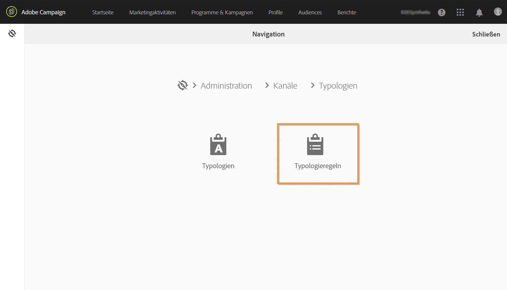

1. Wählen Sie in der Liste mit Typologieregeln die Option **[!UICONTROL Erstellen]** aus.

   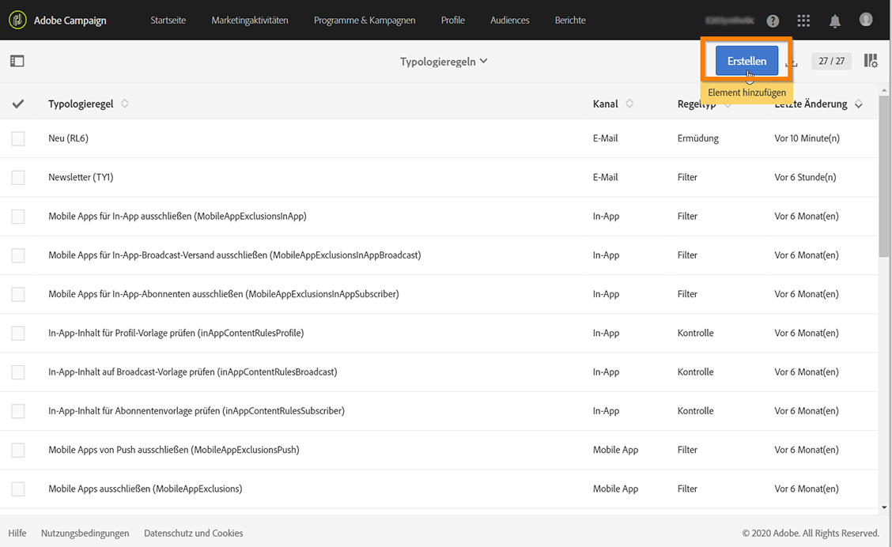

1. Wählen Sie im Feld **[!UICONTROL Regeltyp]** die Option **[!UICONTROL Ermüdung]** aus.

   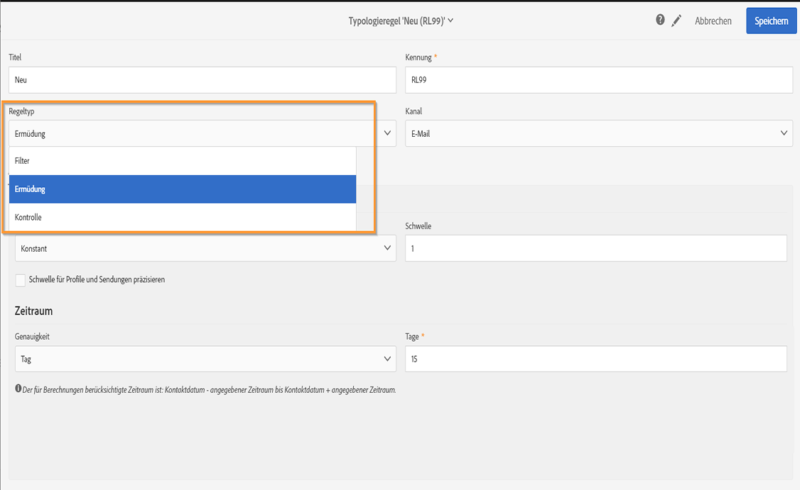

1. Wählen Sie im Feld **[!UICONTROL Kanal]** aus, auf welchen Kanal die Regel angewendet werden soll. Sie können entweder einen einzelnen Kanal (E-Mail, SMS, Briefpost, Mobile App) oder **[!UICONTROL Alle Kanäle]** auswählen. Siehe [Kanal auswählen](#choosing-the-channel).

   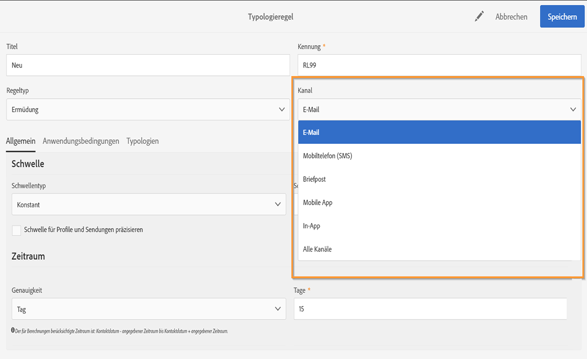

1. Definieren Sie im Tab **[!UICONTROL Allgemein]** die Methode zur Berechnung der maximalen Anzahl an Nachrichten pro Profil. Sie können entweder eine konstante oder variable Schwelle auswählen. Sie können auch die Schwelle für Profile und Sendungen präzisieren. Lesen Sie diesbezüglich auch den Abschnitt [Schwelle definieren](#defining-the-threshold).

   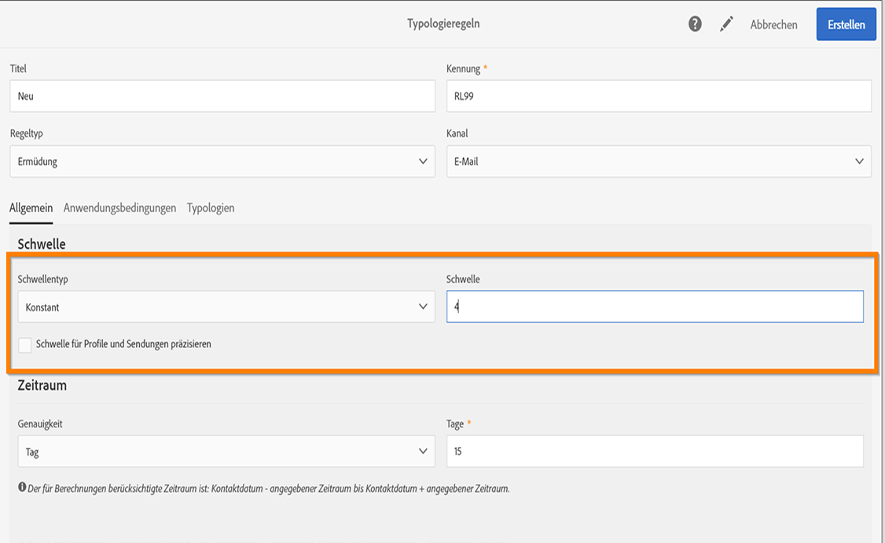

1. Wählen Sie einen **[!UICONTROL beweglichen Zeitraum]** aus, in dem die Typologieregel gelten soll. Lesen Sie diesbezüglich auch den Abschnitt [Beweglichen Zeitraum festlegen](#setting-the-sliding-period).

   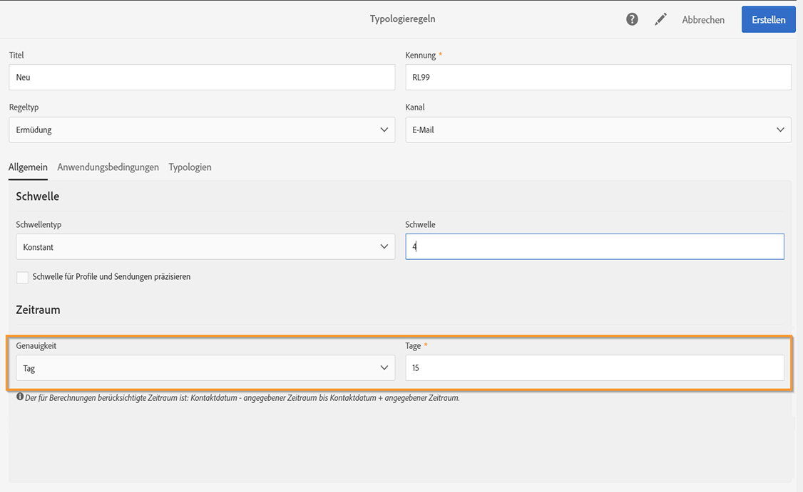

   In diesem Beispiel (siehe vorherige Screenshots) möchten wir eine Höchstzahl von vier Nachrichten in einem beweglichen Zeitraum von 15 Tagen versenden.

1. Im Tab **[!UICONTROL Anwendungskriterien]** können Sie festlegen, ob diese Regel je nach Nachricht für alle Sendungen gelten oder die Anwendbarkeit der Regel einschränkt werden soll. Die Regel wird nur ausgeführt, wenn die Anwendungsbedingung erfüllt ist. Sie können die Regel beispielsweise nur auf Nachrichten anwenden, deren Titel mit einem bestimmten Wort oder einer Kennung beginnt, die bestimmte Buchstaben enthalten. Siehe [Anwendbarkeit einer Filterregel einschränken](../../sending/using/filtering-rules.md#restricting-the-applicability-of-a-filtering-rule).

   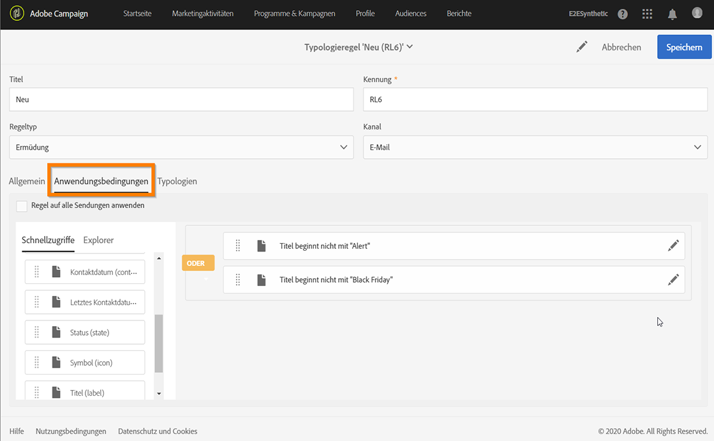

1. Wählen Sie den Tab **[!UICONTROL Typologien]** aus und verknüpfen Sie Ihre Typologieregel mit der für Ihre Sendungen verwendeten Typologie. Siehe [Typologien verwalten](../../sending/using/managing-typologies.md) und [Typologieregeln](../../sending/using/managing-typology-rules.md).

   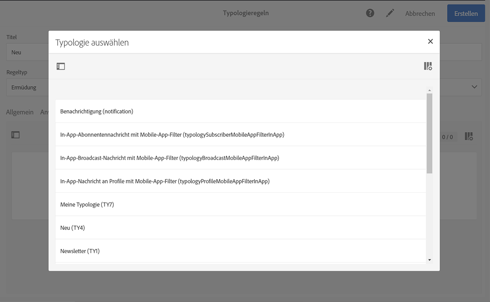

   >[!NOTE]
   >
   >Die Typologie kann auf Ebene der Versandvorlage festgelegt werden, um sie automatisch auf alle mit der jeweiligen Vorlage erstellten Sendungen anzuwenden.

Bei der Versandvorbereitung werden Profile vom Versand ausgeschlossen, wenn sie bereits eine bestimmte Anzahl an Sendungen erhalten haben. Die Ausführungsergebnisse der Ermüdungsregel finden Sie in den Versandlogs. Siehe [Ermüdungsergebnisse ansehen](#viewing-the-fatigue-results).

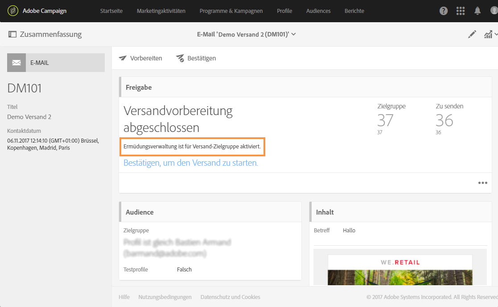

>[!IMPORTANT]
>
>Damit Ermüdungsregeln funktionieren, müssen Sie ein Kontaktdatum für den Versand festlegen. Wenn Sie Nachrichten sofort senden möchten, wird die Ermüdungsregel nicht angewendet.

## Kanal auswählen   {#choosing-the-channel}

Ermüdungsregeln sind für mehrere Kanäle verfügbar. Den Kanal können Sie in den Einstellungen der Typologieregel im Feld **[!UICONTROL Kanal]** definieren. Zur Auswahl stehen entweder ein einzelner Kanal oder **[!UICONTROL Alle Kanäle]**.

**Verfügbare Kanäle**

Folgende Kanäle stehen zur Verfügung:

* E-Mail
* Mobiltelefon (SMS)
* Briefpost
* Mobile App: Mit diesem Kanal können Sie Push-Benachrichtigungen an Profile oder an App-Abonnenten senden. Wenn Sie Benachrichtigungen an Profile senden, können die Ermüdungsregeln für alle Kanäle verwendet werden.

   >[!IMPORTANT]
   >
   >Ermüdungsregeln sind jedoch nicht kompatibel mit an App-Abonnenten gesendete Push-Benachrichtigungen. Wenn Sie Nachrichten an App-Abonnenten senden, werden die Ermüdungsregeln nicht angewendet.

* Alle Kanäle: Mit dieser Option können Sie die Regel auf alle Kanäle anwenden. Beispielsweise können Sie festlegen, monatlich kanalübergreifend maximal drei Nachrichten zu versenden. Wenn Sie in der Vorwoche zwei E-Mails an ein Profil gesendet haben und diesem Profil heute eine Push-Benachrichtigung senden möchten, wird dieses Profil ausgeschlossen.

**Versandtypen**

Ermüdungsregeln sind mit allen Versandtypen kompatibel: einmalige Sendungen, wiederkehrende Sendungen, Workflow-Sendungen und Transaktionsnachrichten.

**Transaktionsnachrichten** kommen zum Versand von Dienstnachrichten zur Anwendung. In diesem Fall wird die Zielgruppe über Ereignisse (rtEvent) bestimmt. Aber auch der Versand von Marketing-Nachrichten ist möglich, bei denen die Zielgruppe Profile enthält. Dies ist beispielsweise bei Remarketing-Nachrichten der Fall. Ermüdungsregeln sind nur mit Marketing-Nachrichten kompatibel (Zielgruppenbestimmung durch Profile). Ereignis-Transaktionsnachrichten enthalten keine Profilinformationen, weshalb sie nicht mit Ermüdungsregeln kompatibel sind (auch nicht, wenn sie mit Profilen angereichert werden). Durch die Unterstützung von Marketing-Nachrichten durch Transaktionsnachrichten können Sie **auf alle Kanäle eine Ermüdungsregel anwenden, auch auf Marketing-Transaktionsnachrichten**.

## Schwelle definieren   {#defining-the-threshold}

In jeder Ermüdungsregel wird eine Schwelle definiert, also eine maximale Nachrichtenanzahl, die in einem gewissen Zeitraum an ein Profil gesendet werden kann. Sobald diese Schwelle erreicht ist, können keine Sendungen mehr durchgeführt werden, bis der Zeitraum abgelaufen ist. Durch dieses Verfahren kann ein Profil aus einem Versand automatisch ausgeschlossen werden, wenn eine Nachricht die festgelegte Schwelle übersteigt. Dadurch wird verhindert, dass ein Profil zu oft angesprochen wird.

Schwellenwerte können konstant oder variabel sein. Das bedeutet, dass unterschiedliche Profile in einem bestimmten Zeitraum unterschiedliche Schwellen aufweisen können oder Schwellen sogar innerhalb desselben Profils variieren können.

**Fixe Schwelle verwenden**

Die Schwelle stellt die maximale Anzahl der Nachrichten dar, die an ein Profil im betreffenden Zeitraum geschickt werden kann.

Die Schwelle ist standardmäßig konstant. Die von der Regel erlaubte maximale Nachrichtenanzahl muss festgelegt werden.

**Variable Schwelle verwenden**

Um eine variable Schwelle zu definieren, wählen Sie im Feld **[!UICONTROL Schwellentyp]** den Wert **[!UICONTROL Empfängerabhängig]** aus.

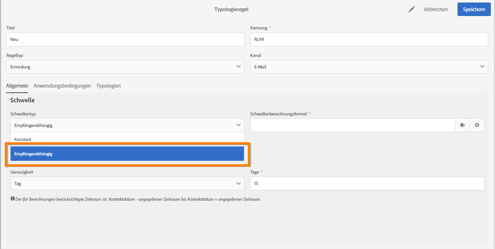

Dann haben Sie zwei Möglichkeiten:

* Wählen Sie ein Profilfeld aus: Die Schwelle ändert sich für jedes Profil entsprechend dem ausgewählten Feld. Wenn Sie beispielsweise die Profil-Ressource durch das Feld &#39;Kommunikationshäufigkeit&#39; erweitert haben, wählen Sie das Feld mithilfe der Schaltfläche rechts vom Feld **[!UICONTROL Schwellenformel]** und danach Ihr Feld aus. Für jedes Profil übernimmt die Schwelle den im Feld &#39;Kommunikationshäufigkeit‘ angegebenen Wert.

   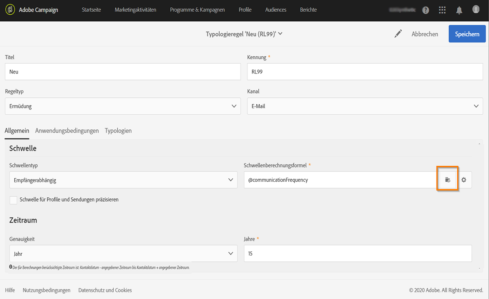

* Definieren Sie eine Formel: Verwenden Sie die zweite Schaltfläche rechts neben dem Feld **[!UICONTROL Schwellenformel]**, um eine erweiterte Schwellenformel zu definieren. Sie können beispielsweise die Anzahl der genehmigten Nachrichten entsprechend dem Segment indexieren, zu dem das Profil gehört. Dies bedeutet, dass ein Profil, das zum Segment &#39;Web&#39; gehört, mehr Nachrichten erhalten kann als andere Profile. Mit einer Formel vom Typ **[!UICONTROL Iif (@origin=&#39;Web&#39;, 5, 3)]** wird der Versand von fünf Nachrichten an Profile des Web-Segments und an drei anderer Segmente genehmigt.

   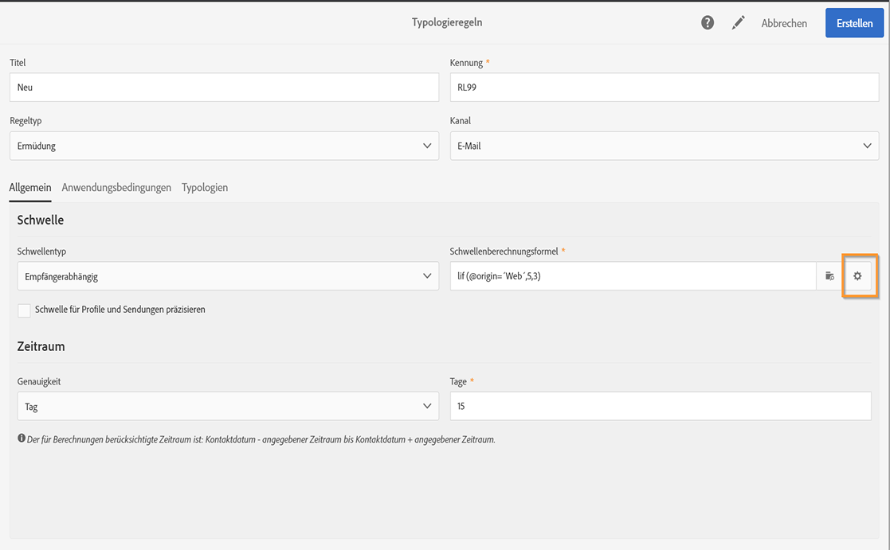

**Schwelle für Profile und Sendungen präzisieren**

Standardmäßig werden bei der Schwellenberechnung alle Nachrichten berücksichtigt. Markieren Sie die Option **[!UICONTROL Schwelle für Profile und Sendungen präzisieren]**, um bei der Versandvorbereitung die zu zählenden Profile und Sendungen zu filtern.

Im folgenden Beispiel werden nur männliche Profile und nur Sendungen mit einem Titel gezählt, der mit **Newsletter** beginnt.

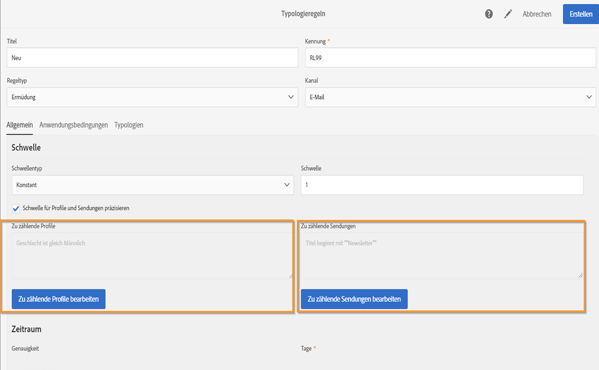

Das Präzisieren der Schwelle für Sendungen funktioniert anders als die Beschränkung der Anwendbarkeit der gesamten Regel (Tab **[!UICONTROL Anwendungsbedingungen]**):

* **[!UICONTROL Anwendungsbedingungen]**: Hier legen Sie fest, ob die Regel gemäß bestimmten Kriterien ausgeführt werden soll oder nicht. Wenn beispielsweise Ihre Anwendungsbedingung &#39;Titel beginnt mit Newsletter&#39; lautet, wird die Regel nur auf Sendungen angewendet, auf die diese Bedingung zutrifft. Wenn der Titel des Versands mit &#39;Promotion&#39; beginnt, wird die Regel gar nicht ausgeführt.
* **[!UICONTROL Schwelle für Profile und Sendungen präzisieren > Zu zählende Sendungen]**: Alle Sendungen, die diese Typologieregel verwenden, führen die Regel aus, doch Sie entscheiden, welche der ausgeführten und geplanten Sendungen gezählt werden sollen. Wenn beispielsweise Ihre Beschränkung ‚Titel beginnt mit Newsletter‘ lautet, wird die Regel ausgeführt, selbst wenn der Versandtitel mit &#39;Promo‘ beginnt. Gezählt wird die Anzahl der Sendungen im ausgewählten beweglichen Zeitraum, deren Titel mit &#39;Newsletter‘ beginnt.

## Beweglichen Zeitraum festlegen   {#setting-the-sliding-period}

Die Ermüdungsregeln werden für bewegliche Zeiträume von n Tagen bestimmt. Der Zeitraum wird im Bereich **[!UICONTROL Beweglicher Zeitraum]** konfiguriert, z. B. 2 Wochen, 7 Tage oder 5 Stunden.

Bei der Ausführung der Regel werden sowohl vergangene als auch geplante Sendungen berücksichtigt. Damit wird sichergestellt, dass in einem bestimmten beweglichen Zeitraum die Schwelle nie überschritten wird.

Wenn Sie beispielsweise einen Zeitraum von 48 Stunden definieren, werden vom System 48 Stunden **vor dem Kontaktdatum** und 48 Stunden **nach dem Kontaktdatum** berücksichtigt. Der ausgewählte Zeitraum wird demnach verdoppelt, damit sowohl künftige als auch vorhergegangene Sendungen einbezogen werden können.

Um die berücksichtigten Sendungen auf einen Zeitraum von zwei Wochen zu beschränken, geben Sie im Bereich **Beweglicher Zeitraum** die Option **Tag** und **7** oder 1 Woche ein. In dieser Berechnung werden Sendungen berücksichtigt, die bis zu sieben Tage vor dem Verfügbarkeitsdatum und bis zu sieben Tage nach dem in der Regel festgelegten Verfügbarkeitsdatum durchgeführt werden.

## Ermüdungsergebnisse ansehen   {#viewing-the-fatigue-results}

Bei der Versandvorbereitung werden Profile vom Versand ausgeschlossen, wenn sie bereits eine bestimmte Anzahl an Sendungen erhalten haben. Der Zugriff auf die Ausführungsergebnisse der Ermüdungsregel ist über die Schaltfläche unten rechts in der **[!UICONTROL Freigabe]**-Kachel möglich.

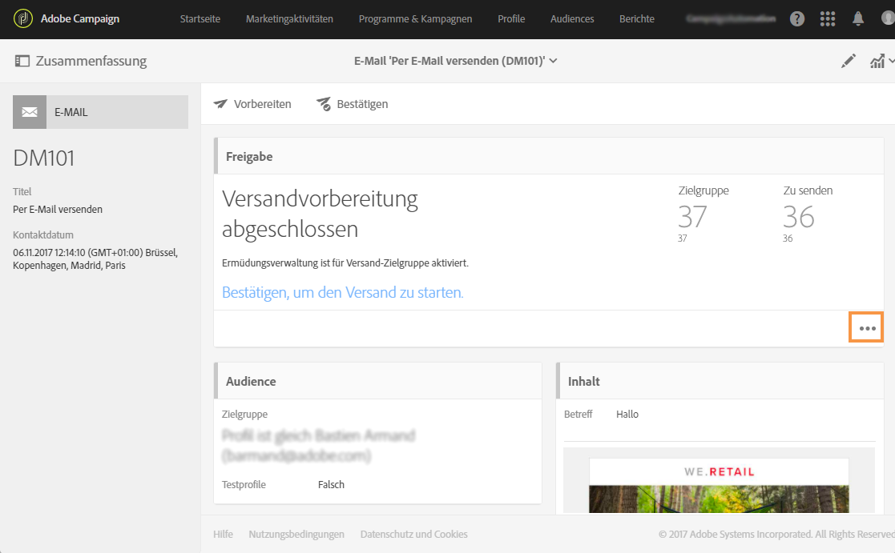

In drei Tabs werden die Durchführungsergebnisse der Ermüdungsregel, einschließlich des Namens der Regel, angezeigt:

* Versandlogs:

   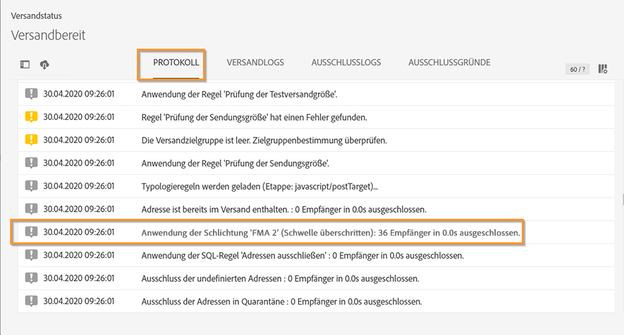

* Ausschlusslogs:

   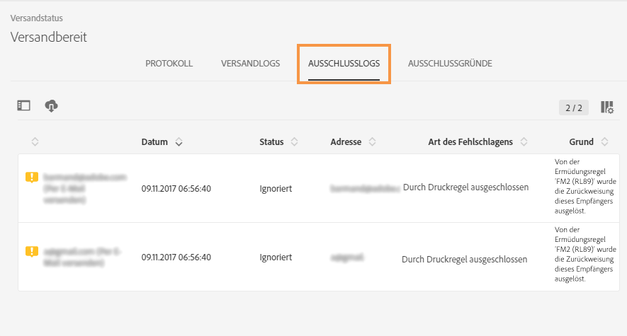

* Ausschlussgründe:

   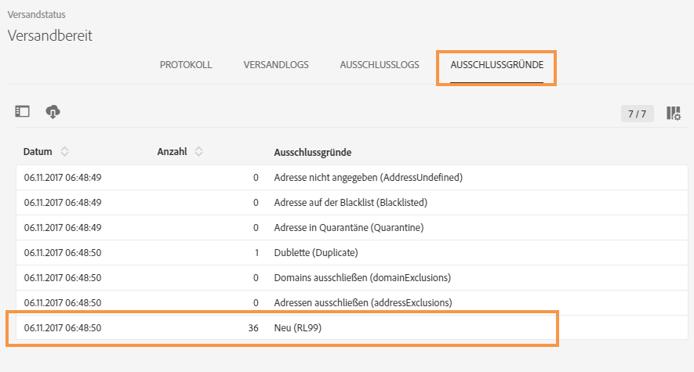

## Bericht mit der Zusammenfassung zu Ermüdungsregeln ansehen   {#viewing-the-fatigue-rule-summary-report}

In Adobe Campaign ist ein Bericht zu Ermüdungsregeln verfügbar, dem Sie entnehmen können, wie die Regeln auf Ihre Kampagnen angewendet werden. Dadurch erfahren Sie, wie Ihre Kampagnen einander beeinflussen und welche Anpassungen Sie vornehmen können.

Der Bericht mit der **[!UICONTROL Zusammenfassung zu Ermüdungsregeln]** kann oben rechts in einem Programm, einer Kampagne oder einer Nachricht über die Schaltfläche **[!UICONTROL Berichte]** geöffnet werden.

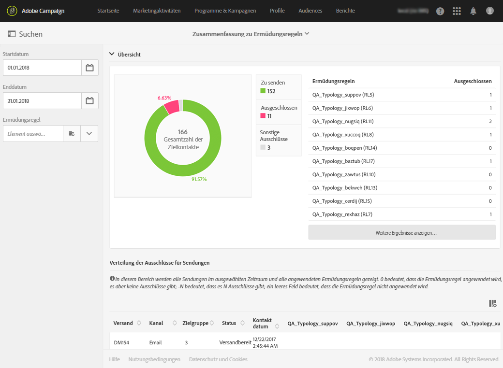

Auf der linken Seite des Bildschirms können Sie die Daten des Berichts nach Kontaktdatum der Sendungen filtern. Standardmäßig beginnt der ausgewählte Zeitraum 15 Tage vor dem aktuellen Datum und endet 15 Tage danach. Sie können auch nach einer bestimmten Ermüdungsregel filtern.

Das Kreisdiagramm bietet für den ausgewählten Zeitraum die folgenden Informationen:

* **[!UICONTROL Gesamtzahl der Zielkontakte]**: die gesamte Zielgruppe vor der Nachrichtenvorbereitung
* **[!UICONTROL Ausgeschlossen]**: die Gesamtzahl der Ausschlüsse wegen der Anwendung der Ermüdungsregel
* **[!UICONTROL Sonstige Ausschlüsse]**: die Gesamtzahl der Ausschlüsse wegen anderer Typologieregeln
* **[!UICONTROL Zu senden]**: die Gesamtzahl der nach der Nachrichtenvorbereitung zu sendenden Nachrichten (**[!UICONTROL Zu senden]** = **[!UICONTROL Gesamtzahl der Zielkontakte]** – **[!UICONTROL Ausgeschlossen]** – **[!UICONTROL Sonstige Ausschlüsse]**)

Rechts neben dem Diagramm finden Sie die Anzahl der Ausschlüsse aufgeschlüsselt nach Ermüdungsregeln.

In der Tabelle am unteren Seitenrand werden alle im ausgewählten Zeitraum durchgeführten Sendungen angezeigt. Für jeden Versand werden die angewendeten Ermüdungsregeln und die entsprechenden Ausschlüsse aufgeführt. Auch Sendungen ohne Kontaktdatum sind in der Tabelle enthalten.

* **[!UICONTROL 0]** bedeutet, dass die Ermüdungsregel angewendet wurde, aber kein Ausschluss erfolgte.
* **[!UICONTROL -N]** bedeutet, dass N Ausschlüsse durchgeführt wurden.
* Ein leeres Feld bedeutet, dass die Ermüdungsregel nicht angewendet wurde.

>[!NOTE]
>
>Die angezeigten Daten beziehen sich kontextuell nicht auf das Programm, die Nachricht oder die Kampagne, von denen auf den Bericht zugegriffen wird. In diesem Bericht werden alle Ermüdungsregeln und Sendungen für alle Organisationseinheiten angezeigt. Dadurch erhalten Sie einen umfassenden Überblick über alle Sendungen und können analysieren, wie Ihre Kampagnen durch andere beeinflusst werden.

## Beispiele   {#examples}

Es gibt viele Möglichkeiten zur Verwendung der Ermüdungsfunktion. Hier sind einige Beispiele:

* Erstellen Sie eine Ermüdungsregel mit einer **konstanten Schwelle**, die für **alle Kanäle** gilt:

   Angenommen, Sie erstellen eine Regel für mehrere Kanäle mit einer konstanten Schwelle von 3 über einen beweglichen Zeitraum von 7 Tagen.

   In der vorangegangenen Woche haben Ihre Premium-Profile eine Promotion-E-Mail und eine Transaktions-Remarketing-E-Mail erhalten. Außerdem haben Sie eine SMS geplant, die nächste Woche gesendet wird. Heute möchten Sie eine Push-Benachrichtigung an alle Ihre Profile senden. Die Premium-Profile werden aus der heutigen Push-Benachrichtigung ausgeschlossen, da ihre maximale Nachrichtenanzahl über einen Zeitraum von zwei Wochen bereits erreicht wurde.

   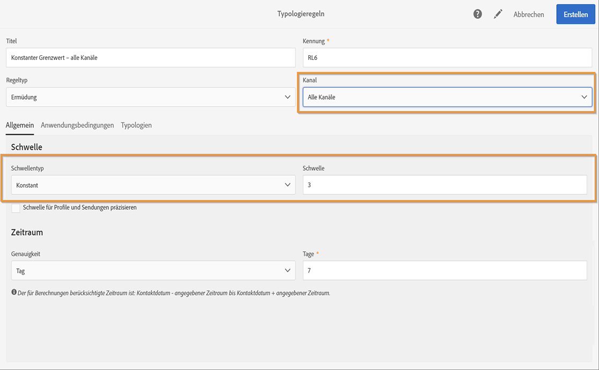

* Erstellen Sie eine Ermüdungsregel mit einer **variablen Schwelle** auf der Basis eines **Profilfelds**:

   Sie haben die Profil-Ressource mit dem Feld &#39;Kommunikationsbeschränkung&#39; erweitert, um für jedes Profil eine andere Schwelle festzulegen. Definieren Sie in Ihrer Ermüdungsregel eine variable Schwelle auf der Basis dieses Feldes und wählen Sie einen beweglichen Zeitraum von zwei Tagen aus. Sehen wir uns als Beispiel zwei Profile an: John hat eine Kommunikationsbeschränkung von 1 und David hat eine Schwelle von 2. Beide haben bereits gestern eine E-Mail mit einem Newsletter erhalten. Sie möchten ihnen heute noch eine E-Mail schicken. Nur David wird eine erhalten, da John von der Zielgruppe ausgeschlossen wurde.

   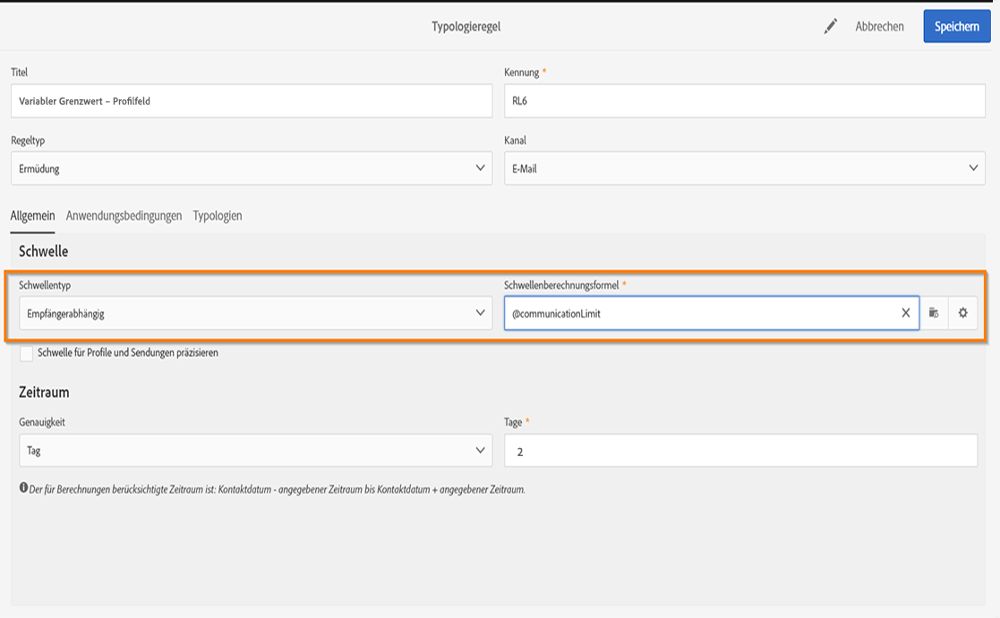

* Erstellen Sie eine Ermüdungsregel mit einer **Schwellenformel**:

   Sie möchten die Schwelle dem Alter Ihrer Profile anpassen. Für Profile unter 40 möchten Sie ein Limit von 4 und für ältere Profile ein Limit von 2 festlegen. Anstatt diese Schwelle für jedes Profil über ein erweitertes Feld festzulegen, können Sie direkt in Ihrer Ermüdungsregel eine Formel erstellen, mit der die Schwelle entsprechend dem Alter Ihrer Profile berechnet wird. In unserem Beispiel wäre die Formel **[!UICONTROL Iif (@age&lt;40, 4, 2)]**.

   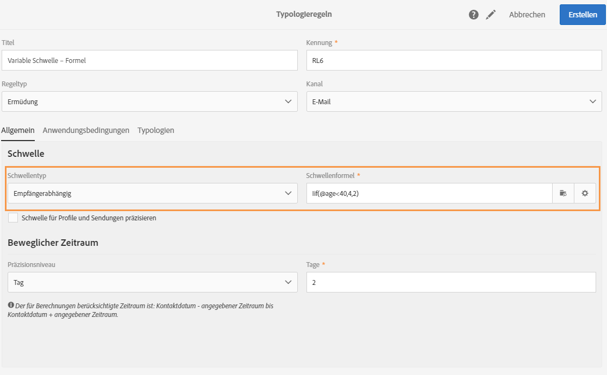

   >[!NOTE]
   >
   >Dieser Abschnitt enthält auch ein Beispiel mit einer schrittweisen Anleitung zu einer Ermüdungsregel, in der eine Schwellenformel verwendet wird.

* Erstellen Sie eine Ermüdungsregel zur **Präzisierung der Schwelle** für Profile und Sendungen:

   Sie haben die Profil-Ressource mit dem Feld &#39;Punktzahl&#39; und die Sendungen-Ressource mit dem Feld &#39;Typ&#39; erweitert. Sie möchten eine konstante Schwelle von 3 definieren, doch von der Zählung sollen alle Sendungen des Typs &#39;Warnung&#39; oder &#39;Schwarzer Freitag&#39; sowie alle Profile mit einer Punktzahl größer als 10 ausgeschlossen werden. Wenn die Regel ausgeführt wird, werden innerhalb der vorangegangenen und geplanten Sendungen alle Sendungen gezählt, die nicht vom Typ &#39;Warnung&#39; oder &#39;Schwarzer Freitag&#39; sind und an Profile gesendet werden, deren Punktzahl unter 10 liegt.

   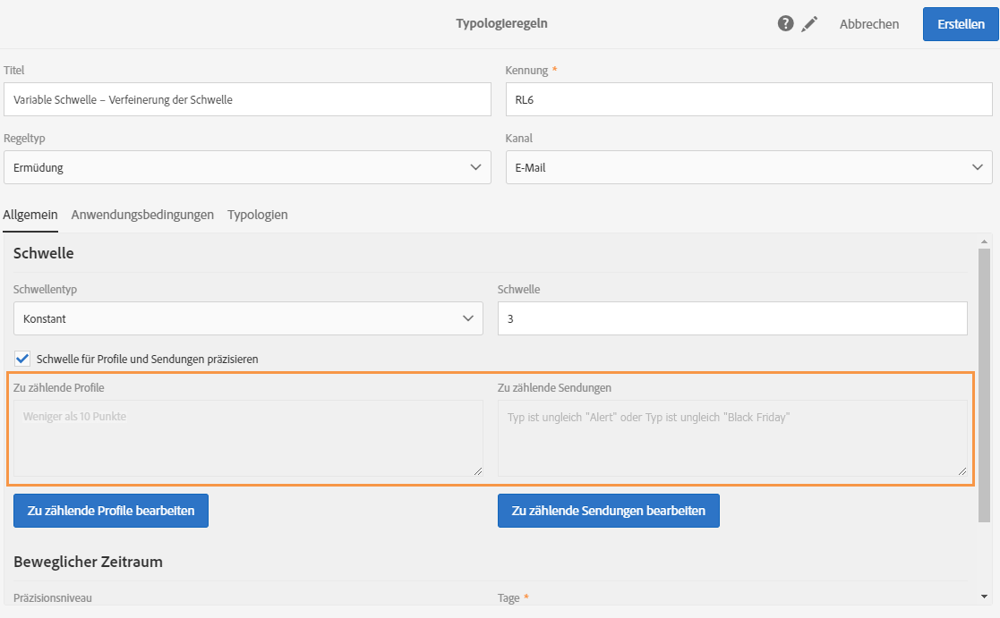

Im Folgenden finden Sie ein Beispiel mit einer schrittweisen Anleitung zur Erstellung einer Ermüdungsregel, in der eine Schwellenformel verwendet wird.

In diesem Anwendungsbeispiel möchten wir eine Typologieregel erstellen, die die Anzahl der wöchentlich gesendeten Nachrichten an Premium-Profile auf 2 und an Standard-Profile ebenfalls auf 2 begrenzt.

Um Kunden und Interessenten zu identifizieren, haben wir die Profil-Ressource mit dem Feld **[!UICONTROL Status]** erweitert, das 0 für Premium-Profile und 1 für Standard-Profile enthält.

Befolgen Sie die nachstehenden Schritte, um die Regel zu konfigurieren:

1. Erstellen Sie eine neue Typologieregel vom Typ **Ermüdung**.
1. Im Bereich **[!UICONTROL Schwelle]** möchten wir eine Formel zur Berechnung der Schwelle für jedes Profil erstellen. Wählen Sie im Feld **[!UICONTROL Schwellentyp]** den Wert **[!UICONTROL Empfängerabhängig]** aus und verwenden Sie dann die zweite Schaltfläche rechts vom Feld **[!UICONTROL Schwellenberechnungsformel]**.

   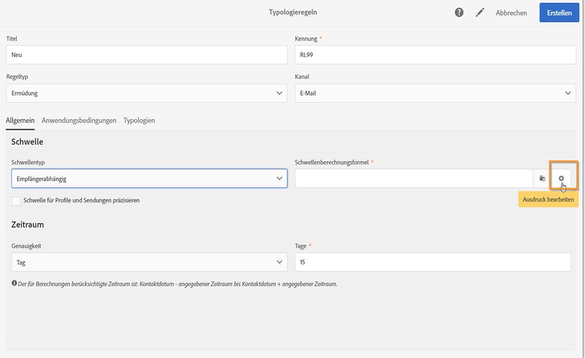

1. Wählen Sie in der **[!UICONTROL Funktionsliste]** im Knoten **Sonstige** mit einem Doppelklick die Funktion **[!UICONTROL Iif]** aus.

   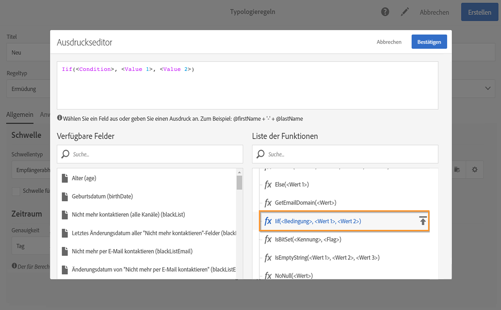

1. Wählen Sie anschließend den **Status** des Profils im Abschnitt **[!UICONTROL Verfügbare Felder]** aus.

   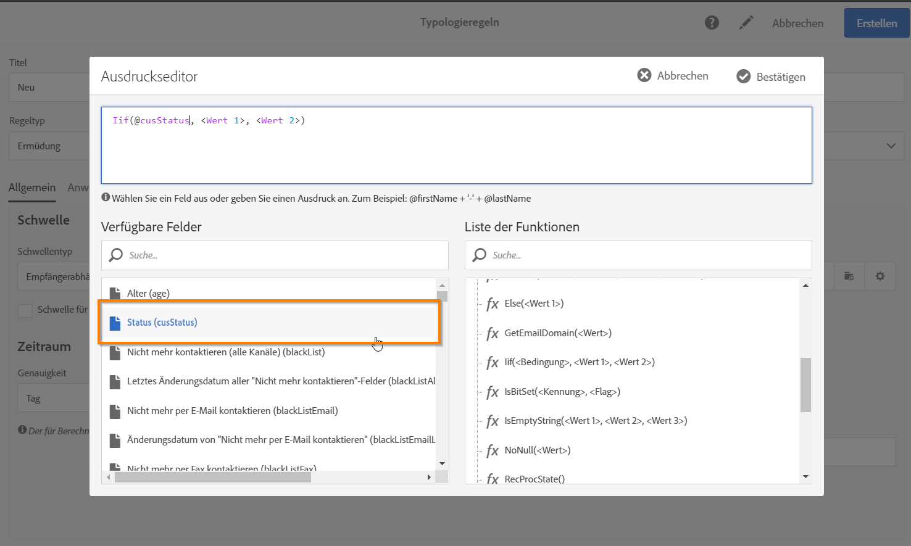

1. Geben Sie die gewünschten Werte für folgende Formel ein: **Iif(@status=0,2,4)**

   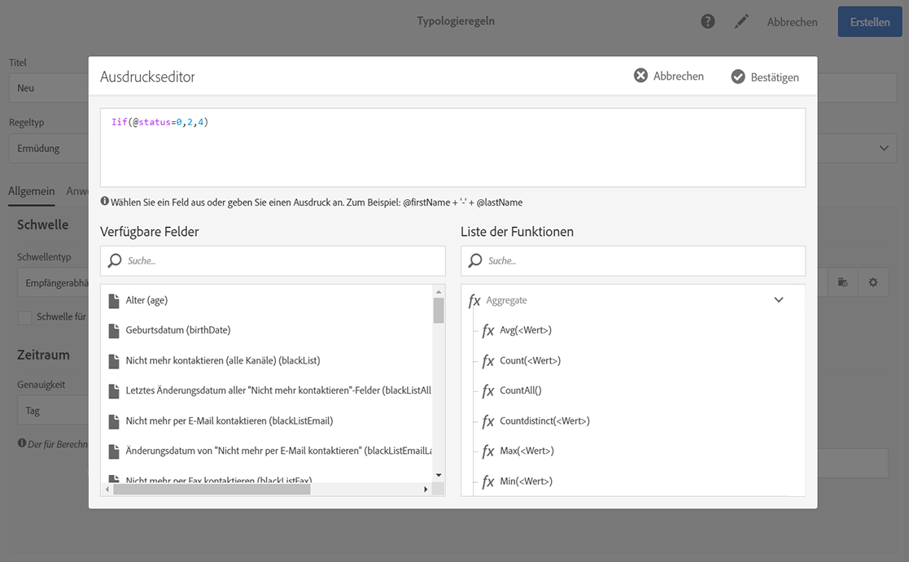

   Diese Formel ordnet einem Status gleich 0 den Wert 2 und jedem anderen Status den Wert 4 zu.

1. Klicken Sie auf die Schaltfläche **[!UICONTROL Bestätigen]**, um die Formel zu bestätigen.
1. Wählen Sie einen **[!UICONTROL beweglichen Zeitraum]** aus, in dem die Regel gelten soll: Wählen Sie für unser Beispiel sieben Tage aus, um die berücksichtigten Sendungen auf einen Zeitraum von zwei Wochen zu beschränken.

   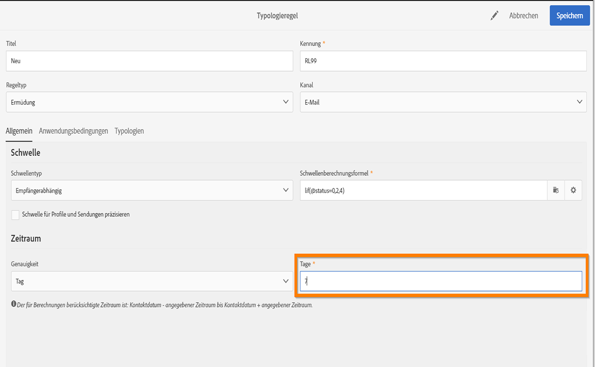

1. Fügen Sie die Regel einer Typologie hinzu, um sie bei Sendungen anwenden zu können. Wählen Sie dazu den Tab **[!UICONTROL Typologien]**, die Option **[!UICONTROL Element erstellen]** und danach die für Ihre Sendungen verwendete Typologie aus.

   

1. Speichern Sie die Regel, um ihre Erstellung zu bestätigen.

Die Regel wird daraufhin für alle Sendungen auf der Basis der Typologie angewendet.
