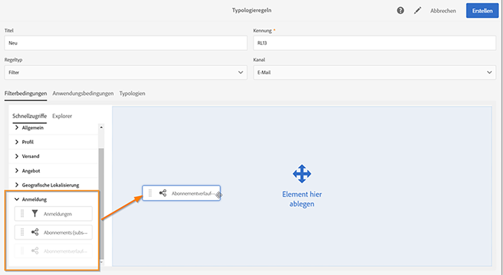
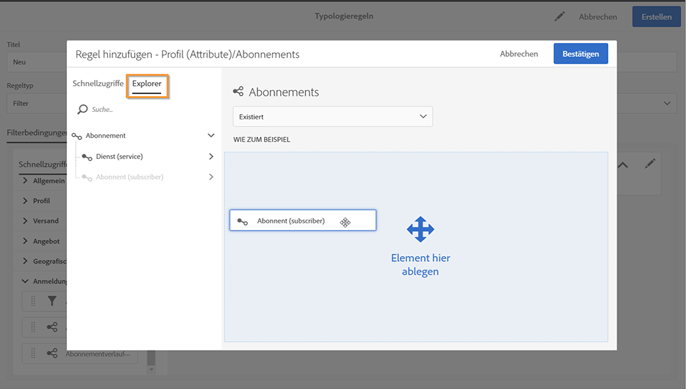
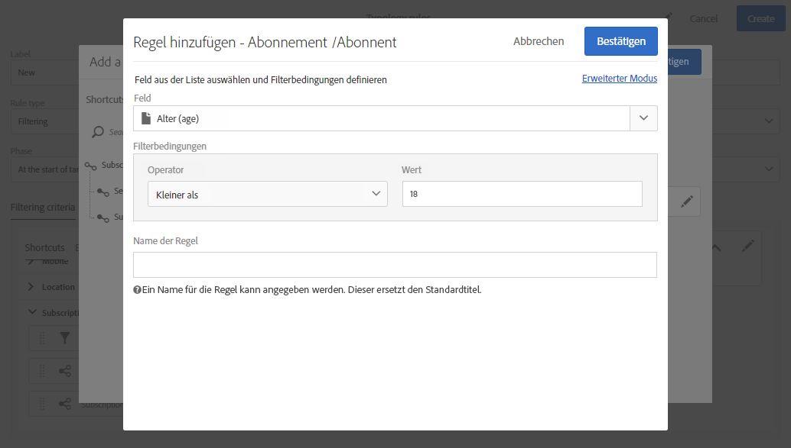
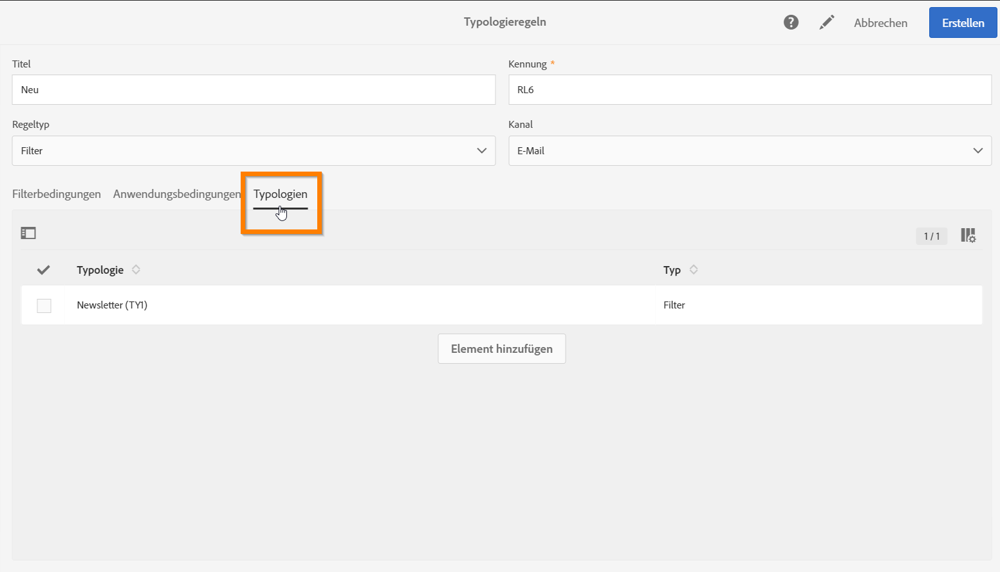
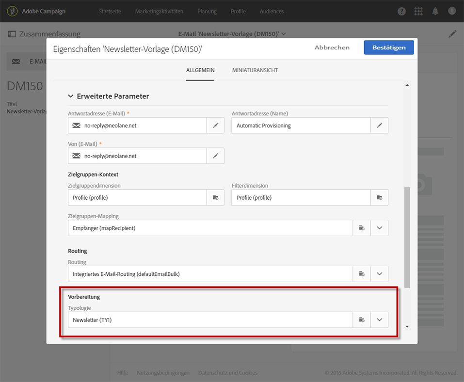
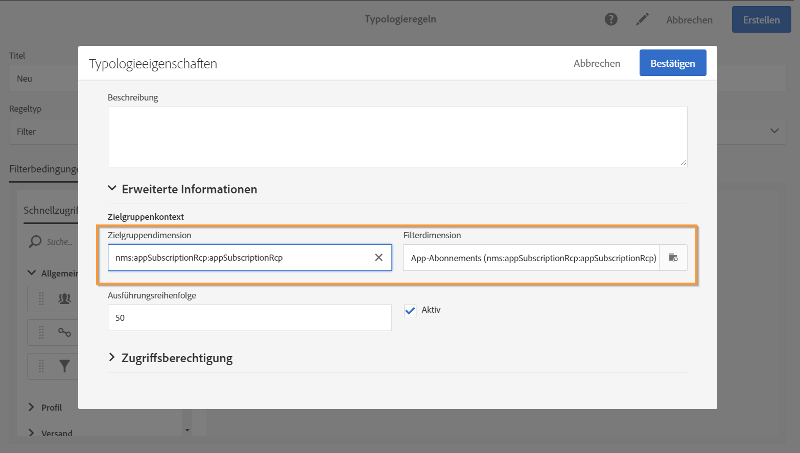
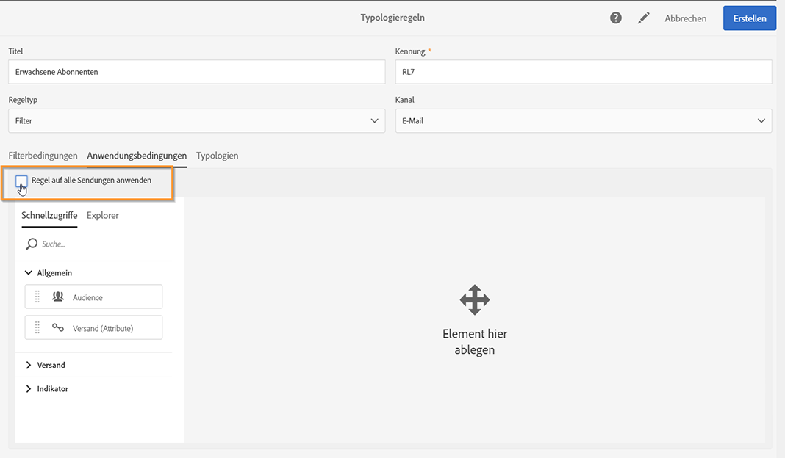
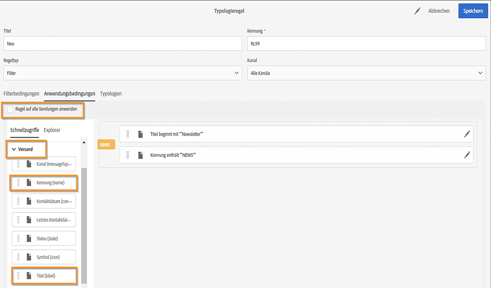

# Filterregeln {#filtering-rules}

Mit Filterregeln können Sie einen Teil der Nachrichten-Zielgruppe anhand von in einer Abfrage definierten Kriterien ausschließen. Mögliche Kriterien sind zum Beispiel Profile in Quarantäne oder Profile, die bereits eine bestimmte Anzahl an E-Mails erhalten haben.

## Standardmäßige Filtertypologieregeln {#default-filtering-typology-rules}

Die nachstehende Tabelle enthält Informationen zu vordefinierten Filterregeln sowie zu den zugehörigen Kanälen.

| Titel | Kanal | Beschreibung |
| ---------|----------|---------|
| **[!UICONTROL Adresse nicht angegeben]** | Alle | Schließt die Zielpopulation ohne angegebene Adresse (E-Mail, Anschrift usw. je nach ausgewähltem Kanal) aus. |
| **[!UICONTROL Adresse auf Blockierungsliste]** | Alle | Schließt Adressen aus, die sich auf der Blockierungsliste befinden. |
| **[!UICONTROL Duplikat]** | Alle | Schließt Duplikate anhand des Felds **[!UICONTROL Adresse]** der Zielpopulation aus. |
| **[!UICONTROL Mobile Apps ausschließen]** | Mobile App | Schließt App-Anmeldungen aus, die nicht mit der in der Nachricht definierten Mobile App übereinstimmen. |
| **[!UICONTROL Mobile Apps für In-App ausschließen]** | In-App | Schließt App-Anmeldungen aus, die nicht mit der in der Nachricht definierten Mobile App übereinstimmen (In-App-Vorlage). |
| **[!UICONTROL Mobile Apps für In-App-Broadcast-Versand ausschließen]** | In-App | Schließt App-Anmeldungen aus, die nicht mit der in der Nachricht definierten Mobile App übereinstimmen (In-App-Broadcast-Vorlage) |
| **[!UICONTROL Mobile Apps von Push ausschließen]** | Mobile App | Schließt App-Anmeldungen aus, die nicht mit der in der Nachricht definierten Mobile App übereinstimmen (Push) |
| **[!UICONTROL Adresse in Quarantäne]** | Alle | Schließt Quarantäne-Neuzugänge aus. |
| **[!UICONTROL Größe der Zielgruppe begrenzt]** | Alle | Überprüft, ob die maximale Versandgröße für die Zielgruppe erreicht wurde. Gilt für Briefpostversand mit aktivierter Option &quot;Versand-Deadline&quot;. |

Zusätzlich zu diesen standardmäßigen Filterregeln stehen zwei Ausschlussregeln zur Verfügung:

* **[!UICONTROL Ausschluss von Adressen]** ( **[!UICONTROL addressExclusions]** )
* **[!UICONTROL Ausschluss von Domains]** ( **[!UICONTROL domainExclusions]** ).

Während der E-Mail-Analyse vergleichen diese Regeln die E-Mail-Adressen der Empfänger mit den unzulässigen Adressen oder Domain-Namen aus einer verschlüsselten globalen Unterdrückungsliste, die in der Zustellbarkeitsinstanz verwaltet wird. Im Falle einer Übereinstimmung wird die Nachricht nicht an den jeweiligen Empfänger gesendet.

Auf diese Weise soll das Hinzufügen zur Blockierungsliste aufgrund von schädlichen Aktivitäten, insbesondere durch die Verwendung von Spamtraps, vermieden werden. Wenn beispielsweise für die Anmeldung über ein Web-Formular eine Spamtrap verwendet wird, wird automatisch eine Bestätigungs-E-Mail an diese Spamtrap gesendet. Als Folge davon wird Ihre Adresse automatisch auf die Blockierungsliste gesetzt.

>[!NOTE]
>
>Die Adressen und Domain-Namen in der globalen Unterdrückungsliste sind verborgen. In den Versandanalyse-Logs wird nur die Anzahl der ausgeschlossen Empfänger angegeben.

## Filterregel erstellen         {#creating-a-filtering-rule}

Sie können entsprechend Ihren Anforderungen eigene Filterregeln erstellen. Sie können beispielsweise die Zielpopulation von Newslettern so filtern, dass Abonnenten unter 18 Jahren keine Nachricht erhalten.

Gehen Sie wie folgt vor, um eine Typologieregel zum Filtern zu erstellen:

1. Erstellen Sie eine neue Typologieregel. Die wichtigsten Schritte zum Erstellen von Typologieregeln sind in [diesem Abschnitt](../../sending/using/managing-typology-rules.md) beschrieben.

1. Wählen Sie den Typ **[!UICONTROL Filterregel]** aus und geben Sie dann den gewünschten Kanal an.

1. Wählen Sie im Tab **[!UICONTROL Filterbedingungen]** in der Kategorie **[!UICONTROL Anmeldung]** die Abonnements aus.

   

1. Ziehen Sie im **[!UICONTROL Explorer]**-Tab des Abfrage-Editors den **[!UICONTROL Abonnent]**-Knoten per Drag-and-Drop in den Arbeitsbereich des Bildschirms.

   

1. Wählen Sie das Feld **[!UICONTROL Alter]** und definieren Sie die Filterbedingungen so, dass das Mindestalter der Abonnenten weniger als 18 beträgt.

   

1. Verknüpfen Sie diese Regel im **[!UICONTROL Typologien]**-Tab mit einer Typologie.

   

1. Stellen Sie sicher, dass die betreffende Typologie im Versand oder der Versandvorlage, den bzw. die Sie verwenden möchten, ausgewählt ist. Weiterführende Informationen hierzu finden Sie in [diesem Abschnitt](../../sending/using/managing-typologies.md#applying-typologies-to-messages).

   

Wenn diese Regel in einer Nachricht verwendet wird, werden minderjährige Abonnenten automatisch ausgeschlossen.

## Konfigurieren des Zielgruppenbestimmungs-Kontexts von Filterregeln {#configuring-filtering-rules-targeting-context}

Mit Campaign Standard können Sie je nach den beabsichtigten Daten die **Targeting**- und **Filterdimensionen** konfigurieren.

Öffnen Sie dazu die Eigenschaften der Typologieregel und greifen Sie dann auf den Abschnitt **[!UICONTROL Erweiterte Informationen]** zu.

Standardmäßig werden für die Filterung **[!UICONTROL Profile]** herangezogen. Wenn sich die Regel beispielsweise auf eine Mobile App bezieht, kann für die **[!UICONTROL Filterdimension]** **[!UICONTROL App-Abonnements]** gewählt werden.

## Anwendbarkeit einer Filterregel einschränken        {#restricting-the-applicability-of-a-filtering-rule}

Sie können die Anwendbarkeit einer Filterregel je nach zu sendender Nachricht einschränken.

1. Deaktivieren Sie hierfür im Tab **[!UICONTROL Anwendungskriterien]** der Typologieregel die Option **[!UICONTROL Regel auf alle Sendungen anwenden]**, die standardmäßig aktiviert ist.

   

1. Verwenden Sie den Abfrage-Editor, um einen Filter zu definieren. Sie können die Regel beispielsweise nur auf Nachrichten anwenden, deren Titel mit einem bestimmten Wort beginnt oder deren Kennung bestimmte Buchstaben enthält.

   

In diesem Fall wird die Regel nur auf die Nachrichten angewendet, die den definierten Kriterien entsprechen.
