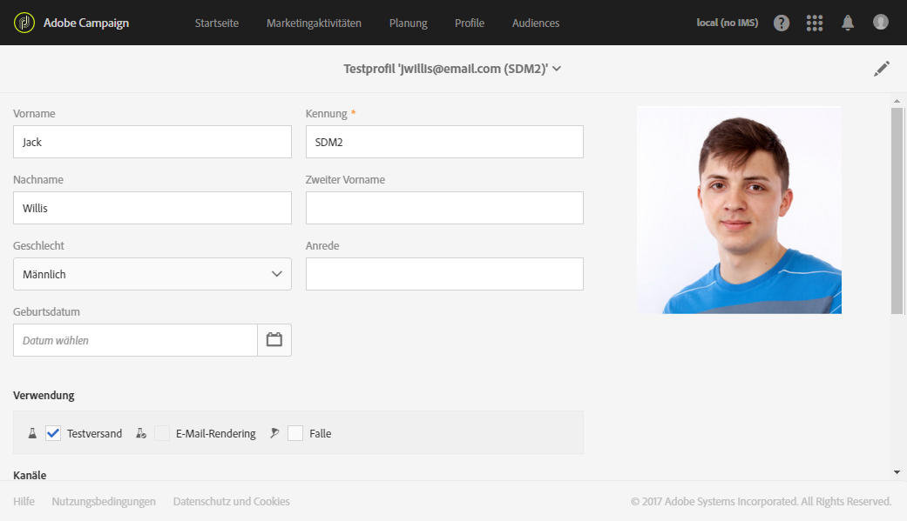
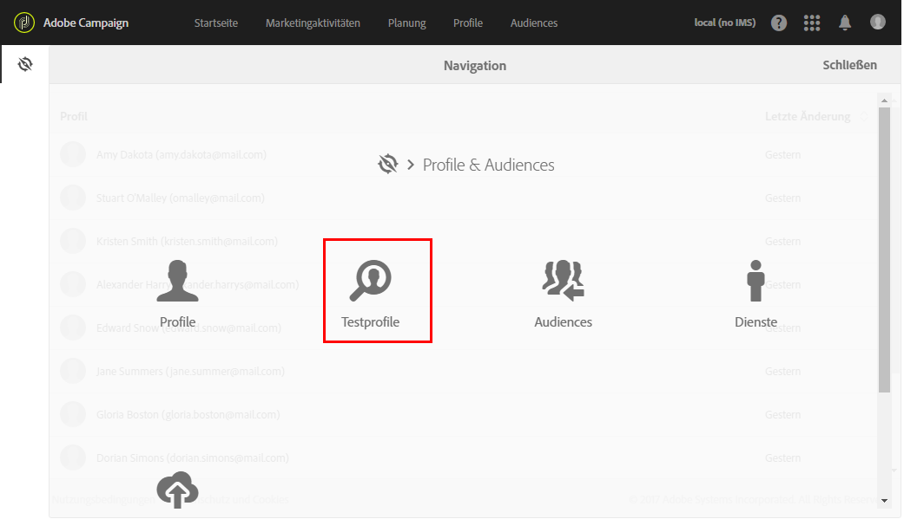
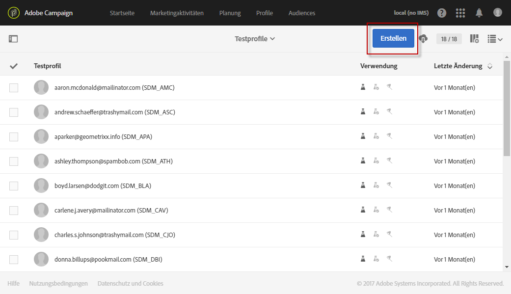
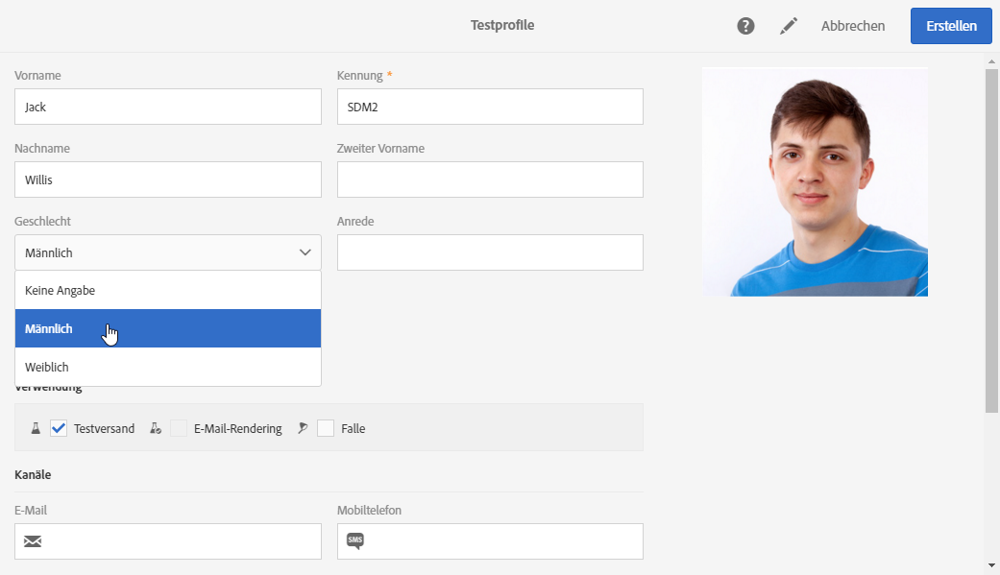
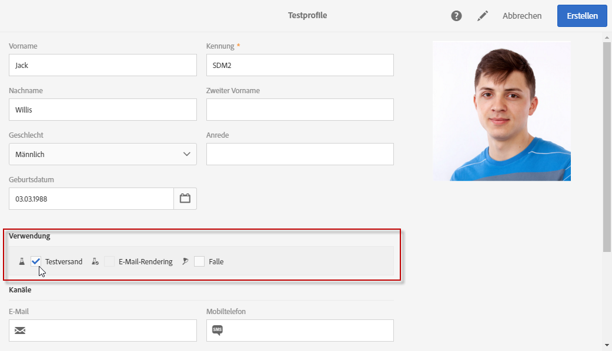
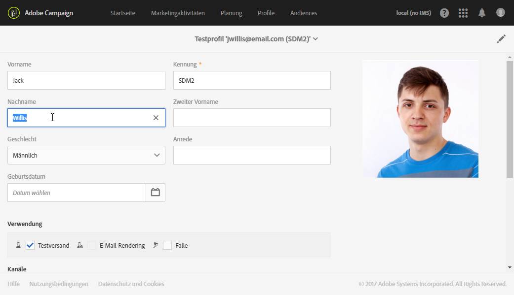

# Testprofile verwalten und Testsendungen durchführen{#managing-test-profiles-and-sending-proofs}

## Über Testprofile {#about-test-profiles}

Testprofile ermöglichen es, zusätzliche Empfänger anzusprechen, die nicht den definierten Zielgruppenkriterien entsprechen. Sie werden Audiences hinzugefügt, um beispielsweise Missbrauch bei der Nutzung Ihrer Empfängerliste aufzudecken oder den korrekten Erhalt der Sendungen zu kontrollieren.

Testprofile werden im erweiterten Menü **[!UICONTROL Profile &amp; Audiences > Testprofile verwaltet]**.

Testprofile sind Profile mit fiktiven oder vom Absender kontrollierten Kontaktinformationen, die verschiedenen Zwecken dienen können:

* **Testsendungen**: Dabei handelt es sich um einen speziellen Versand, der es ermöglicht, eine Nachricht vor dem Versenden an die Empfänger zu validieren. Testversand-Empfänger sind verantwortlich für die Validierung des Inhalts und der Form von Sendungen. Siehe [Testversand durchführen](#sending-proofs).
* **E-Mail-Rendering**: Diese Art von Testprofilen wird verwendet, um den Empfang und die Darstellung Ihrer Nachricht in den verschiedenen E-Mail-Clients zu testen. Beispielsweise Webmail, SMS, Mobilgeräte etc. Siehe [E-Mail-Rendering](../../sending/using/email-rendering.md).

   Die Funktion **E-Mail-Rendering** ist schreibgeschützt. Testprofile mit diesem Verwendungszweck sind ausschließlich nativ in Adobe Campaign enthalten.

* Als **Falle**: Die Nachricht wird auf dieselbe Weise an das Testprofil gesendet wie an die Hauptzielgruppe. Siehe [Verwenden von Fallen](#using-traps).
* **Vorschau** einer Nachricht: Durch Auswahl eines Testprofils lässt sich die korrekte Umsetzung von Personalisierungselementen innerhalb einer Nachricht prüfen. Siehe [Vorschau der Nachricht erzeugen](/help/sending/using/previewing-messages.md).

## Verwaltung von Testprofilen {#managing-test-profiles}

### Testprofile erstellen {#creating-test-profiles}

1. Greifen Sie mithilfe des Adobe-Campaign-Logos auf das erweiterte Menü **Profile &amp; Audiences > Testprofile** zu, um die Liste mit Testprofilen aufzurufen.

   

1. Verwenden Sie in der Übersicht der **[!UICONTROL Testprofile]**die Schaltfläche** Erstellen **.

   

1. Machen Sie die erforderlichen Angaben zum Profil.

   

1. Kreuzen Sie die Verwendung des Testprofils an.

   

1. Geben Sie die verschiedenen Kontaktkanäle (**[!UICONTROL E-Mail, Telefon, Mobiltelefon, Mobile App]**) sowie bei Bedarf die Adresse des Testprofils an.

   >[!NOTE]
   >
   >Sie können ein bevorzugtes E-Mail-Format definieren: **[!UICONTROL Text]**oder**[!UICONTROL  HTML]**.

1. Geben Sie einen Ereignistyp sowie die Ereignisdaten an, wenn Sie dieses Testprofil dazu verwenden möchten, die Personalisierung einer Transaktionsnachricht zu testen.
1. Speichern Sie das Testprofil mithilfe der Schaltfläche **[!UICONTROL Erstellen]**.

Das Testprofil wurde der Liste der Profile hinzugefügt.

**Verwandtes Thema:**

Video [Creating a test profile](https://docs.adobe.com/content/help/en/campaign-learn/campaign-standard-tutorials/profiles-and-audiences/test-profiles.html)

### Testprofile bearbeiten {#editing-test-profiles}

Gehen Sie wie folgt vor, um ein bereits existierendes Testprofil zu bearbeiten bzw. seine Daten einzusehen oder es zu ändern:

1. Wählen Sie das zu ändernde Testprofil aus, indem Sie auf sein Bild klicken.
1. Nehmen Sie bei Bedarf die gewünschten Änderungen vor.

   

1. Verwenden Sie die Schaltfläche **[!UICONTROL Speichern]**, falls Sie Änderungen vorgenommen haben. Andernfalls können Sie oben im Bildschirm den Namen des Testprofils anklicken und dann in der sich öffnenden Dropdown-Liste**[!UICONTROL  Testprofile]** auswählen, um zur Übersicht der Testprofile zurückzukehren.

## Testversand durchführen {#sending-proofs}

Ein Testversand dient der Validierung einer Nachricht, bevor sie an die Hauptzielgruppe gesendet wird.

Die Empfänger des Testversands haben die Aufgabe, sowohl Inhalt als auch Form der Nachricht zu validieren. Die Profile, die Testsendungen erhalten sollen, werden im Tab **Testprofile** ausgewählt. Weiterführende Informationen dazu finden Sie im Abschnitt [Verwaltung von Testprofilen](#managing-test-profiles).

Um Testsendungen vornehmen zu können, muss die Audience Ihrer Nachricht mindestens ein Testprofil enthalten.

Gehen Sie in einer Nachricht wie folgt vor, um einen Test zu senden:

1. Klicken Sie auf die Schaltfläche **[!UICONTROL Test senden]**.

   

1. Wählen Sie die Art des Testversands aus:

   * **[!UICONTROL E-Mail-Rendering]**: Diese Option erlaubt es Ihnen, den Empfang und die Darstellung Ihrer Nachricht in den verschiedenen E-Mail-Clients zu testen. Weiterführende Informationen finden Sie im Abschnitt[E-Mail-Rendering](../../sending/using/email-rendering.md).
   * **[!UICONTROL Testversand]**: Diese Option erlaubt es Ihnen, die Nachricht vor dem Versand an die Hauptzielgruppe zu prüfen. Die Testversand-Empfänger sind verantwortlich für die Validierung des Inhalts und der Form von Sendungen.
   * **[!UICONTROL Testversand + E-Mail-Rendering]**: Diese Funktion kombiniert die beiden vorangehenden Optionen.
   

1. Bestätigen Sie Ihre Auswahl.

   Die Testsendungen werden an die Testprofile geschickt.

   

1. Abgeschickte Testsendungen können mithilfe der Dropdown-Liste **[!UICONTROL Testsendungen]**aufgerufen werden.

   

1. Wählen Sie einen Testversand aus, um seine Zusammenfassung anzuzeigen. Wenn Sie sich bei der Auswahl des Testversands einer E-Mail für die Option **E-Mail-Rendering** entschieden haben, können Sie über das Symbol **[!UICONTROL Zugriff auf das E-Mail-Rendering]**rechts vom Testversandtitel auf das Ergebnis zugreifen. Siehe[E-Mail-Rendering](../../sending/using/email-rendering.md).

   

Nach Prüfung des Testversands durch die Testprofile sind gegebenenfalls Änderungen im Versandinhalt und seiner Form vorzunehmen. Nach jeder Änderung ist der Versand erneut vorzubereiten. Es empfiehlt sich außerdem, einen neuen Testversand zu erzeugen. Alle neuen Tests können ebenfalls mithilfe der Schaltfläche **[!UICONTROL Testsendungen anzeigen]**aufgerufen werden.

Senden Sie so viele Testsendungen wie nötig sind, um zu einer endgültigen Version des Nachrichteninhalts zu gelangen. Danach können Sie den Versand an die Hauptzielgruppe senden und den Validierungszyklus beenden.

**Verwandtes Thema:**

Video [Sending a test, preparing and sending an email](https://docs.adobe.com/content/help/en/campaign-learn/campaign-standard-tutorials/getting-started/sending-test-preparing-sending-email.html)

## Verwenden von Fallen {#using-traps}

Bei der Verwendung von Fallen wird die Nachricht gleichermaßen an das Testprofil wie an die Hauptzielgruppe gesendet. Das Ziel dabei ist insbesondere, zu überwachen, ob Ihre Kundendatei für unlautere Zwecke verwendet wird.

Fallen wurden ursprünglich für den Briefpostversand entwickelt. Sie ermöglichen Ihnen Folgendes:
* Sie können überprüfen, ob Ihr Briefpost-Anbieter die Nachricht tatsächlich sendet.
* Sie erhalten die Post zur gleichen Zeit und im selben Zustand wie Ihre Kunden.
* Sie können sich eine exakte Kopie der gesendeten Nachricht aufbewahren.
* Sie können sich vergewissern, dass Ihre Kundenliste nicht von Ihrem Briefpost-Anbieter missbraucht wird. Wenn eine andere Nachricht an die Adresse Ihres Testprofils gesendet wird, wurde Ihre Kundendatei möglicherweise ohne Ihr Wissen verwendet. Deshalb sollte die Adresse des Testprofils nur zu diesem Zweck verwendet werden.

Weiterführende Informationen zum Hinzufügen von Fallen zur Zielgruppe eines Briefpostversands finden Sie unter [Test- und Fallen-Profile hinzufügen](../../channels/using/defining-the-direct-mail-audience.md#adding-test-and-trap-profiles).

Wenn Sie Ihrer Hauptzielgruppe bei den anderen Kommunikationskanälen Fallen-Testprofile hinzufügen, haben Sie folgende Möglichkeiten:
* Sie können überprüfen, ob Ihre Nachricht erfolgreich gesendet wurde.
* Sie können eine exakte Kopie Ihrer Nachricht erhalten und aufbewahren.
* Sie können verfolgen, wann die Nachricht gesendet und empfangen wurde.

Um ein Testprofil als Falle zu verwenden, muss es in der Zielgruppe Ihrer Nachricht enthalten sein.

>[!NOTE]
>
>Im Gegensatz zu Testprofilen, die für [Testsendungen](#sending-proofs) oder zum [E-Mail-Rendering](../../sending/using/email-rendering.md) verwendet werden, erfolgt der Nachrichtenversand an die Hauptzielgruppe und die Testprofile, die als Fallen verwendet werden, gleichzeitig.

Gehen Sie beim Definieren der Zielgruppe einer Nachricht folgendermaßen vor:

1. Wählen Sie im Tab **[!UICONTROL Testprofile]**ein Testprofil aus. Vergewissern Sie sich, dass als Verwendungszweck**[!UICONTROL  Falle]** ausgewählt ist.

   

1. Wenn der Nachrichteninhalt fertig ist, klicken Sie auf die Schaltfläche **[!UICONTROL Vorbereiten]**. Siehe[Versandvorbereitung](../../sending/using/preparing-the-send.md).
   >[!NOTE]
   >
   >Stellen Sie sicher, dass Sie eine Hauptzielgruppe ausgewählt haben. Andernfalls kann Ihre Nachricht nicht gesendet werden.

1. Wählen Sie die Schaltfläche **[!UICONTROL Bestätigen]**aus. Siehe[Versand bestätigen](../../sending/using/confirming-the-send.md).

   

Die Nachricht wird an die Hauptzielgruppe und an das Testprofil gesendet.

>[!NOTE]
>
>Bei Verwendung eines Testprofils als Falle werden die entsprechenden zusätzlichen Daten für alle angereicherten Felder in einer Nachricht nach dem Zufallsprinzip aus einem echten Zielgruppenprofil ausgewählt und dem Fallen-Testprofil zugewiesen. Weiterführende Informationen zur Anreicherung finden Sie in [diesem Beispiel](../../automating/using/enrichment.md#example--enriching-profile-data-with-data-contained-in-a-file).
