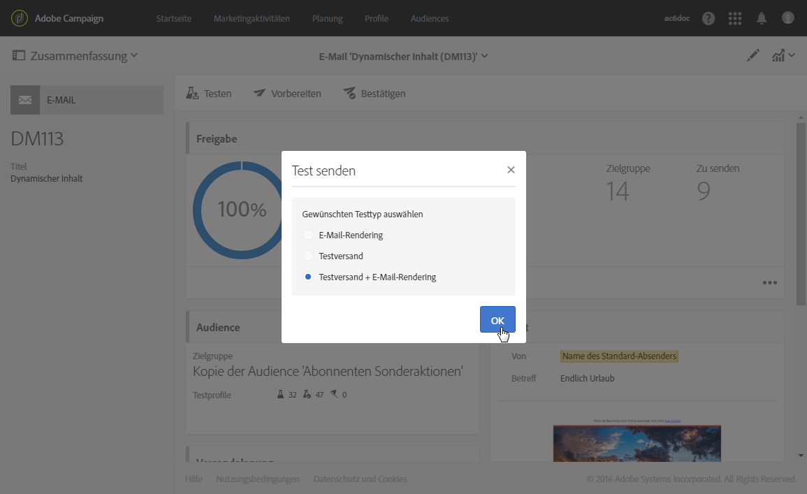
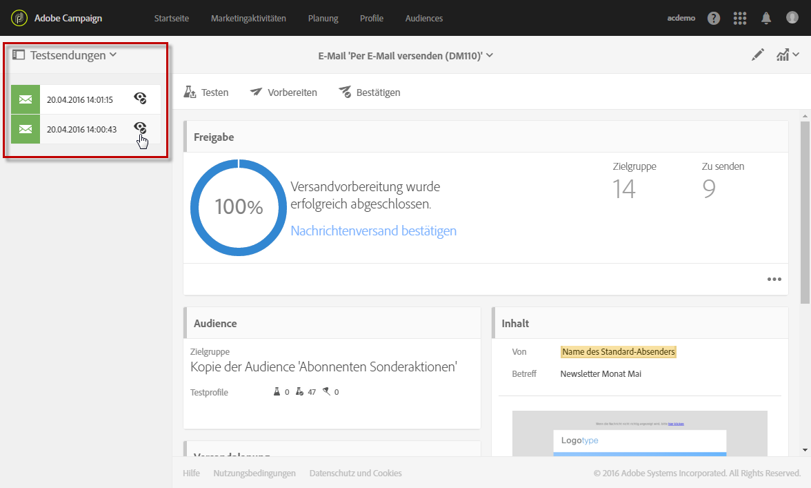
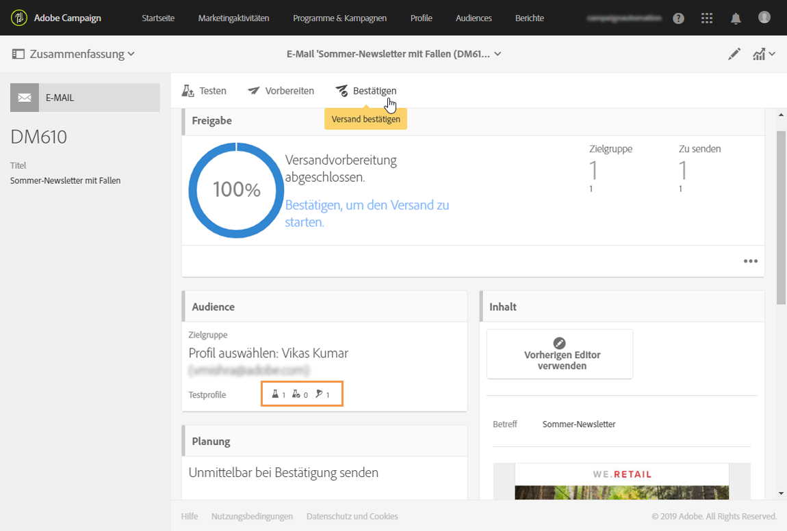

# Testprofile verwalten und Testsendungen durchführen{#managing-test-profiles-and-sending-proofs}

## Über Testprofile {#about-test-profiles}

Testprofile ermöglichen es, zusätzliche Empfänger anzusprechen, die nicht den definierten Zielgruppenkriterien entsprechen. Sie werden Audiences hinzugefügt, um beispielsweise Missbrauch bei der Nutzung Ihrer Empfängerliste aufzudecken oder den korrekten Erhalt der Sendungen zu kontrollieren.

Testprofile werden im erweiterten Menü **[!UICONTROL Profile &amp; Audiences &gt; Testprofile verwaltet]**.

Testprofile sind Profile mit fiktiven oder vom Absender kontrollierten Kontaktinformationen, die verschiedenen Zwecken dienen können:

* **Testsendungen**: Dabei handelt es sich um einen speziellen Versand, der es ermöglicht, eine Nachricht vor dem Versenden an die Empfänger zu validieren. Testversand-Empfänger sind verantwortlich für die Validierung des Inhalts und der Form von Sendungen. Siehe [Testversand durchführen](../../sending/using/managing-test-profiles-and-sending-proofs.md#sending-proofs).
* **E-Mail-Rendering**: Diese Art von Testprofilen wird verwendet, um den Empfang und die Darstellung Ihrer Nachricht in den verschiedenen E-Mail-Clients zu testen. Beispielsweise Webmail, SMS, Mobilgeräte etc. Siehe [E-Mail-Rendering](../../sending/using/email-rendering.md).

   Die Funktion **E-Mail-Rendering** ist schreibgeschützt. Testprofile mit diesem Verwendungszweck sind ausschließlich nativ in Adobe Campaign enthalten.

* Als **Falle**: die Nachricht wird an das Prüfprofil gesandt, ebenso wie sie an das Hauptziel gesandt wird. Sehen Sie die [Fallen](../../sending/using/managing-test-profiles-and-sending-proofs.md#using-traps)aus.
* **Vorschau** - durch Auswahl eines Testprofils lässt sich die korrekte Umsetzung von Personalisierungselementen innerhalb einer Nachricht prüfen. Siehe [Vorschau der Nachricht erzeugen](/help/sending/using/previewing-messages.md).

## Verwaltung von Testprofilen   {#managing-test-profiles}

### Testprofile erstellen {#creating-test-profiles}

1. Greifen Sie mithilfe des Adobe-Campaign-Logos auf das erweiterte Menü **Profile &amp; Audiences &gt; Testprofile** zu, um die Liste mit Testprofilen aufzurufen.

   

1. Verwenden Sie in der Übersicht der **[!UICONTROL Testprofile]** die Schaltfläche **Erstellen**.

   

1. Machen Sie die erforderlichen Angaben zum Profil.

   

1. Kreuzen Sie die Verwendung des Testprofils an.

   

1. Geben Sie die verschiedenen Kontaktkanäle (**[!UICONTROL E-Mail, Telefon, Mobiltelefon, Mobile App]**) sowie bei Bedarf die Adresse des Testprofils an.

   >[!NOTE]
   >
   >Sie können ein bevorzugtes E-Mail-Format definieren: **[!UICONTROL Text]** oder **[!UICONTROL HTML]**.

1. Geben Sie einen Ereignistyp sowie die Ereignisdaten an, wenn Sie dieses Testprofil dazu verwenden möchten, die Personalisierung einer Transaktionsnachricht zu testen.
1. Speichern Sie das Testprofil mithilfe der Schaltfläche **[!UICONTROL Erstellen]**.

Das Testprofil wurde der Liste der Profile hinzugefügt.

**Verwandtes Thema:**

Video [Creating a test profile](https://helpx.adobe.com/campaign/kt/acs/using/acs-test-profiles-feature-video-use.html)

### Testprofile bearbeiten {#editing-test-profiles}

Gehen Sie wie folgt vor, um ein bereits existierendes Testprofil zu bearbeiten bzw. seine Daten einzusehen oder es zu ändern:

1. Wählen Sie das zu ändernde Testprofil aus, indem Sie auf sein Bild klicken.
1. Nehmen Sie bei Bedarf die gewünschten Änderungen vor.

   

1. Verwenden Sie die Schaltfläche **[!UICONTROL Speichern]**, falls Sie Änderungen vorgenommen haben. Andernfalls können Sie oben im Bildschirm den Namen des Testprofils anklicken und dann in der sich öffnenden Dropdown-Liste **[!UICONTROL Testprofile]** auswählen, um zur Übersicht der Testprofile zurückzukehren.

## Testversand durchführen {#sending-proofs}

Ein Testversand dient der Validierung einer Nachricht, bevor sie an die Hauptzielgruppe gesendet wird.

Die Empfänger des Testversands haben die Aufgabe, sowohl Inhalt als auch Form der Nachricht zu validieren. Die Profile, die Testsendungen erhalten sollen, werden im Tab **Testprofile** ausgewählt. Weiterführende Informationen dazu finden Sie im Abschnitt [Verwaltung von Testprofilen](../../sending/using/managing-test-profiles-and-sending-proofs.md#managing-test-profiles).

Um Testsendungen vornehmen zu können, muss die Audience Ihrer Nachricht mindestens ein Testprofil enthalten.

Gehen Sie in einer Nachricht wie folgt vor, um einen Test zu senden:

1. Klicken Sie auf die Schaltfläche **[!UICONTROL Test senden]**.

   

1. Wählen Sie die Art des Testversands aus:

   * **[!UICONTROL E-Mail-Rendering]**: Diese Option erlaubt es Ihnen, den Empfang und die Darstellung Ihrer Nachricht in den verschiedenen E-Mail-Clients zu testen. Weiterführende Informationen finden Sie im Abschnitt [E-Mail-Rendering](../../sending/using/email-rendering.md).
   * **[!UICONTROL Testversand]**: Diese Option erlaubt es Ihnen, die Nachricht vor dem Versand an die Hauptzielgruppe zu prüfen. Die Testversand-Empfänger sind verantwortlich für die Validierung des Inhalts und der Form von Sendungen.
   * **[!UICONTROL Testversand + E-Mail-Rendering]**: Diese Funktion kombiniert die beiden vorangehenden Optionen.
   

1. Bestätigen Sie Ihre Auswahl.

   Die Testsendungen werden an die Testprofile geschickt.

   

1. Abgeschickte Testsendungen können mithilfe der Dropdown-Liste **[!UICONTROL Testsendungen]** aufgerufen werden.

   

1. Wählen Sie einen Testversand aus, um seine Zusammenfassung anzuzeigen. Wenn Sie sich bei der Auswahl des Testversands einer E-Mail für die Option **E-Mail-Rendering** entschieden haben, können Sie über das Symbol **[!UICONTROL Zugriff auf das E-Mail-Rendering]** rechts vom Testversandtitel auf das Ergebnis zugreifen. Siehe [E-Mail-Rendering](../../sending/using/email-rendering.md).

   

Nach Prüfung des Testversands durch die Testprofile sind gegebenenfalls Änderungen im Versandinhalt und seiner Form vorzunehmen. Nach jeder Änderung ist der Versand erneut vorzubereiten. Es empfiehlt sich außerdem, einen neuen Testversand zu erzeugen. Alle neuen Tests können ebenfalls mithilfe der Schaltfläche **[!UICONTROL Testsendungen anzeigen]** aufgerufen werden.

Senden Sie so viele Testsendungen wie nötig sind, um zu einer endgültigen Version des Nachrichteninhalts zu gelangen. Danach können Sie den Versand an die Hauptzielgruppe senden und den Validierungszyklus beenden.

**Verwandtes Thema:**

Video [Sending a test, preparing and sending an email](https://helpx.adobe.com/campaign/kt/acs/using/acs-sending-test-preparing-sending-email-feature-video-use.html)

## Verwendung von Fallen {#using-traps}

Bei Verwendung von Fallen wird die Meldung an das Testprofil genau so geschickt, wie es an das Hauptziel geschickt wird, um festzustellen, ob Ihre Kundendatei betrügerisch verwendet wird.

Fallen waren ursprünglich für Direktsendungen konzipiert. Sie erlauben es Ihnen,
* Überprüfen Sie, dass Ihr Direktpostanbieter die Mitteilung tatsächlich übermittelt.
* Erhalten Sie die Post gleichzeitig und unter den gleichen Bedingungen wie Ihre Kunden.
* Führen Sie eine genaue Kopie der versandten Post.
* Überprüfen Sie, dass Ihre Klientenliste von Ihrem Direktpostanbieter nicht missbraucht wird. Wenn eine andere Mitteilung an Ihre Adresse geschickt wird, kann Ihre Klientenakte ohne Ihr Wissen verwendet worden sein. Deshalb sollte die Anschrift des Prüfprofils nur dazu verwendet werden.

Weitere Informationen über die Zugabe von Fallen an ein Direktes Publikum finden [Sie in den Nachprüfungs- und Tonnare-Profilen](../../channels/using/defining-the-direct-mail-audience.md#adding-test-and-trap-profiles).

Für die anderen Kommunikationskanäle können Sie Ihren Hauptzielen mit Fallprofilen hinzufügen, um
* Überprüfen Sie, dass Ihre Nachricht erfolgreich geschickt wurde.
* Nimm eine genaue Kopie deiner Nachricht.
* Gleis, wenn es geschickt und empfangen wurde.

Um ein Testprofil als Falle zu benutzen, muss es in das Publikum Ihrer Botschaft aufgenommen werden.

>[!NOTE]
>
>Im Gegensatz zu Prüfprofilen, die für [Nachweise](../../sending/using/managing-test-profiles-and-sending-proofs.md#sending-proofs) oder [E-Mail-Tierkörperbeseitigung](../../sending/using/email-rendering.md)verwendet werden, wird die Meldung gleichzeitig an das Hauptziel und die als Fallen verwendeten Prüfprofile übermittelt.

Bei der Definition des Zuschauers der Botschaft:

1. Von den **[!UICONTROL Prüfprofilen ist ein]** Prüfprofil auszuwählen. Sorgen Sie dafür, **[!UICONTROL dass sie Falle als]** vorgesehene Verwendung hat.

   

1. Sobald Ihr Nachrichtengehalt fertig ist, klicken Sie den **[!UICONTROL Knopf.]** Siehe [Versandvorbereitung](../../sending/using/preparing-the-send.md).
   >[!NOTE]
   >
   >Sorgen Sie dafür, dass Sie ein Hauptziel gewählt haben. Andernfalls kann Ihre Botschaft nicht übermittelt werden.

1. Wählen Sie die **[!UICONTROL Bestätigen]**-Schaltfläche aus. Siehe [Versand bestätigen](../../sending/using/confirming-the-send.md).

   

Die Meldung wird an das Hauptziel und das Prüfprofil gesandt.

>[!NOTE]
>
>Bei Verwendung eines Prüfprofils als Falle für angereicherte Felder in einer Nachricht werden die entsprechenden zusätzlichen Daten zufällig von einem tatsächlichen Zielprofil ausgewählt und dem Untersuchungsprofil der Tonnare zugeordnet. Weitere Informationen zur Anreicherung finden Sie hier.
