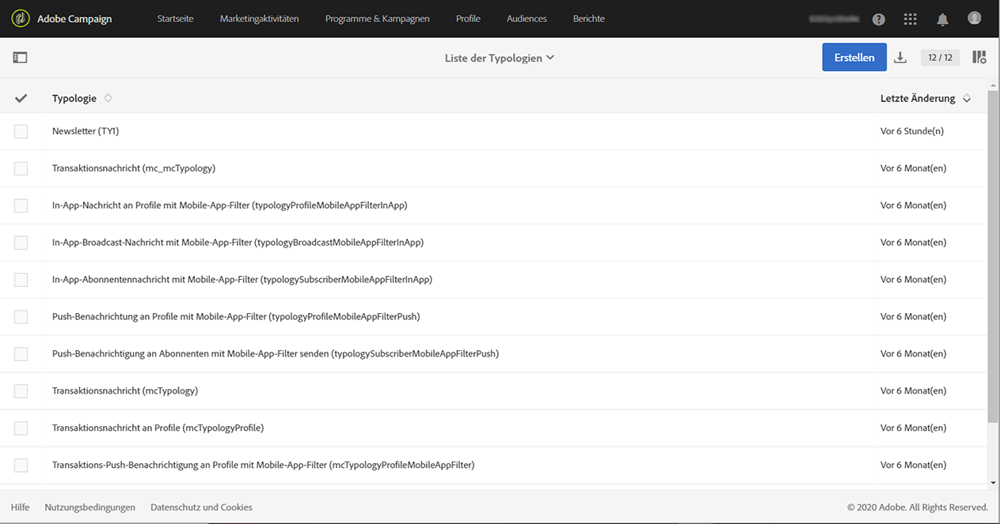
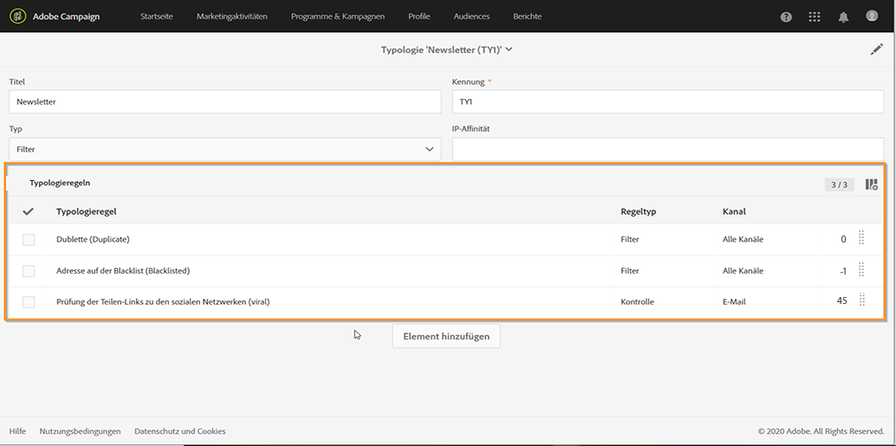
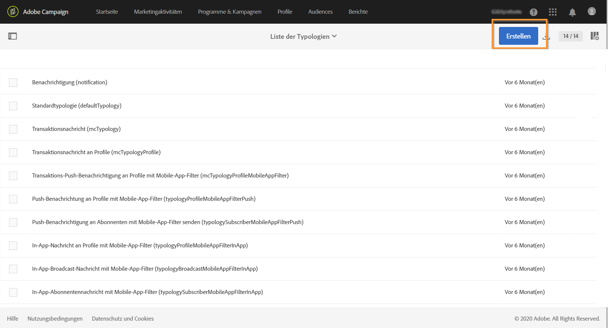
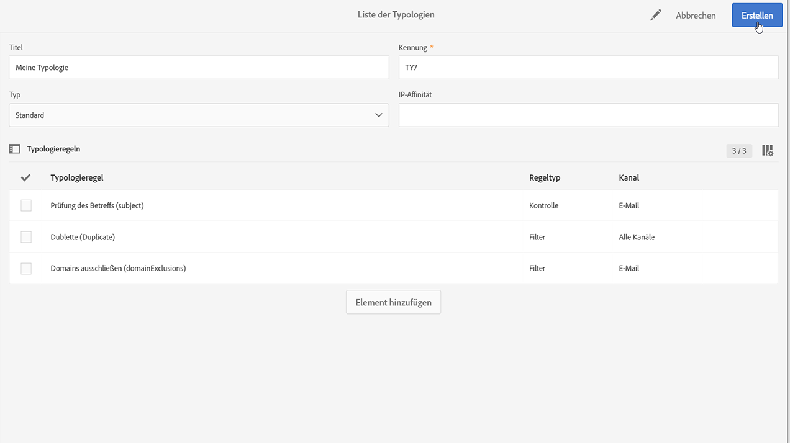
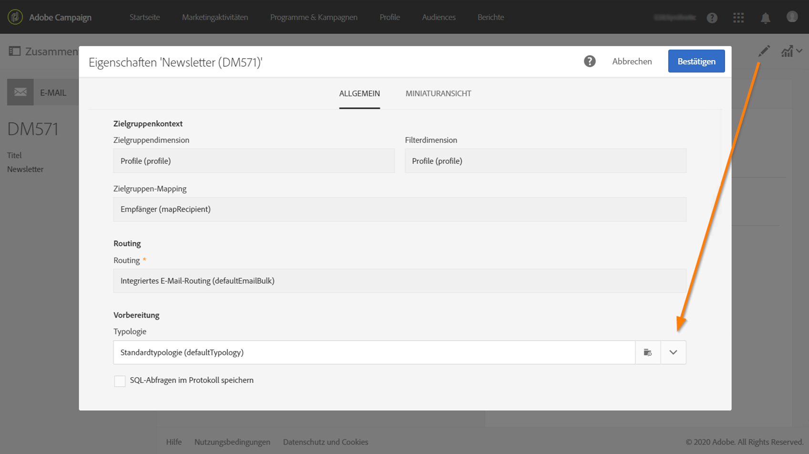

# Typologien verwalten {#managing-typologies}

## Über Typologien {#about-typologies}

Typologien sind Regelsätze, mit denen Sie die Gültigkeit Ihrer Nachricht überprüfen können, bevor Sie sie senden. Beispiel: Der Inhalt der Nachricht ist nicht leer, eine Abmeldung ist vorhanden, Ausschluss von Duplikaten usw.

Auf Typologien können Sie über das Menü **[!UICONTROL Administration]** > **[!UICONTROL Kanal]** > **[!UICONTROL Typologien]** zugreifen. Standardmäßig ist in der Anwendung eine Standardtypologie verfügbar. Sie können nach Bedarf auch eigene Typologien erstellen oder vorhandene abändern.

Für jede Typologie wird im Abschnitt **[!UICONTROL Typologieregeln]** der Regelsatz aufgelistet, der beim Einsatz der Typologie mit einer Nachricht ausgeführt wird.

>[!NOTE]
>
>Wenn Sie weitere Informationen zu einer der Typologieregeln erhalten möchten, doppelklicken Sie darauf. Die Regel wird im schreibgeschützten Modus angezeigt.

## Typologie erstellen {#creating-a-typology}

Gehen Sie wie folgt vor, um eine neue Typologie zu erstellen:

1. Rufen Sie das Menü **[!UICONTROL Administration]** > **[!UICONTROL Kanal]** > **[!UICONTROL Typologien]** auf.

1. Die Liste der Typologien wird angezeigt. Wählen Sie die **[!UICONTROL Erstellen]**-Schaltfläche aus.

   

1. Definieren Sie den **[!UICONTROL Titel]** der Typologie und wählen Sie dann die Schaltfläche **[!UICONTROL Element hinzufügen]** aus, um die Typologieregeln auszuwählen, die Sie darin aufnehmen möchten. Weiterführende Informationen zu Typologieregeln finden Sie in diesem [Abschnitt](../../sending/using/managing-typology-rules.md).

   

   >[!NOTE]
   >
   >Mit dem Feld **[!UICONTROL IP-Affinität]** können Sie die Affinitäten Ihrer Konfiguration entsprechend verwalten. Sie sind in der Konfigurationsdatei der Instanz definiert. Wenn Sie die Affinitäten verwenden möchten, wenden Sie sich an Ihren Administrator.

1. Wählen Sie **[!UICONTROL Erstellen]** aus, um Ihre Auswahl zu bestätigen. Ihre Typologie kann jetzt in Nachrichten genutzt werden.

## Typologien auf Nachrichten anwenden {#applying-typologies-to-messages}

Wenn Sie eine Typologie mit einer Nachricht oder Nachrichtenvorlage verknüpfen, werden die in der Typologie enthaltenen Typologieregeln ausgeführt, um die Gültigkeit der Nachricht zu überprüfen.

>[!NOTE]
>
>Eine Nachricht oder Nachrichtenvorlage kann jeweils nur mit einer Typologie verknüpft werden.

Gehen Sie wie folgt vor, um eine Typologie mit einer Nachricht zu verknüpfen:

1. Greifen Sie auf die Nachrichteneigenschaften zu. Beachten Sie, dass Nachrichtenvorlagen über das Navigationsmenü **[!UICONTROL Ressourcen]** > **[!UICONTROL Vorlagen]** verfügbar sind.

1. Wählen Sie im Abschnitt **[!UICONTROL Erweiterte Parameter]** > **[!UICONTROL Vorbereitung]** die Typologie aus, die mit der Nachricht verknüpft werden soll.

   

1. Wählen Sie **[!UICONTROL Bestätigen]** aus.

   Die ausgewählte Typologie ist jetzt mit der Nachricht verknüpft. Alle zugehörigen Typologieregeln werden ausgeführt, um die Gültigkeit der Nachricht zu überprüfen.
