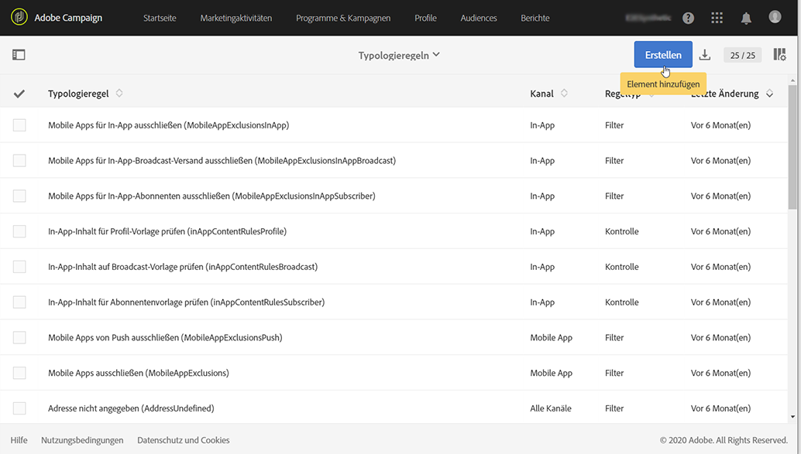
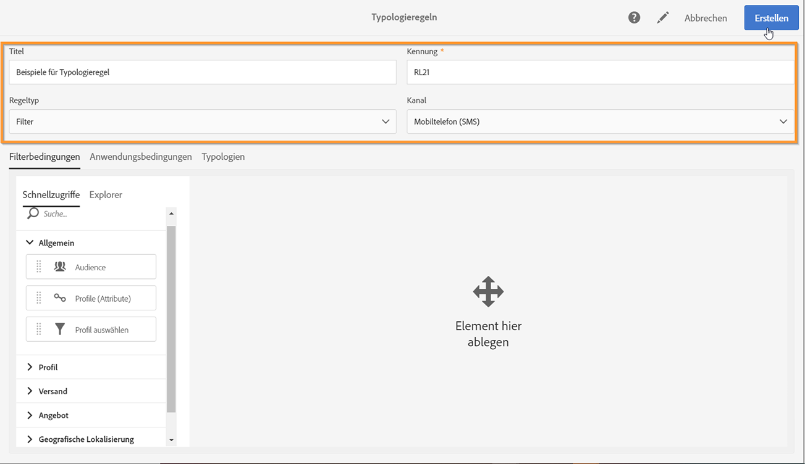
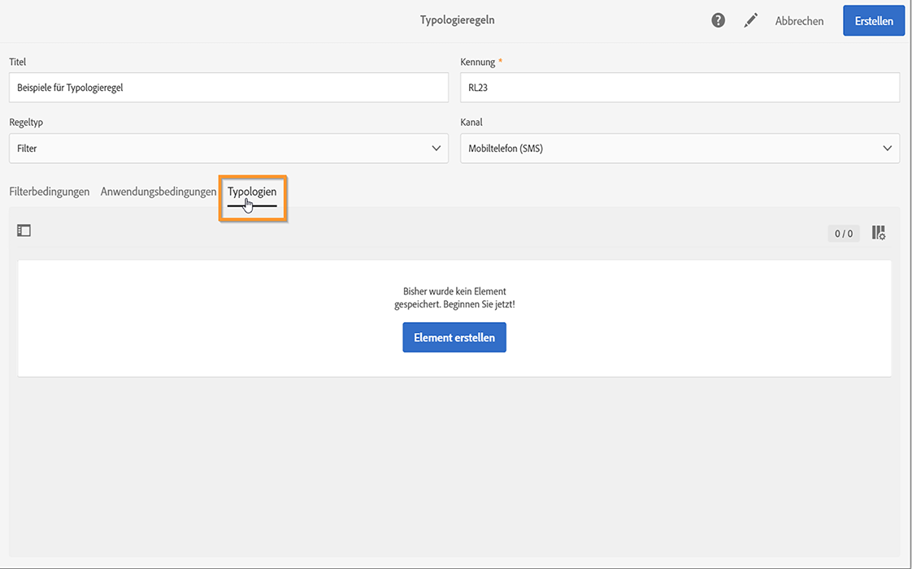
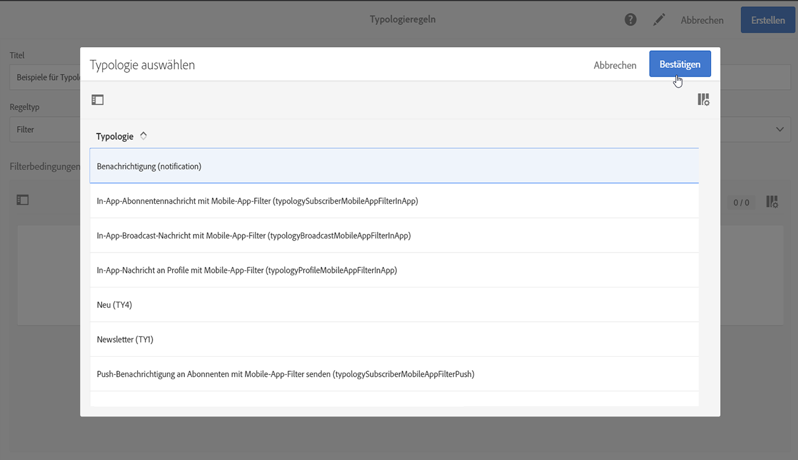
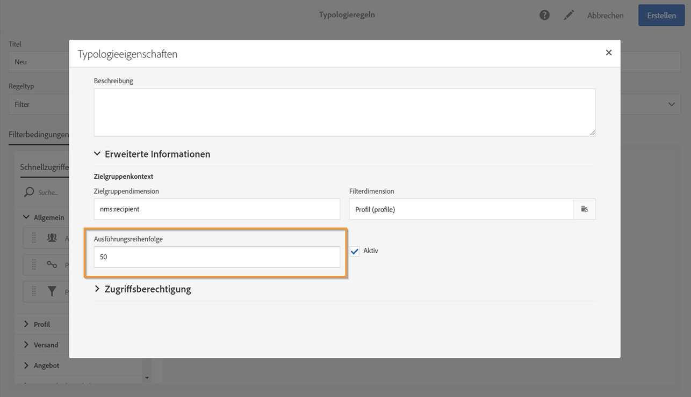
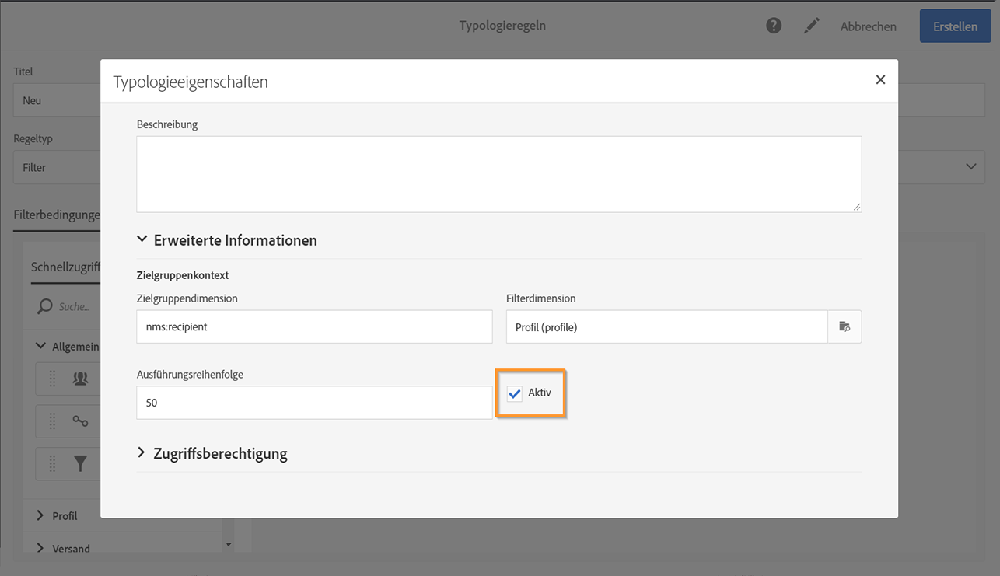

# Verwenden von Typologieregeln {#managing-typology-rules}

## Über Typologieregeln {#about-typology-rules}

Typologieregeln sind Geschäftsregeln, mit denen Sie eine Nachricht prüfen und filtern können, bevor Sie sie senden. Verfügbare Arten von Typologieregeln sind:

* **Filterregeln**: Damit können Sie einen Teil der Nachrichten-Zielgruppe anhand von in einer Abfrage definierten Kriterien ausschließen. Mögliche Kriterien sind zum Beispiel Profile in Quarantäne oder Profile, die bereits eine bestimmte Anzahl an E-Mails erhalten haben. Weiterführende Informationen hierzu finden Sie in [diesem Abschnitt](../../sending/using/filtering-rules.md).

* **Ermüdungsregeln**: Damit können Sie eine Höchstzahl an Nachrichten festlegen, die an jedes Profil gesendet wird. Auf diese Weise stellen Sie sicher, dass die einzelnen Profile nicht zu häufig angesprochen werden. Weiterführende Informationen hierzu finden Sie in [diesem Abschnitt](../../sending/using/fatigue-rules.md).

* **Kontrollregeln**: Damit kann der Anwender die Gültigkeit und Qualität der Nachrichten vor dem Versand überprüfen. Dabei werden beispielsweise die Zeichenanzeige, die Größe von SMS-Nachrichten, das Adressformat usw. überprüft. Weiterführende Informationen hierzu finden Sie in [diesem Abschnitt](../../sending/using/control-rules.md).

Typologieregeln sind verfügbar über das Menü **[!UICONTROL Administration]** > **[!UICONTROL Kanäle]** > **[!UICONTROL Typologien]** > **[!UICONTROL Typologieregeln]**.

Standardmäßig sind mehrere vordefinierte **Filter**- und **Kontroll**-Typologieregeln verfügbar. Sie werden in den Abschnitten [Filterregeln](../../sending/using/filtering-rules.md) und [Kontrollregeln](../../sending/using/control-rules.md) genauer beschrieben.

Je nach Bedarf können Sie bestehende Typologieregeln ändern oder neue erstellen, mit Ausnahme von **[!UICONTROL Kontrollregeln]**, die schreibgeschützt sind und sich nicht ändern lassen.

## Erstellung einer Typologieregel {#creating-a-typology-rule}

Die wichtigsten Schritte zum Erstellen einer Typologieregel sind:

1. Rufen Sie das Menü **[!UICONTROL Administration]** > **[!UICONTROL Kanal]** > **[!UICONTROL Typologien]** > **[!UICONTROL Typologieregeln]** auf und wählen Sie dann **[!UICONTROL Erstellen]**.

   

1. Geben Sie den **[!UICONTROL Titel]** der Typologie ein und geben Sie dann den **[!UICONTROL Kanal]** an, auf den die Regel angewendet werden soll.

   

1. Geben Sie den **[!UICONTROL Typ]** der Typologieregel an und konfigurieren Sie sie dann entsprechend Ihren Anforderungen. Beachten Sie, dass die Konfiguration der Typologieregeln je nach Typ unterschiedlich ist. Weiterführende Informationen finden Sie in den Abschnitten **[Filterregeln](../../sending/using/filtering-rules.md)** und **[Ermüdungsregeln](../../sending/using/fatigue-rules.md)**.

1. Wählen Sie die Typologien aus, in die die neue Regel eingefügt werden soll. Wählen Sie dazu den Tab **[!UICONTROL Typologien]** und dann die Schaltfläche **[!UICONTROL Element erstellen]** aus.

   

1. Wählen Sie die gewünschte Typologie aus und dann **[!UICONTROL Bestätigen]**.

   

1. Bestätigen Sie nach Auswahl aller Typologien die Erstellung der Typologieregel mit **[!UICONTROL Erstellen]**.

## Ausführungsreihenfolge von Typologieregeln        {#typology-rules-execution-order}

Die Typologieregeln werden in der Reihenfolge ausgeführt, die während der Zielgruppenbestimmung, Analyse und Nachrichtenpersonalisierung festgelegt wird.

Im Standard-Ausführungsmodus werden die Regeln in der folgenden Reihenfolge ausgeführt:

1. Kontrollregeln, wenn sie zu Beginn der Zielgruppenbestimmung angewendet werden
1. Filterregeln:

   * Native Anwendungsregeln für die Adressqualifizierung: definierte Adresse / nicht verifizierte Adresse / Adresse auf der Blockierungsliste / Adresse in Quarantäne / Qualität der Adresse.
   * Vom Benutzer definierte Filterregeln

1. Kontrollregeln, wenn sie am Ende der Zielgruppenbestimmung angewendet werden
1. Kontrollregeln, wenn sie zu Beginn der Personalisierung angewendet werden
1. Kontrollregeln, wenn sie am Ende der Personalisierung angewendet werden

Sie können die Ausführungsreihenfolge für Regeln desselben Typs jedoch in jeder Typologie anpassen. Wenn während einer Nachrichtenverarbeitungsphase mehrere Regeln ausgeführt werden, können Sie sogar wählen, in welcher Reihenfolge sie angewendet werden sollen.

Eine Filterregel, die in der Ausführungsreihenfolge an Position 20 steht, wird zum Beispiel vor einer Filterregel ausgeführt, die in der Ausführungsreihenfolge an Position 30 steht.

In den **[!UICONTROL Eigenschaften]** einer Typologieregel können Sie deren Ausführungsreihenfolge festlegen. Wenn mehrere Regeln angewendet werden müssen, wird durch die Ausführungsreihenfolge jeder Regel bestimmt, welche zuerst ausgeführt wird. Lesen Sie diesbezüglich auch den Abschnitt [Ausführungsreihenfolge von Typologieregeln](#typology-rules-execution-order).

Eine Typologieregel kann über **[!UICONTROL Eigenschaften]** deaktiviert werden, wenn die Regel zum Zeitpunkt der Analyse der von der Regel betroffenen Nachrichten nicht angewendet werden soll.

