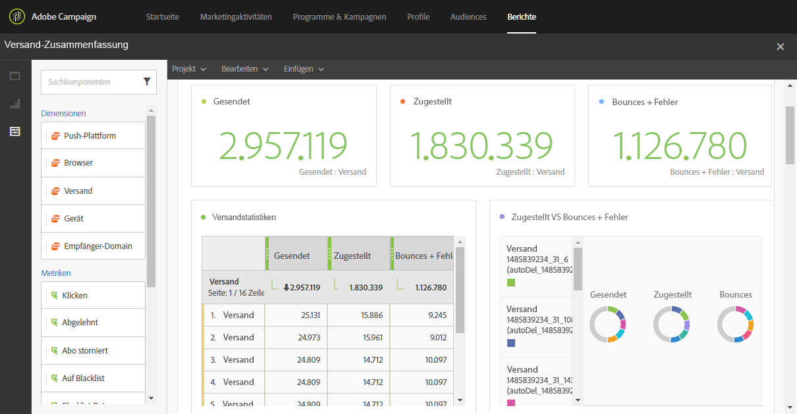
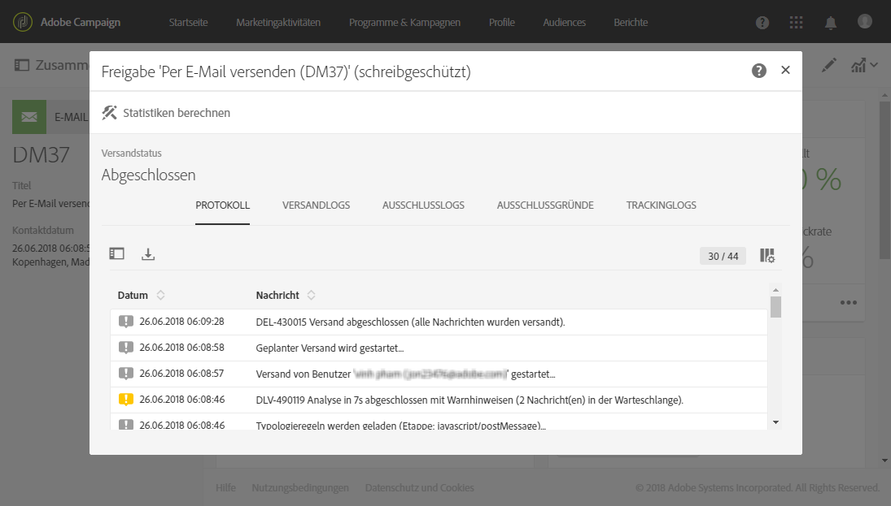

# Überwachen der Zustellbarkeit{#monitor-deliverability}

Im Folgenden finden Sie Details zum **[!UICONTROL Versanddurchsatz]**-Bericht sowie zu den unterschiedlichen von Adobe Campaign bereitgestellten Monitoring-Werkzeugen. Hier sind zusätzliche Tipps für das Monitoring der Zustellbarkeit:
* Prüfen Sie regelmäßig den Versanddurchsatz für die gesamte Plattform, um festzustellen, ob er der ursprünglichen Einstellung entspricht.
* Achten Sie darauf, dass weitere Versuche in den Versandvorlagen korrekt eingerichtet sind (30 Minuten für das Versuchsintervall und mehr als 20 weitere Versuche).
* Prüfen Sie regelmäßig, ob das Bounce-Postfach zugänglich ist, und sorgen Sie dafür, dass die Gültigkeit des Kontos nicht abläuft.
* Prüfen Sie, ob die einzelnen Versanddurchsätze der Gültigkeit des Versandinhalts entsprechen (&quot;Flash Sales&quot; zum Beispiel sollten innerhalb von Minuten, nicht von Tagen zugestellt werden).
* Prüfen Sie, ob die Anzahl der Fehler und der neuen Quarantänen der anderer Sendungen entspricht.
* Prüfen Sie in den Versandlogs sorgfältig die Art der hervorgehobenen Fehler (Blockierungsliste, DNS-Probleme, Anti-Spam-Regeln usw.).

## Versanddurchsatz {#delivery-throughput}

Dieser Bericht enthält Informationen zum Versanddurchsatz der gesamten Plattform in einem bestimmten Zeitraum und misst die Geschwindigkeit der Nachrichtenzustellung.

Weitere Informationen finden Sie unter [Versanddurchsatz](../../reporting/using/delivery-throughput.md).

Sie können die angezeigten Werte konfigurieren, indem Sie den Parameter ändern.

Es stehen weitere Berichte zur Verfügung, z. B. **[!UICONTROL Versandzusammenfassung]** oder **[!UICONTROL Fehler und Bounces]**. Weiterführende Informationen dazu finden Sie unter [Dynamische Berichte](../../reporting/using/about-dynamic-reports.md).

## Sendungen überwachen {#monitoring-deliveries}

Über das Nachrichten-Dashboard können Sie auf diese Versandlogs zugreifen: **[!UICONTROL Versandlogs]**, **[!UICONTROL Ausschlusslogs]**, **[!UICONTROL Ausschlussgründe]**, **[!UICONTROL Trackinglogs]** und **[!UICONTROL Getrackte URLs]**. In ihnen erfahren Sie Versanddetails, welche Zielgruppe ausgeschlossen war und den Ausschlussgrund sowie Tracking-Informationen wie Öffnungen und Klicks.

Weiterführende Informationen dazu finden Sie unter [Sendungen beobachten](../../sending/using/monitoring-a-delivery.md).

## Warnungen erhalten {#receiving-alerts}

Bei der Funktion **[!UICONTROL Versandwarnungen]** handelt es sich um ein Warnungsmanagementsystem, über das eine Benutzergruppe automatisch Benachrichtigungen zu ihren Sendungen erhält.

Weiterführende Informationen dazu finden Sie unter [Warnungen bei Zustellproblemen erhalten](../../sending/using/receiving-alerts-when-failures-happen.md).

<!--## External tools (#external-tools)

### Signal Spam {#signal-spam}

Signal Spam is a French service which offers anonymized feedback loop reporting for French ISPs (Orange, SFR).

This service allows you to follow the reputation of the French ISPs and track customers' activity evolution.

Signal Spam also provides direct complaints that end users log through a dedicated interface. Those complaints are then quarantined from the email address database.

### 250ok {#solution-250ok}

250ok is a monitoring solution which provides IP and domain denylists, as well as reputation indicators.

The information provided is real-time, which allows for a pro-active assistance. 250ok a complementary solution to the Adobe deliverability internal tools.-->
