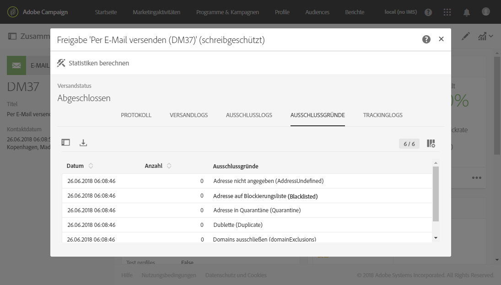

# Sendungen beobachten{#monitoring-a-delivery}

Es gibt mehrere Möglichkeiten, einen Versand zu beobachten und seine Wirkung zu messen:

* **Nachrichtenprotokolle**: Diese Protokolle können Sie direkt vom Nachrichten-Dashboard aus abrufen. In ihnen werden Details zum Versand dargestellt und Sie erfahren, welche Zielgruppe warum ausgeschlossen wurde sowie Tracking-Informationen wie z. B. Öffnungen und Klicks.

   Der Zugriff auf die Nachrichtenprotokolle ist über die Schaltfläche unten rechts in der Kachel **[!UICONTROL Freigabe]** möglich.

   Die verschiedenen Tabs zeigen (wenn vorhanden) Informationen zu **[!UICONTROL Versandlogs]**, **[!UICONTROL Ausschlusslogs]**, **[!UICONTROL Ausschlussgründen]**, **[!UICONTROL Trackinglogs]** und **[!UICONTROL getrackten URLs]**. Siehe [Versandlogs](#delivery-logs).

   

   Das Protokoll enthält alle auf den Versand und auf Testsendungen bezogenen Logs. Eventuelle Fehler oder Warnmeldungen werden durch spezifische Symbole hervorgehoben. Lesen Sie diesbezüglich auch den Abschnitt [Nachrichten validieren](../../sending/using/previewing-messages.md).

   Mithilfe der Schaltfläche **[!UICONTROL Liste exportieren]** kann das Protokoll exportiert werden.

   

* **Versandwarnungen**: Um Erfolge und Fehlschläge beim Versand zu verfolgen, ist Adobe Campaign mit einem E-Mail-Warnsystem ausgestattet, über das Benutzer Benachrichtigungen zu wichtigen Systemaktivitäten erhalten.
* **Berichte**: Im Nachrichten-Dashboard können Sie für diese Nachricht mehrere Berichte aufrufen. Zusätzlich ist über das Menü **[!UICONTROL Berichte]** eine vollständige Liste integrierter oder benutzerdefinierter Berichte mit Metriken zu Ihrer Nachricht oder Kampagne abrufbar.
* Administratoren können Logs auch in einer separaten Datei exportieren, die dann in eigenen Berichterstellungs- oder Business Intelligence Tools verarbeitet werden können. Lesen Sie diesbezüglich auch den Abschnitt [Logs exportieren](../../automating/using/exporting-logs.md).

**Verwandte Themen:**

* [Warnungen bei Zustellproblemen erhalten](../../sending/using/receiving-alerts-when-failures-happen.md)
* [Berichte](../../reporting/using/about-dynamic-reports.md)

## Versandlogs   {#delivery-logs}

### Versandlogs {#sending-logs}

Der Tab **[!UICONTROL Versandlogs]** zeigt die Liste der einzelnen Nachrichten eines Versands. sowie deren Status an. Für jeden einzelnen Empfänger können Sie anhand des Status das Ergebnis des Versands verfolgen.

Für jedes Profil mit dem Status **[!UICONTROL Gesendet]** wird in der Spalte **[!UICONTROL Datum]** der Versandzeitpunkt der Nachricht angezeigt.

Klicken Sie auf das Stiftsymbol rechts neben der entsprechenden Zeile, um auf die Details eines bestimmten Versandprotokolls zuzugreifen.

Alle Details zum Versandprotokoll sind schreibgeschützt. Sie können auch eine Vorschau der Mirrorseite anzeigen.

>[!NOTE]
>
>Um das Rendering der Mirrorseite in der Campaign-Benutzeroberfläche anzuzeigen, muss die Server-URL der Mirrorseite sicher sein. Verwenden Sie in diesem Fall https:// anstelle von http://, um diese URL beim [Konfigurieren Ihrer Marke](../../administration/using/branding.md#configuring-and-using-brands) einzurichten.

### Ausschlusslogs {#exclusion-logs}

Der **[!UICONTROL Ausschlusslogs]**-Tab zeigt die Liste der vom Versand ausgeschlossenen Empfänger und den jeweiligen Ausschlussgrund an.

### Ausschlussgründe {#exclusion-causes}

Der **[!UICONTROL Ausschlussgründe]**-Tab zeigt die Anzahl an ausgeschlossenen Empfängern pro Ausschlussgrund an.

