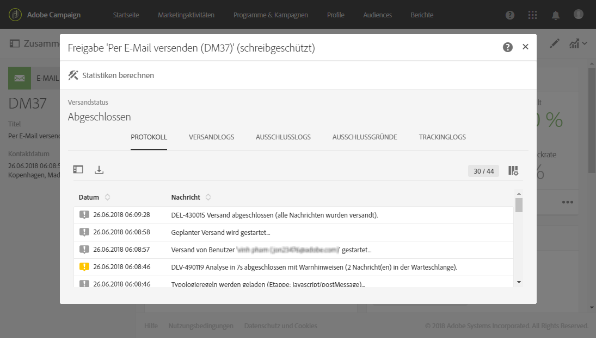
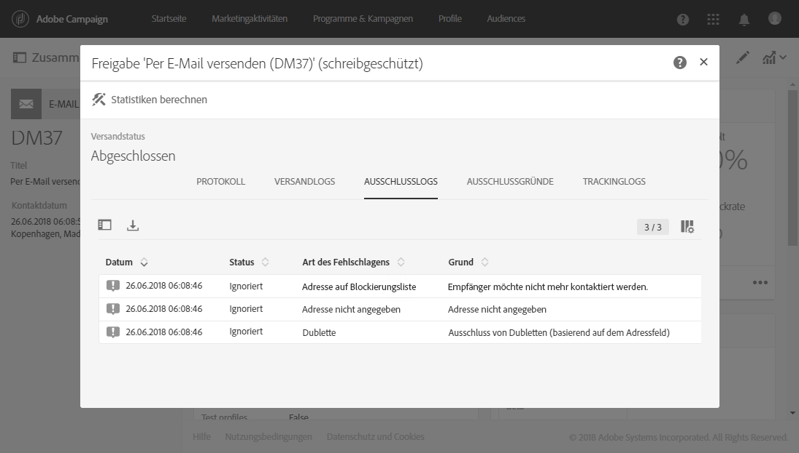

# Sendungen beobachten{#monitoring-a-delivery}

Es gibt mehrere Möglichkeiten, einen Versand zu beobachten und seine Wirkung zu messen:

* **Nachrichtenprotokolle**: Diese Protokolle können Sie direkt vom Nachrichten-Dashboard aus abrufen. In ihnen werden Details zum Versand dargestellt und Sie erfahren, welche Zielgruppe warum ausgeschlossen wurde sowie Tracking-Informationen wie z. B. Öffnungen und Klicks.

   To view the message logs, click the icon at the bottom right of the **[!UICONTROL Deployment]** block.

   Mehrere Registerkarten enthalten Informationen (sofern vorhanden) zu den Registerkarten **[!UICONTROL Sending logs]**, **[!UICONTROL Exclusion logs]**, **[!UICONTROL Exclusion causes]** und **[!UICONTROL Tracking logs]****[!UICONTROL Tracked URLs]** . Siehe [Versandlogs](#delivery-logs).

   

   Das Protokoll enthält alle auf den Versand und auf Testsendungen bezogenen Logs. Eventuelle Fehler oder Warnmeldungen werden durch spezifische Symbole hervorgehoben. Lesen Sie diesbezüglich auch den Abschnitt [Nachrichten validieren](../../sending/using/previewing-messages.md).

   You can export the log by clicking the **[!UICONTROL Export list]** button.

   

* **Versandwarnungen**: Um Erfolge und Fehlschläge beim Versand zu verfolgen, ist Adobe Campaign mit einem E-Mail-Warnsystem ausgestattet, über das Benutzer Benachrichtigungen zu wichtigen Systemaktivitäten erhalten.
* **Berichte**: Im Nachrichten-Dashboard können Sie für diese Nachricht mehrere Berichte aufrufen. You also have a **[!UICONTROL Reports]** menu that allows you to access a complete list of built-in or custom reports that you can use to outline specific metrics related to your message or campaign.
* Administratoren können Logs auch in einer separaten Datei exportieren, die dann in eigenen Berichterstellungs- oder Business Intelligence Tools verarbeitet werden können. Lesen Sie diesbezüglich auch den Abschnitt [Logs exportieren](../../automating/using/exporting-logs.md).

**Verwandte Themen:**

* [Warnungen bei Zustellproblemen erhalten](../../sending/using/receiving-alerts-when-failures-happen.md)
* [Berichte](../../reporting/using/about-dynamic-reports.md)

## Versandlogs {#delivery-logs}

### Versandlogs {#sending-logs}

The **[!UICONTROL Sending logs]** tab offers a history of every occurrence of this delivery. sowie deren Status an. Für jeden einzelnen Empfänger können Sie anhand des Status das Ergebnis des Versands verfolgen.

For each profile with a **[!UICONTROL Sent]** status, the **[!UICONTROL Date]** column shows when the message was sent.

Klicken Sie auf das Stiftsymbol rechts neben der entsprechenden Zeile, um auf die Details eines bestimmten Sendetlogs zuzugreifen.

Alle Details zum Versandprotokoll sind schreibgeschützt. Sie können auch eine Vorschau der Spiegelseite anzeigen.

>[!NOTE]
>
>Um das Rendering der Spiegelseite in der Benutzeroberfläche von Campaign anzuzeigen, muss die Server-URL der Spiegelseite sicher sein. Verwenden Sie in diesem Fall https:// statt http://, um diese URL beim [Konfigurieren Ihrer Marke](../../administration/using/branding.md#configuring-and-using-brands)einzurichten.

### Ausschlusslogs {#exclusion-logs}

The **[!UICONTROL Exclusion logs]** tab lists all the messages that have been excluded from the target sent and specifies the reason for the send failure.

### Ausschlussgründe {#exclusion-causes}

The **[!UICONTROL Exclusion causes]** tab displays the volume (in number of messages) of messages that were excluded from the target send.

