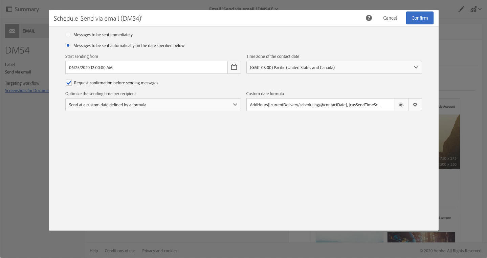

# Prädiktive Benutzerinteraktionsfunktionen {#journey-ai}

Mit Campaign können Sie die Gestaltung und den Versand von Customer Journeys optimieren, um die Interaktionsvorlieben von Kontakten vorherzusagen. Mit der auf KI und maschinellem Lernen basierenden Sendezeitoptimierung und der prädiktiven Interaktionsbewertung von Adobe Campaign können Öffnungsraten, optimale Sendezeiten und wahrscheinliche Abwanderung auf der Grundlage historischer Interaktionsmetriken analysiert und vorhergesagt werden.

>[!IMPORTANT]
>
>Diese Funktion ist im Lieferumfang des Produkts nicht verfügbar. Die Implementierung erfordert die Einbindung von Adobe Consulting. Wenden Sie sich an Ihren Adobe-Support-Mitarbeiter, um weitere Informationen zu erhalten.

Adobe Campaign bietet zwei neue Modelle für maschinelles Lernen: **Prädiktive Sendezeitoptimierung** und **Prädiktive Interaktionsbewertung**. Bei diesen beiden Modellen handelt es sich um Modelle für maschinelles Lernen, die speziell für die Erstellung und Bereitstellung besserer Customer Journeys entwickelt wurden.

* **Prädiktive Sendezeitoptimierung** sagt für jedes Empfängerprofil voraus, welche die beste Sendezeit für E-Mail-Öffnungen oder Klicks und Push-Öffnungen ist. Für jedes Empfängerprofil kann anhand von Werten festgestellt werden, was die beste Sendezeit für jeden Wochentag ist und welcher Wochentag beim Senden die besten Ergebnisse liefert.

* **Prädiktive Interaktionsbewertung**: prognostiziert die Wahrscheinlichkeit, mit der ein Empfänger mit einer Nachricht interagiert, sowie die Wahrscheinlichkeit, dass er sich innerhalb der nächsten sieben Tage nach dem nächsten E-Mail-Versand abmeldet. Die Wahrscheinlichkeiten werden je nach vorhergesagter Interaktion mit Ihrem Inhalt in verschiedene Kategorien eingeteilt: hoch, mittel oder niedrig. Diese Modelle liefern auch den prozentualen Rang des Abmelderisikos für die Kundinnen und Kunden, um zu verdeutlichen, wo der Rang einer/eines bestimmten Kundin/Kunden im Vergleich zu anderen liegt.

## Prädiktive Sendezeitoptimierung{#predictive-send-time}

Die prädiktive Sendezeitoptimierung prognostiziert für jedes Empfängerprofil den besten Sendezeitpunkt für E-Mail-Öffnungen oder -Klicks und für Push-Nachrichten-Öffnungen. Für jedes Empfängerprofil kann anhand von Werten festgestellt werden, was die beste Sendezeit für jeden Wochentag ist und welcher Wochentag beim Senden die besten Ergebnisse liefert.

Innerhalb des prädiktiven Sendezeit-Optimierungsmodells gibt es zwei Untermodelle:

* **Die prädiktive Sendezeit für Öffnungen ist die beste Zeit, zu der eine Kommunikation an den Kunden gesendet werden muss, um Öffnungen zu maximieren.**

* **Die prädiktive Sendezeit für Klicks ist die beste Zeit, zu der eine Kommunikation an den Kunden gesendet werden muss, um Klicks zu maximieren.**

**Modelleingabe**: Versandlogs, Trackinglogs und Profilattribute (Nicht-PII)

**Modellausgabe**: Optimale Zeit zum Senden einer Nachricht (für Öffnungen und Klicks)

Ausgabedetails

* Berechnet die beste Tageszeit für den Versand einer E-Mail an den 7 Wochentagen mit 1-Stunden-Intervallen (z. B.: 9:00 Uhr, 10:00 Uhr, 11:00 Uhr)
* Das Modell zeigt den besten Tag der Woche und die beste Stunde an diesem Tag an.
* Jede optimale Zeit wird zweimal berechnet: einmal zur Maximierung der Öffnungsrate und einmal zur Maximierung der Klickrate.
* Es werden 16 Felder angegeben (14 für die Wochentage und 2 für die ganze Woche):

* Optimale Zeit für den Versand einer E-Mail zur Optimierung der Klicks für Montag - Werte zwischen 0 und 23

* Optimale Zeit für den Versand einer E-Mail zur Optimierung der Öffnungen für Montag - Werte zwischen 0 und 23
* ...
* Optimale Zeit für den Versand einer E-Mail zur Optimierung der Klicks für Sonntag - Werte zwischen 0 und 23
* Optimale Zeit zum Senden einer E-Mail zur Optimierung der Öffnungen für Sonntag - Werte zwischen 0 und 23
* ...
* Optimaler Tag für den Versand einer E-Mail zur Optimierung der Öffnungen über die ganze Woche - Montag bis Sonntag
* Optimale Zeit für den Versand einer E-Mail zur Optimierung der Öffnungen über die ganze Woche - Werte zwischen 0 und 23

>[!NOTE]
>
>Das Modell benötigt mindestens einen Monat an Daten, um signifikante Ergebnisse zu erzielen.
>
>Diese prädiktiven Funktionen sind nur für E-Mail- und Push-Kanäle verfügbar.

Nach der Implementierung in Campaign reichern die Funktionen für maschinelles Lernen die Profildaten mit neuen Tabs mit den besten Öffnungs- /Klickbewertungen an. Die Metriken werden mithilfe technischer Workflows berechnet und in Campaign eingebracht.

Um auf diese Metriken zuzugreifen:

1. Öffnen Sie ein Profil und klicken Sie auf &quot;Bearbeiten&quot;.

1. Klicken Sie auf den Tab **Sendezeitbewertung nach Klick** oder **Sendezeitbewertung nach Öffnung**.

Standardmäßig geben die Profilbewertungen die beste Tageszeit für jeden Wochentag und die beste Zeit für die gesamte Woche an.


### Nachrichten zum besten Zeitpunkt senden{#use-predictive-send-time}

Damit die E-Mails zum optimalen Zeitpunkt pro Profil gesendet werden, muss der Versand mit der Option **[!UICONTROL Zu einem durch eine Formel definierten Datum senden]** geplant werden.

Erfahren Sie [in diesem Abschnitt](../../sending/using/computing-the-sending-date.md), wie Sie das Versanddatum berechnen.

Die Formel muss mit der besten Tageszeit des jeweiligen Tages ausgefüllt werden, an dem der Versand ausgeführt werden soll.



Beispiel einer Formel:

```
AddHours([currentDelivery/scheduling/@contactDate],
[cusSendTimeScoreByClickprofile_link/@EMAIL_BEST_TIME_TO_CLICK_WEDNESDAY])
```


>[!NOTE]
>
>Das Datenmodell kann je nach Implementierung unterschiedlich sein.

## Prädiktive Interaktionsbewertung {#predictive-scoring}

Die Bewertung prädiktiver Interaktionen sagt die Wahrscheinlichkeit voraus, mit der Empfangende mit einer Nachricht interagieren, sowie die Wahrscheinlichkeit, mit der sie sich innerhalb der nächsten sieben Tage nach dem nächsten E-Mail-Versand abmelden.

Die Wahrscheinlichkeiten werden je nach vorhergesagter Interaktion mit Ihrem Inhalt in verschiedene Kategorien eingeteilt: hoch, mittel oder niedrig. Diese Modelle liefern auch den prozentualen Rang des Abmelderisikos für die Kundinnen und Kunden, um zu verdeutlichen, wo der Rang einer/eines bestimmten Kundin/Kunden im Vergleich zu anderen liegt.

Die prädiktive Interaktionsbewertung ermöglicht Ihnen Folgendes:

* **Auswählen einer Zielgruppe**: Mithilfe der Abfrageaktivität können Sie die Audience auswählen, mit der eine bestimmte Nachricht interagiert werden soll
* **Ausschluss einer Zielgruppe**: Mithilfe der Abfrageaktivität können Sie die Audience entfernen, die sich wahrscheinlicher abmeldet
* **Personalisieren**: Personalisieren Sie Nachrichten basierend auf dem Grad der Interaktion (stark interaktive Benutzer erhalten eine andere Nachricht als nicht interaktive).

Dieses Modell verwendet mehrere Bewertungen, um Folgendes anzugeben:

* **Interaktionsbewertung für Öffnungen/Interaktionsbewertung für Klicks**: Dieser Wert entspricht der Wahrscheinlichkeit, mit der sich ein Abonnent mit einer bestimmte Nachricht beschäftigt (Öffnung oder Klick). Die Werte liegen zwischen 0,0 und 1,0.
* **Abmeldewahrscheinlichkeit**: Dieser Wert entspricht der Wahrscheinlichkeit, dass der Empfänger sich von einem E-Mail-Kanal abmeldet, nachdem er eine E-Mail geöffnet hat. Die Werte liegen zwischen 0,0 und 1,0.
* **Bindungsgrad**: Dieser Wert unterteilt Benutzer in drei Stufen: niedrig, mittel und hoch. Dabei bedeutet &quot;hoch&quot;, dass sie höchstwahrscheinlich bei der Marke bleiben, und &quot;niedrig&quot;, dass sie sich wahrscheinlich abmelden.
* **Perzentilrang der Bindung**: Rang des Profils in Bezug auf die Abmeldewahrscheinlichkeit. Die Werte liegen zwischen 0,0 und 1,0. Wenn der Perzentilrang der Bindung beispielsweise 0,953 beträgt, bleibt dieser Empfänger mit größerer Wahrscheinlichkeit bei der Marke und hat eine geringere Wahrscheinlichkeit, sich abzumelden, als 95,3 % aller Empfänger.

>[!NOTE]
>
>Diese prädiktiven Funktionen gelten nur für den E-Mail-Versand.
>
>Das Modell benötigt mindestens einen Monat an Daten, um signifikante Ergebnisse zu erzielen.

**Modelleingabe**: Versandlogs, Trackinglogs und spezifische Profilattribute

**Modellausgabe**: Ein Profilattribut, das die Bewertung und Kategorie des Profils beschreibt.

Um auf diese Metriken zuzugreifen:

1. Öffnen Sie ein Profil und klicken Sie auf &quot;Bearbeiten&quot;.

1. Klicken Sie auf den Tab **Interaktionsbewertungen für E-Mail-Kanal**.

Wenn Sie eine Abfrageaktivität in einem Workflow verwenden, können Sie die Bewertung zur Optimierung Ihrer Audience nutzen. Beispielsweise mit den Kriterien für den **Bindungsgrad**:

