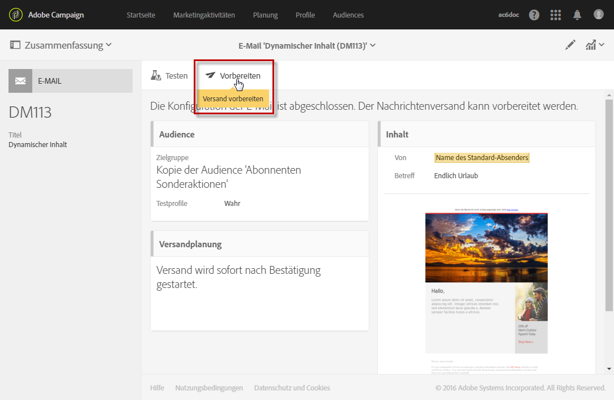
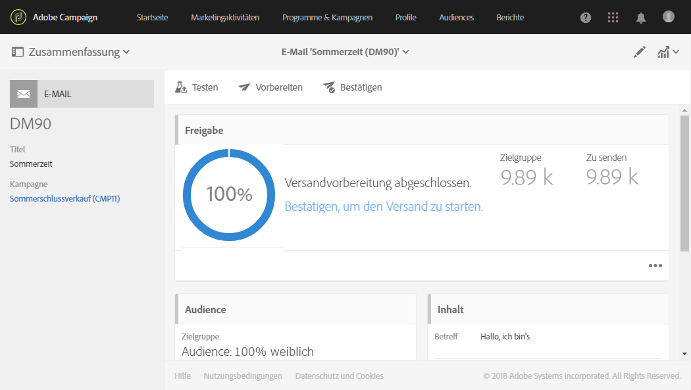
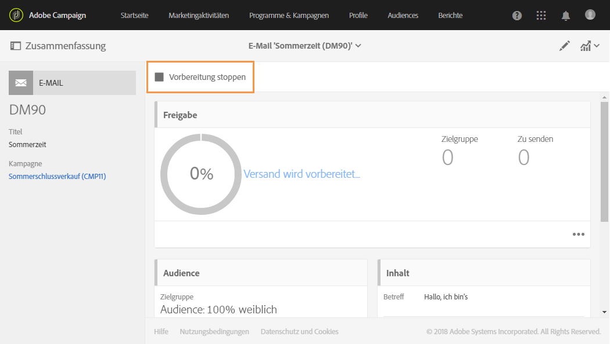
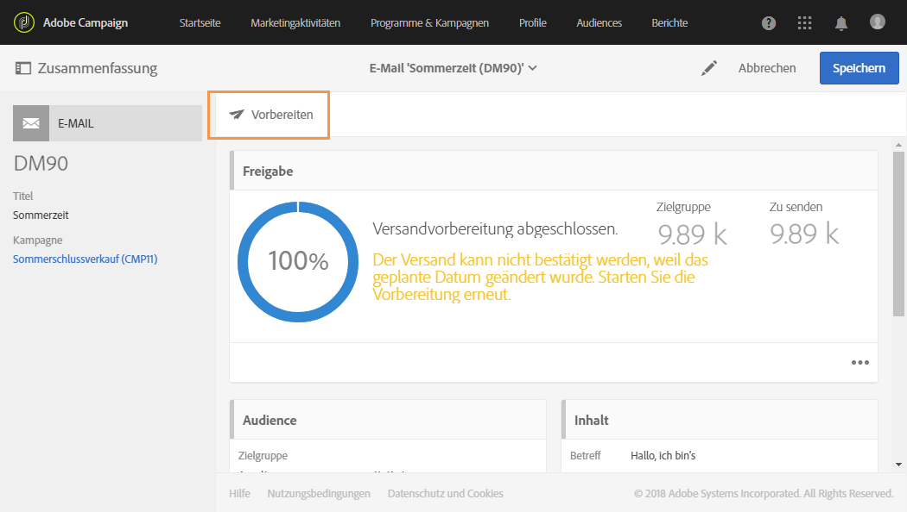
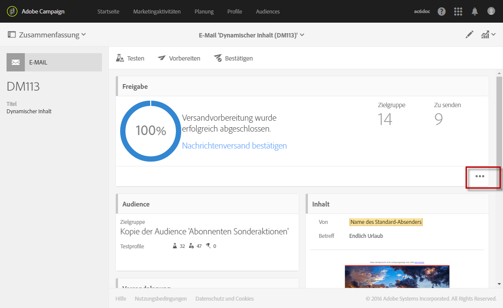
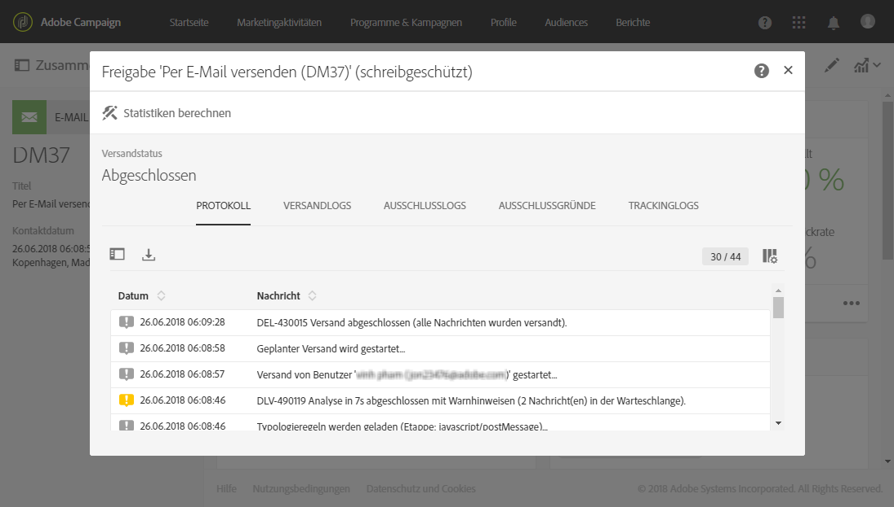

# Versandvorbereitung{#preparing-the-send}

In diesem Schritt werden die Zielgruppe berechnet und der Nachrichteninhalt für jedes Profil in der Zielgruppe erzeugt. Sobald die Vorbereitung abgeschlossen ist, können die Nachrichten entweder sofort oder am [geplanten Datum und zur geplanten Uhrzeit](../../sending/using/about-scheduling-messages.md) gesendet werden.

1. Klicken Sie in der Symbolleiste auf die Schaltfläche **Vorbereiten**, um die Vorbereitung zu starten.

   

1. In der Kachel **[!UICONTROL Freigabe]** werden zunächst der Vorbereitungsfortschritt und dann das Ergebnis der Vorbereitung angezeigt: die Anzahl der in der Zielgruppe enthaltenen Kontakte und zu sendenden Nachrichten usw.

   Abhängig von der Größe der Ziel-Population kann dieser Vorgang einige Zeit in Anspruch nehmen.

   

1. Die Schaltfläche **Anhalten** in der Symbolleiste ermöglicht es, die Vorbereitung jederzeit zu unterbrechen.

   Dies ist mit keinerlei Risiko verbunden, da in dieser Phase keine Nachrichten gesendet werden. Je nach Größe der Zielgruppe kann die Dauer der Versandvorbereitung variieren.

   

1. Ihre Nachricht wird automatisch während der Versandvorbereitung gespeichert. Wenn Sie nach dem Vorbereitungsschritt den Zeitplan Ihrer Nachricht ändern müssen, wählen Sie die Schaltfläche **[!UICONTROL Vorbereiten]** erneut aus, damit diese Änderungen wirksam werden. Weiterführende Informationen zur Planung einer Nachricht finden Sie auf [dieser Seite](../../sending/using/about-scheduling-messages.md).

   

1. Verwenden Sie zur Anzeige der Vorbereitungslogs die Schaltfläche unten rechts in der Kachel.

   

1. Das Fenster **[!UICONTROL Freigabe]** wird geöffnet. Korrigieren Sie etwaige Fehler und starten Sie die Vorbereitung erneut.

   Der letzte Logeintrag zeigt eventuelle Fehler und deren Anzahl an. Ein spezifisches Symbol verdeutlicht den Fehlertyp: Ein gelbes Symbol kennzeichnet beispielsweise einen nicht blockierenden Verarbeitungsfehler, während ein rotes Symbol einen Fehler bezeichnet, der den Versand der Nachrichten verhindert.

   

1. Prüfen Sie das Vorbereitungsergebnis, bevor Sie den Versand der Nachrichten bestätigen. Wenn die Anzahl zu sendender Nachrichten nicht Ihrer Konfiguration entspricht, passen Sie die Zielgruppenbestimmung an (siehe [Audience in einer Nachricht auswählen](../../audiences/using/selecting-an-audience-in-a-message.md)) und starten Sie die Vorbereitung erneut.

Nach Abschluss der Vorbereitung ist die Nachricht versandbereit. Weiterführende Informationen dazu finden Sie im Abschnitt [Versand bestätigen](../../sending/using/confirming-the-send.md).

**Typologieregeln**

Adobe Campaign ist mit integrierten Typologieregeln ausgestattet, die während der Nachrichtenvorbereitung angewendet werden. Mithilfe dieser Regeln wird geprüft, ob eine Nachricht gültig ist und Ihre Qualitätskriterien erfüllt. Näheres dazu finden Sie unter [Typologien](../../sending/using/about-typology-rules.md). Sie können Ihre eigenen Typologieregeln definieren, wie beispielsweise globale, kanalübergreifende Ermüdungsregeln, mit denen Profile, die bereits zu oft angesprochen wurden, automatisch von Kampagnen ausgeschlossen werden. Näheres dazu finden Sie unter [Ermüdungsregeln](../../sending/using/fatigue-rules.md).

**Kontrolle von SMS-Nachrichten**

Die Verwendung von Personalisierungsfeldern oder bedingten Texten im SMS-Inhalt kann dazu führen, dass u. U. nicht von GSM unterstützte Zeichen eingefügt werden. Im Zuge der Vorbereitung wird die Nachrichtenlänge geprüft und bei Überschreiten der Höchstgrenze ein Warnhinweis ausgelöst.

Weiterführende Information dazu finden Sie in den Abschnitten [Kodierung, Länge und Tansliteration von SMS](../../administration/using/configuring-sms-channel.md#sms-encoding--length-and-transliteration) und [SMS personalisieren](../../channels/using/personalizing-sms-messages.md).
