# Vorschau von Versänden {#previewing-messages}

## Vorschau der E-Mail erzeugen     {#previewing-emails}

Mit Campaign Standard können Sie Nachrichten vor dem Versand in einer Vorschau anzeigen, um deren Personalisierung zu überprüfen und zu ermitteln, wie die Nachrichten bei Ihren Empfängern aussehen werden.

Die Anzeige der Vorschau von Nachrichten erfolgt über **Testprofile**, die Sie der Zielgruppe der Nachricht hinzufügen.

Bei **E-Mail**-Nachrichten können Sie in Campaign Standard eine Vorschau mit Zielgruppenprofilen anstatt mit Testprofilen erstellen. So erhalten Sie eine genaue Darstellung der Nachricht, die ein bestimmtes Profil erhalten wird. Weiterführende Informationen finden Sie unter [Testen von E-Mail-Nachrichten mit Zielgruppenprofilen](../../sending/using/testing-messages-using-target.md).

Gehen Sie wie folgt vor, um unter Verwendung von Testprofilen die Vorschau einer Nachricht anzuzeigen:

1. In the [Email Designer](../../designing/using/designing-content-in-adobe-campaign.md), click the **[!UICONTROL Preview]** button.

   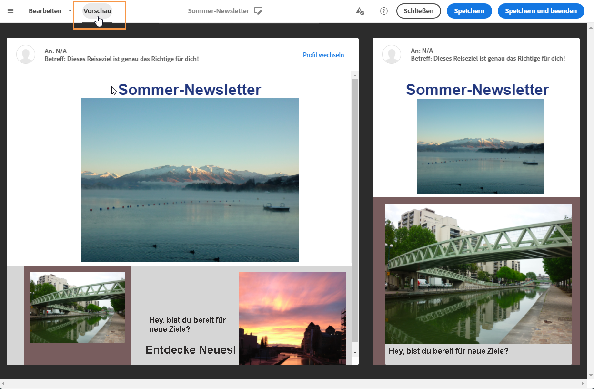

   Eine Ansicht Ihrer E-Mail auf einem Desktop und auf einem Mobilgerät werden nebeneinander dargestellt.

1. Die Vorschauerzeugung löst automatisch die Durchführung einer Anti-Spam-Prüfung aus. Click the **[!UICONTROL Anti-spam analysis]** button to find out more about the warning.

   

1. Select the **[!UICONTROL Change profile]** button to choose the test profile you want to test the personalization elements on.

   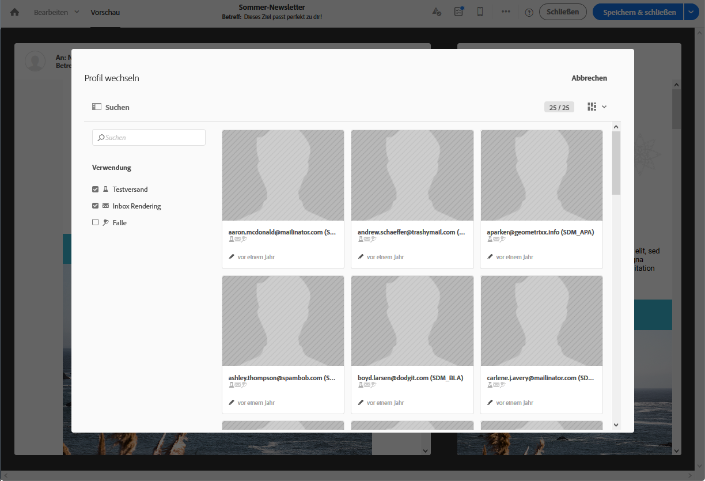

1. To exit the **[!UICONTROL Preview]** mode, click the **[!UICONTROL Edit]** button on top left of the screen.

   

**Verwandte Themen**

* [Verwaltung von Testprofilen](../../audiences/using/managing-test-profiles.md)
* [Testen von E-Mail-Nachrichten mit Zielgruppenprofilen](../../sending/using/testing-messages-using-target.md)
* [Testversand durchführen](../../sending/using/sending-proofs.md)

## Vorschau von SMS-Nachrichten {#previewing-sms}

Bei **SMS** -Nachrichten können Sie mit Campaign Standard Vorschauen mit Test-Profilen durchführen. So erhalten Sie eine genaue Darstellung der Nachricht, die ein bestimmtes Profil erhalten wird. Weiterführende Informationen dazu finden Sie im Abschnitt [Verwaltung von Testprofilen](../../audiences/using/managing-test-profiles.md).

Gehen Sie wie folgt vor, um eine SMS-Nachricht mit Test-Profilen Vorschau:

1. Nachdem Sie die **[!UICONTROL Properties]** SMS-Nachricht ausgefüllt und Ihre Audiencen ausgewählt haben, können Sie Ihren Versand personalisieren. For more information, refer to [section](../../channels/using/personalizing-sms-messages.md).

   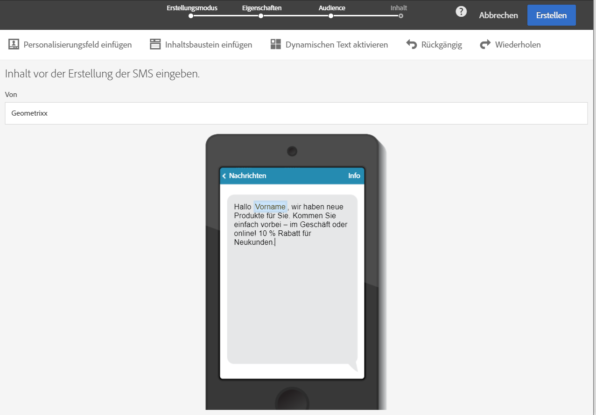

1. Nachdem Sie Ihren Inhalt personalisiert haben, klicken Sie auf **[!UICONTROL Create]** , um das **[!UICONTROL Summary]** Fenster aufzurufen.

1. Klicken Sie im **[!UICONTROL Summary]** Fenster auf **[!UICONTROL Content]** den Beginn, um eine Vorschau des Versands anzuzeigen.

   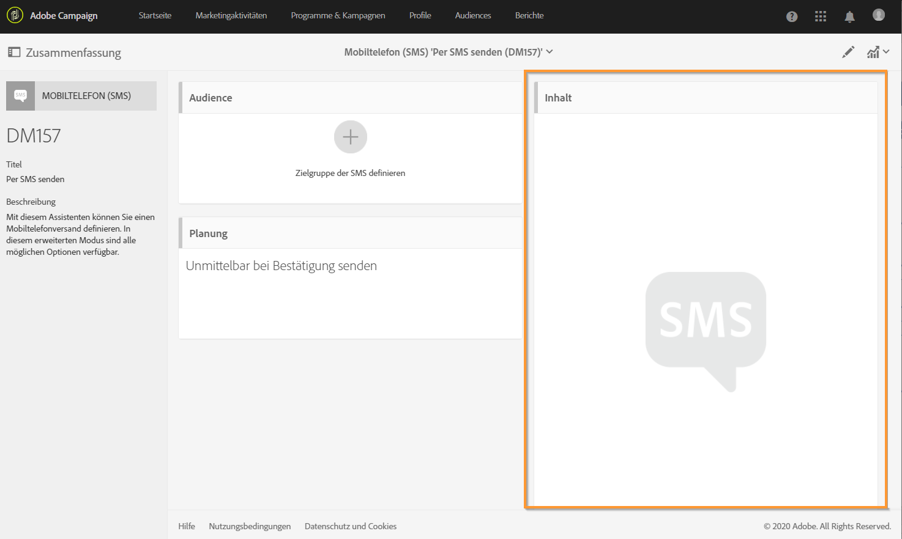

1. Klicken Sie **[!UICONTROL Preview]** in der Symbolleiste auf .

   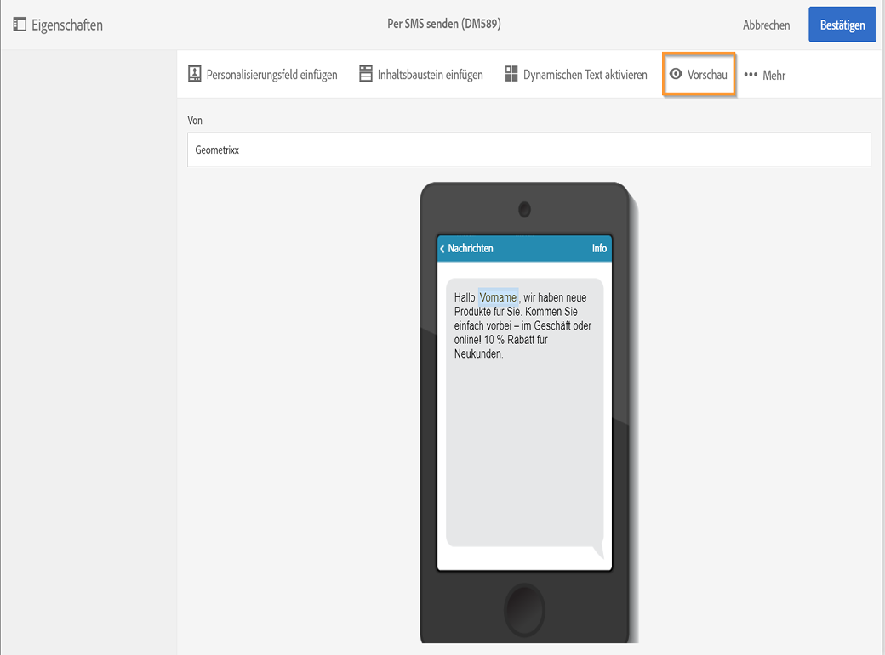

1. Klicken Sie auf **[!UICONTROL Change profile]** , um Ihr Test-Profil auszuwählen **[!UICONTROL Confirm]**.

   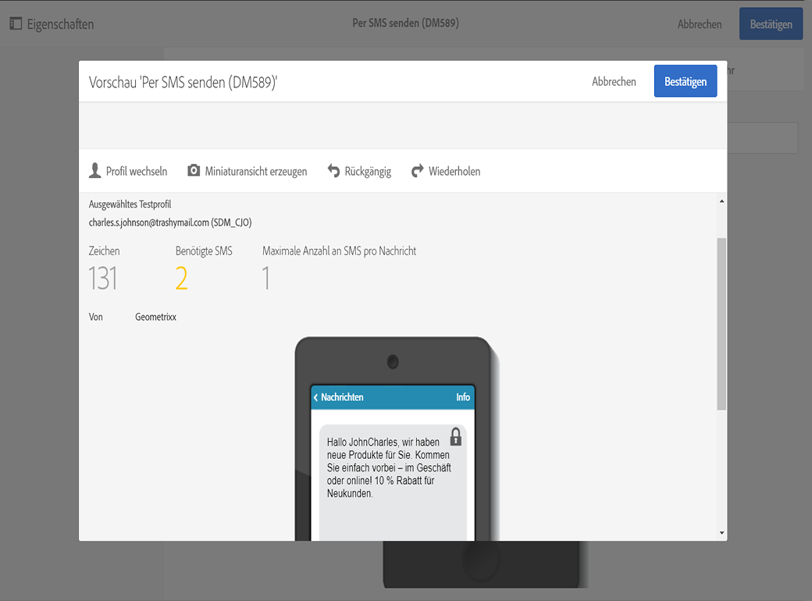

Sie können nun die genaue Darstellung Ihrer Nachricht in Abhängigkeit von den ausgewählten Profilen sehen.

**Verwandte Themen**

* [Über SMS-Nachrichten](../../channels/using/about-sms-messages.md)
* [SMS erstellen](../../channels/using/creating-an-sms-message.md)
* [SMS personalisieren](../../channels/using/personalizing-sms-messages.md)

## Vorschau von Push-Benachrichtigungen {#previewing-push}

Für die **Push-Benachrichtigung** können Sie mit Campaign Standard Vorschauen mit Test-Profilen durchführen. So erhalten Sie eine genaue Darstellung der Nachricht, die ein bestimmtes Profil erhalten wird. Weiterführende Informationen dazu finden Sie im Abschnitt [Verwaltung von Testprofilen](../../audiences/using/managing-test-profiles.md).

Gehen Sie wie folgt vor, um eine Push-Benachrichtigung mit Test-Profilen Vorschau:

1. Nachdem Sie die **[!UICONTROL Properties]** Push-Benachrichtigung ausgefüllt und Ihre Audiencen ausgewählt haben, können Sie Ihren Versand personalisieren. For more information, refer to [Customizing a push notification](../../channels/using/customizing-a-push-notification.md).

1. Nach der Personalisierung der Inhalte können Sie die Wiedergabe Ihrer Push-Benachrichtigungen je nach Gerät und Betriebssystem im Fenster &quot;Vorschau&quot;direkt überprüfen.

   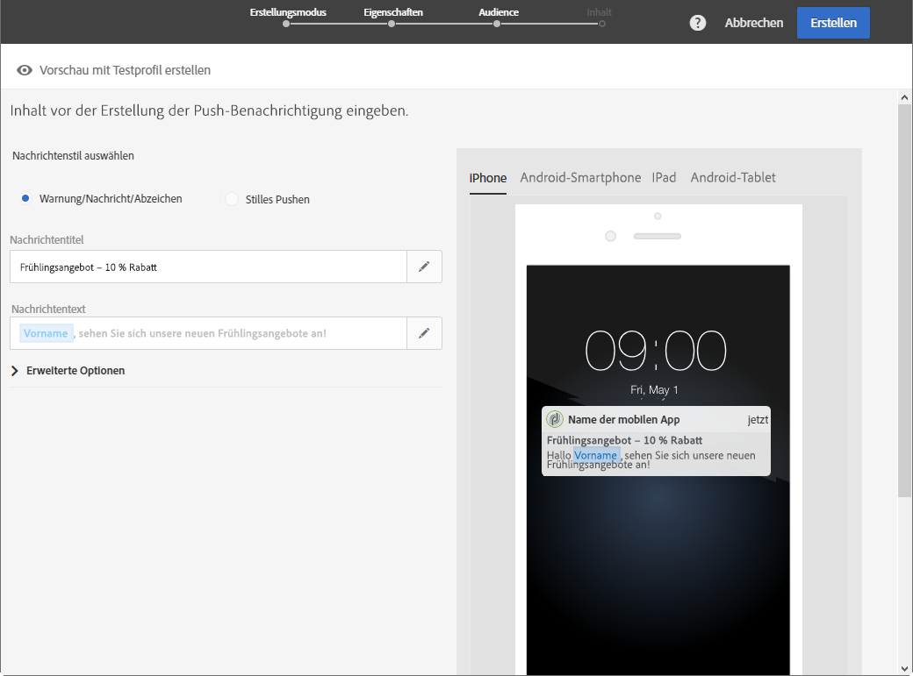

1. Um Ihre Push-Benachrichtigung mit Test-Profilen Vorschau, klicken Sie auf **[!UICONTROL Preview with test profile]**.

   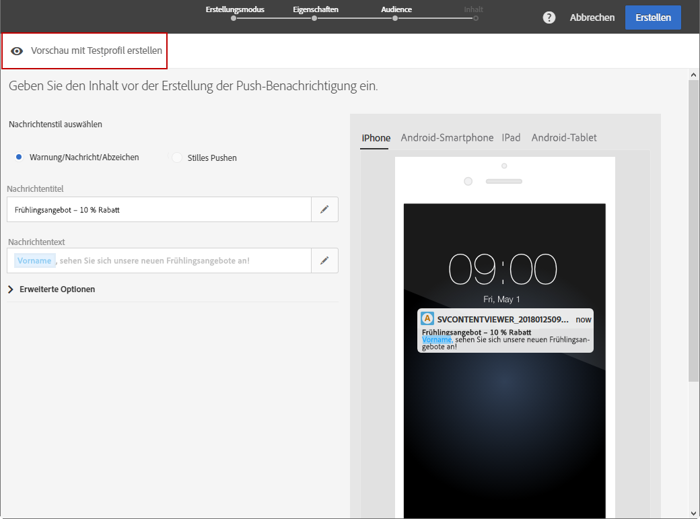

1. Wählen Sie dann Ihr Profil aus **[!UICONTROL Confirm]**.

Sie können nun die genaue Darstellung Ihrer Nachricht in Abhängigkeit von den ausgewählten Profilen sehen.

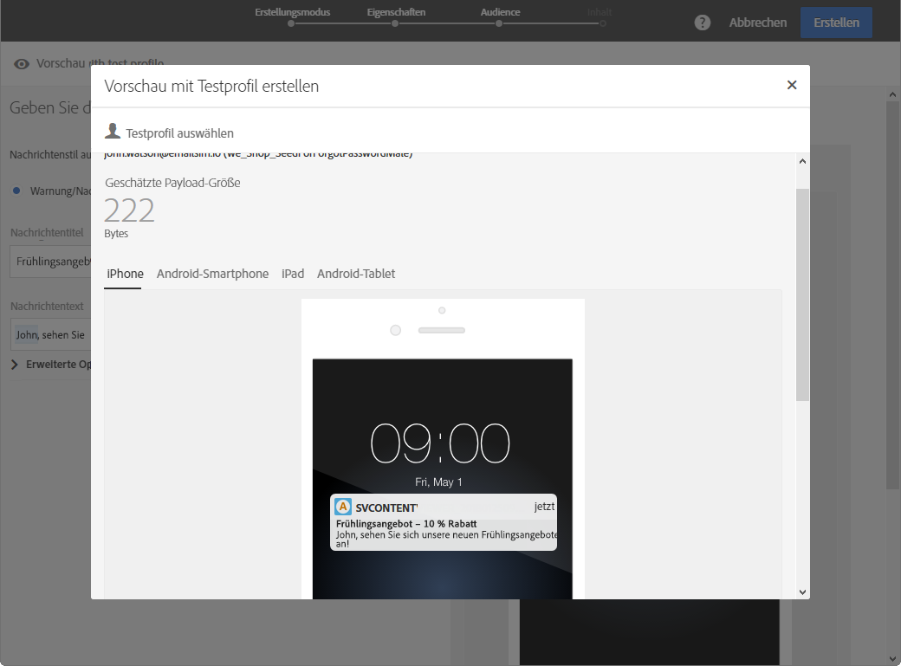

**Verwandte Themen**

* [Über Push-Benachrichtigungen](../../channels/using/about-push-notifications.md)
* [Push-Benachrichtigung vorbereiten und senden](../../channels/using/preparing-and-sending-a-push-notification.md)
* [Push-Benachrichtigung anpassen](../../channels/using/customizing-a-push-notification.md)

## Anzeigen einer Vorschau von In-App-Nachrichten {#previewing-in-app}

Für **In-App**-Nachrichten können Sie mit Campaign Standard Vorschauen mithilfe von Test-Profilen durchführen. So erhalten Sie eine genaue Darstellung der Nachricht, die ein bestimmtes Profil erhalten wird. Weiterführende Informationen dazu finden Sie im Abschnitt [Verwaltung von Testprofilen](../../audiences/using/managing-test-profiles.md).

Gehen Sie wie folgt vor, um eine In-App-Nachricht mit Test-Profilen Vorschau:

1. Nachdem Sie die **[!UICONTROL Properties]** In-App-Nachricht ausgefüllt und die Audiencen ausgewählt haben, können Sie Ihren Versand personalisieren **[!UICONTROL Triggers]**. Weitere Informationen finden Sie unter [Anpassen einer In-App-Nachricht](../../channels/using/customizing-an-in-app-message.md).

1. Nach der Personalisierung der Inhalte können Sie die Wiedergabe Ihrer In-App-Nachricht direkt prüfen, je nach Gerät und Betriebssystem im Fenster &quot;Vorschau&quot;.

   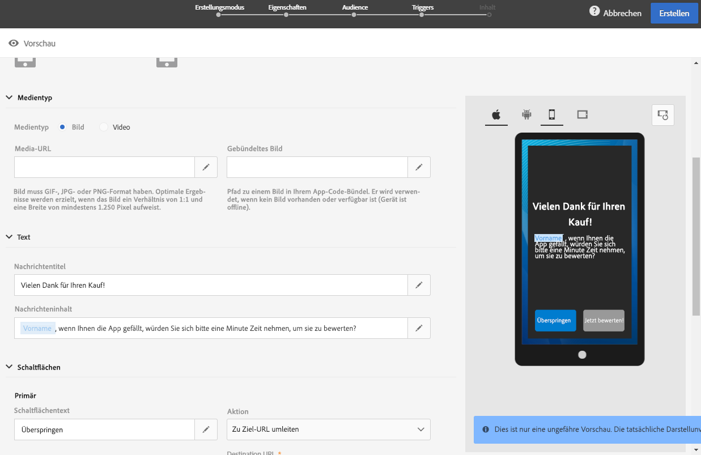

1. Um Ihre In-App-Nachricht mit Test-Profilen Vorschau, klicken Sie auf **[!UICONTROL Preview]**.

   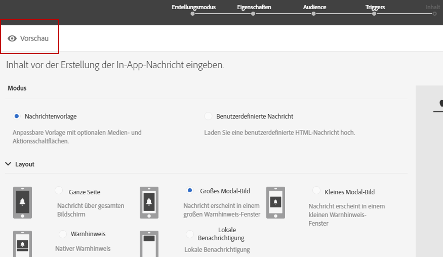

1. Wählen Sie dann Ihr Profil aus **[!UICONTROL Confirm]**.

Sie können nun die genaue Darstellung Ihrer Nachricht in Abhängigkeit von den ausgewählten Profilen sehen.

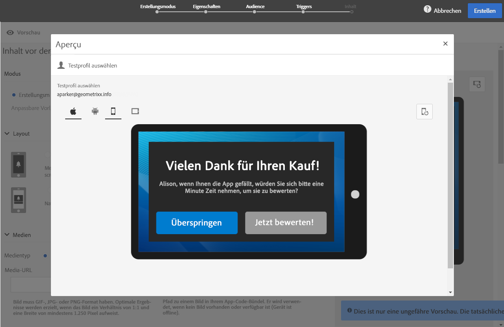

**Verwandte Themen**

* [Über In-App-Messaging](../../channels/using/about-in-app-messaging.md)
* [In-App-Nachricht vorbereiten und senden](../../channels/using/preparing-and-sending-an-in-app-message.md)
* [In-App-Nachricht anpassen](../../channels/using/customizing-an-in-app-message.md)