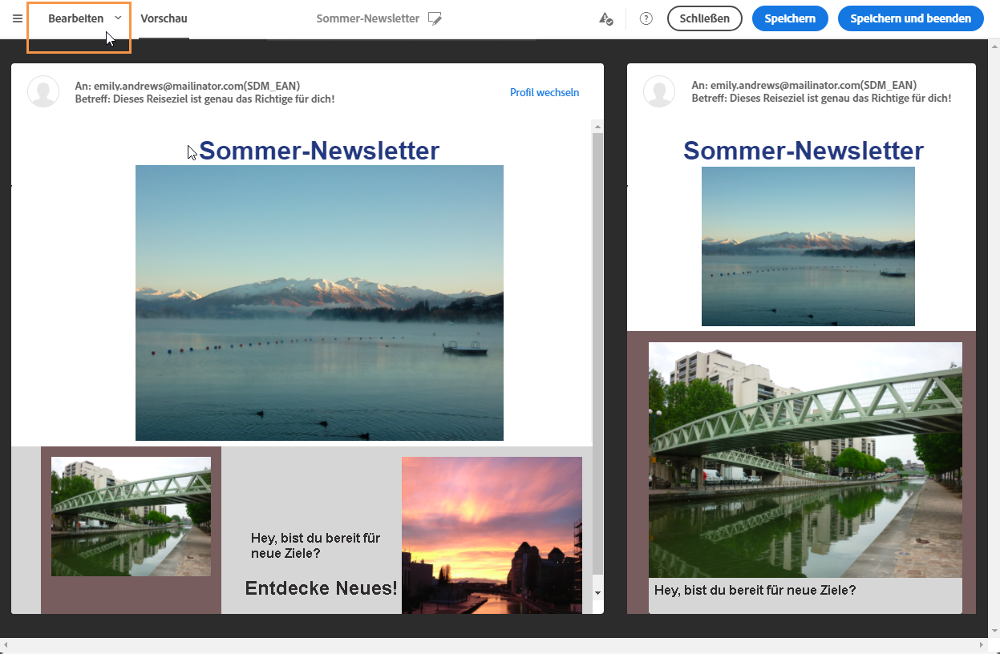

# Sendungen in Vorschau anzeigen {#previewing-messages}

## E-Mail-Vorschau erzeugen {#previewing-emails}

Mit Campaign Standard können Sie Nachrichten vor dem Versand in einer Vorschau anzeigen, um deren Personalisierung zu überprüfen und zu ermitteln, wie die Nachrichten bei Ihren Empfängern aussehen werden.

Die Anzeige der Vorschau von Nachrichten erfolgt über **Testprofile**, die Sie der Zielgruppe der Nachricht hinzufügen.

Bei **E-Mail**-Nachrichten können Sie in Campaign Standard eine Vorschau mit Zielgruppenprofilen anstatt mit Testprofilen erstellen. So erhalten Sie eine genaue Darstellung der Nachricht, die ein bestimmtes Profil erhalten wird. Weiterführende Informationen finden Sie unter [Testen von E-Mail-Nachrichten mit Zielgruppenprofilen](../../sending/using/testing-messages-using-target.md).

Gehen Sie wie folgt vor, um unter Verwendung von Testprofilen die Vorschau einer Nachricht anzuzeigen:

1. Wählen Sie in [Email Designer](../../designing/using/designing-content-in-adobe-campaign.md) die Schaltfläche **[!UICONTROL Vorschau]** aus.

   

   Eine Ansicht Ihrer E-Mail auf einem Desktop und auf einem Mobilgerät werden nebeneinander dargestellt.

1. Die Vorschauerzeugung löst automatisch die Durchführung einer Anti-Spam-Prüfung aus. Wählen Sie die Schaltfläche **[!UICONTROL Anti-Spam-Analyse]** aus, um die Gründe des Warnhinweises zu erfahren.

   

1. Wählen Sie die Schaltfläche **[!UICONTROL Profil wechseln]**, um das Testprofil auszuwählen, für das die Personalisierungselemente getestet werden sollen.

   

1. Um den Modus **[!UICONTROL Vorschau]** zu beenden, klicken Sie im Bildschirm links oben auf die Schaltfläche **[!UICONTROL Bearbeiten]**.

   

**Verwandte Themen** 

* [Testprofile verwalten](../../audiences/using/managing-test-profiles.md)
* [E-Mail-Nachrichten mit Zielgruppenprofilen testen](../../sending/using/testing-messages-using-target.md)
* [Testversand durchführen](../../sending/using/sending-proofs.md)

## Vorschau von SMS-Nachrichten erzeugen {#previewing-sms}

Bei **SMS**-Nachrichten können Sie mit Campaign Standard unter Verwendung von Testprofilen eine Vorschau der Nachricht anzeigen. So erhalten Sie eine genaue Darstellung der Nachricht, die ein bestimmtes Profil erhalten wird. Weiterführende Informationen dazu finden Sie im Abschnitt [Verwaltung von Testprofilen](../../audiences/using/managing-test-profiles.md).

Gehen Sie wie folgt vor, um unter Verwendung von Testprofilen die Vorschau einer SMS-Nachricht anzuzeigen:

1. Nachdem Sie die **[!UICONTROL Eigenschaften]** Ihrer SMS-Nachricht ausgefüllt und Ihre Zielgruppen ausgewählt haben, können Sie Ihren Versand personalisieren. Weiterführende Informationen hierzu finden Sie in [diesem Abschnitt](../../channels/using/personalizing-sms-messages.md).

   

1. Wählen Sie nach der Personalisierung Ihres Inhalts **[!UICONTROL Erstellen]** aus, um das Fenster **[!UICONTROL Zusammenfassung]** aufzurufen.

1. Wählen Sie im Fenster **[!UICONTROL Zusammenfassung]** **[!UICONTROL Inhalt]** aus, um die Vorschau Ihres Versands anzuzeigen.

   

1. Wählen Sie in der Symbolleiste **[!UICONTROL Vorschau]** aus.

   

1. Wählen Sie **[!UICONTROL Profil ändern]** aus, um Ihr Testprofil auszuwählen, und dann **[!UICONTROL Bestätigen]**.

   

Sie können nun je nach den ausgewählten Testprofilen die genaue Darstellung Ihrer Nachricht sehen.

**Verwandte Themen** 

* [Über SMS-Nachrichten](../../channels/using/about-sms-messages.md)
* [SMS erstellen](../../channels/using/creating-an-sms-message.md)
* [SMS personalisieren](../../channels/using/personalizing-sms-messages.md)

## Vorschau von Push-Benachrichtigungen erzeugen {#previewing-push}

Bei **Push-Benachrichtigungen** können Sie mit Campaign Standard unter Verwendung von Testprofilen eine Vorschau der Nachricht anzeigen. So erhalten Sie eine genaue Darstellung der Nachricht, die ein bestimmtes Profil empfangen wird. Weiterführende Informationen dazu finden Sie im Abschnitt [Verwaltung von Testprofilen](../../audiences/using/managing-test-profiles.md).

Gehen Sie wie folgt vor, um unter Verwendung von Testprofilen die Vorschau einer Push-Benachrichtigung anzuzeigen:

1. Nachdem Sie die **[!UICONTROL Eigenschaften]** Ihrer Push-Benachrichtigung ausgefüllt und Ihre Zielgruppen ausgewählt haben, können Sie Ihren Versand personalisieren. Weiterführende Informationen dazu finden Sie unter [Push-Benachrichtigung anpassen](../../channels/using/customizing-a-push-notification.md).

1. Nach der Personalisierung Ihrer Inhalte können Sie das Rendering Ihrer Push-Benachrichtigungen je nach Gerät und Betriebssystem im Vorschaufenster direkt überprüfen.

   

1. Um Ihre Push-Benachrichtigung mit Testprofilen als Vorschau anzuzeigen, wählen Sie **[!UICONTROL Vorschau mit Testprofil erstellen]** aus.

   

1. Wählen Sie Ihr Testprofil aus und **[!UICONTROL bestätigen]** Sie es dann.

Sie können nun je nach ausgewähltem Testprofil die genaue Darstellung Ihrer Nachricht sehen.

**Verwandte Themen** 

* [Über Push-Benachrichtigungen](../../channels/using/about-push-notifications.md)
* [Push-Benachrichtigung vorbereiten und senden](../../channels/using/preparing-and-sending-a-push-notification.md)
* [Push-Benachrichtigung anpassen](../../channels/using/customizing-a-push-notification.md)

## Vorschau von In-App-Nachrichten erzeugen {#previewing-in-app}

Bei **In-App-Nachrichten** können Sie mit Campaign Standard unter Verwendung von Testprofilen eine Vorschau der Nachricht erzeugen. So erhalten Sie eine genaue Darstellung der Nachricht, die ein bestimmtes Profil erhalten wird. Weiterführende Informationen dazu finden Sie im Abschnitt [Verwaltung von Testprofilen](../../audiences/using/managing-test-profiles.md).

Gehen Sie wie folgt vor, um unter Verwendung von Testprofilen die Vorschau einer In-App-Nachricht anzuzeigen:

1. Nachdem Sie die **[!UICONTROL Eigenschaften]** Ihrer In-App-Nachricht ausgefüllt, Ihre Zielgruppen ausgewählt und Ihre **[!UICONTROL Triggers]** festgelegt haben, können Sie Ihren Versand personalisieren. Weiterführende Informationen dazu finden Sie unter [In-App-Nachricht anpassen](../../channels/using/customizing-an-in-app-message.md).

1. Nach der Personalisierung Ihrer Inhalte können Sie das Rendering Ihrer In-App-Nachricht je nach Gerät und Betriebssystem im Vorschaufenster direkt überprüfen.

   

1. Um Ihre In-App-Nachricht mit Testprofilen als Vorschau anzuzeigen, wählen Sie **[!UICONTROL Vorschau]** aus.

   

1. Wählen Sie Ihr Testprofil aus und **[!UICONTROL bestätigen]** Sie es dann.

Sie können nun je nach ausgewähltem Testprofil die genaue Darstellung Ihrer Nachricht sehen.

**Verwandte Themen** 

* [Über In-App-Messaging](../../channels/using/about-in-app-messaging.md)
* [In-App-Nachricht vorbereiten und senden](../../channels/using/preparing-and-sending-an-in-app-message.md)
* [In-App-Nachricht anpassen](../../channels/using/customizing-an-in-app-message.md)
