# Warnungen bei Zustellproblemen erhalten{#receiving-alerts-when-failures-happen}

## Über Versandwarnungen {#about-delivery-alerting}

Bei der Funktion **Versandwarnungen** handelt es sich um ein Warnungsmanagementsystem, über das eine Benutzergruppe automatisch Benachrichtigungen zu ihren Sendungen erhält.

Die gesendeten Benachrichtigungen beinhalten einen Bericht, der standardmäßig auf den folgenden Bedingungen basiert:

* Fehlgeschlagene Sendungen
* Sendungen mit fehlgeschlagener Vorbereitung
* Sendungen mit zu hoher Softbounce-Fehlerrate
* Sendungen mit zu hoher Hardbounce-Fehlerrate
* Sendungen mit dem Status &quot;Ausstehend&quot;, die länger als üblich dauern
* Sendungen mit geringem Durchsatz
* Gestartete Sendungen

Die Empfänger der Warnungen können die von Adobe Campaign verarbeiteten Sendungen überwachen und entsprechende Maßnahmen treffen, wenn bei der Durchführung Fehler auftreten.

Diese Warnungen können entsprechend den Warnungsbedingungen angepasst werden, die über ein Dashboard in Adobe Campaign definiert werden.

>[!NOTE]
>
>Die Warnungen werden nur per E-Mail zugestellt.

Die gesendeten Benachrichtigungen enthalten folgende Elemente:

* eine **[!UICONTROL Zusammenfassung]** bestehend aus der Anzahl der Sendungen, die den von Ihnen definierten Bedingungen entsprechen, und dem Titel/der Farbe, den bzw. die Sie für jede Bedingung ausgewählt haben;
* den Bereich **[!UICONTROL Details]**, in dem alle für das entsprechende Dashboard definierten Versandbedingungen sowie alle Sendungen für jede Bedingung aufgeführt werden.

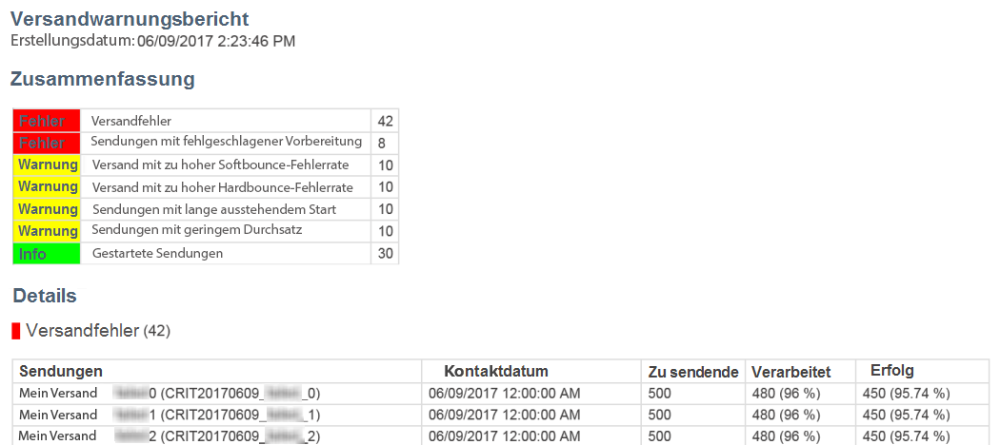

## Versandwarnungs-Dashboards {#delivery-alerting-dashboards}

### Über Versandwarnungs-Dashboards {#about-delivery-alerting-dashboards}

Dashboards werden verwendet, um die Empfänger der Benachrichtigungen zu verwalten, die Warnungsbedingungen zu definieren und auf den Verlauf der Warnungen zuzugreifen.

>[!NOTE]
>
>Um Dashboards und Warnungsbedingungen öffnen und konfigurieren zu können, müssen Sie über Administratorrechte verfügen oder der Sicherheitsgruppe **Versand-Supervisoren** angehören. Standardbenutzer können nicht auf Dashboards in Adobe Campaign zugreifen, sondern haben nur die Möglichkeit, Warnnachrichten zu empfangen. Weiterführende Informationen zu Benutzern und zur Sicherheit in Adobe Campaign finden Sie in den Abschnitten [Typen von Benutzern](../../administration/using/users-management.md) und [Über Sicherheitsgruppen](../../administration/using/managing-groups-and-users.md#about-security-groups).

In der Adobe Campaign-Benutzeroberfläche haben Sie folgende Möglichkeiten:

* Versandwarnungs-Dashboards erstellen und verwalten. Siehe [Versandwarnungs-Dashboard erstellen](#creating-a-delivery-alerting-dashboard).
* Versandwarnungsbedingungen für jedes Dashboard definieren und verwalten. Beispielsweise können Sie Warnungen für Sendungen mit fehlgeschlagener Vorbereitung oder Sendungen mit geringem Durchsatz erstellen. Siehe [Über Warnungsbedingungen](#about-alerting-criteria).
* Die Bedingungsparameter für jedes Dashboard ändern. Siehe [Bedingungsparameter](#criteria-parameters).
* Für jedes Dashboard eine Empfängergruppe definieren.

   Beispiel: Sie möchten die Benutzer mit Administratorrechten nur über fehlgeschlagene Sendungen informieren. Sie möchten aber auch, dass Mitarbeiter der Marketingabteilung von den Sendungen mit zu hoher Softbounce-Fehlerrate informiert werden. Sie müssen daher zwei unterschiedliche Dashboards erstellen und die Bedingungen für jede Empfängergruppe definieren.

* Öffnen Sie den Verlauf aller gesendeten Warnungen für jedes Dashboard.

   Bei der Auswahl eines Dashboards wird standardmäßig die zuletzt gesendete Warnung für dieses Dashboard angezeigt. Alle gesendeten Warnungen sind auf der linken Bildschirmseite aufgelistet. Wählen Sie ein Objekt in der **[!UICONTROL Verlauf]**-Liste aus, um die entsprechenden Warnungen zu öffnen.

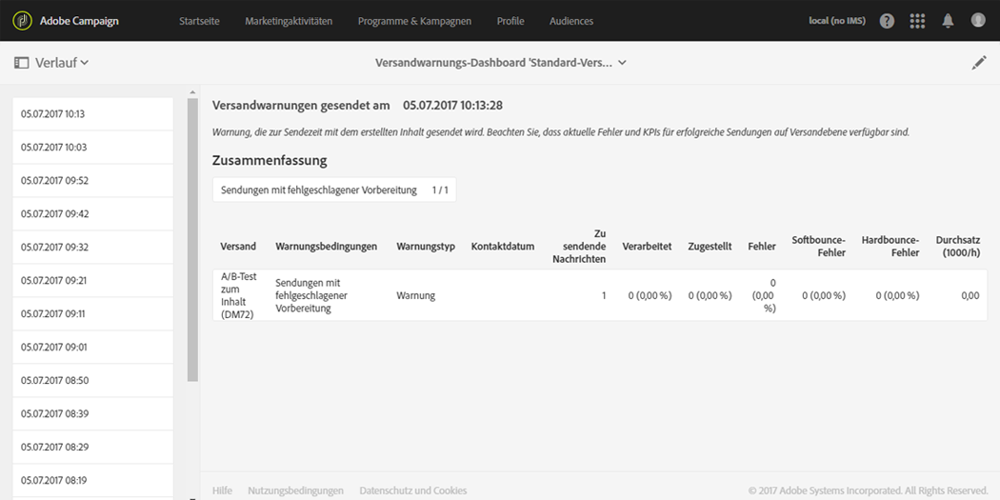

### Versandwarnungs-Dashboard erstellen {#creating-a-delivery-alerting-dashboard}

Wenn Sie Benachrichtigungen, die auf bestimmten Bedingungen basieren, an unterschiedliche Benutzergruppen senden möchten, benötigen Sie mehrere Dashboards. Gehen Sie wie folgt vor, um ein neues Dashboard zu erstellen:

1. Gehen Sie zu **[!UICONTROL Administration]** > **[!UICONTROL Kanäle]** > **[!UICONTROL Versandwarnung]**.
1. Wählen Sie **[!UICONTROL Versandwarnungs-Dashboards]** und danach **[!UICONTROL Erstellen]**.
1. Aktivieren Sie die Option **[!UICONTROL Aktiviert]**, um das aktuelle Dashboard zu aktivieren.

   Ist diese Option deaktiviert, werden mit diesem Dashboard verknüpfte Benachrichtigungen nicht mehr gesendet. Standardmäßig ist diese Option deaktiviert.

   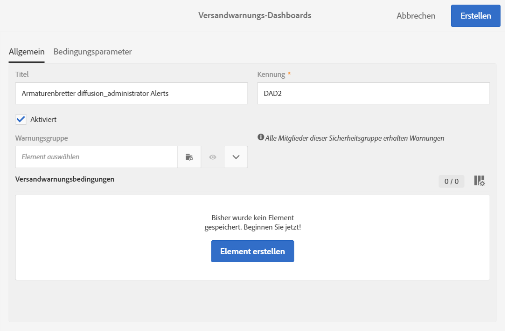

1. Wählen Sie in der Dropdown-Liste **[!UICONTROL Warnungsgruppe]** die Empfängergruppe aus, die Sie benachrichtigen möchten. Zum Ändern oder Erstellen einer Gruppe lesen Sie den Abschnitt [Sicherheitsgruppe erstellen und Benutzer zuordnen](../../administration/using/managing-groups-and-users.md#creating-a-security-group-and-assigning-users).
1. Wählen Sie im Bereich **[!UICONTROL Versandwarnungsbedingungen]** die Option **[!UICONTROL Element erstellen]**, um Bedingungen hinzuzufügen. Siehe [Über Warnungsbedingungen](#about-alerting-criteria).
1. Wählen Sie die Schaltfläche **[!UICONTROL Eigenschaften bearbeiten]**. Definieren Sie im Tab **[!UICONTROL Bedingungsparameter]**, wie die Bedingungen angewendet werden sollen. Siehe [Bedingungsparameter](#criteria-parameters).
1. Speichern Sie das Dashboard mithilfe der Schaltfläche **[!UICONTROL Erstellen]**.

Immer wenn jetzt ein Versand die von Ihnen in diesem Dashboard definierten Bedingungen erfüllt, wird eine Warnung an die angegebene Benutzergruppe gesendet.

## Versandwarnungsbedingungen    {#delivery-alerting-criteria}

### Über Warnungsbedingungen {#about-alerting-criteria}

Um auf die Versandwarnungsbedingungen zuzugreifen, gehen Sie zu **[!UICONTROL Administration]** > **[!UICONTROL Kanäle]** > **[!UICONTROL Versandwarnung]** und wählen Sie **[!UICONTROL Versandwarnungsbedingungen]** aus.

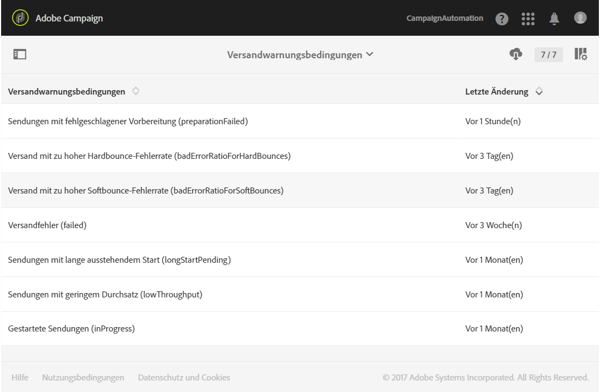

Die folgenden Bedingungen stehen in den Versandwarnungs-Dashboards zur Verfügung:

* **[!UICONTROL Versandfehler]**: Alle in einem bestimmten Zeitraum geplanten Sendungen mit einem Fehler als Status.
* **[!UICONTROL Sendungen mit fehlgeschlagener Vorbereitung]**: Alle in einem bestimmten Zeitraum geänderten Sendungen, deren Vorbereitung (Zielgruppenberechnung und Inhaltsvorbereitung) fehlgeschlagen ist. Weiterführende Informationen dazu finden Sie im Abschnitt [Versandvorbereitung](../../sending/using/preparing-the-send.md).
* **[!UICONTROL Versand mit zu hoher Softbounce-Fehlerrate]**: Alle in einem bestimmten Zeitraum geplanten Sendungen, deren Status zumindest **[!UICONTROL Gestartet]** lautet und deren Softbounce-Fehlerrate über dem festgelegten Prozentsatz liegt.
* **[!UICONTROL Versand mit zu hoher Hardbounce-Fehlerrate]**: Alle in einem bestimmten Zeitraum geplanten Sendungen, deren Status zumindest **[!UICONTROL Gestartet]** lautet und deren Hardbounce-Fehlerrate über dem festgelegten Prozentsatz liegt.
* **[!UICONTROL Sendungen mit lange ausstehendem Start]**: Alle in einem bestimmten Zeitraum geplanten Sendungen, deren Status **[!UICONTROL Start ausstehend]** die definierte Dauer überschreitet. **[!UICONTROL Start ausstehend]** bedeutet, dass die Nachrichten vom System noch nicht berücksichtigt wurden.
* **[!UICONTROL Sendungen mit geringem Durchsatz]**: Alle Sendungen, deren Start länger als die definierte Dauer zurückliegt, die einen niedrigeren als den definierten Prozentsatz an verarbeiteten Nachrichten aufweisen und deren Durchsatz unter einem definierten Wert liegt.
* **[!UICONTROL Gestartete Sendungen]**: Alle in einem bestimmten Zeitraum geplanten Sendungen, deren Status **[!UICONTROL Gestartet]** lautet.

>[!NOTE]
>
>Alle Parameter, die für die oben aufgeführten Bedingungen gelten, weisen Standardwerte auf. Diese Werte können im Tab **[!UICONTROL Bedingungsparameter]** des Versandwarnungs-Dashboards geändert werden. Siehe [Bedingungsparameter](#criteria-parameters).

In der Liste **[!UICONTROL Versandwarnungsbedingungen]** können Sie ein Objekt auswählen, um auf dessen Details zuzugreifen.

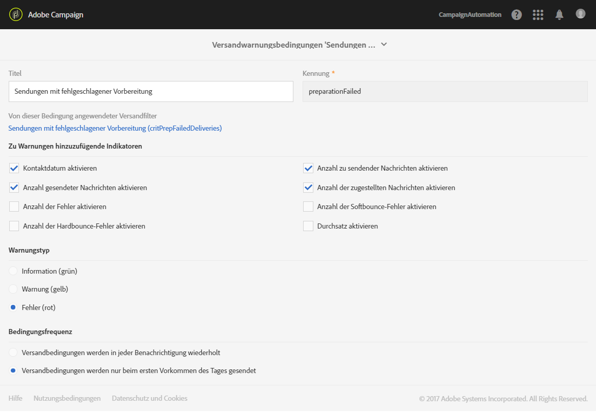

Für jede Bedingung können Sie folgende Einstellungen festlegen:

* **[!UICONTROL Indikatoren zum Hinzufügen in Warnungen]**: Dies sind die Spalten im Bereich **[!UICONTROL Details]** einer Benachrichtigung bei Sendungen, die der ausgewählten Bedingung entsprechen.

   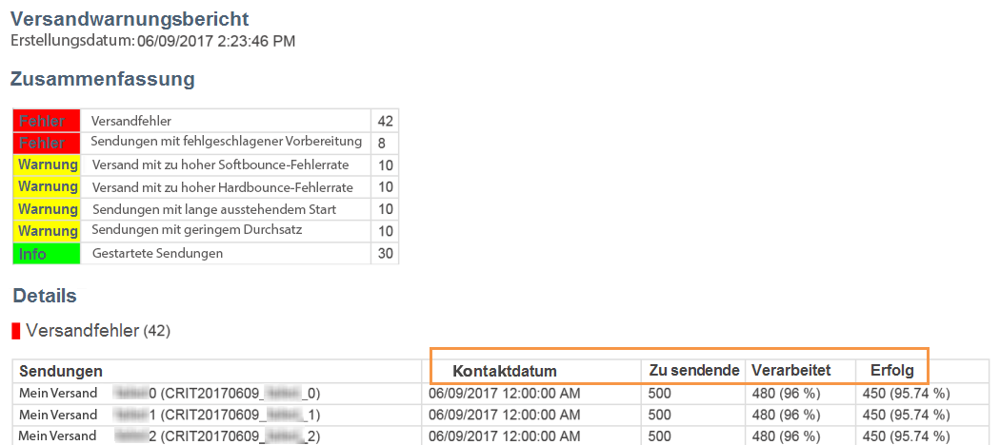

* **[!UICONTROL Warnungstyp]**: Dies sind der Titel und die Farbe, die neben der Versandbedingung in der Zusammenfassung der Benachrichtigung angezeigt werden.

   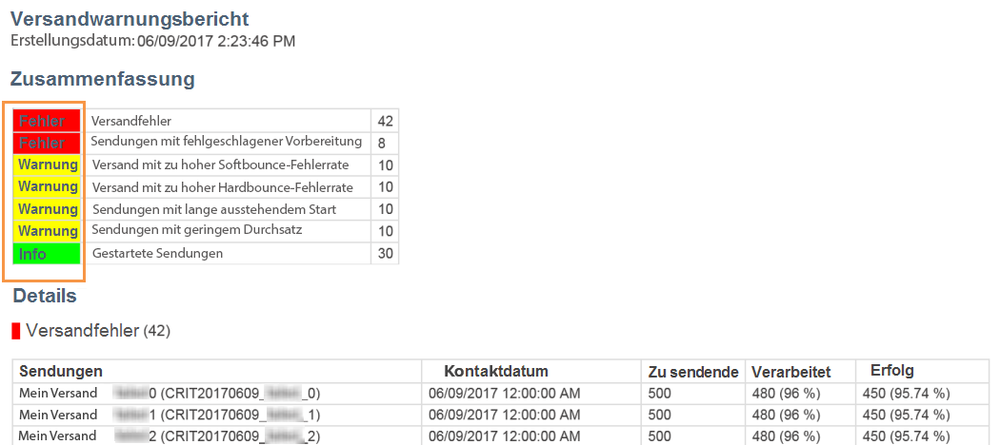

* **[!UICONTROL Bedingungsfrequenz]**: Wenn eine Bedingung für einen Versand erfüllt ist, wird sie in jeder im Überwachungszeitraum gesendeten Benachrichtigung wiederholt. Ansonsten wird für einen Versand nur eine einzige Warnung pro Tag und Art der Warnung (beim ersten Auftreten) gemäß der Warnungsbedingung gesendet.

   Standardmäßig ist diese Option für alle Bedingungen auf einmal täglich festgelegt.

**Verwandte Themen:**

* [Versandlogs](../../sending/using/monitoring-a-delivery.md#sending-logs)
* [Häufigkeit der Versandwarnungen](#alerting-frequency)
* [Symbole und Status von Marketingaktivitäten](../../start/using/marketing-activities.md#marketing-activity-icons-and-statuses)

### Versandwarnungsbedingung erstellen    {#creating-a-delivery-alerting-criterion}

Sie können nach Bedarf neue Versandwarnungsbedingungen erstellen.

Beispielsweise können Sie eine neue Bedingung erstellen, mit der eine Benachrichtigung gesendet wird, in der alle Sendungen mit dem Status **[!UICONTROL Abgeschlossen]** aufgelistet werden.

Dazu müssen Sie zunächst die Ressource **Versand** erweitern und einen neuen Filter hinzufügen, der es Ihnen ermöglicht, nur die Sendungen mit dem Status **[!UICONTROL Abgeschlossen]** auszuwählen.

1. Gehen Sie zu **Adobe Campaign** > **Administration** > **Entwicklung** > **Benutzerdefinierte Ressourcen** und wählen Sie **[!UICONTROL Erstellen]** aus.
1. Wählen Sie dann **[!UICONTROL Existierende Ressource erweitern]** und aus der Dropdown-Liste die Ressource **[!UICONTROL Versand]** aus. Wählen Sie abschließend **[!UICONTROL Erstellen]** aus, um die Ressource zu bearbeiten.

   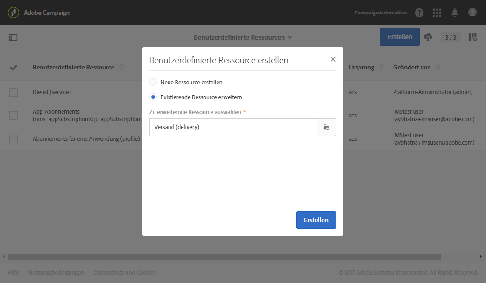

   Weiterführende Informationen zu einer bestehenden Ressource finden Sie im Abschnitt [Ressource definieren](../../developing/using/creating-or-extending-the-resource.md).

1. Öffnen Sie in der Ressource **[!UICONTROL Versand]** den Tab **[!UICONTROL Filterdefinition]** und wählen Sie **[!UICONTROL Element hinzufügen]** aus, um einen Filter zu erstellen.

   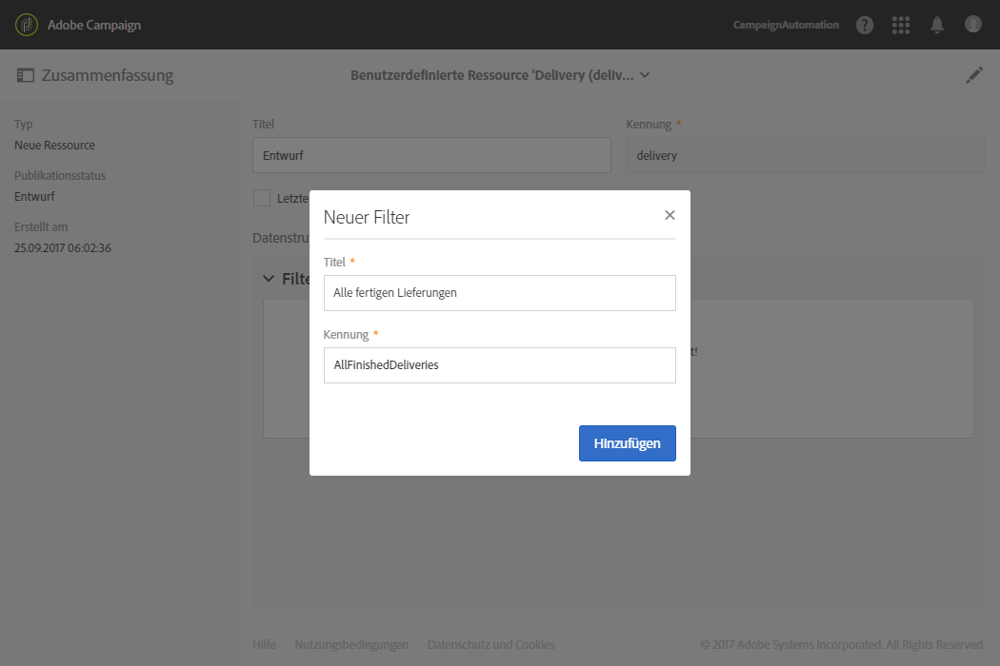

1. Bearbeiten Sie die neue Filterdefinition: Ziehen Sie im Fenster **[!UICONTROL Filterdefinition]** das Element **[!UICONTROL Status]** in den Arbeitsbereich und wählen Sie **[!UICONTROL Abgeschlossen]** als Filterbedingung aus.

   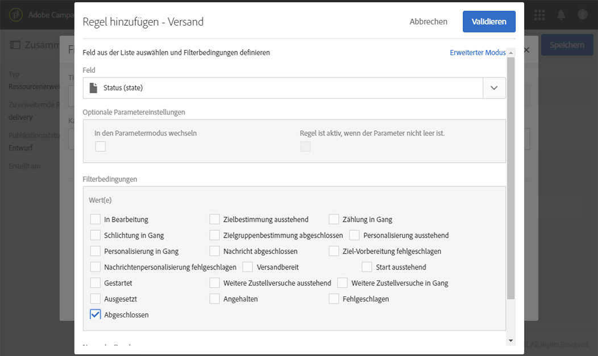

   Weiterführende Informationen zur Erstellung und Bearbeitung von benutzerdefinierten Filtern finden Sie im Abschnitt [Filter definieren](../../developing/using/configuring-filter-definition.md).

1. Speichern Sie Ihre Änderungen und publizieren Sie die Ressourcen. Weiterführende Informationen dazu finden Sie unter [Benutzerdefinierte Ressource publizieren](../../developing/using/updating-the-database-structure.md#publishing-a-custom-resource).

   Der Filter wird erstellt und kann jetzt in einer neuen Versandwarnungsbedingung ausgewählt werden.

1. Gehen Sie zu **[!UICONTROL Administration]** > **[!UICONTROL Kanäle]** > **[!UICONTROL Versandwarnung]**, wählen Sie **[!UICONTROL Versandwarnungsbedingungen]** und dann **[!UICONTROL Erstellen]** aus.
1. Wählen Sie in der Dropdown-Liste **[!UICONTROL Von dieser Bedingung angewendeter Versandfilter]** den soeben erstellten Filter aus.

   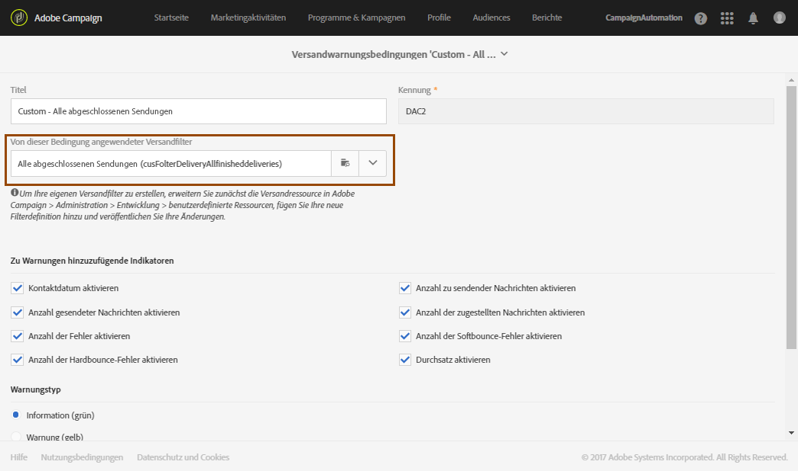

   Die Einstellungen Ihrer Bedingung können auf dieselbe Weise definiert werden wie die der Standardbedingungen. Siehe [Über Warnungsbedingungen](#about-alerting-criteria).

Nach der Erstellung können diese Bedingungen zu einem Versandwarnungs-Dashboard sowie zu anderen Bedingungen hinzugefügt werden. Siehe [Über Versandwarnungs-Dashboards](#about-delivery-alerting-dashboards).

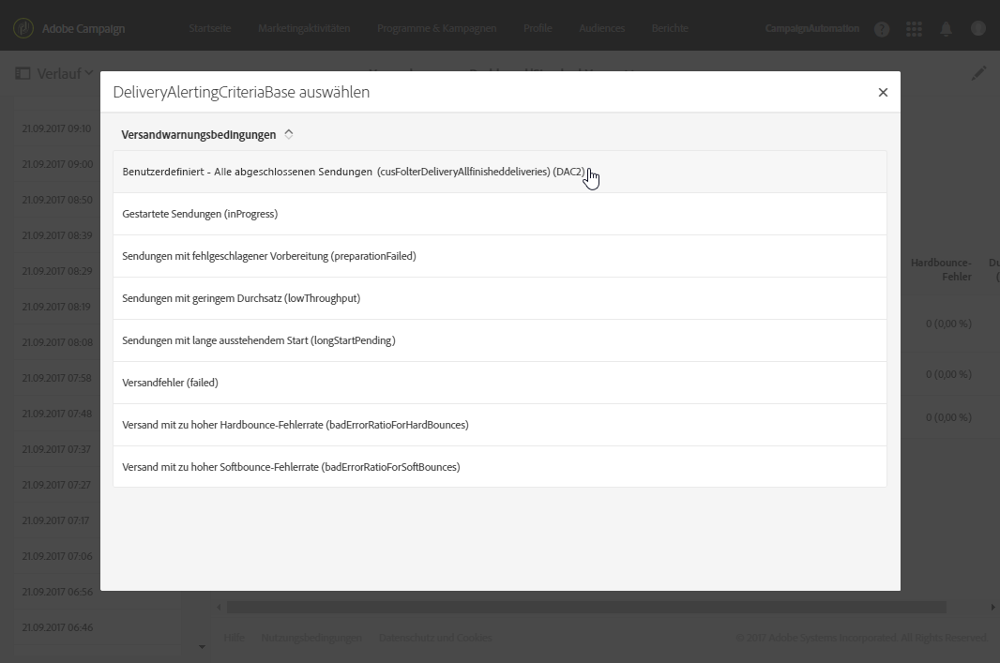

**Verwandtes Thema:**

[Ressource hinzufügen oder erweitern](../../developing/using/key-steps-to-add-a-resource.md)

## Versandwarnungsparameter    {#delivery-alerting-parameters}

### Bedingungsparameter {#criteria-parameters}

Im Tab **[!UICONTROL Bedingungsparameter]** eines [Versandwarnungs-Dashboards](#creating-a-delivery-alerting-dashboard) können Sie die in diesem Dashboard ausgewählten Bedingungen festlegen.

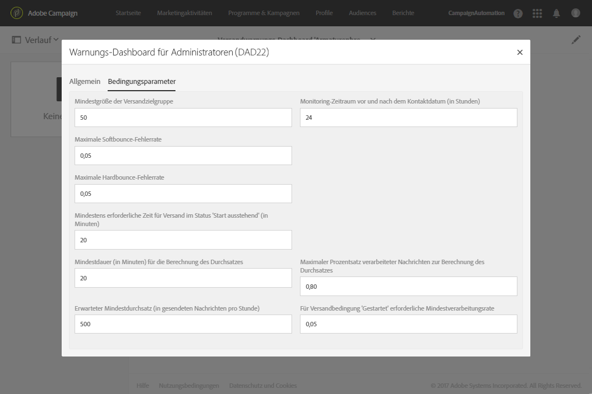

* **[!UICONTROL Mindestgröße der Versandzielgruppe]**: Wenn Sie in diesem Feld beispielsweise 100 eingeben, wird eine Benachrichtigung nur für Sendungen gesendet, deren Zielgruppe mindestens 100 Empfänger umfasst. Dieser Parameter gilt für alle Bedingungen.
* **[!UICONTROL Monitoring-Zeitraum vor und nach dem Kontaktdatum (in Stunden)]**: Anzahl der Stunden vor und nach der aktuellen Zeit. Berücksichtigt werden nur Sendungen, deren Kontaktdatum in diesem Zeitraum liegt. Dieser Parameter gilt für alle Bedingungen. Standardmäßig ist der Wert dieses Feldes mit 24 Stunden festgelegt.

   Weiterführende Informationen zum Kontaktdatum finden Sie in Abschnitt [Über die Versandplanung](../../sending/using/about-scheduling-messages.md).

* **[!UICONTROL Maximale Softbounce-Fehlerrate]**: Eine Benachrichtigung wird für alle Sendungen gesendet, deren Softbounce-Fehlerrate über dem definierten Wert liegt. Standardmäßig ist der Wert dieses Feldes mit 0,05 (5 %) Stunden festgelegt.

   Weiterführende Informationen zu Softbounce-Fehlern finden Sie in den Abschnitten [Bounce-Message-Qualifizierung](../../sending/using/understanding-delivery-failures.md#bounce-mail-qualification) und [Liste der Versandfehlertypen](../../sending/using/understanding-delivery-failures.md#delivery-failure-types-and-reasons).

* **[!UICONTROL Maximale Hardbounce-Fehlerrate]**: Eine Benachrichtigung wird für alle Sendungen gesendet, deren Hardbounce-Fehlerrate über dem definierten Wert liegt. Standardmäßig ist der Wert dieses Feldes mit 0,05 (5 %) Stunden festgelegt.

   Weiterführende Informationen zu Hardbounce-Fehlern finden Sie in den Abschnitten [Bounce-Message-Qualifizierung](../../sending/using/understanding-delivery-failures.md#bounce-mail-qualification) und [Liste der Versandfehlertypen](../../sending/using/understanding-delivery-failures.md#delivery-failure-types-and-reasons).

* **[!UICONTROL Mindestens erforderliche Zeit für Versand im Status &#39;Start ausstehend&#39; (in Minuten)]**: Eine Benachrichtigung wird für alle Sendungen gesendet, deren Status **[!UICONTROL Start ausstehend]** die in diesem Feld definierte Dauer übersteigt. **[!UICONTROL Start ausstehend]** bedeutet, dass die Nachrichten vom System noch nicht berücksichtigt wurden.
* **[!UICONTROL Mindestdauer (in Minuten) für die Berechnung des Durchsatzes]**: Nur Sendungen, deren Dauer länger ist als der spezifizierte Wert (mit Status **[!UICONTROL Gestartet]**), werden für die Bedingung **[!UICONTROL Sendungen mit geringem Durchsatz]** berücksichtigt.
* **[!UICONTROL Maximaler Prozentsatz verarbeiteter Nachrichten zur Berechnung des Durchsatzes]**: Nur Sendungen mit einem Prozentsatz an verarbeiteten Nachrichten, der unter dem definierten Wert liegt, werden für die Bedingung **[!UICONTROL Sendungen mit geringem Durchsatz]** berücksichtigt.
* **[!UICONTROL Erwarteter Mindestdurchsatz (in gesendeten Nachrichten pro Stunde)]**: Nur Sendungen mit einem Durchsatz, der unter dem festgelegten Wert liegt, werden für die Bedingung **[!UICONTROL Sendungen mit geringem Durchsatz]** berücksichtigt.
* **[!UICONTROL Für Versandbedingung &#39;Gestartet&#39; erforderliche Mindest-Verarbeitungsrate]**: Nur Sendungen mit einem Prozentsatz an verarbeiteten Nachrichten, der über dem festgelegten Wert liegt, werden berücksichtigt.

### Häufigkeit der Versandwarnungen {#alerting-frequency}

Die Option **[!UICONTROL Häufigkeit der Versandwarnungen]** ermöglicht die Definition des zeitlichen Abstands zwischen zwei Warnungen. Standardmäßig ist dieser Zeitraum auf 10 Minuten festgelegt.

Sie können diese Einstellung im Menü **[!UICONTROL Administration]** > **[!UICONTROL Anwendungskonfiguration]** > **[!UICONTROL Optionen]** ändern.

>[!NOTE]
>
>Diese Option gilt für alle in Adobe Campaign definierten Dashboards. Es ist nicht möglich, für jedes Dashboard eine eigene Häufigkeit festzulegen.

## Gründe für Versandwarnungen    {#delivery-alerting-reasons}

Mit der Funktion **Versandwarnung** von Adobe Campaign sind alle Benutzer von Adobe Campaign automatisch über den Ausführungsstatus des Versands über E-Mails und Dashboards informiert.

Hier sind einige Tipps, was Sie tun können, wenn Sie eine Benachrichtigung zu Versandwarnungen erhalten.

Prüfen Sie zuerst den Tab **Protokoll** des Versands, um alle mit dem Versand und den Testsendungen verbundenen Informationen anzuzeigen. Eventuelle Fehler oder Warnmeldungen werden durch rote und gelbe Symbole hervorgehoben. Ein rotes Symbol weist auf einen kritischen Fehler hin, der den Start des Versands verhindert.

Um Informationen zu jedem Vorfall eines Versands anzuzeigen, wählen Sie den Tab **[!UICONTROL Versandlogs]** aus. Hier finden Sie die Liste der gesendeten Nachrichten sowie deren Status. Für jeden einzelnen Empfänger können Sie anhand des Status das Ergebnis des Versands verfolgen (**[!UICONTROL Gesendet]**, **[!UICONTROL Ausstehend]**, **[!UICONTROL Fehlgeschlagen]** etc.). Lesen Sie diesbezüglich auch den Abschnitt [Versandlogs](../../sending/using/monitoring-a-delivery.md#sending-logs).

Hier sind einige mögliche Gründe für den Erhalt von Warnungsbenachrichtigungen in Bezug auf die für einen Versand erfüllten Bedingungen.

* **[!UICONTROL Fehlgeschlagene Sendungen]**: In dieser Bedingung werden Sie über alle Sendungen mit einem Fehlerstatus informiert. Die möglichen Gründe:

   * Ein Problem mit dem Versand-Server (MTA, Message Transfer Agent)
   * Eine Zeitüberschreitung bei der Verbindung zwischen dem Versand-Server von Adobe Campaign und dem Empfangs-Server
   * Ein Problem bei der Zustellbarkeit
   * Ein fehlerhafter Workflow

   Wenn der Versand durch einen Workflow ausgelöst wird, prüfen Sie, ob der Workflow korrekt gestartet wurde. Weiterführende Informationen dazu finden Sie unter [Workflow ausführen](../../automating/using/about-workflow-execution.md). Sollten die Probleme fortbestehen, wenden Sie sich an Ihren Adobe-Campaign-Administrator.

* **[!UICONTROL Sendungen mit fehlgeschlagener Vorbereitung]**: Bei der Versandvorbereitung kann in folgenden Fällen ein Fehler auftreten:

   * Im Versand fehlt der Betreff.
   * Die Personalisierungsfelder enthalten falsche Syntax.
   * Die Zielgruppe fehlt.
   * Der Versand übersteigt das Größenlimit.

   Weiterführende Informationen dazu finden Sie im Abschnitt [Versandvorbereitung](../../sending/using/preparing-the-send.md). Diese Fehler werden jedoch normalerweise während der Nachrichtenanalyse erkannt. Näheres dazu finden Sie unter [Kontrollregeln](../../sending/using/control-rules.md).

* Mögliche Gründe für die Warnung **[!UICONTROL Versand mit zu hoher Softbounce-Fehlerrate]** sind:

   * Der Server des Empfängers ist ausgefallen.
   * Das Postfach des Empfängers ist voll.

   Weitere Informationen erhalten Sie in den Tabs **[!UICONTROL Ausschlusslogs]** und **[!UICONTROL Ausschlussgründe]** des Versandlogs. Siehe [Ausschlusslogs](../../sending/using/monitoring-a-delivery.md#exclusion-logs).

   Mögliche Gründe für die Warnung **[!UICONTROL Versand mit zu hoher Hardbounce-Fehlerrate]** sind:

   * Der Empfänger steht auf der Blockierungsliste, was bedeutet, dass er nicht mehr kontaktiert werden möchte.
   * Die E-Mail-Adresse des Empfängers existiert nicht.
   * Die Domain des Empfängers existiert nicht.
   * Der Server des Empfängers blockiert die Zustellung.

   Um Soft- und Hardbounce-Fehler zu vermeiden, folgen Sie den unten stehenden Empfehlungen:

   * Erstellen Sie Filter-Typologieregeln, um einen Teil der Zielgruppe während der Versandanalyse auszuschließen, wie etwa Empfänger in Quarantäne. Näheres dazu finden Sie unter [Filterregel erstellen](../../sending/using/filtering-rules.md).
   * Aktualisieren Sie regelmäßig Ihre Kundendatenbank, um eine gute Quarantäneverwaltung zu gewährleisten. Näheres dazu erfahren Sie unter [Über Quarantänen](../../sending/using/understanding-quarantine-management.md#about-quarantines).
   * Im Allgemeinen sollten Sie versuchen, die Zustellbarkeit möglichst zu verbessern. Näheres dazu finden Sie in der Dokumentation von Adobe Campaign im Abschnitt [Zustellbarkeit](../../sending/using/about-deliverability.md). Wenden Sie sich außerdem an Ihren Adobe Campaign-Administrator um Hilfe.

* **[!UICONTROL Sendungen mit lange ausstehendem Start]**: Normalerweise bedeutet das, dass es ein Problem auf MTA-Ebene gibt (Message Transfer Agent). Der Prozess wartet auf die Verfügbarkeit von Ressourcen. Möglicherweise wurde der MTA noch nicht gestartet.

   **[!UICONTROL Sendungen mit geringem Durchsatz]**: Hierbei handelt es sich ebenfalls um ein Problem mit der Zustellbarkeit, das darauf hinweist, dass der MTA zu langsam ist.

   Wenden Sie sich an Ihren Adobe-Campaign-Administrator, um Näheres dazu zu erfahren.

**Verwandte Themen:**

* [Ursachen von fehlgeschlagenen Sendungen](../../sending/using/understanding-delivery-failures.md)
* [Funktionsweise der Quarantäneverwaltung](../../sending/using/understanding-quarantine-management.md)
* [Funktionsweise des Opt-in- und Opt-out-Verfahrens in Campaign](../../audiences/using/about-opt-in-and-opt-out-in-campaign.md)

