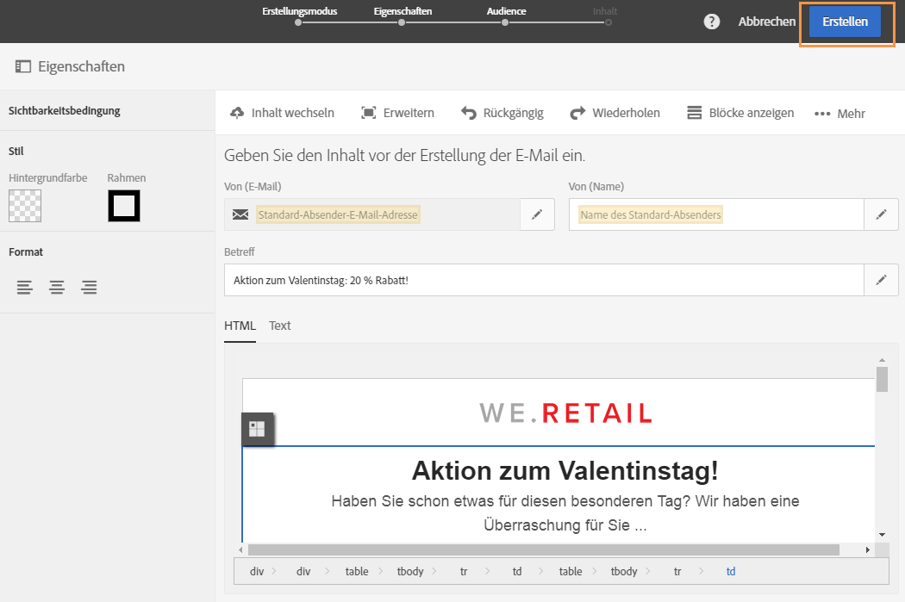
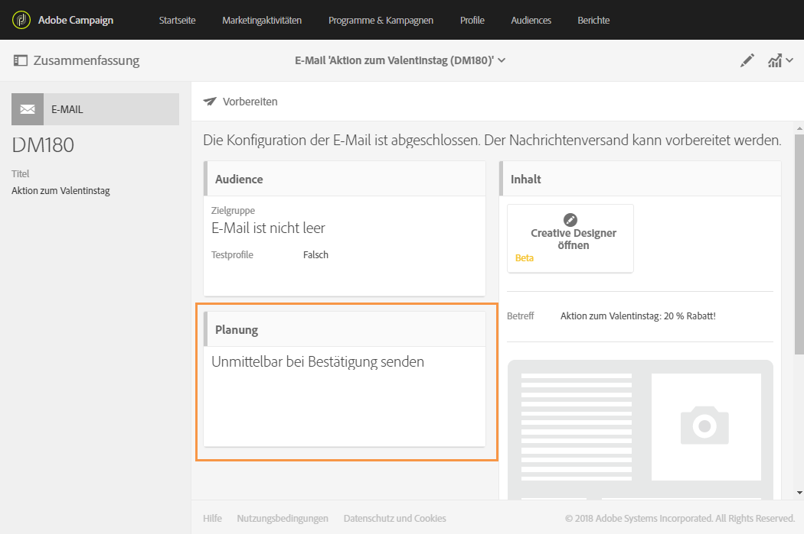
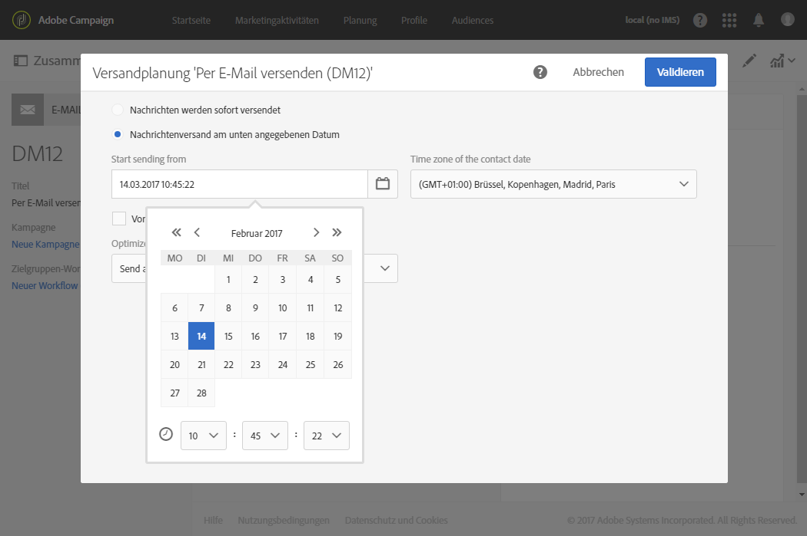
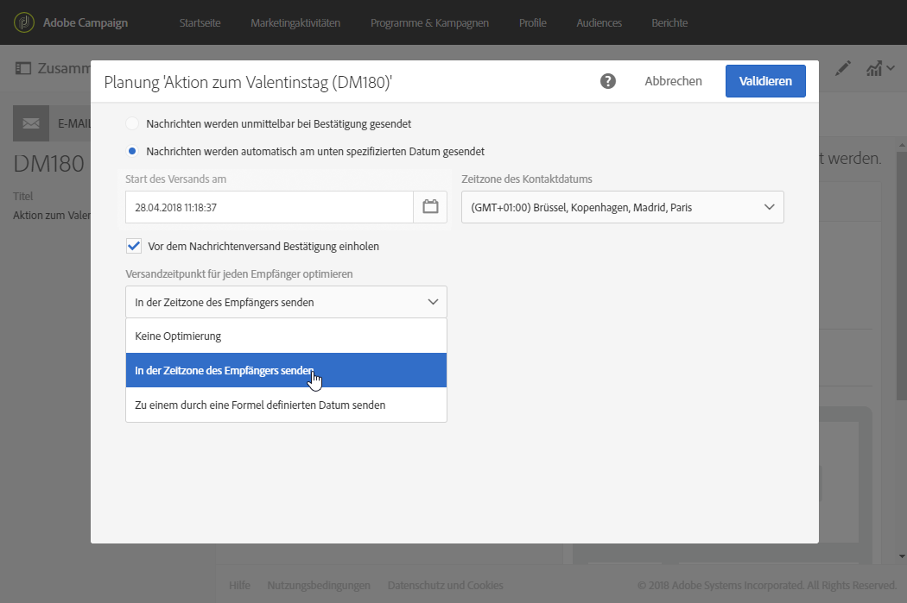

# Nachrichten in der Zeitzone des Empfängers senden{#sending-messages-at-the-recipient-s-time-zone}

Wenn bei einer Kampagne das Datum und die Uhrzeit wichtig sind, können Sie den Versand so terminieren, dass die Ortszeit eines jeden Empfängers berücksichtigt wird. Ihre Empfänger erhalten dann E-Mails, SMS-Nachrichten oder Push-Benachrichtigungen zum von Ihnen festgelegten Zeitpunkt in ihrer eigenen Zeitzone.

>[!NOTE]
>
>Um diese Funktion verwenden zu können, muss in allen von Ihrem Versand eingeschlossenen Profilen in den Eigenschaften im Bereich **[!UICONTROL Adresse]** eine Zeitzone angegeben sein. Nähere Informationen zum Zugriff auf Profileigenschaften erhalten Sie in [diesem Abschnitt](../../audiences/using/editing-profiles.md).

Zum Senden einer Nachricht in der Zeitzone des Empfängers können Sie auch die Aktivität **[!UICONTROL Planung]** in einem Workflow verwenden. Weiterführende Informationen hierzu finden Sie auf dieser [Seite](../../automating/using/scheduler.md).

Im folgenden Beispiel möchten wir allen Kunden auf der ganzen Welt einen nur am Valentinstag gültigen Gutschein-Code senden. Damit die Empfänger genügend Zeit haben, den Gutschein noch am selben Tag einzulösen, müssen sie Ihre Nachricht am 14. Februar um 8 Uhr in ihrer jeweiligen Zeitzone erhalten.

1. Beginnen Sie mit der Erstellung Ihres Versands – in unserem Fall einer E-Mail – im Tab **[!UICONTROL Marketing-Aktivitäten]**. Weiterführende Informationen zur Versanderstellung finden Sie in diesem [Abschnitt](../../channels/using/creating-an-email.md).
1. Klicken Sie nach der Erstellung Ihrer Valentinstags-E-Mail auf **[!UICONTROL Erstellen]**, um das Versand-Dashboard zu öffnen. Weiterführende Informationen zur Erstellung von E-Mails finden Sie auf dieser [Seite](../../designing/using/personalization.md#example-email-personalization).

   

1. Wählen Sie im Versand-Dashboard die Kachel **[!UICONTROL Planung]**.

   

1. Wählen Sie die Option **[!UICONTROL Nachrichtenversand am unten angegebenen Datum]** aus. Definieren Sie dann das Kontaktdatum im Feld **[!UICONTROL Start des Versands am]**, in unserem Fall den 14. Februar um 8:00 Uhr, sodass jeder Empfänger die Nachricht am Valentinstag erhält.

   

1. Wählen Sie im Feld **[!UICONTROL Zeitzone des Kontaktdatums]** aus, in welcher Zeitzone Ihr Versand standardmäßig durchgeführt werden soll.

   Wenn die **[!UICONTROL Zeitzone]** **[!UICONTROL Standard]** lautet, erhält der Empfänger die Nachricht entsprechend der hier ausgewählten Zeitzone.

1. Wählen Sie im Dropdown-Menü **[!UICONTROL Versandzeitpunkt für jeden Empfänger optimieren]** die Option **[!UICONTROL In der Zeitzone des Empfängers senden]** aus. Dadurch erhalten die Empfänger die Valentinstags-E-Mail am 14. Februar ihrer Zeitzone.

   

1. Bestätigen Sie den Zeitplan Ihres Versands und klicken Sie auf die Schaltfläche **[!UICONTROL Vorbereiten]** und danach auf **[!UICONTROL Bestätigen]**.

   Nehmen Sie die Validierung mindestens 24 Stunden vor dem Versand vor. Andernfalls könnten manche Empfänger abhängig von ihrem Standort den Versand schon vor dem Valentinstag erhalten.

   

Alle Empfänger auf der ganzen Welt erhalten daraufhin die Nachricht am 14. Februar um 8 Uhr Ortszeit.
