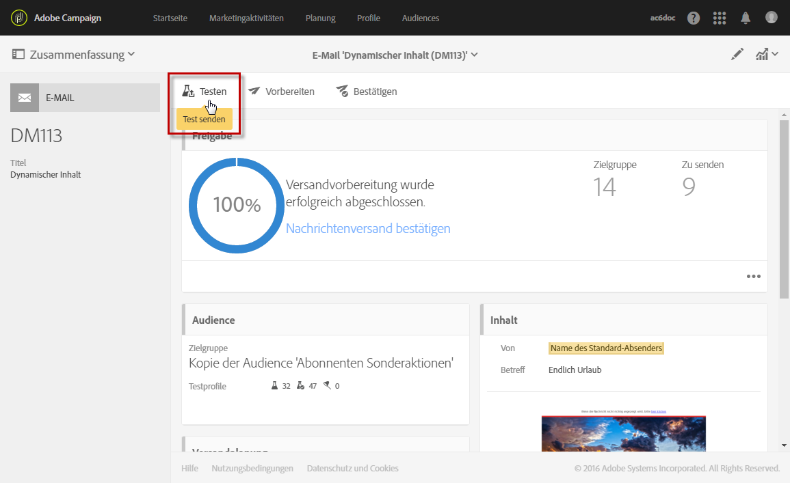
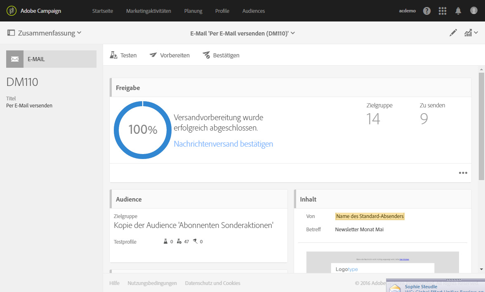
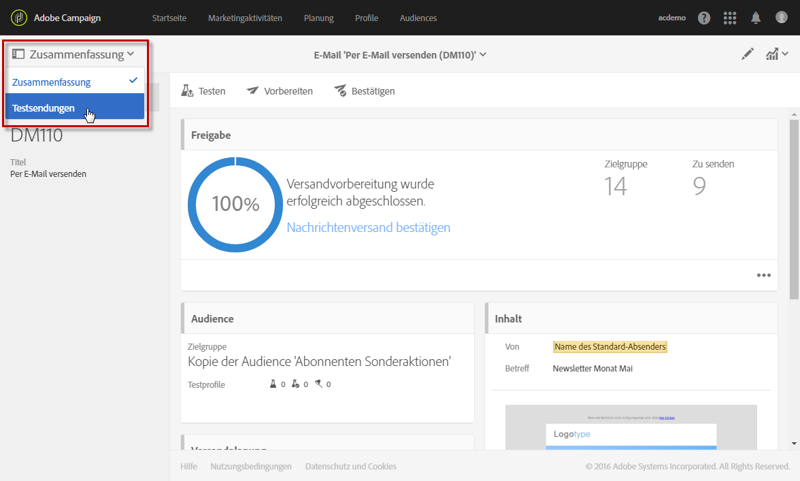
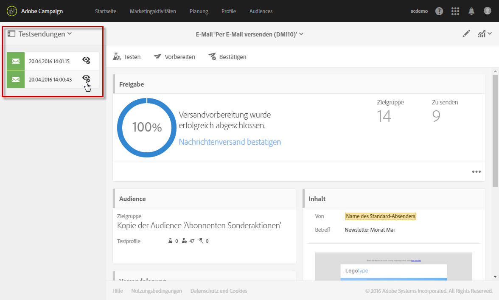
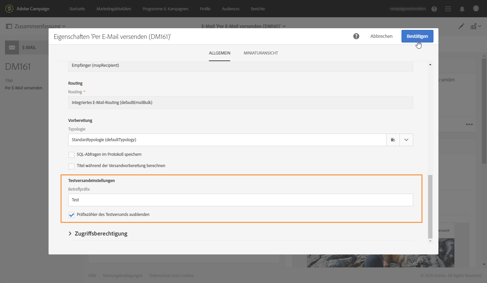

# Testversand durchführen {#sending-proofs}

## Über Testsendungen {#about-proofs}

Ein Testversand dient der Validierung einer Nachricht, bevor sie an die Hauptzielgruppe gesendet wird. Die Empfänger des Testversands haben die Aufgabe, sowohl Inhalt als auch Form der Nachricht zu validieren. 

Es gibt zwei Typen von Testversandempfängern:

* **Testprofile** ermöglichen es, zusätzliche Empfänger anzusprechen, die nicht den definierten Zielgruppenkriterien entsprechen.

  Sie können Audiences hinzugefügt werden, um beispielsweise Missbrauch bei der Nutzung Ihrer Empfängerliste aufzudecken oder den korrekten Empfang der Sendungen zu kontrollieren. Weiterführende Informationen dazu finden Sie im Abschnitt [Verwaltung von Testprofilen](../../audiences/using/managing-test-profiles.md).

  >[!NOTE]
  >
  >Um Testsendungen vornehmen zu können, muss die Audience Ihrer Nachricht mindestens ein Testprofil enthalten.

* **Ersatzprofile** ermöglichen es, sich selbst in die Position eines der angesprochenen Profile zu versetzen und eine genaue Darstellung der Nachricht zu erhalten, die das Profil empfangen wird. Weiterführende Informationen finden Sie unter [Testen von E-Mail-Nachrichten mit Zielgruppenprofilen](../../sending/using/testing-messages-using-target.md).

  >[!NOTE]
  >
  >Diese Funktion steht nur beim E-Mail-Kanal zur Verfügung.

## Durchführen eines Testversands {#sending-a-proof}

Gehen Sie wie folgt vor, um Testsendungen vorzunehmen:

1. Vergewissern Sie sich, dass die Testversandempfänger konfiguriert worden sind:
   * Die Audience Ihrer Nachricht muss **Testprofile** beinhalten.
   * Nach erfolgreicher Vorbereitung der Nachricht müssen **Ersatzprofile** hinzugefügt werden (siehe [diesen Abschnitt](../../sending/using/testing-messages-using-target.md)).

1. Klicken Sie auf die Schaltfläche **[!UICONTROL Test senden]**.

   

1. Wählen Sie die Art des Testversands aus:

   * **[!UICONTROL E-Mail-Rendering]**: Diese Option erlaubt es Ihnen, den Empfang und die Darstellung Ihrer Nachricht in den verschiedenen E-Mail-Clients zu testen. Weiterführende Informationen finden Sie im Abschnitt [E-Mail-Rendering](../../sending/using/email-rendering.md).
   * **[!UICONTROL Testversand]**: Diese Option erlaubt es Ihnen, die Nachricht vor dem Versand an die Hauptzielgruppe zu prüfen. Die Testversand-Empfänger sind verantwortlich für die Validierung des Inhalts und der Form von Sendungen.
   * **[!UICONTROL Testversand + E-Mail-Rendering]**: Diese Funktion kombiniert die beiden vorangehenden Optionen.

   

   >[!NOTE]
   >
   >E-Mail-Rendering ist nur bei Testprofilen verfügbar. Wenn der Nachricht keine Testprofile hinzugefügt wurden, lässt sich nur die Option **[!UICONTROL Testversand]** auswählen.

1. Bestätigen Sie Ihre Auswahl.

   Die Testsendungen werden an die konfigurierten Empfänger gesendet.

   

1. Abgeschickte Testsendungen können mithilfe der Dropdown-Liste **[!UICONTROL Testsendungen]** aufgerufen werden.

   

1. Wählen Sie einen Testversand aus, um seine Zusammenfassung anzuzeigen. Wenn Sie sich bei der Auswahl des Testversands einer E-Mail für die Option **E-Mail-Rendering** entschieden haben, können Sie über das Symbol **[!UICONTROL Zugriff auf das E-Mail-Rendering]** rechts vom Testversandtitel auf das Ergebnis zugreifen. Siehe [E-Mail-Rendering](../../sending/using/email-rendering.md).

   

Nach Prüfung des Testversands durch die Testprofile sind gegebenenfalls Änderungen im Versandinhalt und seiner Form vorzunehmen. Nach jeder Änderung ist der Versand erneut vorzubereiten. Es empfiehlt sich außerdem, einen neuen Testversand zu erzeugen. Alle neuen Testsendungen können ebenfalls mithilfe der Schaltfläche **[!UICONTROL Testsendungen anzeigen]** aufgerufen werden.

Senden Sie so viele Testsendungen wie nötig sind, um zu einer endgültigen Version des Nachrichteninhalts zu gelangen. Danach können Sie den Versand an die Hauptzielgruppe senden und den Validierungszyklus beenden.

## Konfigurieren der Betreffzeile für Testsendungen {#configuring-proofs-subject-line}

Beim Durchführen eines Testversands wird die Betreffzeile standardmäßig mit dem Präfix **„Testversand“** und einem Zähler konfiguriert, der Auskunft über die Nummer des Testversands gibt.

Gehen Sie wie folgt vor, um die zu verwendende Standardbetreffzeile zu ändern:

1. Klicken Sie im Nachrichten-Dashboard auf die Schaltfläche **[!UICONTROL Eigenschaften öffnen]**.
1. Definieren Sie im Abschnitt **[!UICONTROL Erweiterte Parameter]** das Präfix, das Sie standardmäßig in der Betreffzeile verwenden möchten.

Wenn Sie die Nummer des Testversands in der Betreffzeile ausblenden möchten, aktivieren Sie die Option **[!UICONTROL Präfixzähler des Testversands ausblenden]**.

>[!NOTE]
>
>Wenn Sie das gesamte Präfix des Testversands ausblenden möchten, lassen Sie das Feld **[!UICONTROL Betreffpräfix]** leer.

1. Wählen Sie **[!UICONTROL Bestätigen]** aus. Die Einstellungen werden standardmäßig auf alle Testsendungen angewendet, die für die jeweilige Nachricht gesendet werden.

**Verwandtes Thema:**

* Video [Sending a test, preparing and sending an email](../../sending/using/get-started-sending-messages.md#video)
* [Testen von E-Mail-Nachrichten mit Zielgruppenprofilen](../../sending/using/testing-messages-using-target.md)
* [Verwaltung von Testprofilen](../../audiences/using/managing-test-profiles.md)
* [Vorschau der Nachricht erzeugen](../../sending/using/previewing-messages.md)
* [E-Mail-Kanal konfigurieren](../../administration/using/configuring-email-channel.md)
