# Testen von E-Mail-Nachrichten mit Zielgruppenprofilen {#testing-message-profiles}

## Übersicht {#overview}

Zusätzlich zu [Testprofilen](../../audiences/using/managing-test-profiles.md) können Sie auch eine E-Mail-Nachricht testen, indem Sie sich in die Position eines der Zielgruppenprofile versetzen. So erhalten Sie eine genaue Darstellung der Nachricht, die das Profil empfangen wird (benutzerdefinierte Felder, dynamische und personalisierte Informationen, einschließlich zusätzlicher Daten von Workflows usw.).

>[!IMPORTANT]
>
>Mit dieser Funktion können Sie personenbezogene Daten des Profils an externe E-Mail-Adressen senden. Beachten Sie, dass eine Ausführung von Datenschutzanfragen (DSGVO und CCPA) in Campaign Standard NICHT zu einer externen Ausführung der Anfrage führen wird.

Die wichtigsten Schritte sind:

1. Konfigurieren Sie Ihre Nachricht und starten Sie dann die **Vorbereitungsphase**.
1. **Wählen Sie eines oder mehrere Profile** aus den Profilen aus, die zur Zielgruppe der Nachricht gehören.
1. Weisen Sie jedem Profil eine **Ersatzadresse** zu, an die Testsendungen gesendet werden sollen.
1. (Optional) Definieren Sie für jedes Profil ein **Präfix**, das der Betreffzeile des Testversands hinzugefügt werden soll.
1. Nutzen Sie die **Vorschau** in Email Designer, um zu ermitteln, wie die Nachricht für die Profile angezeigt wird.
1. Versenden Sie die Testsendungen.

   >[!IMPORTANT]
   >
   >Die Testsendungen werden von [!DNL Campaign Standard] als Standardlieferungen verarbeitet. Daher werden durch den Versand von Testsendungen mithilfe der Profilersetzung den Versand- und Trackinglogs der ausgewählten Profile Datensätze hinzugefügt.

 [Entdecken Sie diese Funktion im Video](#video).

## Auswählen von Profilen und Ersatzadressen {#selecting-profiles}

Um Zielgruppenprofile zum Testen zu verwenden, müssen Sie diese zunächst auswählen und dann die Ersatzadressen definieren, an die die Testsendungen gesendet werden sollen. Dazu können Sie entweder aus den Zielgruppenprofilen [spezifische Profile auswählen](#selecting-individual-profiles) oder [Profile aus einer vorhandenen Audience importieren](#importing-from-audience).

>[!NOTE]
>
>Sie können maximal 100 Profile zum Testen auswählen.

### Auswählen einzelner Profile {#selecting-individual-profiles}

1. Vergewissern Sie sich im Nachrichten-Dashboard, dass die Nachrichtenvorbereitung erfolgreich war, und klicken Sie dann auf den **[!UICONTROL Audience]**-Bereich.

   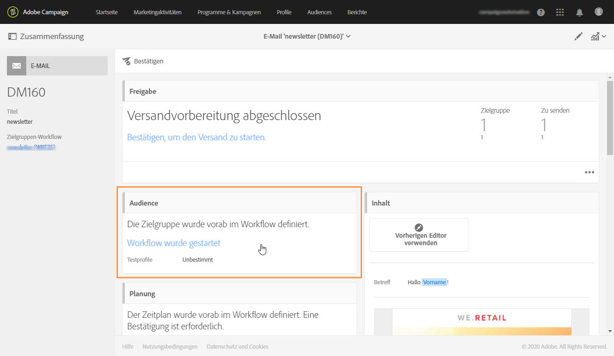

1. Klicken Sie auf dem Tab **[!UICONTROL Profilersetzungen]** auf die Schaltfläche **[!UICONTROL Element erstellen]**, um die Profile für den Test auszuwählen.

   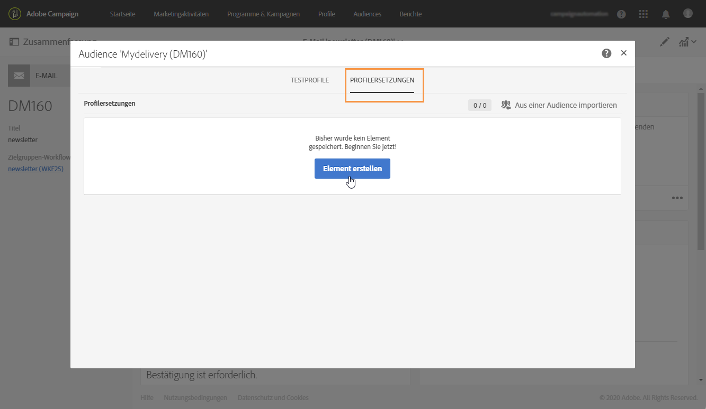

1. Klicken Sie auf die Schaltfläche zur Profilauswahl, um die Liste der Profile anzuzeigen, die zur Zielgruppe der Nachricht gehören.

   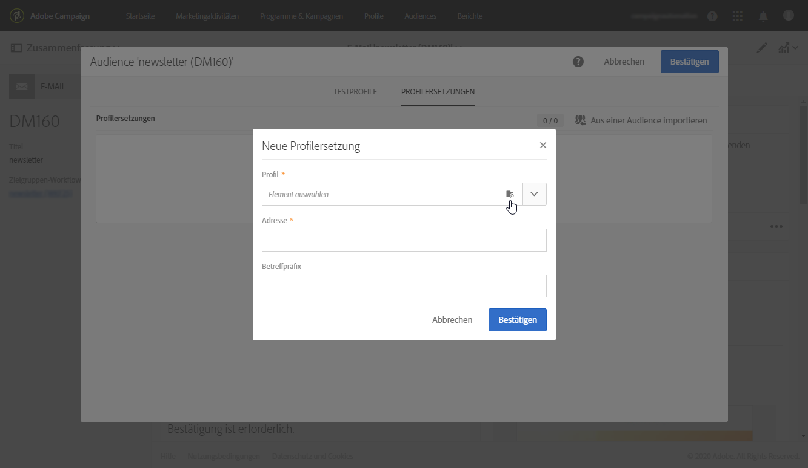

1. Wählen Sie das Profil aus, das für den Test verwendet werden soll, geben Sie im Feld **[!UICONTROL Adresse]** die gewünschte Ersatzadresse ein und klicken Sie dann auf **[!UICONTROL Bestätigen]**. Alle Testsendungen, bei denen das Profil zur Zielgruppe gehört, werden an diese E-Mail-Adresse gesendet und nicht an die in der Datenbank für das Profil definierte Adresse.

   Wenn Sie der Betreffzeile von Testsendungen ein bestimmtes Präfix hinzufügen möchten, füllen Sie das Feld **[!UICONTROL Betreffpräfix]** aus.

   >[!NOTE]
   >
   >Das Betreffpräfix kann bis zu 500 Zeichen lang sein.

   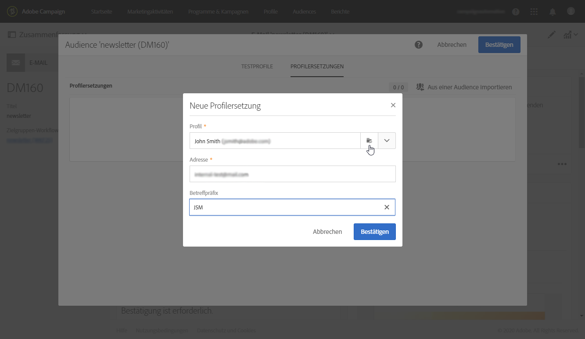

   Das Präfix wird wie folgt angezeigt:

   

1. Das Profil wird der Liste mit der entsprechenden Ersatzadresse und dem dazugehörigen Präfix hinzugefügt. Wiederholen Sie die obigen Schritte für alle Profile, die Sie zum Testen verwenden möchten, und klicken Sie dann auf **[!UICONTROL Bestätigen]**.

   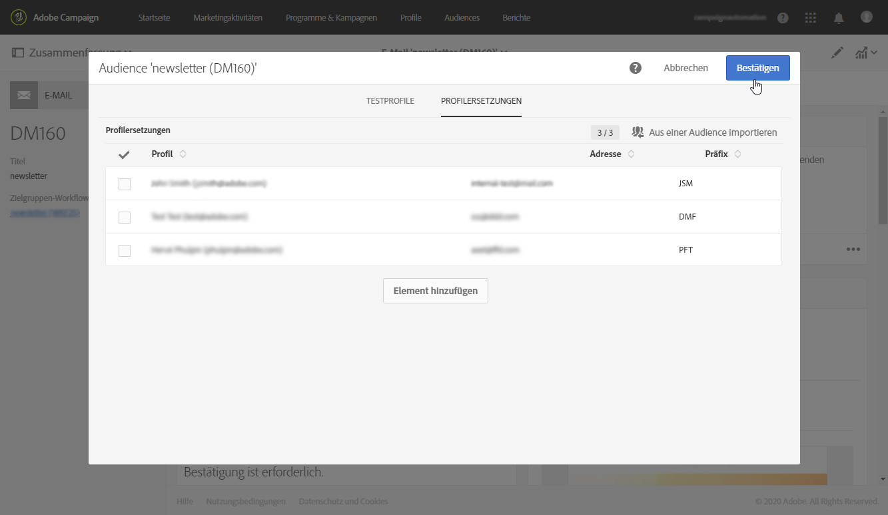

   Wenn Sie einen Testversand für dasselbe Profil an verschiedene Ersatzadressen senden möchten, müssen Sie dieses Profil so oft wie erforderlich hinzufügen.

   Im folgenden Beispiel wird der Testversand, der auf dem Profil „John Smith“ basiert, an zwei verschiedene Ersatzadressen gesendet:

   

1. Sobald alle Profile und Ersatzadressen definiert sind, können Sie einen Testversand durchführen, um die Nachricht zu testen. Klicken Sie dazu auf die Schaltfläche **[!UICONTROL Testen]** und wählen Sie den gewünschten Testtyp aus.

   Beachten Sie, dass die Optionen **[!UICONTROL E-Mail-Rendering]** und **[!UICONTROL Testversand + E-Mail-Rendering]** nicht verfügbar sind, wenn der Zielgruppe der Nachricht kein Testprofil hinzugefügt wurde.  Weiterführende Informationen zum Durchführen eines Testversands finden Sie in [diesem Abschnitt](../../sending/using/sending-proofs.md).

   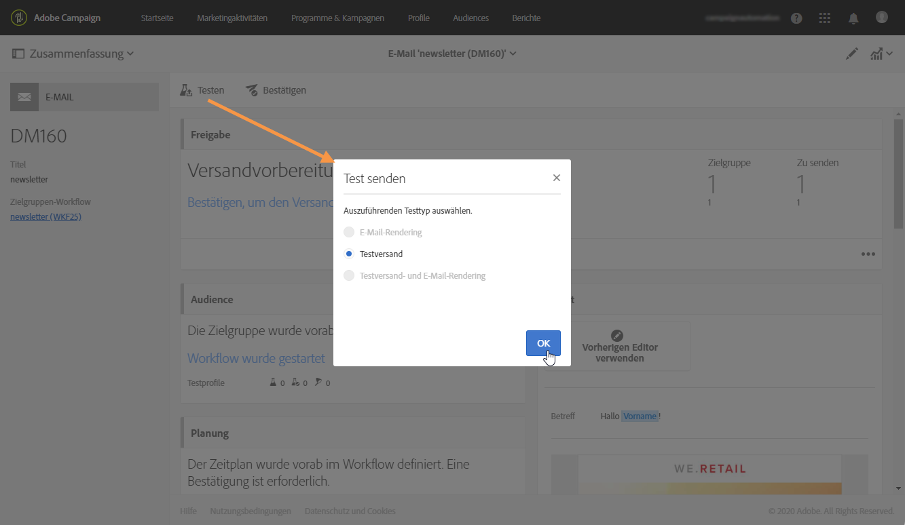

>[!IMPORTANT]
>
>Wenn Sie Änderungen an Ihrer Nachricht vornehmen, stellen Sie sicher, dass Sie die Nachrichtenvorbereitung erneut starten. Andernfalls werden die Änderungen im Testversand nicht übernommen.

### Importieren von Profilen aus einer Audience {#importing-from-audience}

Campaign Standard ermöglicht den Import einer Audience mit Profilen, die Sie zum Testen verwenden können. So können Sie beispielsweise mehrere Nachrichten, die sich an verschiedene Profile richten, an eine einzige E-Mail-Adresse senden.

Wenn Ihre Audience bereits mit den Spalten „Adresse“ und „Präfix“ konfiguriert ist, können Sie diese Informationen auf dem Tab **[!UICONTROL Profilersetzungen]** auch importieren. Ein Beispiel für den Import einer Audience mit Ersatzadressen finden Sie in [diesem Abschnitt](#use-case).

>[!NOTE]
>
>Beim Importieren einer Audience werden nur die Profile, die der Zielgruppe der Nachricht entsprechen, ausgewählt und zum Tab **[!UICONTROL Profilersetzungen]** hinzugefügt.

Gehen Sie wie folgt vor, um Profile, die zum Testen einer Audience verwendet werden sollen, zu importieren:

1. Vergewissern Sie sich im Nachrichten-Dashboard, dass die Nachrichtenvorbereitung erfolgreich war, und klicken Sie dann auf den **[!UICONTROL Audience]**-Bereich.

   

1. Klicken Sie auf dem Tab **[!UICONTROL Profilersetzungen]** auf **[!UICONTROL Aus einer Audience importieren]**.

   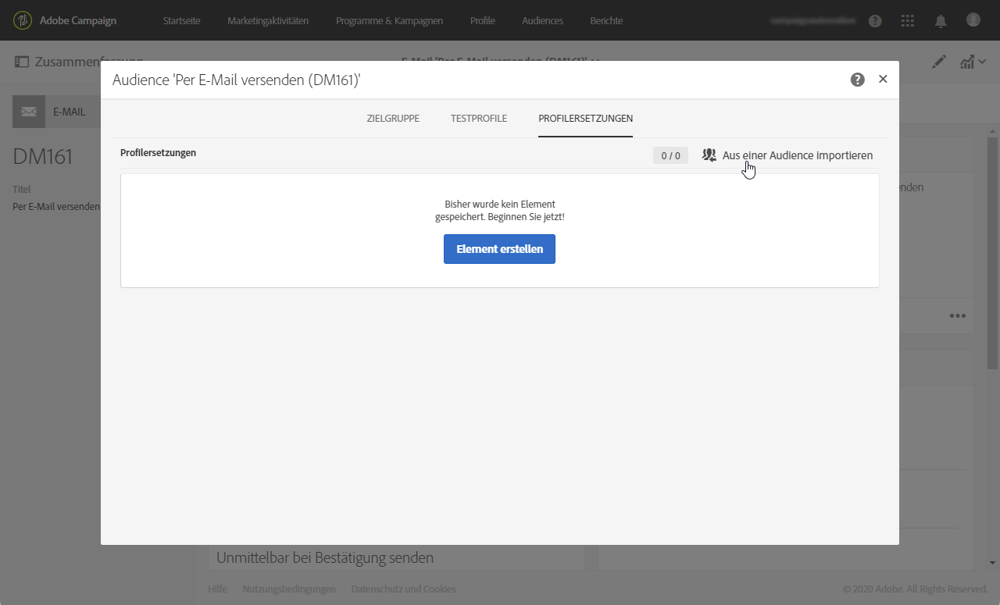

1. Wählen Sie die zu verwendende Audience aus und geben Sie dann die Ersatzadresse und das Präfix ein, die für die an die Audience gesendeten Testsendungen verwendet werden sollen.

   >[!NOTE]
   >
   >Das Betreffpräfix kann bis zu 500 Zeichen lang sein.

   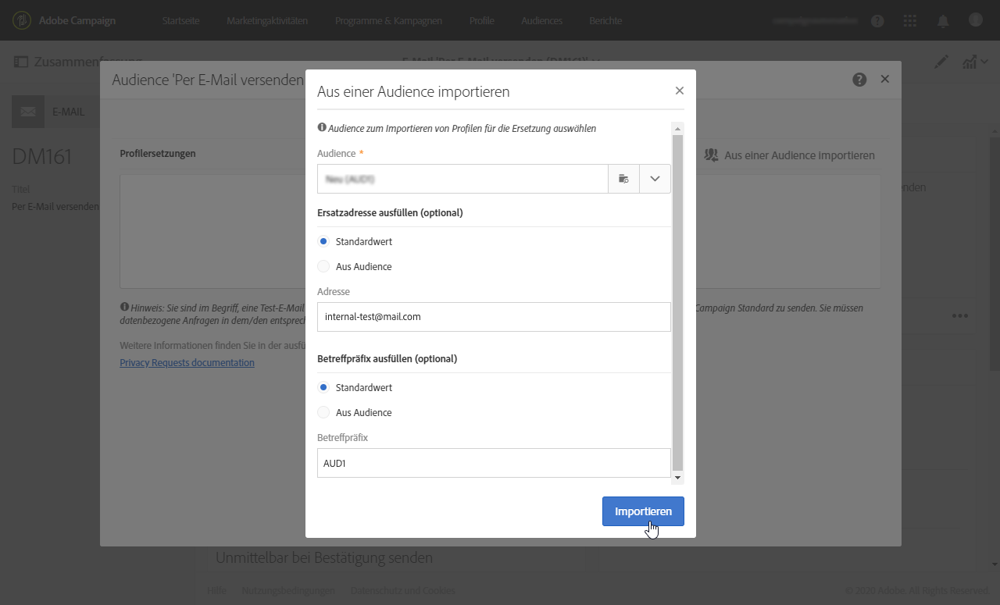

   Wenn die zu verwendenden Ersatzadressen und/oder Präfixe in Ihrer Audience bereits definiert wurden, wählen Sie die Option **[!UICONTROL Aus Audience]** und geben Sie dann die Spalte an, die zum Abrufen der Informationen verwendet werden soll.

   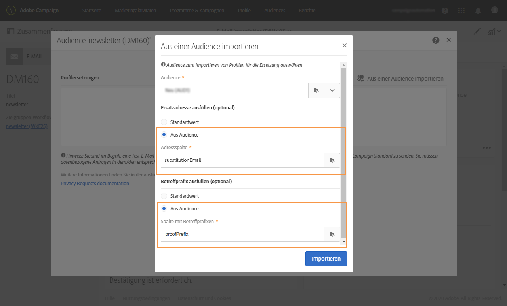

1. Klicken Sie auf die Schaltfläche **[!UICONTROL Importieren]**. Die Profile aus der Audience, die der Zielgruppe der Nachricht entsprechen, werden dem Tab **[!UICONTROL Profilersetzungen]** hinzugefügt. Das Gleiche gilt für die zugehörigen Ersatzadressen und Präfixe.

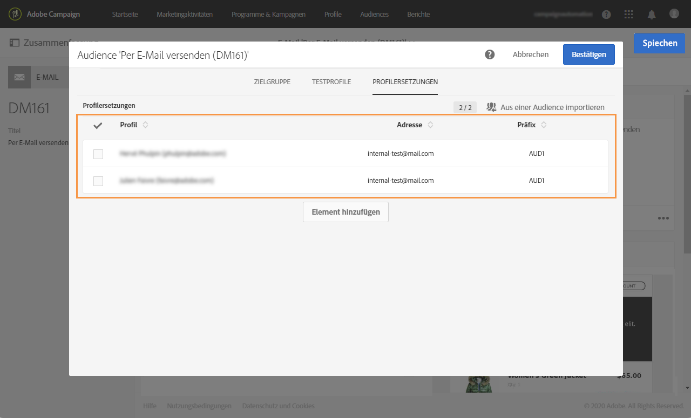

>[!NOTE]
>
>Wenn Sie die gleiche Audience mit unterschiedlichen Ersatzadressen und/oder Präfixen erneut importieren, werden die Profile zusätzlich zu den Profilen aus dem vorherigen Import der Liste hinzugefügt.

## Anzeigen einer Vorschau der Nachricht mit Zielgruppenprofilen

>[!NOTE]
>
>Eine Vorschau ist nur mit Email Designer möglich.

Um mit Zielgruppenprofilen eine Vorschau von Nachrichten anzeigen zu können, müssen Sie diese Profile der Liste mit den **[!UICONTROL Profilersetzungen]** hinzugefügt haben (siehe [Definieren von Profilen und Ersatzadressen](#selecting-profiles)).

Wenn Sie in der Nachricht Personalisierungsfelder verwenden möchten, müssen Sie diese hinzufügen, **bevor** Sie die Nachrichtenvorbereitung starten. Andernfalls werden sie in der Vorschau nicht berücksichtigt. Stellen Sie also sicher, dass Sie die Nachrichtenvorbereitung erneut starten, sollten Sie an den Personalisierungsfeldern Änderungen vorgenommen haben.

Gehen Sie wie folgt vor, um Nachrichten bei Verwendung von Profilersetzungen als Vorschau anzuzeigen:

1. Klicken Sie im Nachrichten-Dashboard auf den Inhalts-Snapshot, um die Nachricht in Email Designer zu öffnen.

   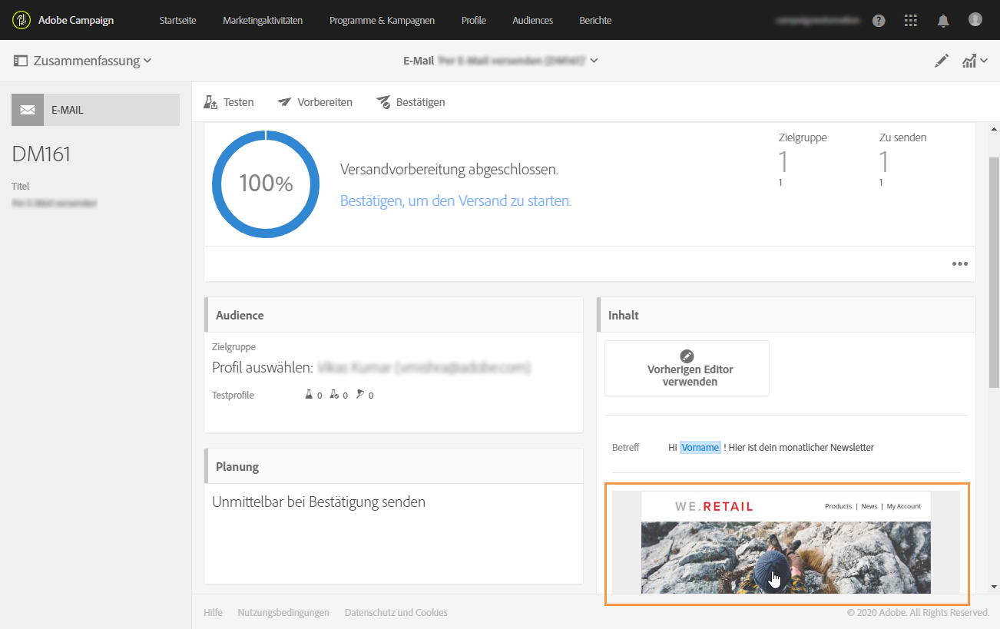

1. Wählen Sie den Tab **[!UICONTROL Vorschau]** und klicken Sie dann auf **[!UICONTROL Profil wechseln]**.

   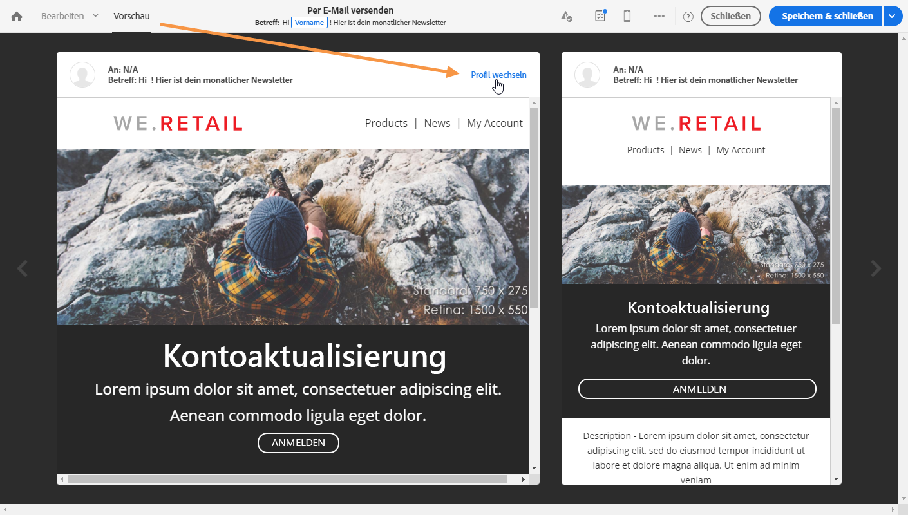

1. Klicken Sie auf den Tab **[!UICONTROL Profilersetzungen]**, um die zu Testzwecken hinzugefügten Ersatzprofile anzuzeigen.

   Wählen Sie die Profile aus, die Sie für die Vorschau verwenden möchten, und klicken Sie dann auf **[!UICONTROL Auswählen]**.

   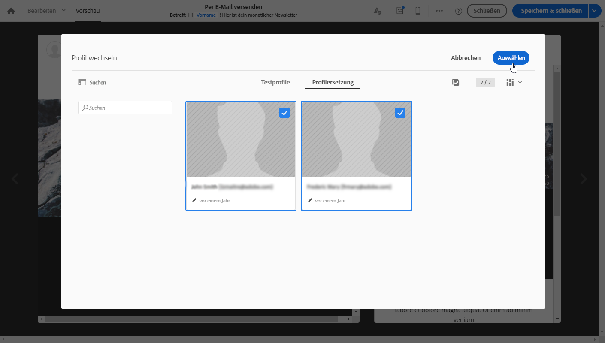

1. Eine Vorschau der Nachricht wird angezeigt. Verwenden Sie die Pfeile, um zwischen den ausgewählten Profilen zu navigieren.

   

## Anwendungsbeispiel {#use-case}

In diesem Beispiel möchten wir einen personalisierten E-Mail-Newsletter an bestimmte Profile senden. Vor dem Versand des Newsletters möchten wir ihn mit einigen der Zielgruppenprofile als Vorschau anzeigen und einen Testversand an interne E-Mail-Adressen durchführen, die in einer externen Datei definiert sind.

Die Umsetzung des Anwendungsbeispiels gliedert sich in folgende Schritte:

1. Erstellen Sie die Audience, die zum Testen verwendet werden soll.
1. Richten Sie einen Workflow ein, um Profile in die Zielgruppe aufzunehmen und den Newsletter zu senden.
1. Konfigurieren Sie die Profilersetzungen der Nachricht.
1. Zeigen Sie eine Vorschau der Nachricht mit Zielgruppenprofilen an.
1. Führen Sie einen Testversand durch.

### Schritt 1: Audience für Testzwecke erstellen

1. Bereiten Sie die zu importierende Datei vor, um die Audience zu erstellen. In unserem Beispiel sollte sie die für den Testversand zu verwendende Ersatzadresse und ein Präfix enthalten, das der Betreffzeile des Testversands hinzugefügt wird.

   In diesem Fall erhält die E-Mail-Adresse „oliver.vaughan@internal.com“ einen Testversand der Nachricht, die an das Profil mit der E-Mail-Adresse „john.doe@mail.com“ gesendet wird. Der Betreffzeile des Testversands wird das Präfix „JD“ hinzugefügt.

   

1. Richten Sie den Workflow ein, um eine Audience aus der Datei zu erstellen. Fügen Sie dazu die folgenden Aktivitäten hinzu und konfigurieren Sie sie:

   * Aktivität **[!UICONTROL Datei laden]**: Importiert die CSV-Datei (weitere Informationen zu dieser Aktivität finden Sie in [diesem Abschnitt](../../automating/using/load-file.md)).
   * Aktivität **[!UICONTROL Abstimmung]**: Verknüpft Informationen aus der Datei mit Informationen aus der Datenbank. In diesem Beispiel verwenden wir die E-Mail-Adresse des Profils als Abstimmungsfeld (weitere Informationen zu dieser Aktivität finden Sie in [diesem Abschnitt](../../automating/using/reconciliation.md)).
   * Aktivität **[!UICONTROL Audience-Speicherung]**: Erstellt eine Audience basierend auf der importierten Datei (weitere Informationen zu dieser Aktivität finden Sie in [diesem Abschnitt](../../automating/using/save-audience.md)).

   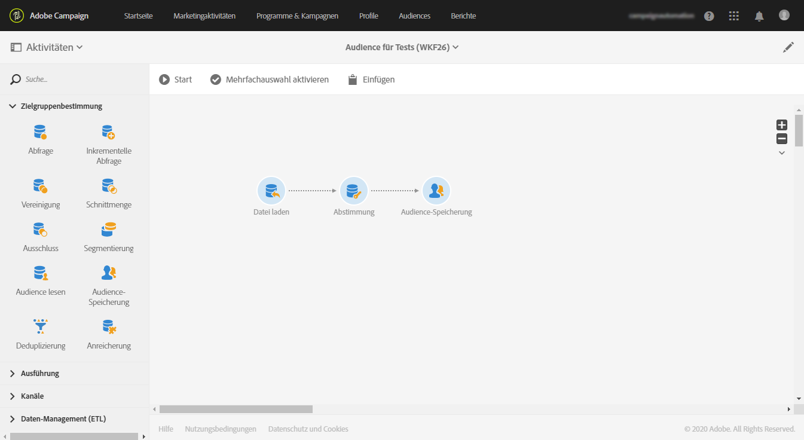

1. Führen Sie den Workflow aus und klicken Sie dann auf den Tab **[!UICONTROL Audiences]**, um zu überprüfen, ob die Audience mit den gewünschten Informationen erstellt wurde.

   In diesem Beispiel besteht die Audience aus drei Profilen. Jedes der Profile ist mit einer Ersatz-E-Mail-Adresse verknüpft, die den Testversand erhalten wird, inklusive eines Präfixes, das im Betreff des Testversands verwendet wird.

   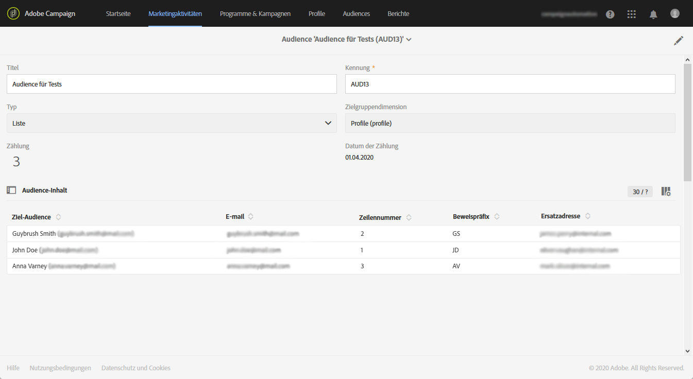

### Schritt 2: Einen Workflow zum Auswählen von Profilen und Senden des Newsletters erstellen

1. Fügen Sie die Aktivitäten **[!UICONTROL Abfrage]** und **[!UICONTROL E-Mail-Versand]** hinzu und konfigurieren Sie sie entsprechend Ihren Anforderungen (siehe Abschnitte [Abfrage](../../automating/using/query.md) und [E-Mail-Versand](../../automating/using/email-delivery.md)).

   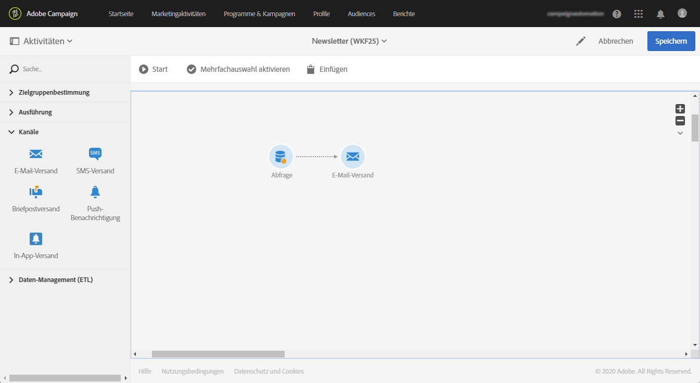

1. Führen Sie den Workflow aus und vergewissern Sie sich, dass die Nachrichtenvorbereitung erfolgreich war.

### Schritt 3: Tab zur Profilersetzung der Nachricht konfigurieren

1. Öffnen Sie die Aktivität **[!UICONTROL E-Mail-Versand]**. Klicken Sie im Nachrichten-Dashboard auf den Bereich **[!UICONTROL Audiences]**.

   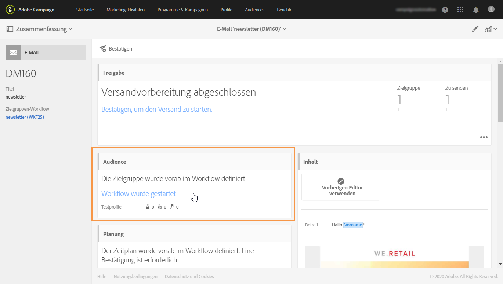

1. Wählen Sie den Tab **[!UICONTROL Profilersetzungen]** und klicken Sie dann auf **[!UICONTROL Aus einer Audience importieren]**.

   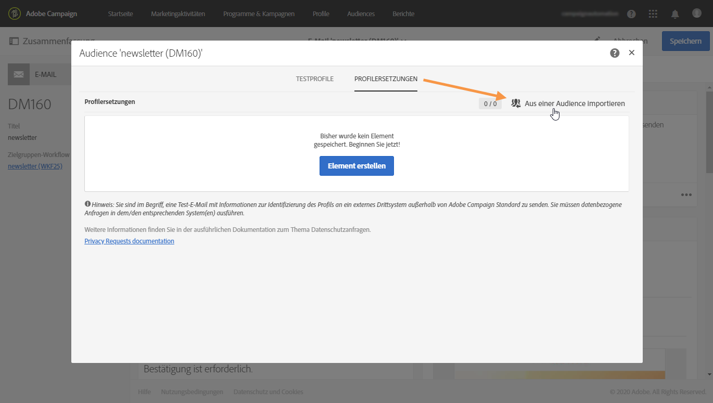

1. Wählen Sie im Feld **[!UICONTROL Audience]** die aus der Datei erstellte Audience aus.

   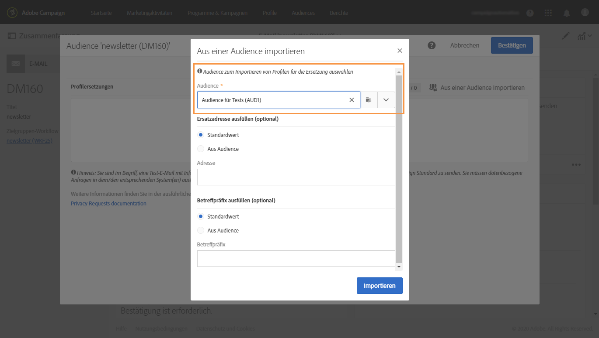

1. Definieren Sie die Ersatzadresse und das Betreffpräfix, die beim Senden der Testsendungen verwendet werden sollen.

   Wählen Sie dazu die Option **[!UICONTROL Aus Audience]** und dann die Spalte aus der Audience, die die Informationen enthält.

   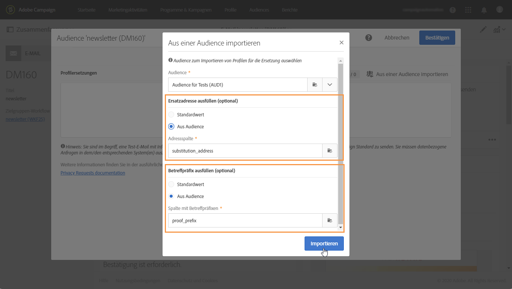

1. Wählen Sie die Schaltfläche **[!UICONTROL Importieren]**. Profile aus der Audience werden der Liste zusammen mit den zugehörigen Ersatzadressen und den Betreffpräfixen hinzugefügt.

   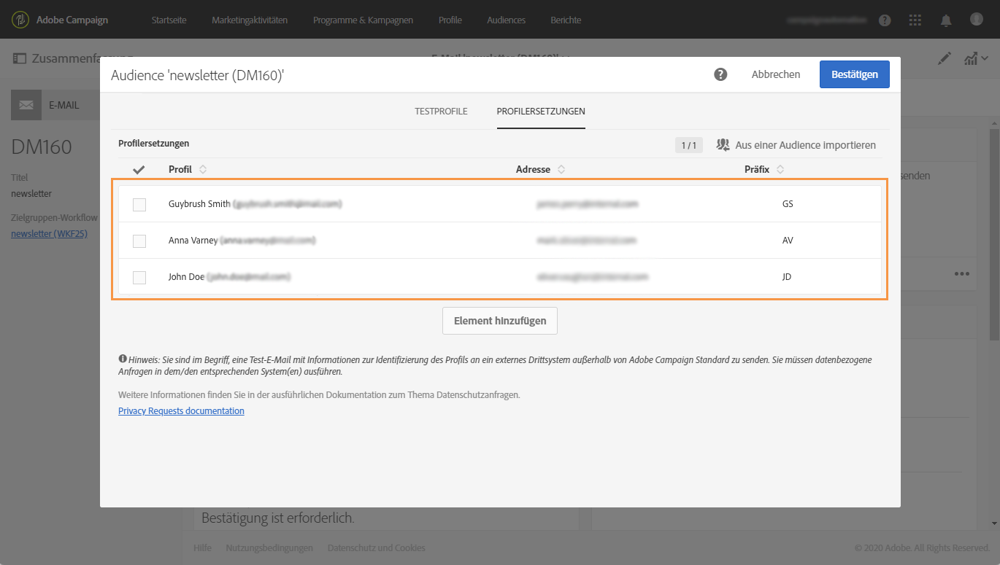

   >[!NOTE]
   >
   >In unserem Beispiel richtet sich die Aktivität **[!UICONTROL Abfrage]** an alle Profile der Audience. Wenn eines der Profile nicht zur Zielgruppe der Nachricht gehörte, wäre es nicht zur Liste hinzugefügt worden.

### Schritt 4: Vorschau der Nachricht mit Zielgruppenprofilen anzeigen

1. Klicken Sie im Nachrichten-Dashboard auf den Inhalts-Snapshot, um die Nachricht in Email Designer zu öffnen.

   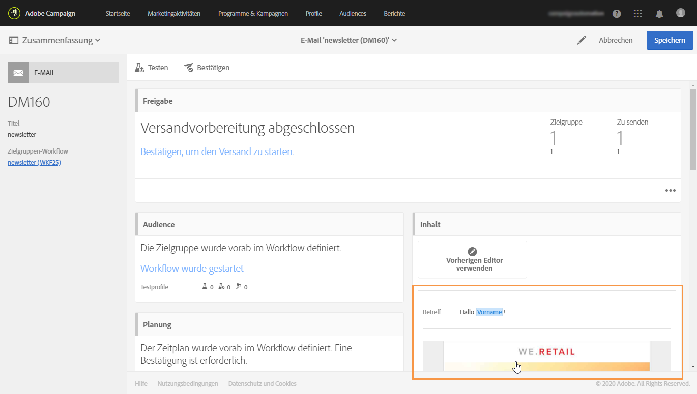

1. Wählen Sie den Tab **[!UICONTROL Vorschau]** und klicken Sie dann auf **[!UICONTROL Profil wechseln]**.

   

1. Klicken Sie auf den Tab **[!UICONTROL Profilersetzungen]**, um die zuvor hinzugefügten Ersatzprofile anzuzeigen.

   Wählen Sie die Profile aus, die Sie für die Vorschau verwenden möchten, und klicken Sie dann auf **[!UICONTROL Auswählen]**.

   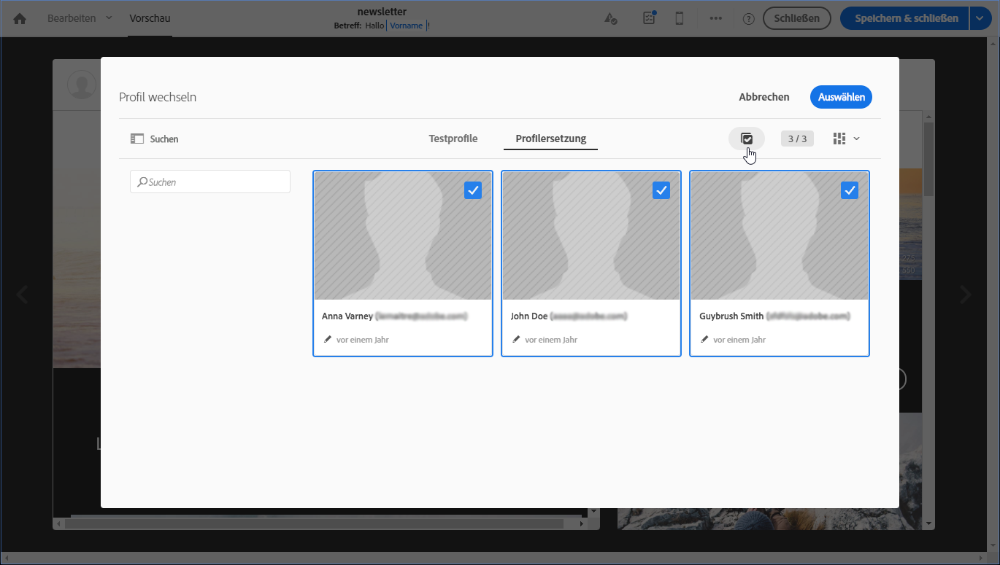

1. Eine Vorschau der Nachricht wird angezeigt. Verwenden Sie die Pfeile, um zwischen den ausgewählten Profilen zu navigieren.

   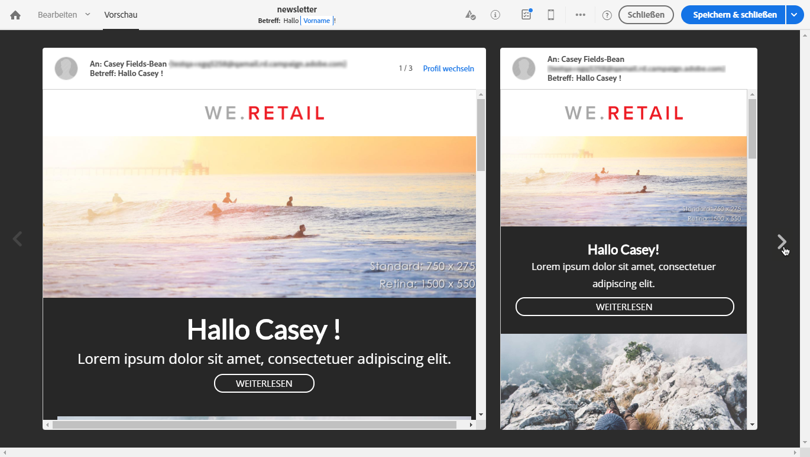

### Schritt 5: Testsendungen durchführen

1. Klicken Sie im Nachrichten-Dashboard auf die Schaltfläche **[!UICONTROL Testen]** und bestätigen Sie dann den Vorgang.

   

1. Die Testsendungen werden entsprechend der Konfiguration auf dem Tab **[!UICONTROL Profilersetzungen]** gesendet.

   

## Anleitungsvideo {#video}

In diesem Video wird gezeigt, wie Sie Ihre E-Mail-Nachrichten mithilfe der Profilersetzung testen können.

>[!VIDEO](https://video.tv.adobe.com/v/32368?quality=12)

Weitere Anleitungsvideos zu Campaign Standard finden Sie [hier](https://experienceleague.adobe.com/docs/campaign-standard-learn/tutorials/overview.html?lang=de).
