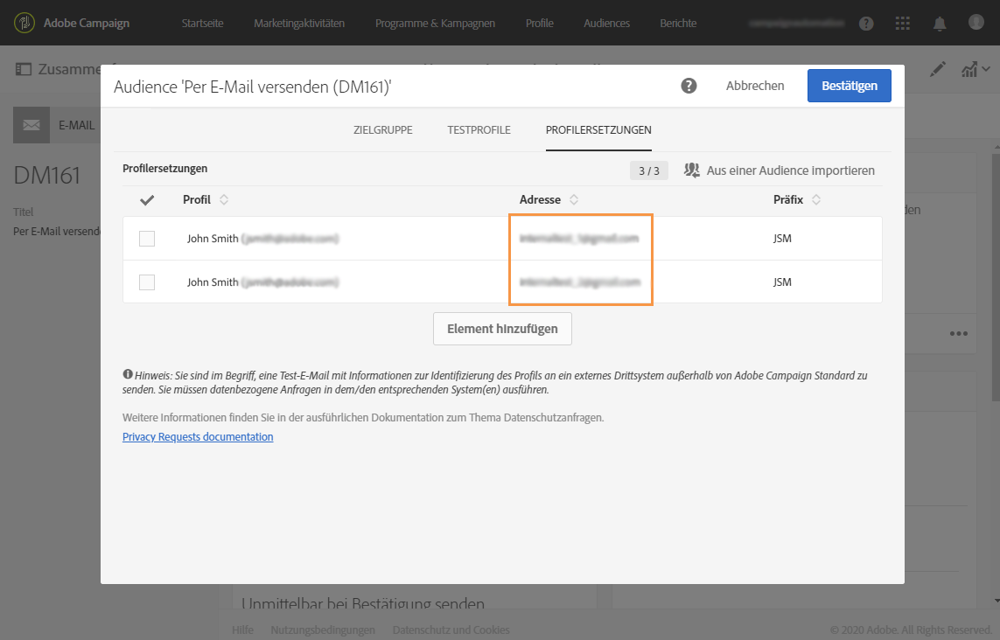
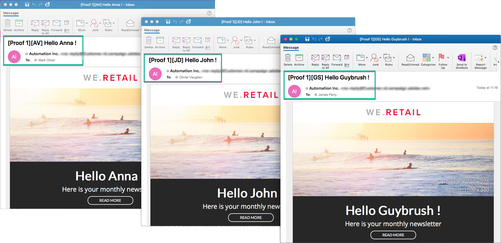

# Testen von E-Mail-Nachrichten mit zielgerichteten Profilen {#testing-message-profiles}

## Übersicht {#overview}

Zusätzlich zum [Testen von Profilen](../../audiences/using/managing-test-profiles.md)können Sie eine E-Mail-Nachricht testen, indem Sie sich in die Position eines der zielgerichteten Profil setzen. Auf diese Weise erhalten Sie eine genaue Darstellung der Meldung, die das Profil erhält (benutzerdefinierte Felder, dynamische und personalisierte Informationen, einschließlich zusätzlicher Daten von Workflows...).

>[!NOTE]
>
> Diese Funktion ist nur für E-Mail-Nachrichten verfügbar.

Die wichtigsten Schritte sind:

1. Konfigurieren Sie Ihre Nachricht und starten Sie dann die **Vorbereitungsphase** .
1. **Wählen Sie eines oder mehrere Profil** unter den Profilen aus, auf die die Nachricht abzielt.
1. Weisen Sie jedem Profil eine **Ersatzadresse** zu, an die Testversand gesendet werden.
1. (Optional) Definieren Sie für jedes Profil ein **Präfix** , das der Betreffzeile des Testversands hinzugefügt werden soll.
1. **Vorschau** im E-Mail-Designer, wie die Nachricht für die Profil angezeigt wird.
1. Schicken Sie die Testversände.

>[!IMPORTANT]
>
>Mit dieser Funktion können Sie personenbezogene Daten des Profils an externe E-Mail-Adressen senden. Beachten Sie, dass die Ausführung von Datenschutzanforderungen (GDPR &amp; CCPA) in Campaign Standard diese Anforderung nicht extern ausführen wird.

## Auswählen von Profilen und Ersetzungsadressen {#selecting-profiles}

Um zielgerichtete Profil zum Testen zu verwenden, müssen Sie diese zuerst auswählen und dann die Ersatzadressen definieren, an die die Testversand gesendet werden. Dazu können Sie entweder spezifische Profil [unter den zielgerichteten Profilen](#selecting-individual-profiles) auswählen oder Profil aus einer vorhandenen Audience importieren.

>[!NOTE]
>
>Sie können maximal 100 Profil zum Testen auswählen.

### Auswählen einzelner Profil {#selecting-individual-profiles}

1. Vergewissern Sie sich im Dashboard message, dass die Meldungsvorbereitung erfolgreich war, und klicken Sie dann auf den **[!UICONTROL Audience]** Block.

   

1. Klicken Sie auf der **[!UICONTROL Profile substitutions]** Registerkarte auf die **[!UICONTROL Create element]** Schaltfläche, um die zu testenden Profil auszuwählen.

   

1. Klicken Sie auf die Schaltfläche zur Auswahl des Profils, um die Liste der Profil anzuzeigen, auf die die Nachricht ausgerichtet ist.

   

1. Wählen Sie das zu testende Profil aus, geben Sie dann in das **[!UICONTROL Address]** Feld die gewünschte Ersetzungsadresse ein und klicken Sie dann auf **[!UICONTROL Confirm]**. Alle Testversand, die auf das Profil abzielen, werden an diese E-Mail-Adresse gesendet und nicht an die in der Datenbank für dieses Profil definierte.

   Wenn Sie der Betreffzeile des Testversands ein bestimmtes Präfix hinzufügen möchten, füllen Sie das **[!UICONTROL Subject line prefix]** Feld aus.

   

   Das Präfix wird wie folgt angezeigt:

   

1. Das Profil wird der Liste mit der zugehörigen Ersetzungsadresse und dem dazugehörigen Präfix hinzugefügt. Wiederholen Sie die obigen Schritte für alle Profil, die Sie zum Testen verwenden möchten, und klicken Sie dann auf **[!UICONTROL Confirm]**.

   

   Wenn Sie einen Testversand für dasselbe Profil an mehrere Ersetzungsadressen senden möchten, müssen Sie dieses Profil so oft wie erforderlich hinzufügen.

   Im unten stehenden Beispiel wird der Testversand, der auf dem Profil John Smith basiert, an zwei verschiedene Substitutionsadressen gesendet:

   

1. Sobald alle Profil und Ersetzungsadressen definiert sind, können Sie einen Testversand senden, um die Nachricht zu testen. Klicken Sie dazu auf die **[!UICONTROL Test]** Schaltfläche und wählen Sie dann den Testtyp aus, der durchgeführt werden soll.

   Beachten Sie, dass die Optionen **[!UICONTROL Email rendering]** und nicht verfügbar sind, wenn kein Test-Profil zur Zielgruppe der Nachricht hinzugefügt wurde **[!UICONTROL Proof + Email rendering]** .  For more information on proofs sending, refer to [this section](../../sending/using/sending-proofs.md).

   

>[!IMPORTANT]
>
>Wenn Sie Änderungen an Ihrer Nachricht vornehmen, stellen Sie sicher, dass Sie die Nachrichtenvorbereitung erneut starten. Andernfalls werden die Änderungen nicht im Testversand übernommen.

### Importieren von Profilen aus einer Audience {#importing-from-audience}

Campaign Standard ermöglicht Ihnen den Import einer Audience von Profilen, die Sie zum Testen verwenden können. Auf diese Weise können Sie beispielsweise einen ganzen Satz Nachrichten, die auf verschiedene Profil abzielen, an eine eindeutige E-Mail-Adresse senden.

Wenn Ihre Audience bereits mit den Spalten &quot;Adresse&quot;und &quot;Präfix&quot;konfiguriert ist, können Sie diese Informationen auch auf der **[!UICONTROL Profile substitutions]** Registerkarte importieren. Ein Beispiel für den Import von Audiencen mit Substitutionsadressen finden Sie in [diesem Abschnitt](#use-case).

>[!NOTE]
>
>Beim Importieren einer Audience werden nur die der Zielgruppe entsprechenden Profil ausgewählt und der Registerkarte hinzugefügt. **[!UICONTROL Profile substitutions]**

Gehen Sie wie folgt vor, um Profil zu importieren, die zum Testen von einer Audience verwendet werden sollen:

1. Vergewissern Sie sich im Dashboard message, dass die Meldungsvorbereitung erfolgreich war, und klicken Sie dann auf den **[!UICONTROL Audience]** Block.

   

1. Klicken Sie auf der **[!UICONTROL Profile substitutions]** Registerkarte auf **[!UICONTROL Import from an audience]**.

   

1. Wählen Sie die zu verwendende Audience aus und geben Sie dann die Ersetzungsadresse und das Präfix ein, das für die an die Audience gesendeten Testversand verwendet werden soll.

   

   Wenn die zu verwendenden Ersatzadressen und/oder Präfixe bereits in Ihrer Audience definiert wurden, wählen Sie die **[!UICONTROL From Audience]** Option aus und geben Sie dann die Spalte an, die zum Abrufen dieser Informationen verwendet werden soll.

   

1. Click the **[!UICONTROL Import]** button. Die Profil aus der Audience, die der Zielgruppe der Nachricht entspricht, werden der **[!UICONTROL Profile substitution]** Registerkarte hinzugefügt, sowie die zugehörigen Ersetzungsadressen und Präfixe.

>[!NOTE]
>
>Wenn Sie die gleiche Audience erneut mit unterschiedlichen Substitutionsadressen und/oder Präfixen importieren, werden die Profil der Liste zusätzlich zu denen des vorherigen Imports hinzugefügt.

    

## Anzeigen einer Vorschau der Nachricht mit zielgerichteten Profilen

>[!NOTE]
>
>Vorschau ist nur mit dem E-Mail-Designer verfügbar.

Um Nachrichten mit zielgerichteten Profilen Vorschau, stellen Sie sicher, dass Sie diese Profil der **[!UICONTROL Profile substitution]** Liste hinzugefügt haben (siehe [Definieren von Profilen und Substitutionsadressen](#selecting-profiles)).

Wenn Sie Personalisierungsfelder in der Nachricht verwenden möchten, müssen sie hinzugefügt werden, **bevor** Sie die Nachrichtenvorbereitung starten. Andernfalls werden sie in der Vorschau nicht berücksichtigt. Stellen Sie daher sicher, dass Sie die Nachrichtenvorbereitung erneut starten, wenn an den Personalisierungsfeldern Änderungen vorgenommen wurden.

Gehen Sie wie folgt vor, um Vorschauen mit Profil Substitution auszuführen:

1. Klicken Sie im Dashboard message auf den InhaltsSchnappschuss, um die Nachricht im E-Mail-Designer zu öffnen.

   

1. Wählen Sie die **[!UICONTROL Preview]** Registerkarte und klicken Sie auf **[!UICONTROL Change profile]**.

   

1. Klicken Sie auf die **[!UICONTROL Profile Substitution]** Registerkarte, um die zu Testzwecken hinzugefügten Profil anzuzeigen.

   Wählen Sie die Profil aus, die Sie für die Vorschau verwenden möchten, und klicken Sie dann auf **[!UICONTROL Select]**.

   

1. Eine Vorschau der Nachricht wird angezeigt. Verwenden Sie die Pfeile, um zwischen den ausgewählten Profilen zu navigieren.

   

## Anwendungsbeispiel {#use-case}

In diesem Fall möchten wir einen personalisierten E-Mail-Newsletter an eine Reihe bestimmter Profile senden. Vor dem Versand des Newsletters möchten wir ihn mit einigen der zielgerichteten Profil Vorschau und Testversand an interne E-Mail-Adressen senden, die in einer externen Datei definiert sind.

Die wichtigsten Schritte für diesen Anwendungsfall sind:

1. Erstellen Sie die Audience, die zum Testen verwendet werden soll.
1. Erstellen Sie einen Workflow zur Zielgruppe von Profilen und senden Sie den Newsletter.
1. Konfigurieren Sie die Profil-Ersetzungen der Nachricht.
1. Vorschau der Nachricht mit zielgerichteten Profilen.
1. Führen Sie einen Testversand durch.

### Schritt 1: Audience zum Testen erstellen

1. Bereiten Sie die zu importierende Datei vor, um die Audience zu erstellen. In unserem Fall sollte es die für den Testversand zu verwendende Substitutionsadresse und ein Präfix enthalten, das der Betreffzeile des Testversands hinzugefügt wird.

   In diesem Beispiel erhält die E-Mail-Adresse &quot;oliver.vaughan@internal.com&quot;einen Testversand der Nachricht, die auf das Profil mit der E-Mail-Adresse &quot;john.doe@mail.com&quot;verweist. Das Präfix &quot;JD&quot;wird der Betreffzeile des Testversands hinzugefügt.

   

1. Erstellen Sie den Workflow, um eine Audience aus der Datei zu erstellen. Fügen Sie dazu die folgenden Aktivitäten hinzu und konfigurieren Sie sie:

   * **[!UICONTROL Load file]** Aktivität: Importiert die CSV-Datei (weitere Informationen zu dieser Aktivität finden Sie in [diesem Abschnitt](../../automating/using/load-file.md)).
   * **[!UICONTROL Reconciliation]** Aktivität: Verknüpft Informationen aus der Datei mit Informationen aus der Datenbank. In diesem Beispiel verwenden wir die E-Mail-Adresse des Profils als Abgleichungsfeld (weitere Informationen zu dieser Aktivität finden Sie in [diesem Abschnitt](../../automating/using/reconciliation.md)).
   * **[!UICONTROL Save audience]** Aktivität: Erstellt eine Audience basierend auf der importierten Datei (weitere Informationen zu dieser Aktivität finden Sie in [diesem Abschnitt](../../automating/using/save-audience.md)).
   

1. Führen Sie den Workflow aus und klicken Sie dann auf die **[!UICONTROL Audiences]** Registerkarte, um zu überprüfen, ob die Audience mit den gewünschten Informationen erstellt wurde.

   In diesem Beispiel besteht die Audience aus drei Profilen. Jeder von ihnen ist mit einer Ersatz-E-Mail-Adresse verknüpft, die den Testversand erhält, mit einem Präfix, das in der Betreffzeile des Testversands verwendet werden soll.

   

### Schritt 2: Erstellen Sie einen Workflow zur Zielgruppe von Profilen und senden Sie den Newsletter

1. Hinzufügen **[!UICONTROL Query]** und **[!UICONTROL Email delivery]** -Aktivitäten konfigurieren und dann entsprechend Ihren Anforderungen konfigurieren (siehe Abschnitte [Abfrage](../../automating/using/query.md) und [E-Mail-Versand](../../automating/using/email-delivery.md) ).

   

1. Führen Sie den Workflow aus und vergewissern Sie sich, dass die Nachrichtenvorbereitung erfolgreich war.

### Schritt 3: Konfigurieren der Registerkarte zum Ersetzen des Profils der Nachricht

1. Open the **[!UICONTROL Email delivery]** activity. Klicken Sie im Dashboard message auf den **[!UICONTROL Audience]** Block.

   

1. Wählen Sie die **[!UICONTROL Profile substitutions]** Registerkarte und klicken Sie auf **[!UICONTROL Import from an audience]**.

   

1. Wählen Sie im **[!UICONTROL Audience]** Feld die aus der Datei erstellte Audience aus.

   

1. Definieren Sie die Ersetzungsadresse und das Präfix der Betreffzeile, die beim Senden der Testversand verwendet werden sollen.

   Wählen Sie dazu die **[!UICONTROL From audience]** Option aus und wählen Sie dann die Spalte aus der Audience aus, die die Informationen enthält.

   

1. Click the **[!UICONTROL Import]** button. Profile aus der Audience werden der Liste mit den zugehörigen Substitutionsadressen und den Präfixen der Betreffzeile hinzugefügt.

   

   >[!NOTE]
   >
   >In unserem Fall richten sich alle Profile der Audience auf die **[!UICONTROL Query]** Aktivität. Wenn eines dieser Profil nicht zur Zielgruppe der Nachricht gehört, wird es nicht zur Liste hinzugefügt.

### Schritt 4: Vorschau der Nachricht mit zielgerichteten Profilen

1. Klicken Sie im Dashboard message auf den InhaltsSchnappschuss, um die Nachricht im E-Mail-Designer zu öffnen.

   

1. Wählen Sie die **[!UICONTROL Preview]** Registerkarte und klicken Sie auf **[!UICONTROL Change profile]**.

   

1. Klicken Sie auf die **[!UICONTROL Profile Substitution]** Registerkarte, um die zuvor hinzugefügten Profil anzuzeigen.

   Wählen Sie die Profil aus, die Sie für die Vorschau verwenden möchten, und klicken Sie dann auf **[!UICONTROL Select]**.

   

1. Eine Vorschau der Nachricht wird angezeigt. Verwenden Sie die Pfeile, um zwischen den ausgewählten Profilen zu navigieren.

   

### Schritt 5: Testversand senden

1. Klicken Sie im Dashboard der Nachricht auf die **[!UICONTROL Test]** Schaltfläche und bestätigen Sie dann.

   

1. Die Testversand werden entsprechend der Konfiguration auf der Registerkarte **[!UICONTROL[Profil Substitutions ]**gesendet.

   
