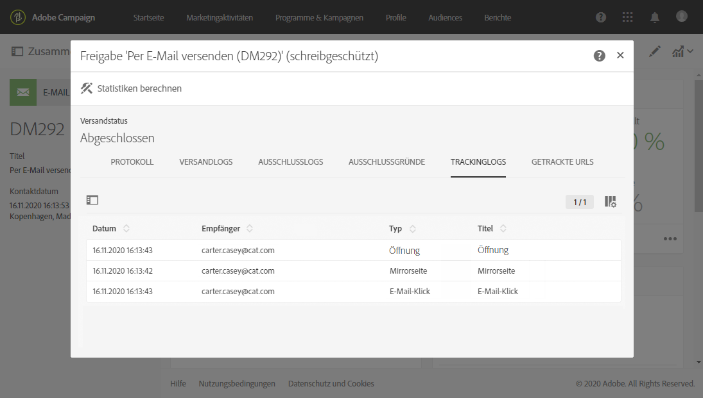

# Nachrichten tracken{#tracking-messages}

## Über das Tracking {#about-tracking}

Dank der Tracking-Funktionen ermöglicht Adobe Campaign die Verfolgung des Verhaltens von Versandempfängern. Dabei kommen mit Adobe Campaign Sitzungs-Cookies und permanente Cookies zum Einsatz.

Eine Möglichkeit besteht darin, Besucher von Webtracking betroffenen Seiten zur Zustimmung aufzufordern, indem im oberen Bereich auf der ersten besuchten Seite ein Banner eingeblendet und zum Ankreuzen eines Feldes aufgefordert wird. Vermeiden Sie jedoch Pop-ups, da diese häufig von den Browsern blockiert werden.

Tracking-Informationen sind für jeden Kontakt in Ihrer Datenbank in **[!UICONTROL integrierten Kundenprofilen verfügbar]**. Weiterführende Informationen hierzu finden Sie in [diesem Abschnitt](../../audiences/using/integrated-customer-profile.md).

Adobe Campaign verwendet zwei Arten von Cookies:

* Sitzungs-Cookie (nlid). Er enthält die Kennung der an den Kontakt gesendeten E-Mail (broadlogId) und die Kennung der Nachrichtenvorlage (deliveryId). Er wird gesetzt, sobald der Kontakt eine in einer mit Adobe Campaign gesendeten E-Mail enthaltene URL anklickt, und ermöglicht, das Webverhalten des Kontakts zu verfolgen. Dieser Sitzungs-Cookie wird automatisch mit Schließen des Browsers gelöscht. Der Kontakt hat die Möglichkeit, das Setzen des Cookies zu verbieten, indem er seine Browser-Einstellungen dementsprechend ändert.
* Von verschiedenen Lösungen in Adobe Experience Cloud gemeinsam genutzter Cookie. Er ermöglicht die Identifizierung eines Internetbenutzers, der mit Experience Cloud-Lösungen bei Website-Besuchen interagiert. Dieses Cookie wird [hier](https://docs.adobe.com/content/help/de-DE/core-services/interface/ec-cookies/cookies-mc.html) beschrieben.

Tracking mit Adobe Campaign Standard bietet Ihnen Zugriff auf folgende Funktionen:

<table>
<tr>
    <td valign="top">
        
    </td>
    <td valign="top">
        
    </td>
    <td valign="top">
        
    </td>
        <td valign="top">
          
    </td>
    </td>
    <td valign="top">
          
</tr>
<tr>
<td>E-Mail-Tracking</td>
<td>Push-Tracking</td>
<td>Getrackte URLs</td>
<td>Trackinglogs </td>
<td>Tracking-Bericht</td>
</tr>
</table>

## Trackinglogs     {#tracking-logs}

Der **[!UICONTROL Trackinglogs]**-Tab zeigt den Verlauf des Trackings für den vorliegenden Versand an. Angezeigt werden die zu allen gesendeten Nachrichten für die jeweils getrackten URLs gesammelten Informationen. Die Trackinginformationen in diesem Tab werden alle 10 Minuten aktualisiert.

>[!NOTE]
>
>Sollte das Tracking für einen Versand nicht aktiviert worden sein, wird dieser Tab nicht angezeigt. Trackinglogs sind nur für die Kanäle **E-Mail** und **Push-Benachrichtigung** verfügbar.

Im obigen Beispiel hat sich der Empfänger folgendermaßen verhalten:

* Er hat die Nachricht geöffnet.
* Er hat auf den benutzerspezifischen Link &quot;MEHR DAZU&quot; geklickt.
* Er hat auf den Abmelde- und Mirrorseiten-Link geklickt.

Die möglichen Werte in der Spalte **[!UICONTROL Typ]** sind:

* **[!UICONTROL E-Mail-Klick]**: Der Empfänger hat auf einen benutzerspezifischen Link geklickt.
* **[!UICONTROL Mirrorseite]**: Der Empfänger hat auf einen Link zur Mirrorseite geklickt.
* **[!UICONTROL Öffnen]**: Der Empfänger hat die E-Mail geöffnet.
* **[!UICONTROL Opt-out]**: Der Empfänger hat auf einen Abmelde-Link geklickt.

>[!NOTE]
>
>Für den Kanal **Push-Benachrichtigung** werden nur Klicks auf Mobile-App-Benachrichtigungen getrackt. In diesem Fall lautet der Wert **[!UICONTROL Klick auf Mobile-App-Benachrichtigung]**.

Weiterführende Informationen zum Einfügen von Tracking-Links finden Sie auf [dieser Seite](../../designing/using/links.md#inserting-a-link).

## Getrackte URLs {#tracked-urls}

Der Tab **[!UICONTROL Getrackte URLs]** gibt Auskunft über die in der gesendeten Nachricht enthaltenen URLs, ihren Typ sowie ihre Quell-URLs.

Weiterführende Informationen zu Tracking-Links finden Sie in [diesem Abschnitt](../../designing/using/links.md#about-tracked-urls).
