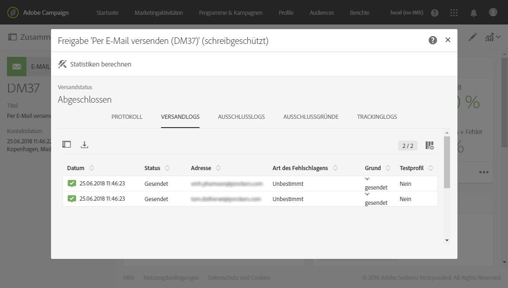
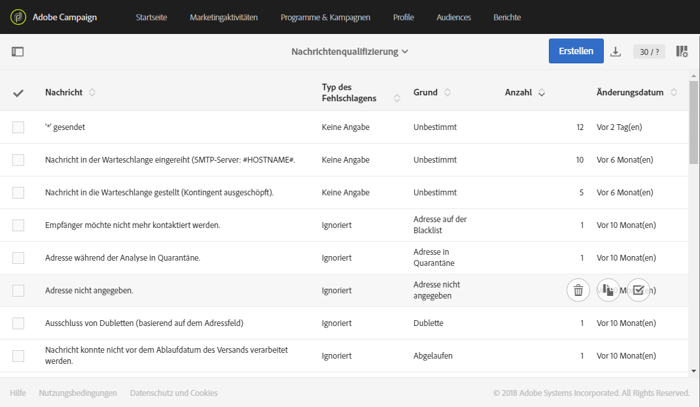

# Ursachen von fehlgeschlagenen Sendungen{#understanding-delivery-failures}

## Über fehlgeschlagene Sendungen {#about-delivery-failures}

Wenn einem Profil eine Nachricht nicht zugestellt werden kann, sendet der Remote-Server automatisch eine Fehlermeldung, die von der Adobe-Campaign-Plattform erfasst und qualifiziert wird, um festzustellen, ob die E-Mail-Adresse oder Telefonnummer unter Quarantäne gestellt werden soll. Siehe [Bounce-Message-Qualifizierung](#bounce-mail-qualification).

>[!NOTE]
>
>**E-Mail**-Fehlermeldungen (oder &quot;Bounces&quot;) werden vom erweiterten MTA (synchrone Bounces) oder InMail-Prozess (asynchrone Bounces) qualifiziert.
>
>**SMS**-Fehlermeldungen (auch &quot;SR&quot; für &quot;Status Report&quot; genannt) werden vom MTA-Prozess qualifiziert.

Nachrichten können während der Versandvorbereitung auch ausgeschlossen werden, wenn eine Adresse unter Quarantäne gestellt oder ein Profil auf die Blockierungsliste gesetzt wurde. Ausgeschlossene Mitteilungen werden im Versand-Dashboard im Tab **[!UICONTROL Ausschlusslogs]** aufgeführt (siehe [diesen Abschnitt](../../sending/using/monitoring-a-delivery.md#exclusion-logs)).

**Verwandte Themen:**

* [Funktionsweise der Quarantäneverwaltung](../../sending/using/understanding-quarantine-management.md)
* [Funktionsweise des Opt-in- und Opt-out-Verfahrens in Campaign](../../audiences/using/about-opt-in-and-opt-out-in-campaign.md)
* [Bounces](https://experienceleague.adobe.com/docs/deliverability-learn/deliverability-best-practice-guide/metrics-for-deliverability/bounces.html?lang=de#metrics-for-deliverability)

## Fehlgeschlagene Sendungen für eine Nachricht identifizieren             {#identifying-delivery-failures-for-a-message}

Nachdem eine Nachricht gesendet wurde, können Sie im Tab **[!UICONTROL Versandlogs]** (siehe [diesen Abschnitt](../../sending/using/monitoring-a-delivery.md#sending-logs)) den Versandstatus für jedes Profil sowie den damit verbundenen Fehlertyp und die Ursache einsehen (siehe [Typen und Ursachen für fehlgeschlagene Sendungen](#delivery-failure-types-and-reasons)).

Es steht auch ein entsprechender Bericht zur Verfügung. Dieser Bericht zeigt die Gesamtheit aller Statistiken zu bei Sendungen aufgetretenen Hard- und Softbounces und der automatischen Bounce-Verarbeitung. Weiterführende Informationen hierzu finden Sie in [diesem Abschnitt](../../reporting/using/bounce-summary.md).

## Typen und Ursachen für fehlgeschlagene Sendungen             {#delivery-failure-types-and-reasons}

Bei Fehlschlägen des Versands gibt es drei Typen von Fehlern:

* **Hard**: Dieser Fehlertyp tritt bei einer ungültigen Adresse auf. Fehlermeldung, die explizit eine ungültige Adresse anzeigt, beispielsweise &quot;Benutzer unbekannt&quot;.
* **Soft**: Fehler, der eventuell nur vorübergehend auftritt oder der nicht qualifiziert werden konnte, beispielsweise &quot;Ungültige Domain&quot;, &quot;Postfach voll&quot;.
* **Ignoriert**: Vorübergehender Fehler, beispielsweise &quot;Out of office&quot; oder technischer Fehler bei Absendern vom Typ &quot;Postmaster&quot;.

Mögliche Ursachen für fehlgeschlagene Sendungen sind:

| Bezeichnung des Fehlers | Fehlertyp | Beschreibung |
| ---------|----------|---------|
| **[!UICONTROL Unbekannter Nutzer]** | Hard | Die Adresse existiert nicht. An dieses Profil werden keine weiteren Zustellversuche unternommen. |
| **[!UICONTROL Adresse in Quarantäne]** | Hard | Die Adresse wurde unter Quarantäne gestellt. |
| **[!UICONTROL Unerreichbar]** | Softbounce / Hardbounce | In der Versandkette der Nachricht ist ein Fehler aufgetreten (zum Beispiel zeitweilig unerreichbare Domain). Entsprechend dem vom Provider zurückgegebenen Fehler wird die Adresse direkt unter Quarantäne gestellt oder der Zustellversuch wiederholt, bis Campaign einen Fehler empfängt, der den Quarantänestatus auslöst oder bis die Fehleranzahl 5 erreicht hat. |
| **[!UICONTROL Adresse leer]** | Hard | Die Adresse ist nicht definiert. |
| **[!UICONTROL Postfach voll]** | Soft | Das Postfach dieses Benutzers ist voll und kann keine weiteren Nachrichten akzeptieren. Die Adresse kann aus der Quarantäne genommen werden, um einen erneuten Zustellversuch zu unternehmen. Diese Liste wird automatisch nach 30 Tagen entfernt. Damit die Adresse automatisch aus der Quarantäne genommen werden kann, muss der technische Workflow **[!UICONTROL Datenbankbereinigung]** gestartet sein. |
| **[!UICONTROL Zurückgewiesen]** | Softbounce / Hardbounce | Die Adresse wurde wegen eines Sicherheits-Feedbacks unter Quarantäne gestellt, da die Nachricht als Spam gemeldet wurde. Entsprechend dem vom Provider zurückgegebenen Fehler wird die Adresse direkt unter Quarantäne gestellt oder der Zustellversuch wiederholt, bis Campaign einen Fehler empfängt, der den Quarantänestatus auslöst oder bis die Fehleranzahl 5 erreicht hat. |
| **[!UICONTROL Dublette]** | Ignoriert | Die Adresse wurde in der Segmentierung bereits erkannt. |
| **[!UICONTROL Unbestimmt]** | Soft | Die Adresse wird qualifiziert, da die Fehler noch nicht inkrementiert | wurden. Dieser Fehlertyp tritt auf, wenn der Server eine bis dahin unbekannte Fehlermeldung sendet: Hierbei kann es sich um einen einmaligen Fehler handeln. Sollte er sich jedoch wiederholen, wird der Fehlerzähler erhöht, was die zuständigen technischen Mitarbeiter auf das Problem aufmerksam macht. |
| **[!UICONTROL Fehler ignoriert]** | Ignoriert | Die Adresse befindet sich auf der Zulassungsliste und es wird in jedem Fall eine E-Mail gesendet. |
| **[!UICONTROL Adresse auf Blockierungsliste]** | Hard | Die Adresse wurde zum Zeitpunkt des Versands der Blockierungsliste hinzugefügt. |
| **[!UICONTROL Konto deaktiviert]** | Softbounce / Hardbounce | Wenn das Konto längere Zeit nicht abgefragt wird, kann es vom Internetanbieter geschlossen werden, was den Versand an diese Empfängeradresse unmöglich macht. Ob es sich um einen Softbounce oder Hardbounce handelt, hängt vom empfangenen Fehlertyp ab: Wenn das Konto vorübergehend wegen einer sechsmonatigen Inaktivität deaktiviert ist und wieder aktiviert werden kann, wird der Status **[!UICONTROL Mit Fehlern]** zugewiesen und der Zustellversuch wird wiederholt. Wenn das Konto permanent deaktiviert ist, wird es sofort unter Quarantäne gestellt. |
| **[!UICONTROL Nicht angemeldet]** | Ignoriert | Das Mobiltelefon des Profils war beim Versand der Nachricht ausgeschaltet oder verfügte über keinen Netzempfang. |
| **[!UICONTROL Ungültige Domain]** | Soft | Die Domain der E-Mail-Adresse ist fehlerhaft oder existiert nicht mehr. An dieses Profil werden wiederholte Zustellversuche unternommen, bis die Fehleranzahl 5 erreicht. Danach wird der Datensatz in den Quarantänestatus versetzt und die Zustellversuche werden eingestellt. |
| **[!UICONTROL Text zu lang]** | Ignoriert | Die Zeichenanzahl der SMS-Nachricht übersteigt das Limit. Weiterführende Informationen dazu finden Sie im Abschnitt [Kodierung, Länge und Tansliteration von SMS](../../administration/using/configuring-sms-channel.md#sms-encoding--length-and-transliteration). |
| **[!UICONTROL Zeichen wird in der Kodierung nicht unterstützt]** | Ignoriert | Die SMS-Nachricht enthält ein oder mehrere Zeichen, die von der Kodierung nicht unterstützt werden. Weiterführende Informationen dazu finden Sie im Abschnitt [Zeichensatztabelle – GSM-Standard](../../administration/using/configuring-sms-channel.md#table-of-characters---gsm-standard). |

**Verwandte Themen:**
* [Hardbounces](https://experienceleague.adobe.com/docs/deliverability-learn/deliverability-best-practice-guide/metrics-for-deliverability/bounces.html?lang=de#hard-bounces)
* [Softbounces](https://experienceleague.adobe.com/docs/deliverability-learn/deliverability-best-practice-guide/metrics-for-deliverability/bounces.html?lang=de#soft-bounces)

## Weitere Zustellversuche nach einem vorübergehend fehlgeschlagenen Versand             {#retries-after-a-delivery-temporary-failure}

Wenn die Zustellung einer Nachricht wegen eines vorübergehenden Fehlers fehlschlägt, werden während der Versandlaufzeit weitere Zustellversuche unternommen. Weiterführende Informationen zu Fehlertypen finden Sie im Abschnitt [Typen und Ursachen für fehlgeschlagene Sendungen](#delivery-failure-types-and-reasons).

Die Anzahl der weiteren Versuche (wie viele weitere Zustellversuche am Tag nach dem Start des Versands ausgeführt werden sollen) und das Mindestintervall zwischen Verarbeitungsversuchen werden nun <!--managed by the Adobe Campaign Enhanced MTA,--> und hängen davon ab, wie gut eine IP-Adresse in einer bestimmten Domain sowohl historisch als auch aktuell abschneidet. Die Einstellungen für **weitere Zustellversuche** in Campaign werden ignoriert.

<!--Please note that Adobe Campaign Enhanced MTA is not available for the Push channel.-->

Um die Dauer eines Versands zu ändern, gehen Sie zu den erweiterten Parametern des Versands oder der Versandvorlage und bearbeiten Sie das Feld **[!UICONTROL Versandlaufzeit]** im Abschnitt [Gültigkeitszeitraum](../../administration/using/configuring-email-channel.md#validity-period-parameters).

>[!IMPORTANT]
>
>**Der Parameter**[!UICONTROL  Versandlaufzeit ]**in Ihren Campaign-Sendungen wird jetzt nur verwendet, wenn er 3,5 Tage oder weniger beträgt.** Wenn Sie einen Wert von mehr als 3,5 Tagen definieren, wird dieser nicht berücksichtigt.

Wenn Sie beispielsweise möchten, dass weitere Zustellversuche für einen Versand nach einem Tag gestoppt werden, können Sie die Versandlaufzeit mit **1d** festlegen. Die Nachrichten in der Wiederholungswarteschlange werden daraufhin nach einem Tag entfernt.

>[!NOTE]
>
>Nachdem eine Nachricht maximal 3,5 Tage lang in der Wiederholungswarteschlange war und nicht gesendet werden konnte, wird sie mit einer Zeitüberschreitung beendet. Ihr Status wird <!--from **[!UICONTROL Sent]**--> in **[!UICONTROL Fehlgeschlagen]** geändert (in den [Versandlogs](../../sending/using/monitoring-a-delivery.md#delivery-logs)).

<!--MOVED TO configuring-email-channel.md > LEGACY SETTINGS
The default configuration allows five retries at one-hour intervals, followed by one retry per day for four days. The number of retries can be changed globally (contact your Adobe technical administrator) or for each delivery or delivery template (see [this section](../../administration/using/configuring-email-channel.md#sending-parameters)).-->

## Synchrone und asynchrone Fehler     {#synchronous-and-asynchronous-errors}

Ein Versand kann sofort fehlschlagen (synchroner Fehler) oder zu einem späteren Zeitpunkt nach dem Versand (asynchroner Fehler).

* **Synchroner Fehler**: Der vom Adobe-Campaign-Server angesprochene Remote-Server hat sofort eine Fehlermeldung zurückgegeben. Die Nachricht kann nicht an den Server des Profils gesendet werden.
* **Asynchroner Fehler**: Eine Bounce Message oder ein Statusbericht (SR) wird vom Remote-Server verzögert zurückgesendet. Asynchrone Fehler können bis zu eine Woche nach einem Versand auftreten.

## Bounce-Message-Qualifizierung             {#bounce-mail-qualification}

Bei Fehlermeldungen zu synchronen Versandfehlern bestimmt der erweiterte MTA (Message Transfer Agent) von Adobe Campaign den Bounce-Typ und die Qualifizierung und sendet diese Informationen an Campaign zurück.

>[!NOTE]
>
>Bounce-Qualifizierungen in der Tabelle **[!UICONTROL Nachrichtenqualifizierung]** von Campaign werden nicht mehr verwendet.

Asynchrone Bounces werden weiterhin vom InMail-Prozess über die Regeln für **[!UICONTROL Eingehende E-Mails]** qualifiziert. Um auf diese Regeln zuzugreifen, klicken Sie auf das **Adobe**-Logo oben links im Bildschirm. Wählen Sie dann **[!UICONTROL Administration > Kanäle > E-Mail > Regeln zum Umgang mit E-Mails]** und anschließend **[!UICONTROL Bounce Messages]**. Weiterführende Informationen zu dieser Regel finden Sie in [diesem Abschnitt](../../administration/using/configuring-email-channel.md#email-processing-rules).

Weitere Informationen zu Bounces und den verschiedenen Arten von Bounces finden Sie in [diesem Abschnitt](https://experienceleague.adobe.com/docs/deliverability-learn/deliverability-best-practice-guide/metrics-for-deliverability/bounces.html?lang=de#metrics-for-deliverability).

<!--MOVED TO configuring-email-channel.md > LEGACY SETTINGS

Bounces can have the following qualification statuses:

* **[!UICONTROL To qualify]**: the bounce mail needs to be qualified. Qualification must be done by the Deliverability team to ensure that the platform deliverability functions correctly. As long as it is not qualified, the bounce mail is not used to enrich the list of email processing rules.
* **[!UICONTROL Keep]**: the bounce mail was qualified and will be used by the **Update for deliverability** workflow to be compared to existing email processing rules and enrich the list.
* **[!UICONTROL Ignore]**: the bounce mail was qualified but will not be used by the **Update for deliverability** workflow. So it will not be sent to the client instances.

To list the various bounces and their associated error types et reasons, click the **Adobe** logo, in the top-left, then select **[!UICONTROL Administration > Channels > Quarantines > Message qualification]**.

-->

## Zustellbarkeit von E-Mails durch die Anmeldung mit zweifacher Bestätigung optimieren {#optimizing-mail-deliverability-with-double-opt-in-mechanism}

Die Anmeldung mit zweifacher Bestätigung zählt zu den Best Practices beim E-Mail-Versand. Die Plattform wird dadurch vor falschen oder ungültigen E-Mail-Adressen und Spambots geschützt, wodurch Spam-Beschwerden verhindert werden.

Das Prinzip dahinter ist folgendes: Der Besucher füllt ein Formular auf einer Online-Landingpage aus, erhält dann eine E-Mail und muss den Bestätigungs-Link anklicken, um die Anmeldung abzuschließen. Erst dann wird er als ‘Profil&#39; in der Campaign-Datenbank gespeichert.

Weiterführende Informationen hierzu finden Sie in [diesem Abschnitt](../../channels/using/setting-up-a-double-opt-in-process.md).
