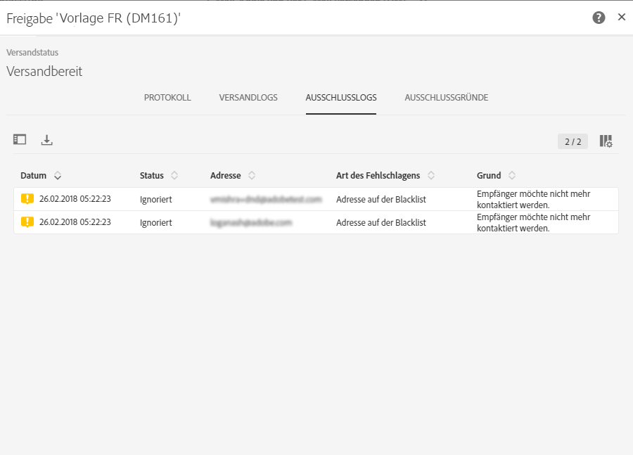
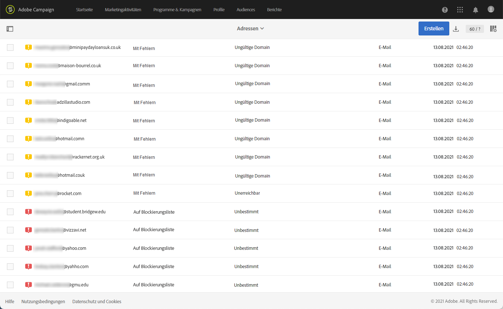
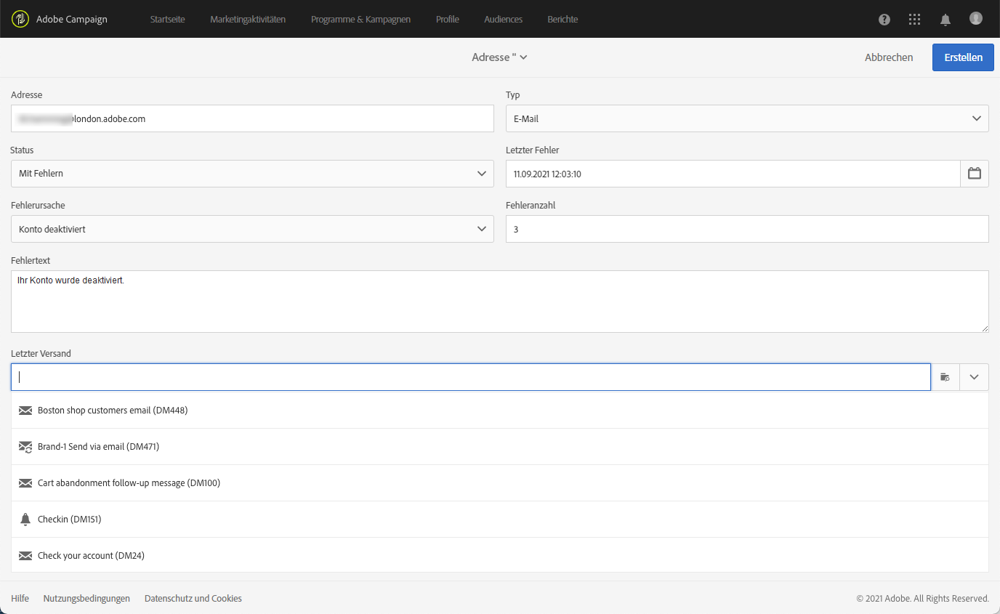
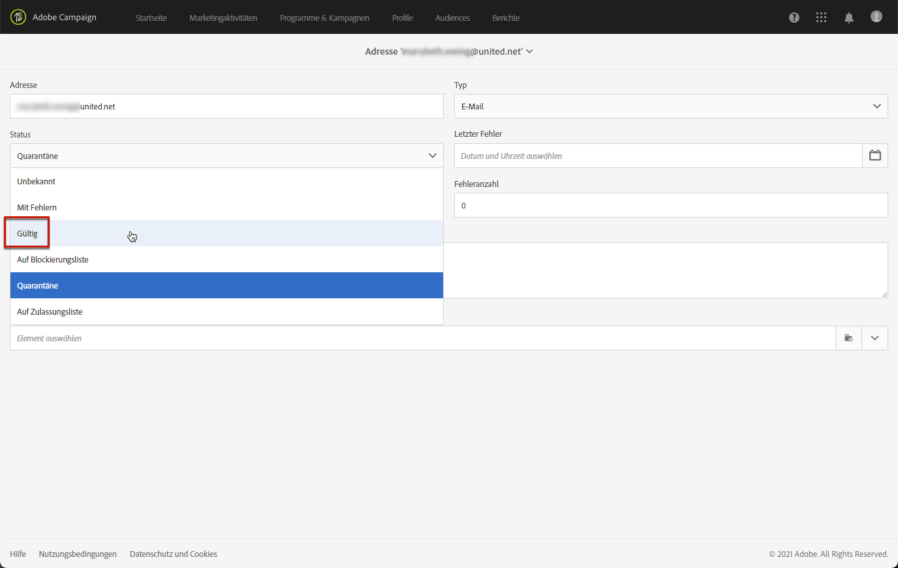

# Funktionsweise der Quarantäneverwaltung{#understanding-quarantine-management}

## Über Quarantänen {#about-quarantines}

Eine E-Mail-Adresse oder Telefonnummer kann in Quarantäne kommen, weil z. B. das Postfach voll ist oder die Adresse nicht existiert.

In diesem [Abschnitt](#conditions-for-sending-an-address-to-quarantine) werden die Regeln, die eine Quarantäne auslösen, näher erläutert.

### Zustellbarkeit durch Quarantänen optimieren        {#optimizing-your-delivery-through-quarantines}

Die Profile, deren E-Mail-Adressen oder Telefonnummern unter Quarantäne sind, werden während der Nachrichtenvorbereitung automatisch ausgeschlossen (siehe [Für einen Versand in Quarantäne befindliche Adressen identifizieren](#identifying-quarantined-addresses-for-a-delivery)). Dies beschleunigt die Zustellung, da sich die Fehlerrate maßgeblich auf die Zustellgeschwindigkeit auswirkt.

Teilweise werden E-Mails von Providern automatisch als Spam eingestuft, wenn die Anzahl ungültiger Adressen zu hoch ist. Durch die Quarantäne können Sie also vermeiden, von diesen Providern auf eine Blockierungsliste gesetzt zu werden.

Zusätzlich helfen Ihnen Quarantänen, die Kosten des SMS-Versands zu senken, indem fehlerhafte Telefonnummern aus dem Versand ausgeschlossen werden.

Weiterführende Informationen zu Best Practices zur Durchführung und Optimierung von Sendungen finden Sie auf [dieser Seite](../../sending/using/delivery-best-practices.md).

### Quarantäne vs. Blockierungsliste {#quarantine-vs-denylist}

Die Quarantäne und die Blockierungsliste gelten nicht für dasselbe Objekt:

* Die **Quarantäne** bezieht sich nur auf eine **Adresse** (oder Telefonnummer usw.), nicht aber auf das Profil selbst. Wenn beispielsweise ein Profil mit einer in Quarantäne befindlichen E-Mail-Adresse eine neue Adresse angibt, kann es erneut in Versandzielgruppen aufgenommen werden. Wenn zwei Profile dieselbe Telefonnummer haben, sind beide betroffen, wenn die Nummer unter Quarantäne gestellt wird.

  Die unter Quarantäne gestellten Adressen oder Telefonnummern werden in den [Ausschlusslogs](#identifying-quarantined-addresses-for-a-delivery) (für einen Versand) oder in der [Quarantäneliste](#identifying-quarantined-addresses-for-the-entire-platform) (für die gesamte Plattform) angezeigt.

* Die Aufnahme in die **Blockierungsliste** führt dagegen dazu, dass das **Profil** vom Versand ausgeschlossen wird. Dies ist z. B. nach einer Abmeldung (Opt-out) von einem Kanal der Fall. Wenn beispielsweise ein Profil, das auf der Blockierungsliste für den E-Mail-Kanal steht, zwei E-Mail-Adressen hat, werden beide Adressen vom Versand ausgeschlossen. Weiterführende Informationen zum Blockierungslistenprozess finden Sie im Abschnitt [Funktionsweise des Opt-in- und Opt-out-Verfahrens in Campaign](../../audiences/using/about-opt-in-and-opt-out-in-campaign.md).

  Im Bereich **[!UICONTROL Nicht mehr kontaktieren (auf Blockierungsliste)]** der Registerkarte **[!UICONTROL Allgemein]** des Profils können Sie überprüfen, ob sich ein Profil auf der Blockierungsliste für einen oder mehrere Kanäle befindet. Weitere Informationen finden Sie in [diesem Abschnitt](../../audiences/using/managing-opt-in-and-opt-out-in-campaign.md#managing-opt-in-and-opt-out-from-a-profile).

>[!NOTE]
>
>Die Quarantäne beinhaltet den Status **Auf Blockierungsliste**, der angewendet wird, wenn Empfänger Ihre Nachricht als Spam melden oder auf eine SMS mit einem Schlüsselwort wie &quot;STOPP&quot; antworten. In diesem Fall wird die betroffene Adresse oder Telefonnummer des Profils unter Quarantäne gestellt und erhält den Status **[!UICONTROL Auf Blockierungsliste]**. Weiterführende Informationen zur Verwaltung von STOPP-SMS-Nachrichten finden Sie in [diesem Abschnitt](../../channels/using/managing-incoming-sms.md#managing-stop-sms).

&lt;!Wenn eine Benutzerin bzw. ein Benutzer auf eine SMS-Nachricht mit einem Schlüsselwort wie „STOPP“ antwortet, um sich vom SMS-Versand abzumelden, wird ihr bzw. sein Profil nicht wie bei einem E-Mail-Abmeldevorgang auf die Blockierungsliste gesetzt. Stattdessen wird die Telefonnummer des Profils unter Quarantäne gestellt und erhält den Status **[!UICONTROL Auf Blockierungsliste]**. Dieser Status bezieht sich ausschließlich auf die Telefonnummer, d. h. das Profil erhält weiterhin E-Mail-Nachrichten.<!-- Also, if the profile has another phone number, he can still receive SMS messages on the other number. For more on this, refer to [this section](../../channels/using/managing-incoming-sms.md#managing-stop-sms).-->

## In Quarantäne befindliche Adressen identifizieren   {#identifying-quarantined-addresses}

Die in Quarantäne befindlichen Adressen können für einen bestimmten Versand oder für die gesamte Plattform angezeigt werden.

<!--
If you need to remove an address from quarantine, contact your technical administrator.
-->

### Für einen Versand in Quarantäne befindliche Adressen identifizieren {#identifying-quarantined-addresses-for-a-delivery}

Die für einen bestimmten Versand in Quarantäne befindlichen Adressen werden während der Versandvorbereitung im Tab **[!UICONTROL Ausschlusslogs]** des Versand-Dashboards angezeigt (siehe [diesen Abschnitt](../../sending/using/monitoring-a-delivery.md#exclusion-logs)). Weiterführende Informationen zur Versandvorbereitung finden Sie in [diesem Abschnitt](../../sending/using/preparing-the-send.md).

### Für die gesamte Plattform in Quarantäne befindliche Adressen identifizieren        {#identifying-quarantined-addresses-for-the-entire-platform}

Administratoren können die für die gesamte Plattform in Quarantäne befindlichen Adressen im Menü **[!UICONTROL Administration > Kanäle > Quarantänen > Adressen]** auflisten.

<!--
This menu lists quarantined elements for **Email**, **SMS** and **Push notification** channels.
-->

>[!NOTE]
>
>Mit zunehmendem Alter der Datenbank steigt auch die Zahl der Adressen in Quarantäne. Wenn man beispielsweise davon ausgeht, dass eine E-Mail-Adresse eine Lebensdauer von etwa drei Jahren hat und dass die Empfängertabelle pro Jahr um 50 % wächst, lässt sich der Quarantänezuwachs wie folgt berechnen: Ende 1. Jahr: (1&#42;0,33)/(1 + 0,5) = 22 %. Ende 2. Jahr: ((1,22 &#42; 0,33) + 0,33) / (1,5 + 0,75) = 32,5 %.

Es stehen Filter zur Verfügung, mit denen Sie die Liste durchsuchen können. Sie können nach Adresse, Status und/oder Kanal filtern.

Sie können jeden Eintrag bearbeiten oder [löschen](#removing-a-quarantined-address) und neue Einträge erstellen.

Um einen Eintrag zu bearbeiten, klicken Sie auf die entsprechende Zeile und ändern Sie die Felder nach Bedarf.

Um einen neuen Eintrag manuell hinzuzufügen, verwenden Sie die Schaltfläche **[!UICONTROL Erstellen]**.

Definieren Sie die Adresse (oder Telefonnummer usw.) und den Kanaltyp. Sie können einen Status für die Aufnahme in die Quarantäneliste und eine Fehlerursache festlegen. Sie können auch das Datum, an dem der Fehler aufgetreten ist, sowie die Anzahl der Fehler angeben und den Fehlertext eingeben. Wählen Sie bei Bedarf aus der Dropdown-Liste den letzten an die Adresse durchgeführten Versand aus.

## Adresse aus der Quarantäne entfernen {#removing-a-quarantined-address}

### Automatische Aktualisierungen {#unquarantine-auto}

Adressen, die bestimmte Bedingungen erfüllen, werden automatisch durch den Datenbankbereinigungs-Workflow aus der Quarantäneliste gelöscht. Weiterführende Informationen zu technischen Workflows finden Sie in [diesem Abschnitt](../../administration/using/technical-workflows.md#list-of-technical-workflows).

In den folgenden Fällen werden die Adressen automatisch aus der Quarantäneliste entfernt:

* Adressen mit dem Status **[!UICONTROL Mit Fehlern]** werden nach einem erfolgreichen Versand aus der Quarantäneliste entfernt.
* Adressen mit dem Status **[!UICONTROL Mit Fehlern]** werden aus der Quarantäneliste entfernt, wenn der letzte Softbounce mehr als 10 Tage zurückliegt. Weitere Informationen zum Fehler-Management finden Sie in [diesem Abschnitt](#soft-error-management).
* Adressen mit dem Status **[!UICONTROL Mit Fehlern]**, die mit dem Fehler **[!UICONTROL Postfach voll]** zurückkommen, werden nach 30 Tagen aus der Quarantäneliste entfernt.

Ihr Status ändert sich dann in **[!UICONTROL Gültig]**.

Die maximale Anzahl erneuter Zustellversuche im Status **[!UICONTROL Mit Fehlern]** und das Mindestintervall zwischen den erneuten Zustellversuchen basieren nun sowohl auf der historischen als auch der aktuellen Leistung einer IP-Adresse bei einer bestimmten Domain.

>[!IMPORTANT]
>
Empfängerinnen und Empfänger mit einer Adresse im Status **[!UICONTROL Quarantäne]** oder **[!UICONTROL Auf Blockierungsliste]** werden niemals entfernt, auch wenn sie eine E-Mail erhalten.

### Manuelle Aktualisierungen {#unquarantine-manual}

Sie können die Quarantäne für eine Adresse auch manuell aufheben.  Um eine Adresse manuell aus der Quarantäneliste zu entfernen, können Sie sie aus der Quarantäneliste entfernen oder ihren Status in **[!UICONTROL Gültig]** ändern.

* Wählen Sie die Adresse aus der Liste **[!UICONTROL Administration > Kanäle > Quarantänen > Adressen]** aus und klicken Sie auf **[!UICONTROL Element löschen]**.

  

* Wählen Sie eine Adresse aus und ändern Sie ihren **[!UICONTROL Status]** in **[!UICONTROL Gültig]**.

  

### Massenaktualisierungen {#unquarantine-bulk}

Möglicherweise müssen Sie Massenaktualisierungen auf der Quarantäneliste durchführen, z. B. im Falle eines ISP-Ausfalls. In diesem Fall werden E-Mails fälschlicherweise als Bounce gekennzeichnet, da sie ihren Empfängerinnen und Empfängern nicht erfolgreich zugestellt werden können. Diese Adressen müssen aus der Quarantäneliste entfernt werden.

Erstellen Sie dazu einen Workflow und fügen Sie eine **[!UICONTROL Abfrage]**-Aktivität in Ihrer Quarantänetabelle hinzu, um alle betroffenen Empfängerinnen und Empfänger herauszufiltern. Sobald sie identifiziert sind, können sie aus der Quarantäneliste entfernt und in zukünftige E-Mail-Sendungen in Campaign aufgenommen werden.

Auf der Grundlage des Zeitrahmens des Vorfalls werden im Folgenden die empfohlenen Richtlinien für diese Abfrage aufgelistet.

* **Fehlertext (Quarantänetext)** enthält „550-5.1.1“ UND **Fehlertext (Quarantänetext)** enthält „support.ISP.com“,

  wobei „support.ISP.com“ zum Beispiel: „support.apple.com“ oder „support.google.com“ sein kann

* **Statusaktualisierung (@lastModified)** am oder später als `MM/DD/YYYY HH:MM:SS AM`
* **Statusaktualisierung (@lastModified)** am oder früher als `MM/DD/YYYY HH:MM:SS PM`

Sobald Sie die Liste der betroffenen Empfängerinnen und Empfänger haben, fügen Sie die Aktivität **[!UICONTROL Daten aktualisieren]** hinzu, um den Status der E-Mail-Adressen auf **[!UICONTROL Gültig]** zu setzen, damit sie durch den Workflow **[!UICONTROL Datenbankbereinigung]** aus der Quarantäneliste entfernt werden. Sie können sie auch einfach aus der Quarantänetabelle löschen.

## Ursachen für Quarantänen {#conditions-for-sending-an-address-to-quarantine}

Adobe Campaign verwaltet Quarantänen entsprechend dem Fehlertyp und dem Grund, der dem Fehler im Zuge der Qualifikation der Fehlermeldungen zugewiesen wurde (siehe [Typen und Ursachen für fehlgeschlagene Sendungen](../../sending/using/understanding-delivery-failures.md#delivery-failure-types-and-reasons) und [Bounce-Message-Qualifizierung](../../sending/using/understanding-delivery-failures.md#bounce-mail-qualification)).

* **Ignorierter Fehler**: Bei ignorierten Fehlern wird eine Adresse nicht unter Quarantäne gestellt.
* **Hardbounce**: Die E-Mail-Adresse kommt sofort in Quarantäne.
* **Softbounce**: In diesem Fall wird die Adresse nicht sofort unter Quarantäne gestellt, sondern der Fehlerzähler nur hinaufgesetzt. Weitere Informationen hierzu finden Sie unter [Verwaltung von Softbounces](#soft-error-management).

  <!--
  When the error counter reaches the limit threshold, the address goes into quarantine. In the default configuration, the threshold is set at five errors, where two errors are significant if they occur at least 24 hours apart. The address is placed in quarantine at the fifth error. The error counter threshold can be modified. For more on this, refer to this [page](../../administration/using/configuring-email-channel.md#email-channel-parameters).
  When a delivery is successful after a retry, the error counter of the address which was prior to that quarantined is reinitialized. The address status changes to **[!UICONTROL Valid]** and it is deleted from the list of quarantines after two days by the **[!UICONTROL Database cleanup]** workflow.
  -->

Wenn ein Benutzer eine E-Mail als Spam kennzeichnet ([Feedback Loop](https://experienceleague.adobe.com/docs/deliverability-learn/deliverability-best-practice-guide/transition-process/infrastructure.html?lang=de#feedback-loops)), wird die Nachricht automatisch an ein von Adobe verwaltetes technisches Postfach weitergeleitet. Die E-Mail-Adresse des Benutzers wird dann automatisch unter Quarantäne gestellt und der Status in **[!UICONTROL Auf Blockierungsliste]** geändert. Der Status bezieht sich ausschließlich auf die Adresse und das Profil wird nicht auf die Blockierungsliste gesetzt, sodass der Empfänger nach wie vor SMS-Nachrichten und Push-Benachrichtigungen erhält.

>[!NOTE]
>
Bei der Quarantänefunktion in Adobe Campaign wird die Groß-/Kleinschreibung beachtet. Achten Sie darauf, E-Mail-Adressen in Kleinbuchstaben zu importieren, damit sie später nicht erneut verwendet werden.

Bei Adressen in Quarantäne (siehe [Für die gesamte Plattform in Quarantäne befindliche Adressen identifizieren](#identifying-quarantined-addresses-for-the-entire-platform)) zeigt das Feld **[!UICONTROL Fehlerursache]** an, warum die Quarantäne ausgelöst wurde.

### Verwaltung von Softbounces {#soft-error-management}

Im Gegensatz zu Hardbounces senden Softbounces eine Adresse nicht sofort in die Quarantäne, sondern erhöhen stattdessen einen Fehlerzähler.

Während der [Versandlaufzeit](../../administration/using/configuring-email-channel.md#validity-period-parameters) werden noch weitere Zustellversuche durchgeführt. Sollte der Zähler eine festgelegte Schwelle überschreiten, wird die Adresse unter Quarantäne gestellt. Weitere Informationen hierzu finden Sie unter [Weitere Zustellversuche nach einem vorübergehend fehlgeschlagenen Versand](understanding-delivery-failures.md#retries-after-a-delivery-temporary-failure).

<!--In the default configuration, the threshold is set at five errors, where two errors are significant if they occur at least 24 hours apart. The address is placed in quarantine at the fifth error.
The error counter threshold can be modified.-->

Der Fehlerzähler wird erneut initialisiert, wenn der letzte signifikante Fehler vor mehr als 10 Tagen aufgetreten ist. Der Status der Adresse wird auf **Gültig** gesetzt und mithilfe des Workflows **Datenbankbereinigung** wird die Adresse aus der Quarantäneliste gelöscht. (Weitere Informationen zu technischen Workflows finden Sie in [diesem Abschnitt](../../administration/using/technical-workflows.md#list-of-technical-workflows).)
