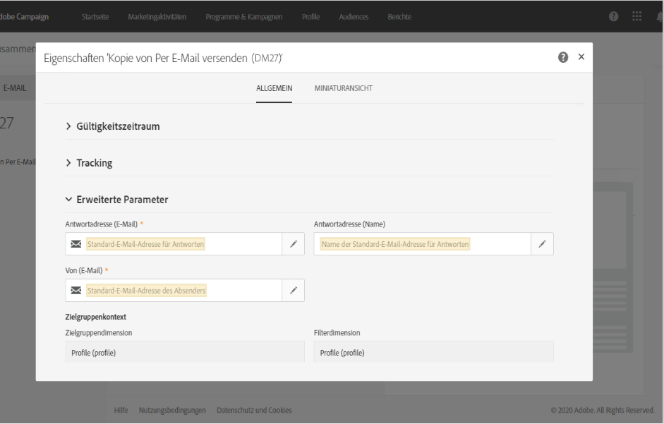
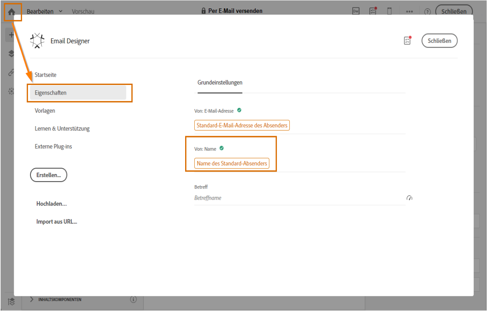
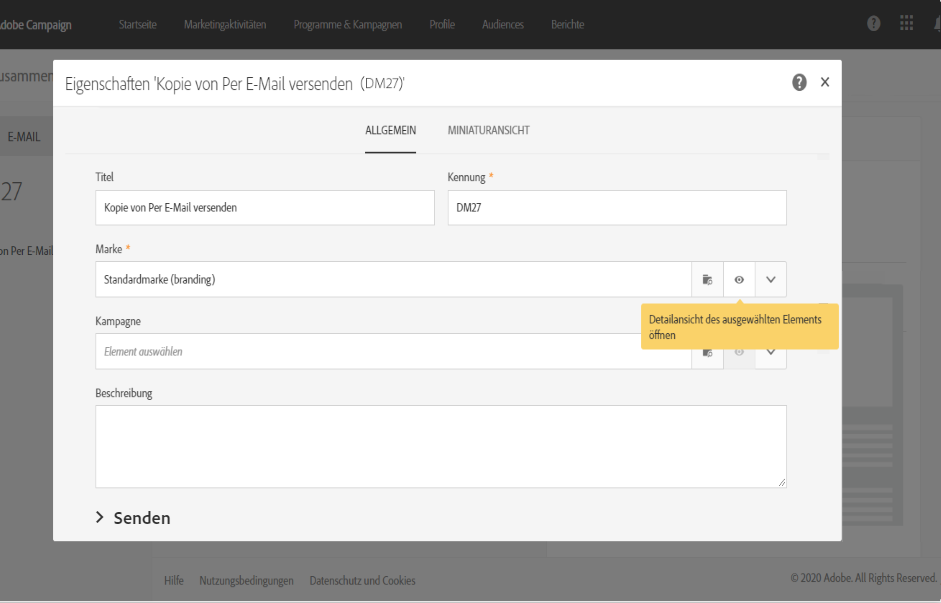

# Vorlagen verwenden {#use-templates}

Versandvorlagen ermöglichen eine effiziente Nutzung, da sie für die häufigsten Aktivitäten vordefinierte Szenarien enthalten. Mit Vorlagen können Marketing-Fachleute in kürzerer Zeit neue Kampagnen bei minimaler Anpassung bereitstellen.

Weiterführende Informationen zu Versandvorlagen finden Sie in [diesem Abschnitt](../../start/using/marketing-activity-templates.md).

## Erste Schritte mit Versandvorlagen {#gs-templates}

Mit einer [Versandvorlage](../../start/using/marketing-activity-templates.md#creating-a-new-template) können Sie ein Set technischer und funktioneller Eigenschaften nach Ihren Anforderungen definieren und für künftige Sendungen wiederverwenden. Sie können damit Zeit sparen und Sendungen bei Bedarf standardisieren.

Wenn Sie mehrere Marken in Adobe Campaign verwalten, empfiehlt Adobe die Zuweisung einer Subdomain pro Marke. Eine Bank kann beispielsweise für jede ihrer regionalen Niederlassungen über eine Subdomain verfügen. Wenn einer Bank die Domain „bluebank.com“ gehört, sind beispielsweise folgende Subdomains möglich: @ny.bluebank.com, @ma.bluebank.com, @ca.bluebank.com. Mit einer Versandvorlage pro Subdomain können Sie stets die richtigen vorkonfigurierten Parameter für jede Marke verwenden, um Fehler zu verhindern und Zeit zu sparen.

**Tipp**: Zur Vermeidung von Konfigurationsfehlern in Campaign wird empfohlen, keine neuen Vorlagen zu erstellen, sondern native Vorlagen zu duplizieren und die Eigenschaften nach Bedarf anzupassen.

## Konfigurieren von Adressen

* Die Angabe der Absenderadresse ist für den E-Mail-Versand zwingend erforderlich.

* Manche ISPs (Internet Service Provider) prüfen die Gültigkeit der Absenderadresse, bevor sie Nachrichten akzeptieren.

* Eine schlecht formulierte Adresse könnte vom Empfangs-Server abgelehnt werden. Achten Sie darauf, dass eine korrekte Adresse angegeben ist.

* Die Adresse muss den Absender explizit identifizieren. Die Domain muss im Besitz des Absenders sein und auf dessen Namen registriert sein.

* Adobe empfiehlt, E-Mail-Konten zu erstellen, die der für Sendungen und Antworten angegebenen Adresse entsprechen. Wenden Sie sich an den bzw. die Systemadmin für das Messaging-System.

Die Absenderadresse finden Sie im Feld **[!UICONTROL Von (E-Mail)]** in den Eigenschaften einer E-Mail-Vorlage im Bereich **[!UICONTROL Erweiterte Parameter]**.

Die Adress-Domain entspricht der Subdomain, die Sie konfiguriert haben.

Die Felder **[!UICONTROL Antworten an]** entsprechen der E-Mail-Adresse und dem Namen, die für Antworten verwendet werden.

**Tipp** – Adobe empfiehlt, eine echte Adresse zu verwenden, wie etwa die der Kundenunterstützung Ihrer Marke. So kann sich diese gegebenenfalls um etwaige Antworten kümmern.

Um den Absendernamen zu ändern, der im Header der gesendeten Nachrichten angezeigt wird, navigieren Sie auf der Startseite des E-Mail-Designers zur Registerkarte **[!UICONTROL Eigenschaften]** (der Zugriff erfolgt über das Startseiten-Symbol) und klicken Sie auf den Block **[!UICONTROL Name des Standard-Absenders]**.

Um die Öffnungsrate Ihrer Sendungen zu erhöhen, empfiehlt Adobe, einen Namen zu verwenden, der von den Empfängern leicht erkennbar ist, wie etwa Ihr Markenname.

**Tipp:** – Um das Benutzererlebnis zu verbessern, können Sie den Namen einer Person einfügen, wie z. B. „Emma von Megastore“.

Weiterführende Informationen zur Personalisierung von Absendernamen finden Sie im Abschnitt zum[E-Mail-Absender](../../designing/using/subject-line.md#email-sender).

## SMS-Absendernamen personalisieren

Im Abschnitt **Erweiterte Parameter** der Eigenschaften einer SMS-Vorlage können Sie mit der Option **Von** den Namen des Absenders der SMS-Nachricht mithilfe einer Zeichenfolge personalisieren. Es ist der hier eingegebene Name, der auf dem Mobiltelefon des Empfängers als Absender der SMS erscheint.

Bleibt das entsprechende Feld leer, wird die im externen Konto angegebene Anrufernummer verwendet. Sollte auch dort keine Anrufernummer gespeichert sein, wird die Kurzwahlnummer verwendet. Weiterführende Informationen dazu finden Sie im Abschnitt [SMS-Konfiguration](../../administration/using/configuring-sms-channel.md).

**Tipp** – Informieren Sie sich über die gesetzlichen Bestimmungen in Ihrem Land in Bezug auf die Änderung der Absenderadresse. Stellen Sie außerdem sicher, dass Ihr SMS-Provider diese Funktionalität anbietet.

## Einrichten einer Kontrollgruppe

Sobald der Versand durchgeführt wurde, können Sie das Verhalten der ausgeschlossenen Empfänger mit den Empfängern vergleichen, die den Versand erhalten haben. Anschließend können Sie die Effizienz Ihrer Kampagnen messen. Weiterführende Informationen zu Kontrollgruppen finden Sie in [diesem Abschnitt](../../sending/using/control-group.md).

## Verwenden von Typologien, um Filter und Kontrollregeln anzuwenden

Eine Typologie enthält Regeln, die in der Analysephase vor dem Versand einer Nachricht angewendet werden.

Ändern Sie im Abschnitt **[!UICONTROL Erweiterte Parameter]** > **[!UICONTROL Vorbereitung]** die Standardtypologie entsprechend Ihren Anforderungen.

Um beispielsweise den ausgehenden Traffic besser zu steuern, können Sie festlegen, welche IP-Adressen verwendet werden können, indem Sie für jede Subdomain eine Affinität definieren und für jede Affinität eine Typologie erstellen. Die Affinitäten werden in der Konfigurationsdatei der Instanz bestimmt. Wenden Sie sich an Ihre bzw. Ihren Adobe Campaign-Admin.

Weiterführende Informationen zu Typologien finden Sie in [diesem Abschnitt](../../sending/using/managing-typologies.md).

## Marken mit einer Vorlage verknüpfen

Die Parameter gesendeter E-Mails, die in Verbindung mit der Markenidentität stehen (wie z. B. das Markenlogo oder die Absenderadresse), werden zentral in Adobe Campaign verwaltet. Sie können eine oder mehrere Marken erstellen und mit Versandvorlagen verknüpfen.

Weiterführende Informationen zur Verwendung und Konfiguration von Marken in Adobe Campaign finden Sie im Abschnitt Marken.

Um die mit einer Versandvorlage verknüpfte Marke anzuzeigen oder zu verändern, wählen Sie in der Vorlage die Schaltfläche Eigenschaften bearbeiten aus und gehen Sie zu den Details der Marke.

Weiterführende Informationen zur Verknüpfung einer Marke mit einer Vorlage finden Sie im Abschnitt [Marke einer E-Mail zuweisen](../../administration/using/branding.md#assigning-a-brand-to-an-email).

[In diesem Abschnitt](../../administration/using/branding.md#creating-a-brand) erfahren Sie, wie Sie eine Marke erstellen und konfigurieren.
