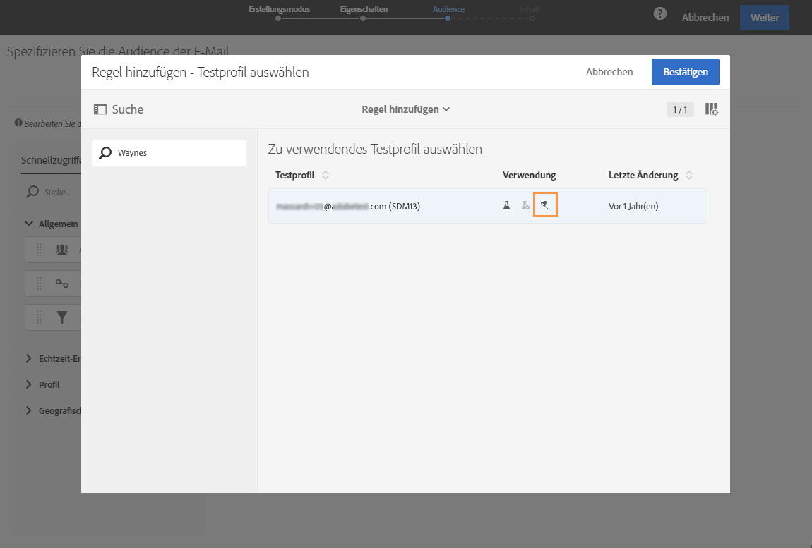
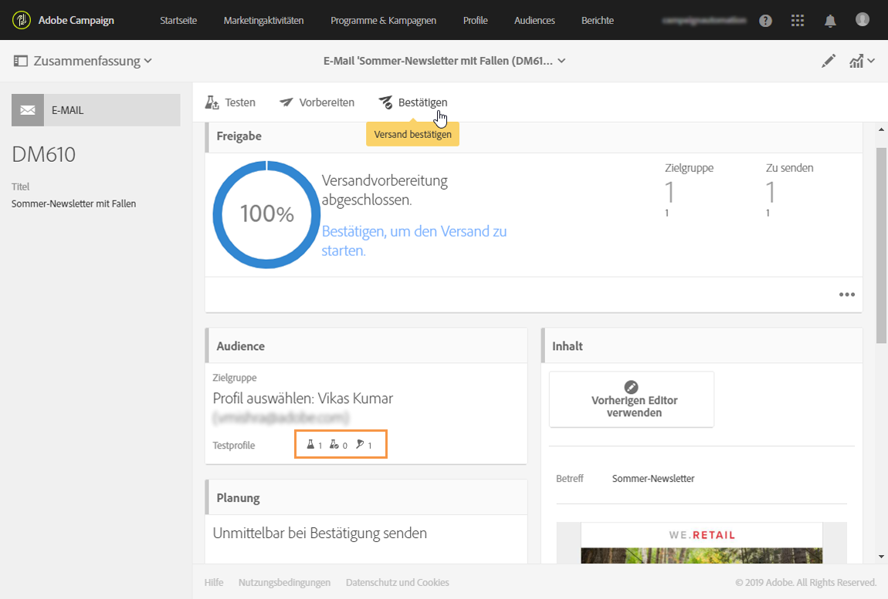

# Fallen verwenden {#using-traps}

Bei der Verwendung von Fallen wird die Nachricht neben der Hauptzielgruppe auch an das [Testprofil](../../audiences/using/managing-test-profiles.md) gesendet. Das Ziel dabei ist insbesondere zu überwachen, ob Ihre Kundendatei für unlautere Zwecke verwendet wird.

Fallen wurden ursprünglich für den Briefpostversand entwickelt. Sie ermöglichen Ihnen Folgendes:

* Sie können überprüfen, ob Ihr Briefpost-Anbieter die Nachricht tatsächlich sendet.
* Sie erhalten die Post zur gleichen Zeit und im selben Zustand wie Ihre Kunden.
* Sie können sich eine exakte Kopie der gesendeten Nachricht aufbewahren.
* Sie können sich vergewissern, dass Ihre Kundenliste nicht von Ihrem Briefpost-Anbieter missbraucht wird. Wenn eine andere Nachricht an die Adresse Ihres Testprofils gesendet wird, wurde Ihre Kundendatei möglicherweise ohne Ihr Wissen verwendet. Deshalb sollte die Adresse des Testprofils nur zu diesem Zweck verwendet werden.

Weiterführende Informationen zum Hinzufügen von Fallen zur Zielgruppe eines Briefpostversands finden Sie unter [Test- und Fallen-Profile hinzufügen](../../channels/using/defining-the-direct-mail-audience.md#adding-test-and-trap-profiles).

Wenn Sie Ihrer Hauptzielgruppe bei den anderen Kommunikationskanälen Fallen-Testprofile hinzufügen, haben Sie folgende Möglichkeiten:

* Sie können überprüfen, ob Ihre Nachricht erfolgreich gesendet wurde.
* Sie können eine exakte Kopie Ihrer Nachricht erhalten und aufbewahren.
* Sie können verfolgen, wann die Nachricht gesendet und empfangen wurde.

Um ein Testprofil als Falle zu verwenden, muss es in der Zielgruppe Ihrer Nachricht enthalten sein.

>[!NOTE]
>
>Im Gegensatz zu Testprofilen, die für [Testsendungen](../../sending/using/sending-proofs.md) oder zum [E-Mail-Rendering](../../sending/using/email-rendering.md) verwendet werden, erfolgt der Nachrichtenversand an die Hauptzielgruppe und die Testprofile, die als Fallen verwendet werden, gleichzeitig.

Gehen Sie beim Definieren der Zielgruppe einer Nachricht folgendermaßen vor:

1. Wählen Sie im Tab **[!UICONTROL Testprofile]** ein Testprofil aus. Vergewissern Sie sich, dass als Verwendungszweck **[!UICONTROL Falle]** ausgewählt ist.

   

1. Wenn der Nachrichteninhalt fertig ist, klicken Sie auf die Schaltfläche **[!UICONTROL Vorbereiten]**. Siehe [Versandvorbereitung](../../sending/using/preparing-the-send.md).
   >[!NOTE]
   >
   >Stellen Sie sicher, dass Sie eine Hauptzielgruppe ausgewählt haben. Andernfalls kann Ihre Nachricht nicht gesendet werden.

1. Wählen Sie die Schaltfläche **[!UICONTROL Bestätigen]** aus. Siehe [Versand bestätigen](../../sending/using/confirming-the-send.md).

   

Die Nachricht wird an die Hauptzielgruppe und an das Testprofil gesendet.

Beim Senden von Transaktionsnachrichten können Traps verwendet werden. In diesem Fall erhält das Testprofil eine Nachricht pro Ereigniskonfiguration. Weiterführende Informationen zu Transaktionsnachrichten finden Sie in [diesem Abschnitt](../../channels/using/getting-started-with-transactional-msg.md).

>[!NOTE]
>
>Bei der Verwendung eines Testprofils als Falle werden die entsprechenden zusätzlichen Daten für alle angereicherten Felder in einer Nachricht nach dem Zufallsprinzip aus einem echten Zielgruppenprofil ausgewählt und dem Fallen-Testprofil zugewiesen. Beachten Sie jedoch, dass die Versandvorbereitung fehlschlägt, wenn das tatsächliche Zielgruppenprofil aufgrund von Typologieregeln ausgeschlossen wird, die während der ersten Nachrichtenvorbereitung angewendet werden. Dieser Fehler tritt auf, weil die angereicherten Feldwerte nicht durch das Fallen-Profil ersetzt werden können. Daher können Typologieregeln vom Typ Ausschluss nicht ordnungsgemäß auf die tatsächlichen Empfängerinnen und Empfänger angewendet werden.
>
>Um dies zu verhindern, vermeiden Sie die gleichzeitige Verwendung von Fallen-Testprofilen mit Filter- oder Ermüdungsregeln in Ihrer Transaktionstypologie. Weitere Informationen zur Anreicherung. Weiterführende Informationen zur Anreicherung finden Sie in [diesem Beispiel](../../automating/using/enriching-profile-data-file.md).
