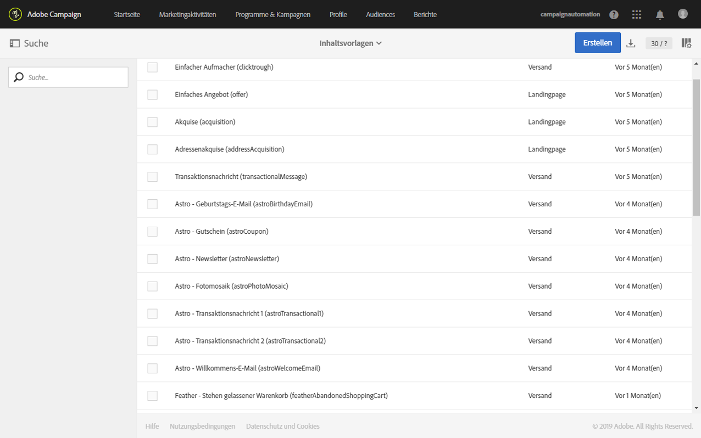
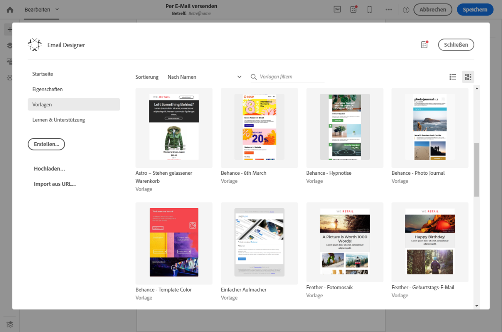
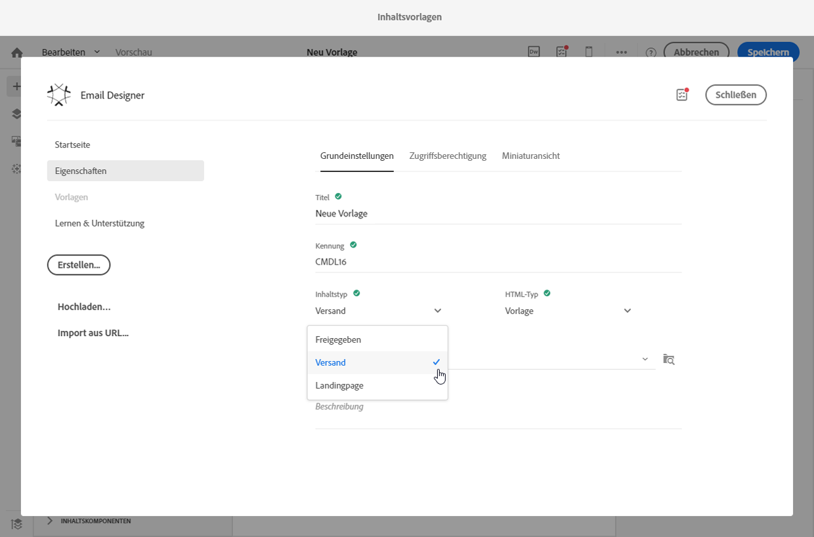
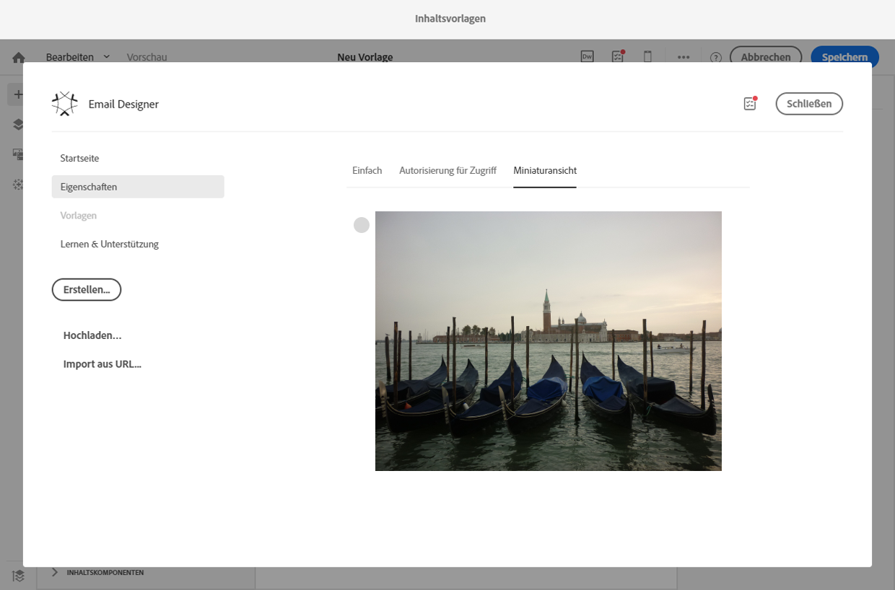
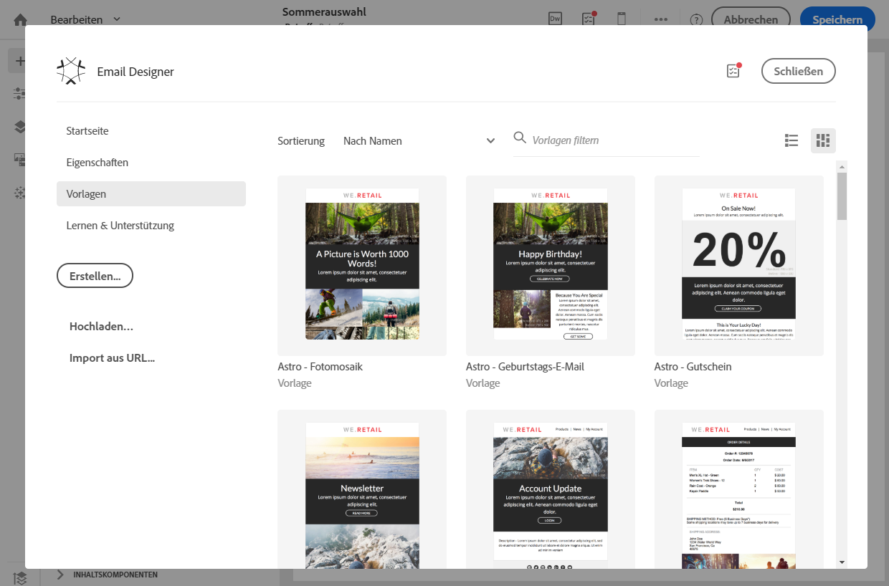
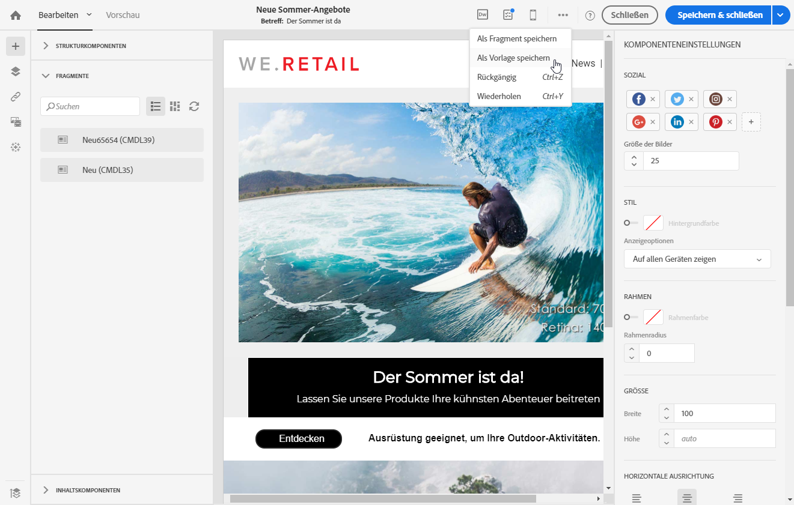
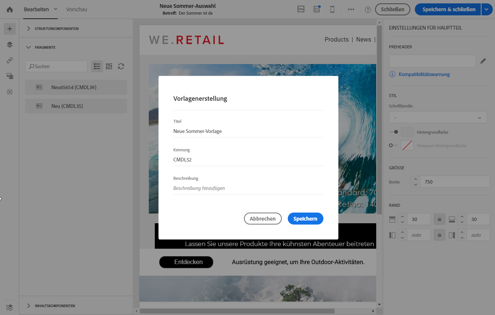

# Über Vorlagen{#about-templates}

## Vorlagen für Marketingaktivitäten {#marketing-activity-templates}

Bei der Erstellung einer Marketingaktivität ist im ersten Schritt des Assistenten ein Aktivitätstyp auszuwählen. Die verfügbaren Typen basieren jeweils auf einer Vorlage. Diese Vorlagen erlauben es, je nach Bedarf gewisse Parameter im Voraus zu konfigurieren. Vorlagen können vollständig oder nur teilweise konfiguriert sein. Die Vorlagenverwaltung erfolgt durch den funktionalen Administrator.

Der Endbenutzer verfügt über eine vereinfachte Benutzeroberfläche. Zur Erstellung einer neuen Marketingaktivität wählt er den gewünschten, auf einer Vorlage basierenden Typ aus. Technische Konfigurationen können ignoriert werden. Dies wurde bereits vom funktionalen Administrator in der Vorlage vorkonfiguriert.

Beispielsweise können Sie im Fall einer E-Mail-Vorlage den HTML-Inhalt, die Audience und andere Versandparameter automatisch ausfüllen lassen: den Zeitplan, die Testprofile, die allgemeinen Eigenschaften Ihrer Sendungen, die erweiterten Parameter etc. Dadurch sparen Sie Zeit bei der Erstellung einer neuen Aktivität.

Für jede Art von Marketingtätigkeit stehen eine oder mehrere außerirdische Vorlagen mit minimaler Konfiguration zur Verfügung. Diese vordefinierten Vorlagen können nicht geändert oder gelöscht werden.

Für folgende Marketingaktivitäten stehen Vorlagen zur Verfügung:

* Programme
* Kampagnen
* E-Mail-Versand
* SMS-Versand
* Push-Benachrichtigungen
* Landingpages
* Workflows
* Dienste
* Import
* Transaktionsnachrichten

Vorlagen werden im Menü **[!UICONTROL Ressourcen]** &gt; **[!UICONTROL Vorlagen]** verwaltet.

>[!NOTE]
>
>Passen Sie bei Bedarf in Ihren E-Mail- oder Landingpage-Vorlagen auch die zu verwendende Marke an. Weiterführende Informationen finden Sie im Abschnitt [Marken](../../administration/using/branding.md).

## Inhaltsvorlagen  {#content-templates}

The HTML content templates are accessible from the **[!UICONTROL Resources]** &gt; **[!UICONTROL Content templates &amp; fragments]** screen of the [Advanced menu](../../start/using/interface-description.md#advanced-menu). Von dort können Sie Anlandeinhalte, E-Mail-Inhalte und Fragmente verwalten.

Die Template aus außerscharbenem Feld werden nur gelesen. Um bearbeitet werden zu können, müssen sie zuerst dupliziert werden.

Sie können neue Muster oder Fragmente schaffen und Ihren eigenen Inhalt definieren. Für mehr dazu siehe [ein Inhaltsmuster](../../start/using/about-templates.md#creating-a-content-template) und [ein Inhaltsfragment](../../designing/using/defining-the-email-structure.md#creating-a-content-fragment).

Wenn man Inhalte mit dem Email-Designer vertreibt, kann man auch Inhalte herstellen, indem man Ihren Inhalt als Fragment oder Vorlage rettet. Mehr dazu: [Sparen Sie Inhalte als Muster](../../start/using/about-templates.md#saving-content-as-template) und [Sparen Sie Inhalte als Fragment](../../designing/using/defining-the-email-structure.md#saving-content-as-a-fragment).

### Verformungen aus dem Feld-Mail-Postmail {#email-content-templates}

You can manage HTML contents that are offered in the **[!UICONTROL Templates]** tab of the [Email Designer](../../designing/using/about-email-content-design.md#about-the-email-designer) home page.

In den Template für die Außerdienststellung werden achtzehn mobile optimierte Gliederungen und vier von Behance-Künstlern entworfene Verhaltensmuster in der besten Schicht erfasst. Diese decken die häufigsten Anwendungsfälle ab, wie Willkommensnachrichten für Kunden, Newsletter und Re-Engagement-E-Mails. In diese Vorlagen können Sie Ihre eigenen Markeninhalte einfügen und müssen dadurch E-Mails nicht von Grund auf neu erstellen.

**Verwandte Themen:**

* [In diesem Video](https://helpx.adobe.com/campaign/kt/acs/using/acs-email_content_templates-feature-video-use.html) erfahren Sie, wie Sie Inhaltsvorlagen personalisieren können.
* Weiterführende Informationen zum Bearbeiten von Inhalten finden Sie im Abschnitt [Über die Inhaltserstellung in E-Mails](../../designing/using/about-email-content-design.md).

### Creating a content template {#creating-a-content-template}

Sie können Ihre eigenen Mustertexte schaffen, um sie so oft wie nötig zu nutzen.

Das folgende Beispiel zeigt, wie ein Muster für E-Mail-Inhalte geschaffen werden kann.

1. Gehen Sie zu **[!UICONTROL Ressourcen]** &gt; **[!UICONTROL Inhaltsvorlagen &amp; Fragmente]** und wählen Sie **[!UICONTROL Erstellen]** aus.
1. Wählen Sie den Titel der E-Mail aus, um auf den Tab **[!UICONTROL Eigenschaften]** in Email Designer zuzugreifen.
1. Geben Sie ein erkennbares Etikett an und wählen Sie die folgenden Parameter aus, um dieses Muster in E-Mails verwenden zu können:

   * Auswahl **[!UICONTROL oder]** **[!UICONTROL Lieferung]** **[!UICONTROL von der]** Aufschlagliste des Inhaltstyps.
   * Auswählen **[!UICONTROL aus]** der **[!UICONTROL HTML]** -Baumusterliste.
   

1. Wenn nötig, können Sie ein Bild setzen, das als ein Tropfen für das Muster benutzt wird. Wählen Sie es in den Vorlageneigenschaften im Tab **[!UICONTROL Miniaturansicht]** l aus.

   

   Dieser Drecksack wird im **[!UICONTROL Templates]** -Tab der Homepage [der Email-Designer](../../designing/using/about-email-content-design.md#about-the-email-designer) angezeigt.

1. Schließ die **[!UICONTROL Immobilien]** ab, um in den Hauptarbeitsraum zurückzukehren.
1. Bauelemente und Inhaltsbestandteile hinzufügen, die Sie je nach Bedarf anpassen können.
   >[!NOTE]
   >
   > Sie können keine Personalisierungsfelder oder bedingtem Inhalt in ein Inhaltsmuster einfügen.
1. Wenn Sie nachgelassen haben, retten Sie Ihre Vorlage.

Dieses Muster kann jetzt in jeder E-Email mit dem Email-Designer verwendet werden. Aus dem **[!UICONTROL Templates]** -Labor der Homepage [Email Designer](../../designing/using/about-email-content-design.md#about-the-email-designer) auswählen.

### Einsparung von Inhalten als Vorlage {#saving-content-as-template}

Bei der Bearbeitung einer E-Email mit dem Email-Designer können Sie den Inhalt dieser E-Email direkt als Vorlage einsparen.

<!--[!CAUTION]
>
>You cannot save as template a structure containing personalization fields or dynamic content.-->

1. Select **[!UICONTROL Save als Vorlage]** von der Email-Designer-Haupttoolbar.

   

1. Bitte geben Sie ein Etikett und eine Beschreibung an, wenn **[!UICONTROL Sie gebraucht]** werden.

   

1. Um das Muster zu finden, das Sie gerade geschaffen haben, gehen Sie zu **[!UICONTROL Ressourcen]** &gt; **[!UICONTROL Inhaltsmuster und Fragmente]**.

1. Um Ihre neue Vorlage zu verwenden, wählen Sie es aus dem **[!UICONTROL Templates]** -Labor der Homepage [Email Designer](../../designing/using/about-email-content-design.md#about-the-email-designer) .

   

