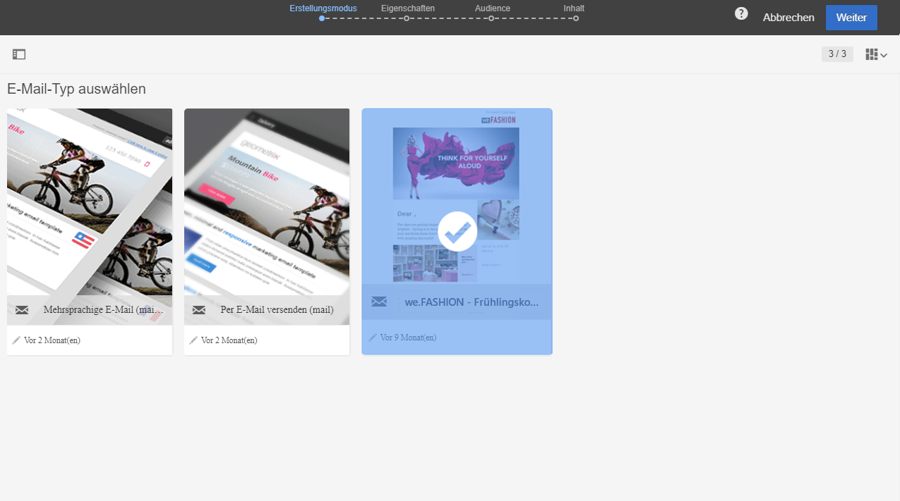
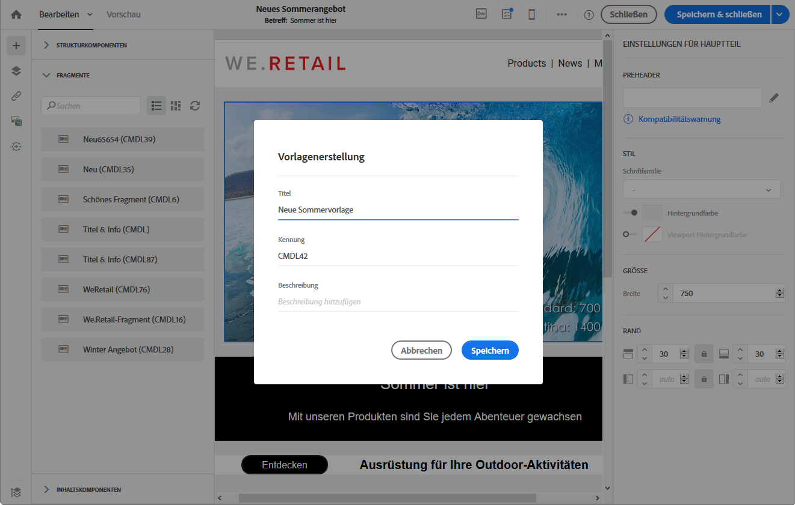

# Über Vorlagen{#about-templates}

## Vorlagen für Marketingaktivitäten {#marketing-activity-templates}

Bei der Erstellung einer Marketingaktivität ist im ersten Schritt des Assistenten ein Aktivitätstyp auszuwählen. Die verfügbaren Typen basieren jeweils auf einer Vorlage. Diese Vorlagen erlauben es, je nach Bedarf gewisse Parameter im Voraus zu konfigurieren. Vorlagen können vollständig oder nur teilweise konfiguriert sein. Die Vorlagenverwaltung erfolgt durch den funktionalen Administrator.

Der Endbenutzer verfügt über eine vereinfachte Benutzeroberfläche. Zur Erstellung einer neuen Marketingaktivität wählt er den gewünschten, auf einer Vorlage basierenden Typ aus. Technische Konfigurationen können ignoriert werden. Dies wurde bereits vom funktionalen Administrator in der Vorlage vorkonfiguriert.

Beispielsweise können Sie im Fall einer E-Mail-Vorlage den HTML-Inhalt, die Audience und andere Versandparameter automatisch ausfüllen lassen: den Zeitplan, die Testprofile, die allgemeinen Eigenschaften Ihrer Sendungen, die erweiterten Parameter etc. Dadurch sparen Sie Zeit bei der Erstellung einer neuen Aktivität.

Für jede Marketing-Aktivität sind standardmäßig eine oder mehrere minimal konfigurierte Vorlagen in der Anwendung enthalten. Diese vordefinierten Vorlagen können nicht geändert oder gelöscht werden.

Für folgende Marketingaktivitäten stehen Vorlagen zur Verfügung:

* Programme
* Kampagnen
* E-Mail-Versand
* SMS-Versand
* Push-Benachrichtigungen
* Landingpages
* Workflows
* Dienste
* Import
* Transaktionsnachrichten

Vorlagen werden im Menü **[!UICONTROL Ressourcen]** &gt; **[!UICONTROL Vorlagen]** verwaltet.

>[!NOTE]
>
>Passen Sie bei Bedarf in Ihren E-Mail- oder Landingpage-Vorlagen auch die zu verwendende Marke an. Weiterführende Informationen finden Sie im Abschnitt [Marken](../../administration/using/branding.md).

## Inhaltsvorlagen {#content-templates}

Der Zugriff auf die HTML-Inhaltsvorlagen erfolgt über das Fenster **[!UICONTROL Ressourcen]** &gt; **[!UICONTROL Inhaltsvorlagen und -fragmente]** in [Erweitertes Menü](../../start/using/interface-description.md#advanced-menu). Dort können Sie Landingpage-Inhaltsvorlagen, E-Mail-Inhaltsvorlagen und Fragmente verwalten.

Die nativen Inhaltsvorlagen sind schreibgeschützt. Um bearbeitet werden zu können, müssen sie zuerst dupliziert werden.

Sie können auch neue Vorlagen oder Fragmente erstellen und eigene Inhalte definieren. Weiterführende Informationen dazu finden Sie in den Abschnitten zum [Erstellen einer Inhaltsvorlage](#creating-a-content-template) und zum [Erstellen eines Inhaltsfragments](../../designing/using/using-reusable-content.md#creating-a-content-fragment).

Bei der Bearbeitung von Inhalt mit Email Designer können Sie auch Inhaltsvorlagen erstellen, indem Sie Inhalt als ein Fragment oder eine Vorlage speichern. Weiterführende Informationen dazu finden Sie in den Abschnitten zum [Speichern von Inhalt als Vorlage](#saving-content-as-template) und zum [Speichern von Inhalt als Fragment](../../designing/using/using-reusable-content.md#saving-content-as-a-fragment).

### Native E-Mail-Inhaltsvorlagen {#email-content-templates}

Sie können HTML-Inhalte verwalten, die im Tab **[!UICONTROL Vorlagen]** auf der Startseite von [Email Designer](../../designing/using/designing-content-in-adobe-campaign.md) verfügbar sind.

Die nativen E-Mail-Inhaltsvorlagen enthalten 18 für Mobilgeräte optimierte Layouts und vier von Behance-Künstlern erstellte responsive Vorlagen. Diese decken die häufigsten Anwendungsfälle ab, wie Willkommensnachrichten für Kunden, Newsletter und Re-Engagement-E-Mails. In diese Vorlagen können Sie Ihre eigenen Markeninhalte einfügen und müssen dadurch E-Mails nicht von Grund auf neu erstellen.

**Verwandte Themen:**

* [In diesem Video](https://helpx.adobe.com/campaign/kt/acs/using/acs-email_content_templates-feature-video-use.html) erfahren Sie, wie Sie Inhaltsvorlagen personalisieren können.
* Weiterführende Informationen zum Bearbeiten von Inhalten finden Sie im Abschnitt [Über die Inhaltserstellung in E-Mails](../../designing/using/designing-content-in-adobe-campaign.md).

### Inhaltsvorlage erstellen {#creating-a-content-template}

Sie können eigene Inhaltsvorlagen erstellen und beliebig oft verwenden.

Das folgende Beispiel zeigt, wie eine E-Mail-Inhaltsvorlage erstellt wird.

1. Gehen Sie zu **[!UICONTROL Ressourcen]** &gt; **[!UICONTROL Inhaltsvorlagen &amp; Fragmente]** und wählen Sie **[!UICONTROL Erstellen]** aus.
1. Wählen Sie den Titel der E-Mail aus, um auf den Tab **[!UICONTROL Eigenschaften]** in Email Designer zuzugreifen.
1. Geben Sie einen charakteristischen Titel an und wählen Sie die folgenden Parameter aus, damit Sie diese Vorlage in E-Mails verwenden können.

   * Wählen Sie **[!UICONTROL Freigegeben]** oder **[!UICONTROL Versand]** in der Dropdownliste **[!UICONTROL Content-Typ]** aus.
   * Wählen Sie **[!UICONTROL Vorlage]** in der Dropdownliste **[!UICONTROL HTML-Typ]** aus.
   

1. Bei Bedarf können Sie ein Bild als Miniaturansicht für diese Vorlage festlegen. Wählen Sie es in den Vorlageneigenschaften im Tab **[!UICONTROL Miniaturansicht]** aus.

   

   Diese Miniaturansicht wird im Tab **[!UICONTROL Vorlagen]** auf der Startseite von [Email Designer](../../designing/using/designing-content-in-adobe-campaign.md) angezeigt.

1. Schließen Sie den Tab **[!UICONTROL Eigenschaften]**, um zum Hauptarbeitsbereich zurückzukehren.
1. Fügen Sie Struktur- und Inhaltskomponenten hinzu, die Sie nach Bedarf anpassen können.
   >[!NOTE]
   >
   > Sie können keine Personalisierungsfelder oder situationsbedingten Inhalt in eine Inhaltsvorlage einfügen.
1. Speichern Sie die Vorlage nach der Bearbeitung.

Diese Vorlage kann jetzt in jeder mit Email Designer erstellten E-Mail verwendet werden. Wählen Sie sie im Tab **[!UICONTROL Vorlagen]** auf der Startseite von [Email Designer](../../designing/using/designing-content-in-adobe-campaign.md) aus.

### Inhalt als Vorlage speichern {#saving-content-as-template}

Bei der Bearbeitung einer E-Mail mit Email Designer können Sie den Inhalt dieser E-Mail direkt als Vorlage speichern.

<!--[!CAUTION]
>
>You cannot save as template a structure containing personalization fields or dynamic content.-->

1. Wählen Sie in der Symbolleiste von Email Designer **[!UICONTROL Als Vorlage speichern]** aus.

   

1. Fügen Sie bei Bedarf einen Titel und eine Beschreibung hinzu und wählen Sie dann **[!UICONTROL Speichern]** aus.

   

1. Um die soeben erstellte Vorlage zu finden, gehen Sie zu **[!UICONTROL Ressourcen]** &gt; **[!UICONTROL Inhaltsvorlagen und -fragmente]**.

1. Um Ihre neue Vorlage zu verwenden, wählen Sie sie im Tab **[!UICONTROL Vorlagen]** in der Startseite von [Email Designer](../../designing/using/designing-content-in-adobe-campaign.md) aus.

   

