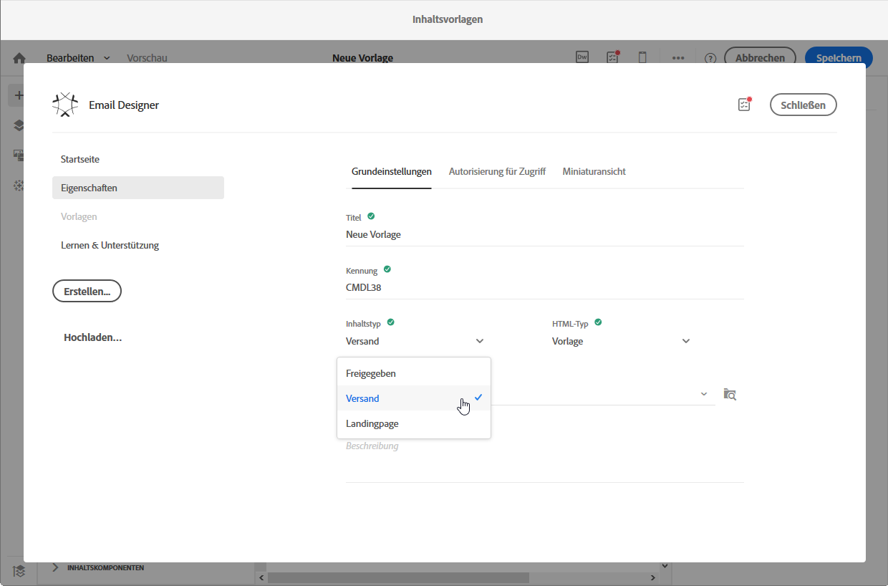

# Über Vorlagen{#about-templates}

## Vorlagen für Marketingaktivitäten {#marketing-activity-templates}

Bei der Erstellung einer Marketingaktivität ist im ersten Schritt des Assistenten ein Aktivitätstyp auszuwählen. Die verfügbaren Typen basieren jeweils auf einer Vorlage. Diese Vorlagen erlauben es, je nach Bedarf gewisse Parameter im Voraus zu konfigurieren. Vorlagen können vollständig oder nur teilweise konfiguriert sein. Die Vorlagenverwaltung erfolgt durch den funktionalen Administrator.

Der Endbenutzer verfügt über eine vereinfachte Benutzeroberfläche. Zur Erstellung einer neuen Marketingaktivität wählt er den gewünschten, auf einer Vorlage basierenden Typ aus. Technische Konfigurationen können ignoriert werden. Dies wurde bereits vom funktionalen Administrator in der Vorlage vorkonfiguriert.

Beispielsweise können Sie im Fall einer E-Mail-Vorlage den HTML-Inhalt, die Audience und andere Versandparameter automatisch ausfüllen lassen: den Zeitplan, die Testprofile, die allgemeinen Eigenschaften Ihrer Sendungen, die erweiterten Parameter etc. Dadurch sparen Sie Zeit bei der Erstellung einer neuen Aktivität.

Für jede Art von Marketingaktivitäten stehen eine oder mehrere Out-of-the-Box-Vorlagen mit minimaler Konfiguration zur Verfügung. Diese vordefinierten Vorlagen können nicht geändert oder gelöscht werden.

Für folgende Marketingaktivitäten stehen Vorlagen zur Verfügung:

* Programme
* Kampagnen
* E-Mail-Versand
* SMS-Versand
* Push-Benachrichtigungen
* Landingpages
* Workflows
* Dienste
* Import
* Transaktionsnachrichten

Vorlagen werden im Menü **[!UICONTROL Ressourcen]** &gt; **[!UICONTROL Vorlagen]** verwaltet.

>[!NOTE]
>
>Passen Sie bei Bedarf in Ihren E-Mail- oder Landingpage-Vorlagen auch die zu verwendende Marke an. Weiterführende Informationen finden Sie im Abschnitt [Marken](../../administration/using/branding.md).

## Inhaltsvorlagen  {#content-templates}

The HTML content templates are accessible from the **[!UICONTROL Resources]** &gt; **[!UICONTROL Content templates &amp; fragments]** screen of the [Advanced menu](../../start/using/interface-description.md#advanced-menu). Von dort aus können Sie Vorlagen für die Landung von Seiteninhalten, E-Mail-Content-Vorlagen und Fragmente verwalten.

Die externen Content-Vorlagen sind schreibgeschützt. Um eine davon zu bearbeiten, müssen Sie zunächst die gewünschte Vorlage duplizieren.

Sie können neue Vorlagen oder Fragmente erstellen und eigene Inhalte definieren. Weitere Informationen hierzu finden Sie unter [Erstellen einer Inhaltsvorlage](../../start/using/about-templates.md#creating-a-content-template) und [Erstellen eines Inhaltsfragments](../../designing/using/using-reusable-content.md#creating-a-content-fragment).

Beim Bearbeiten von Inhalten mit dem E-Mail-Designer können Sie auch Content-Vorlagen erstellen, indem Sie den Inhalt als Fragment oder Vorlage speichern. Weitere Informationen hierzu finden Sie unter [Speichern von Inhalten als Vorlage](../../start/using/about-templates.md#saving-content-as-template) und [Speichern von Inhalten als Fragment](../../designing/using/using-reusable-content.md#saving-content-as-a-fragment).

### Vorlagen für E-Mail-Inhalte außerhalb der Box {#email-content-templates}

You can manage HTML contents that are offered in the **[!UICONTROL Templates]** tab of the [Email Designer](../../designing/using/overview.md) home page.

Die Out-of-the-box E-Mail-Content-Vorlagen beinhalten achtzehn mobile optimierte Layouts und vier erstklassige reaktionsschnelle Vorlagen, die von Behance-Künstlern entwickelt wurden. Diese decken die häufigsten Anwendungsfälle ab, wie Willkommensnachrichten für Kunden, Newsletter und Re-Engagement-E-Mails. In diese Vorlagen können Sie Ihre eigenen Markeninhalte einfügen und müssen dadurch E-Mails nicht von Grund auf neu erstellen.

**Verwandte Themen:**

* [In diesem Video](https://helpx.adobe.com/campaign/kt/acs/using/acs-email_content_templates-feature-video-use.html) erfahren Sie, wie Sie Inhaltsvorlagen personalisieren können.
* Weiterführende Informationen zum Bearbeiten von Inhalten finden Sie im Abschnitt [Über die Inhaltserstellung in E-Mails](../../designing/using/overview.md).

### Creating a content template {#creating-a-content-template}

Sie können eigene Content-Vorlagen erstellen, um sie so oft wie nötig zu verwenden.

Im folgenden Beispiel wird das Erstellen einer E-Mail-Inhaltsvorlage veranschaulicht.

1. Gehen Sie zu **[!UICONTROL Ressourcen]** &gt; **[!UICONTROL Inhaltsvorlagen &amp; Fragmente]** und wählen Sie **[!UICONTROL Erstellen]** aus.
1. Wählen Sie den Titel der E-Mail aus, um auf den Tab **[!UICONTROL Eigenschaften]** in Email Designer zuzugreifen.
1. Geben Sie ein erkennbares Etikett an, und wählen Sie die folgenden Parameter aus, um diese Vorlage in E-Mails verwenden zu können:

   * Wählen Sie in der Dropdown-Liste **[!UICONTROL Inhaltstyp]** die Option **[!UICONTROL Shared]** oder **[!UICONTROL Delivery]** aus.
   * Wählen Sie **[!UICONTROL Vorlage]** aus der Dropdown-Liste **[!UICONTROL HTML-Typ]** .
   

1. Bei Bedarf können Sie ein Bild festlegen, das als Miniaturansicht für die Vorlage verwendet wird. Wählen Sie es in den Vorlageneigenschaften im Tab **[!UICONTROL Miniaturansicht]** l aus.

   

   Diese Miniaturansicht wird auf der **[!UICONTROL Registerkarte Vorlagen]** der Homepage des [E-Mail-Designers](../../designing/using/overview.md) angezeigt.

1. Schließen Sie die Registerkarte **[!UICONTROL Eigenschaften]** , um zum Hauptarbeitsbereich zurückzukehren.
1. Fügen Sie Strukturkomponenten und Inhaltskomponenten hinzu, die Sie nach Bedarf anpassen können.
   >[!NOTE]
   >
   > Sie können keine Personalisierungsfelder oder bedingten Inhalte in eine Inhaltsvorlage einfügen.
1. Nach der Bearbeitung speichern Sie Ihre Vorlage.

Diese Vorlage kann nun in allen E-Mails verwendet werden, die mit dem E-Mail-Designer erstellt wurden. Wählen Sie diese Option auf der **[!UICONTROL Registerkarte Vorlagen]** der Homepage des [E-Mail-Designers](../../designing/using/overview.md) aus.

### Speichern von Inhalten als Vorlage {#saving-content-as-template}

Beim Bearbeiten einer E-Mail mit dem E-Mail-Designer können Sie den Inhalt dieser E-Mail direkt als Vorlage speichern.

<!--[!CAUTION]
>
>You cannot save as template a structure containing personalization fields or dynamic content.-->

1. Wählen Sie in der Hauptleiste des E-Mail-Designers die Option **[!UICONTROL Als Vorlage]** speichern aus.

   

1. Fügen Sie bei Bedarf einen Titel und eine Beschreibung hinzu und wählen Sie dann **[!UICONTROL Speichern]** aus.

   

1. To find the template that you just created, go to **[!UICONTROL Resources]** &gt; **[!UICONTROL Content templates &amp; fragments]**.

1. Um die neue Vorlage zu verwenden, wählen Sie sie auf der Homepage des **E-Mail-Designers[!UICONTROL auf der Registerkarte Vorlagen]** aus.

   

