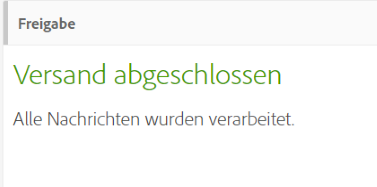
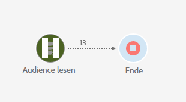
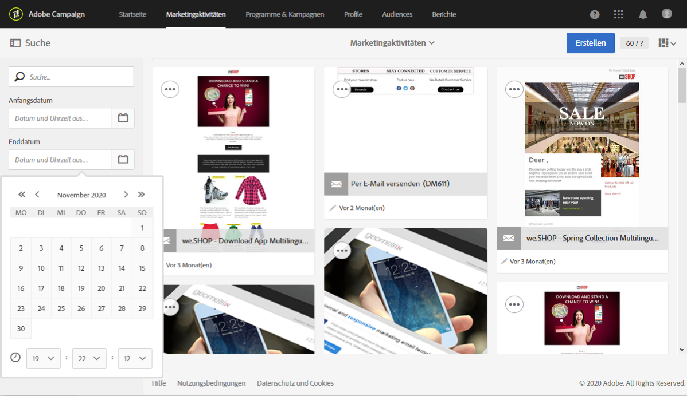
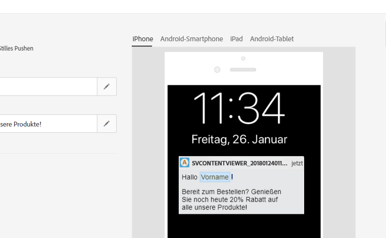
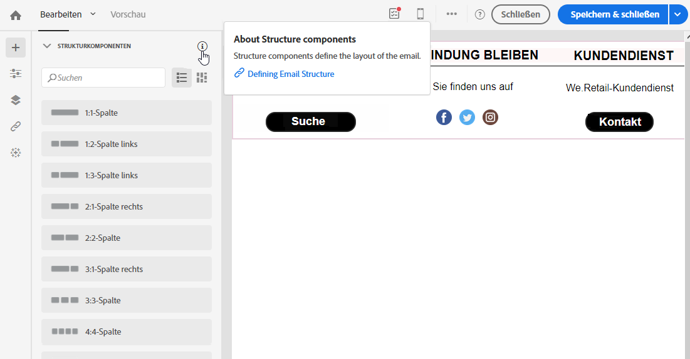

# Barrierefreiheit in Adobe Campaign Standard {#accessibility-acs}

Erfahren Sie mehr über die Unterstützung von Barrierefreiheit in Adobe Campaign Standard Workspace.

Mit Funktionen der Barrierefreiheit sollen Produkte für Menschen mit visuellen, auditiven, kognitiven, motorischen und anderen Behinderungen nutzbar gemacht werden. Beispiele für Funktionen zur Barrierefreiheit von Software-Produkten sind semantisch strukturierte Inhalte, Unterstützung von Bildschirmlesehilfen, Textäquivalente für Grafiken, Tastaturbefehle usw.

Adobe Campaign Standard bietet Funktionen, die die Nutzung erleichtern, wie z. B. Kontrast, Beschriftungen, strukturierte Inhalte, Tastaturnavigation und kontextuelle Hilfe.

## Funktionen zur Barrierefreiheit {#accessibility-features}

### Kontrast und Farbe {#contrast}

Es wurde versucht, in der Benutzeroberfläche von Adobe Campaign Standard genügend Kontrast bereitzustellen, um Benutzern mit Sehbehinderung oder eingeschränkter farblicher Wahrnehmungsfähigkeit ein barrierefreies Seherlebnis zu bieten.

* Großer Text und Überschriften wurden verbessert, um ein Kontrastverhältnis von 3:1 zu erreichen.

   

* Hilfeinhalte und der Textkörper in der Anwendung wurden aktualisiert, um ein Kontrastverhältnis von 4,5:1 zu erreichen.

* Die Symbole zum Aussetzen und Abbrechen von Workflows wurden aktualisiert, um den Kontrast zwischen Hintergrund und Vordergrund zu verbessern.

   

* Farbe, Form und Position sind nicht die einzigen Methoden, mit denen Informationen oder Hierarchien in der Anwendung kommuniziert werden können.

### Benutzeroberfläche {#user-interface}

Die Adobe Campaign Standard-Benutzeroberfläche erleichtert allen Benutzern die Interaktion mit Inhalten, indem sie visuellen Elementen alternative Texte hinzufügt und eine semantische Struktur verwendet, um Informationen sowohl visuell als auch programmatisch zu vermitteln.

* Wenn der Benutzer ein erforderliches ID-Feld leer lässt, zeigt eine Grafik das fehlerhafte Feld mit einem Fehlermeldungstext visuell an. Dieselben Informationen werden Benutzern programmgesteuert mit Hilfstechnologien wie Bildschirmlesehilfen übermittelt.

   

* Inhalte, die beim Bewegen des Mauszeigers oder beim Fokussieren angezeigt werden, können vom Benutzer verworfen werden und verdecken keine anderen Inhalte.

   

* Alternative Texte für Bilder und barrierefreie Namen für Schaltflächen wurden hinzugefügt und können mit Hilfstechnologien vorgelesen werden, sodass der Benutzer nicht ausschließlich auf visuelle Hinweise zur Identifizierung von Elementen angewiesen ist.

<!--
### Create responsive resize for multiple devices {#resize-devices}

When designing for multiple devices and platforms, it's important to create a seamless experience for screen sizes across mobile and desktop resolutions.

Adobe Campaign Standard allows you to design and test emails and push notifications on different devices such as: iPhone, Android devices, iPad, Android tablet and desktop.

-->

## Kontextuelle Hilfe {#contextual-help}

Die kontextuelle Hilfe hilft Ihnen, die verschiedenen erforderlichen Felder und Funktionen besser zu verstehen. Sie führt Sie außerdem durch die Produktdokumentation, wo Sie weitere Informationen über die ausgewählte Funktion erhalten.

Beim Entwerfen einer E-Mail können Sie auf einen Tooltipp zugreifen, der Funktionsbeschreibungen und Links zur Produktdokumentation enthält.

## Unterstützung für Hilfstechnologie {#screen-magnifiers}

Wir sind bestrebt, die Adobe Campaign Standard-Anwendung durch verschiedene Hilfstechnologien so benutzerfreundlich wie möglich zu machen, unter anderem durch modifizierte Tastaturen, Software zur Bildschirmvergrößerung, Bildschirmlesehilfen, Spracherkennungs-Software und andere Hilfsmittel.

## In Ihrer bevorzugten Sprache arbeiten {#languages}

Adobe Campaign Standard ist in verschiedenen Sprachen erhältlich: Englisch, Französisch und Deutsch.

Bitte beachten Sie, dass die Sprache bei der Installation eingerichtet wird und danach nicht mehr geändert werden kann.

## Tastaturbefehle {#shortcuts}

### Startseite {#homepage-shortcuts}

| Aktion | Tastenkombination |
| --- | --- |
| Durch einzelne Elemente der Benutzeroberfläche navigieren | Tab |
| Ausgewähltes Element aktivieren | Eingabetaste oder Leertaste |

### Email Designer {#email-designer-shortcuts}

| Aktion | Windows-Tastaturbefehl | macOS-Tastaturbefehl |
| --- | --- | --- |
| Rückgängig | STRG + Z | Befehl + Z |
| Wiederholen | STRG + Y | Umschalten + Befehl + Z |

### Dynamische Berichte {#report-shortcuts}

| Aktion | Windows-Tastaturbefehl | macOS-Tastaturbefehl |
| --- | --- | --- |
| Projekt öffnen | STRG + O | Befehl + O |
| Speichern | STRG + S | Befehl + S |
| Speichern unter | Umschalten + STRG + S | Umschalten + Befehl + S |
| Projekt aktualisieren | Alt + R | Befehl + R |
| CSV-Datei herunterladen | Umschalten + STRG + V | Umschalten + Befehl + V |
| Drucken | Alt + P | Befehl + P |
| Rückgängig | STRG + Z | Befehl + Z |
| Wiederholen | STRG + Y | Umschalten + Befehl + Z |
| Neues leeres Panel | Alt + B | Option + B |
| Neue Freiform | Alt + A | Option + A |
| Neue Freiformtabelle | Alt + 1 | Option + 1 |
| Neue Zeile | Alt + 2 | Option + 2 |
| Neue Leiste | Alt + 3 | Option + 3 |
| Bericht jetzt senden | Alt + S | Option + S |
| Bericht planmäßig senden | Umschalten + Alt + S | Umschalten + Option + S |
| Terminierte Berichte | Umschalten + Alt + L | <!-- Should be 'Shift + Option + L ' but does not work on Mac --> |

## Weitere Informationen {#further-reading}

Adobe Campaign Standard ist bestrebt, ein wachsendes Maß an Barrierefreiheit zu gewährleisten und das Produkt so benutzerfreundlich wie möglich zu gestalten.

Wir empfehlen Ihnen, das [Adobe Accessibility Feedback-Formular](https://www.adobe.com/accessibility/feedback.html) zu verwenden, um Verbesserungsvorschläge und Probleme mit der Barrierefreiheit zu melden.

Die neuesten Verbesserungen und Funktionen finden Sie in den [Versionshinweisen zu Adobe Campaign Standard](https://experienceleague.adobe.com/docs/campaign-standard/using/release-notes/release-notes.html?lang=de#release-notes).
