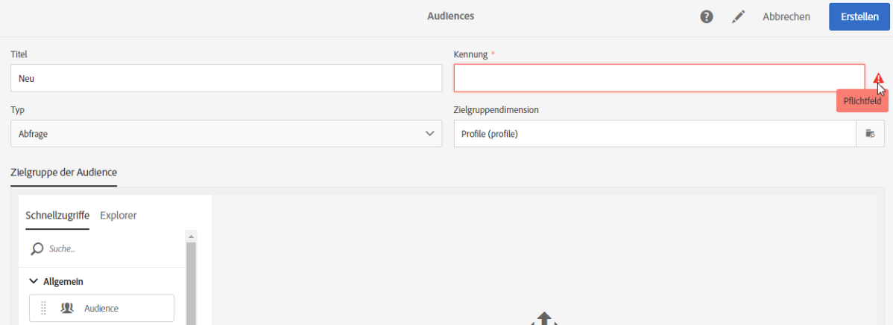

# Barrierefreiheit in Adobe Campaign Standard {#accessibility-acs}

Erfahren Sie mehr über die Barrierefreiheitsunterstützung in Adobe Campaign Standard Workspace.

Barrierefreiheit bedeutet, Produkte für Menschen mit Sehbehinderungen, Hörgeschäften, Kognitionsfähigkeiten, motorischen Störungen und anderen Behinderungen nutzbar zu machen. Beispiele für Barrierefreiheitsfunktionen für Softwareprodukte sind die Unterstützung von Bildschirmlesehilfen, Entsprechungen für Grafiken, Tastaturbefehle, die Änderung von Anzeigefarben in kontrastreiche Farben usw.

Adobe Campaign Standard bietet einige Tools, mit deren Hilfe Sie auf die Verwendung zugreifen können, z. B. Kontrast, Tastaturnavigation, kontextbezogene Hilfe und reaktionsschnelle Größenanpassung.

## Barrierefreiheitsmerkmale {#accessibility-features}

### Kontrast {#contrast}

Die Adobe Campaign Standard-Benutzeroberfläche bietet genügend Kontrast in der Anwendung, um Benutzern mit Sehschwäche oder Farbmangel eine barrierefreie Anzeige zu ermöglichen.

* Die Symbole zum Anhalten und Abbrechen von Workflows wurden aktualisiert, um den Kontrast zwischen Hintergrund und Vordergrund zu verbessern.

   

* Der bei erfolgreichem Versand angezeigte Text enthielt großen grünen Text mit einem unzureichenden Kontrast zwischen Hintergrund und Vordergrund. Der Kontrast wurde mit einem Mindestverhältnis von 3:1 aktualisiert.

   

* Adobe Campaign Standard stellt sicher, dass Farbe, Form oder Position nicht die einzige Methode sind, um Informationen oder Hierarchie zu kommunizieren.

### Benutzeroberfläche {#user-interface}

Die Benutzeroberfläche von Adobe Campaign Standard erleichtert die Anzeige und Wiedergabe von Inhalten, u. a. durch Trennung von Vordergrund und Hintergrund und Hinzufügen alternativer Texte zu den verschiedenen verfügbaren Schaltflächen.

* Wenn der Benutzer ein erforderliches ID-Feld leer lässt, zeigt eine Grafik visuell an, welches Feld mit einem Fehlermeldungstext fehlerhaft ist.

   

* Inhalte, die beim Bewegen des Mauszeigers oder beim Fokus angezeigt werden, können vom Benutzer verworfen werden und verdecken keine anderen Inhalte.

   

* Es wurden alternative Texte für Bildschaltflächen hinzugefügt, die Sie lesen können, anstatt eine Illustration anzuzeigen.

   

* Bei der Verwendung von Listen bleiben die Tabellenkopfzellen nicht leer.

### Responsive Größe für mehrere Geräte erstellen {#resize-devices}

Bei der Entwicklung für mehrere Geräte und Plattformen ist es wichtig, eine nahtlose Darstellung für Bildschirmgrößen über mobile und Desktop-Auflösungen hinweg zu erstellen.

Mit Adobe Campaign Standard können Sie E-Mails und Push-Benachrichtigungen auf verschiedenen Geräten entwerfen und testen, z. B.: iPhone, Android-Geräte, iPad, Android-Tablet und -Desktop.

## Kontextuelle Hilfe {#contextual-help}

Die kontextbezogene Hilfe hilft Ihnen, die verschiedenen erforderlichen Felder und Funktionen besser zu verstehen. Sie führt Sie außerdem durch die Produktdokumentation, um weitere Informationen über die ausgewählte Funktion zu erhalten.

Wenn Sie eine E-Mail entwerfen, können Sie den Cursor über die Informationsschaltfläche bewegen. Eine QuickInfo mit Beschreibungen der Funktionen und Links zur Produktdokumentation wird angezeigt.

## Unterstützung für Bildschirmvergrößerungen {#screen-magnifiers}

Eine Bildschirmlesehilfe liest Text, der auf dem Computerbildschirm angezeigt wird. Es werden auch nicht textuelle Informationen wie Schaltflächenbeschriftungen oder Bildbeschreibungen in der Anwendung gelesen, die in Tags oder Attributen zur Barrierefreiheit bereitgestellt werden.

In Adobe Campaign Standard sind Inhalte und Funktionen auch dann noch verfügbar, wenn der Benutzer die Eigenschaften für den Textabstand außer Kraft setzt.

## Arbeiten Sie in Ihrer bevorzugten Sprache {#languages}

Adobe Campaign Standard ist in verschiedenen Sprachen erhältlich: Englisch, Französisch und Deutsch.

Bitte beachten Sie, dass die Sprache bei der Installation eingerichtet wird und danach nicht mehr geändert werden kann.

## Tastaturbefehle {#shortcuts}

### Homepage {#homepage-shortcuts}

| Tastenkombination | Aktion |
|:-:|:-:|
| Tab | Navigieren durch einzelne Elemente der Benutzeroberfläche |
| Eingabe oder Leerzeichen | Ausgewähltes Element aktivieren |

### E-Mail Designer {#email-designer-shortcuts}

| Tastenkombination | Aktion |
|:-:|:-:|
| STRG + Z | Rückgängig |
| STRG + Y | Wiederherstellen |

### Dynamische Berichte {#report-shortcuts}

| Tastenkombination | Aktion |
|:-:|:-:|
| STRG + O | Projekt öffnen |
| STRG + S | Speichern |
| Umschalt + STRG + S | Speichern unter |
| Alt + R | Projekt aktualisieren |
| Umschalt + STRG + V | CSV herunterladen |
| Alt + P | Drucken |
| STRG + Z | Rückgängig |
| STRG + UMSCHALT + Z | Wiederherstellen |
| Alt + B | Neues leeres Bedienfeld |
| Alt + A | Neuer Freiform |
| Alt + 1 | Neue Freiformtabelle |
| Alt + 2 | Neue Zeile |
| Alt + 3 | Neue Leiste |
| Alt + S | Bericht jetzt senden |
| Umschalt + Alt + S | Bericht planmäßig senden |
| Umschalt = Alt + L | Geplante Berichte |

## Weiterlesen {#further-reading}

Adobe Campaign Standard ist bestrebt, eine immer größere Zugänglichkeit zu gewährleisten und das Produkt so benutzerfreundlich wie möglich zu gestalten.

Wir empfehlen Ihnen, das [Adobe Accessibility Feedback-Formular](https://www.adobe.com/accessibility/feedback.html) zu verwenden, um Verbesserungsvorschläge und Barrierefreiheitsprobleme zu senden, mit denen Sie arbeiten.

Die neuesten Verbesserungen und Funktionen finden Sie unter [Adobe Campaign Standard Versionshinweise](https://experienceleague.adobe.com/docs/campaign-standard/using/release-notes/release-notes.html?lang=en#release-notes).