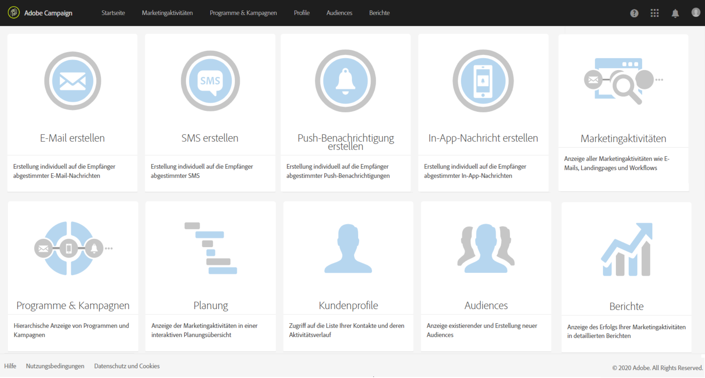

# Kampagnenverwaltung{#campaign-orchestration}

Adobe Campaign ist ein leistungsstarkes kanalübergreifendes Tool zur Kampagnenverwaltung, das es Ihnen ermöglicht, Online- und Offline-Strategien zu kombinieren, um personalisierte Kundenerlebnisse bereitzustellen. Adobe Campaign bietet eine Plattform zur Kampagnenverwaltung – von der Erstellung und Ausführung kanalübergreifender Kampagnen bis hin zu deren Verfolgung. Die Plattform ermöglicht den Versand personalisierter Nachrichten je nach Profil, Verhalten, Vorlieben und Bedürfnissen von Kunden. Sie können damit den gesamten Marketing-Prozess mühelos koordinieren, modellieren und automatisieren und ihn mit anderen Adobe-Lösungen integrieren.

Die wichtigsten Fähigkeiten von Adobe Campaign:

* Erstellung und Erweiterung von Marketing-Datenbanken: Profilverwaltung, Möglichkeiten zum Datenimport und -export, Durchführung von Abfragen;
* Datensegmentierung, Daten-Management und Targeting, um die richtige Nachricht der richtigen Audience zu senden;
* Kanalübergreifende Koordinierung, Verwaltung und Durchführung von Kampagnen mithilfe von Marketingplänen und diversen Marketingaktivitäten: Landingpages, Workflows, Online- und Offline-Nachrichten, Transaktionsnachrichten etc.;
* Erstellung und Versand von Nachrichten auf Online- und Offline-Kommunikationskanälen, einschließlich der Optimierung von E-Mail-Versand für mehrere Geräte durch Tests und responsive Design-Strategien, SMS, Push-Benachrichtigungen und In-App-Nachrichten.
* Berichterstellung, um die Wirkung Ihrer Kampagnen und Ihrer Lösung zu testen, sowie die Möglichkeit, mit dynamischer Berichterstellung eigene Berichte zu erzeugen.

Die wichtigsten Schritte bei der Erstellung und Koordinierung einer Marketingkampagne mit Adobe Campaign sind:

* **Vorbereitung** – In dieser Anfangsphase kann der Benutzer den Zweck und das Ziel der Kampagne formulieren, d. h. den Marketingplan entwickeln, die Zielgruppe identifizieren, den Inhalt und den Erstellungsmodus, das erwartete Ergebnis und das dafür verantwortliche Personal definieren.
* **Zielgruppenbestimmung** – In diesem Arbeitsschritt kann der Benutzer den Datenerfassungsmodus, die Struktur, die Segmentierung, Audiences, Testadressen, Tests, Filterbedingungen etc. bestimmen. Auch An- und Abmeldemöglichkeiten werden in dieser Phase eingerichtet. Siehe [Profile und Audiences](../../audiences/using/about-profiles.md).
* **Erstellen von Nachrichten und Inhalten** – In dieser Phase wird der [Kommunikationskanal](../../channels/using/discovering-communication-channels.md) ausgewählt. Sie können auch [Landingpages](../../channels/using/about-landing-pages.md) erstellen, um Profile zu erfassen oder zu aktualisieren und Ihre Datenbank zu erweitern. Siehe [E-Mails erstellen](../../channels/using/creating-an-email.md), [SMS erstellen](../../channels/using/creating-an-sms-message.md), [Push-Benachrichtigungen erstellen](../../channels/using/preparing-and-sending-a-push-notification.md), [In-App-Nachricht erstellen](../../channels/using/about-in-app-messaging.md), [Briefpost-Versand erstellen](../../channels/using/creating-the-direct-mail.md).
* **Test und Versand** – die Ausführungsphase umfasst die Validierung von Inhalt und Zielgruppe (mittels Vorschau und Testsendungen) sowie den eigentlichen Versand der Nachrichten. Siehe [Test und Versand](../../sending/using/about-sending-messages-with-campaign.md).
* **Monitoring und Berichterstellung** – Im Anschluss an die Ausführung der Kampagne und den Versand der verschiedenen Nachrichten dient diese Phase dem Abruf der Versandstatus, der Trackinginformationen sowie der Analysedaten. Die Kampagnen und Sendungen betreffenden Berichte werden erzeugt, um den Erfolg der Kampagne bzw. das Empfängerverhalten zu verfolgen. See [Reporting-Tools](../../reporting/using/about-dynamic-reports.md).
* **Automatisierung** – In dieser Phase erfolgt die Definition zusätzlicher Faktoren wie der Implementierungsmethoden für Import- und Exportmechanismen, der Datenverwaltung und der Aktualisierungsmodi, der Identifizierung von Personalisierungsdaten etc. Siehe [Workflows und Datenmanagement](../../automating/using/workflow-data-and-processes.md).

