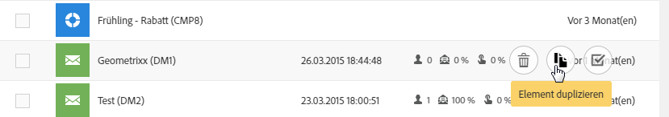
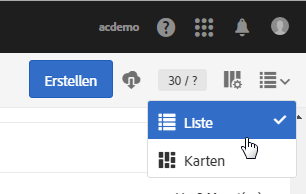
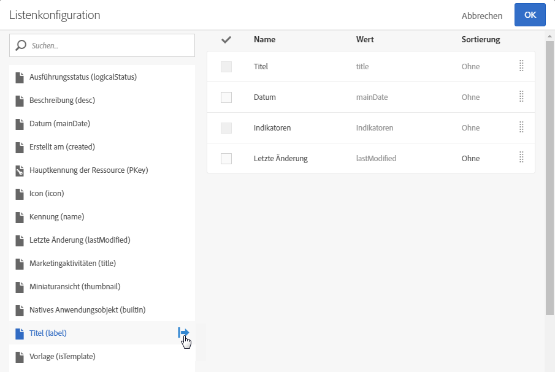

# Listen anpassen{#customizing-lists}

Bildschirme vom Typ **Liste** ermöglichen die Anzeige der Elemente einer oder mehrerer Ressourcen.

Adobe Campaign bietet zwei Arten von Listen:

* **Homogene** Listen enthalten nur Ressourcen eines Typs. Die Profilliste enthält beispielsweise nur Profile.
* **Heterogene** Listen enthalten Ressourcen verschiedener Typen. Die Marketing-Aktivitätenliste beispielsweise enthält Landingpages, Workflows, E-Mails, SMS etc.

Listen werden in Spalten angezeigt. Jede Spalte kann in auf- oder absteigender Reihenfolge einzeln sortiert werden.

Listenelemente können über ihr Kontrollkästchen markiert werden. Die Markierung von einem oder mehreren Elementen ermöglicht verschiedene Aktionen, insbesondere die Bearbeitung, Duplizierung oder das Löschen der ausgewählten Elemente.

Beim Überfahren eines Listenelements mit der Maus werden die **Quick Actions** angezeigt. Diese ermöglichen verschiedene das entsprechende Element betreffende Aktionen wie Bearbeitung, Markierung, Löschung oder Detailanzeige.

Es besteht die Möglichkeit, Spalten einer Liste anzuzeigen oder auszublenden. Gehen Sie wie folgt vor:

1. Stellen Sie zunächst sicher, dass der Bildschirm sich im Anzeigemodus **Liste** befindet.

   

1. Verwenden Sie die Schaltfläche  der Symbolleiste, um auf das Fenster zur Listenkonfiguration zuzugreifen.

   

1. Fügen Sie die anzuzeigenden Spalten hinzu, indem Sie sie in der Liste links im Bildschirm markieren und dann mithilfe der Schaltfläche  der Symbolleiste nach rechts kopieren.

   Die verfügbaren Spalten hängen von der der Liste zugrunde liegenden Ressource ab.

   Geben Sie für jede Spalte an, ob Sie eine Sortierung der Daten wünschen:

   * **[!UICONTROL NO]**: Die Spalte wird nicht sortiert.
   * **[!UICONTROL ASC]**: Die Spalte wird in aufsteigender Reihenfolge sortiert.
   * **[!UICONTROL DESC]**: Die Spalte wird in absteigender Reihenfolge sortiert.

1. Löschen Sie die Spalten, die nicht angezeigt werden sollten, indem Sie die Kästchen der zu löschenden Spalten markieren. Bestätigen Sie dann mit der Schaltfläche  in der Symbolleiste den Löschvorgang.
1. Abschließend können Sie die Reihenfolge der Spaltenanzeige bestimmen, indem Sie die Spalte, deren Platzierung geändert werden soll, markieren. Verwenden Sie dann zum Verschieben der Spalten die Pfeile  und .
1. Bestätigen Sie die Listenkonfiguration mithilfe der Schaltfläche **[!UICONTROL OK]**.

Ihre Liste wird nun Ihrer Konfiguration entsprechend angezeigt.
