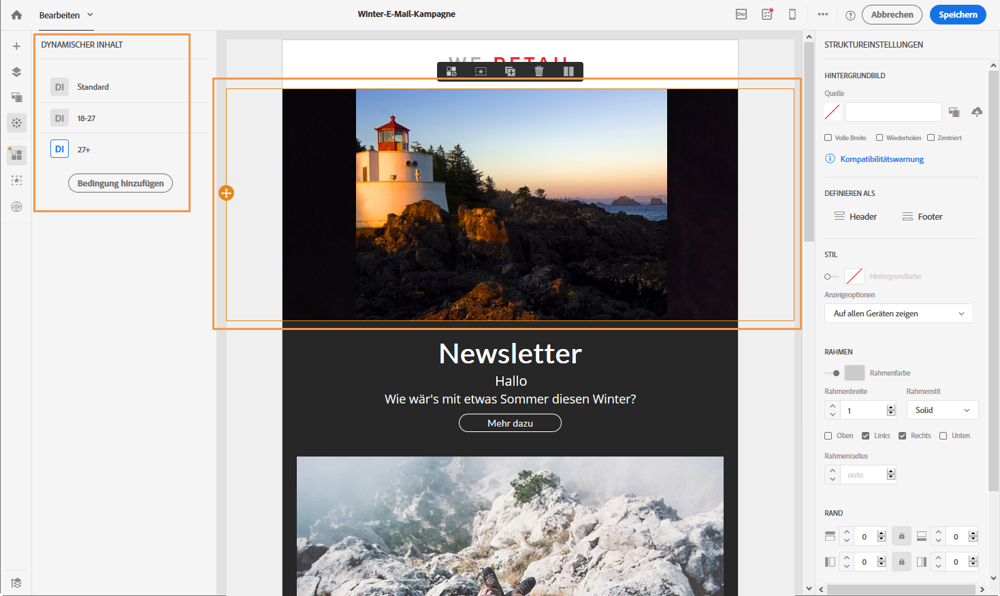
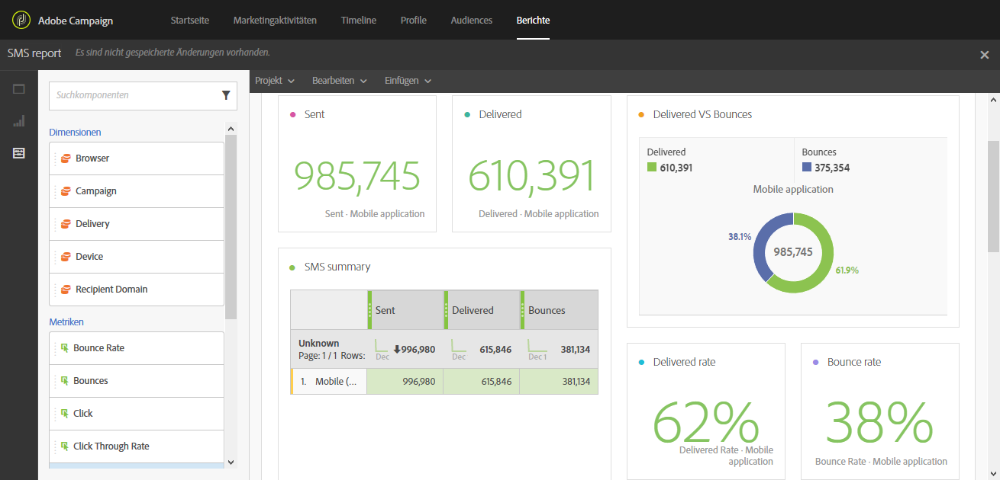

# Nachrichten entwerfen und senden

<table>
<tr>
    <td valign="top">
        
    </td>
    <td valign="top">
        
    </td>
    <td valign="top">
        
    </td>
    <td valign="top">
        
    </td>
    <td valign="top">
        
    </td>
</tr>
<tr>
<td>Sendungen entwerfen</td>
<td>Sendungen erstellen</td>
<td>Sendungen personalisieren und dynamisch gestalten</td>
<td>Sendungen verfolgen und überwachen</td>
<td>Berichte einrichten</td>
</tr>
</table>

## Sendungen entwerfen

Lorem ipsum dolor sit amet, consectetur adipiscing elit. Vestibulum placerat mauris libero, non congue sapien rhoncus id. Integer luctus blandit ligula. Nulla quis vehicula augue, a lacinia risus. Nunc pharetra fringilla enim eu suscipit. Mauris consectetur maximus euismod. Cras et vehicula nulla. Aenean tellus quam, tristique quis risus consectetur, pulvinar elementum dui.

**Mehr dazu**

* xxxx
* xxxx

## Sendungen erstellen

Lorem ipsum dolor sit amet, consectetur adipiscing elit. Vestibulum placerat mauris libero, non congue sapien rhoncus id. Integer luctus blandit ligula. Nulla quis vehicula augue, a lacinia risus. Nunc pharetra fringilla enim eu suscipit. Mauris consectetur maximus euismod. Cras et vehicula nulla. Aenean tellus quam, tristique quis risus consectetur, pulvinar elementum dui.

**Mehr dazu**

* xxxx
* xxxx

## Sendungen personalisieren und dynamisch gestalten

Sichern Sie sich die Aufmerksamkeit Ihrer Kunden und verbessern Sie die Öffnungsrate mithilfe einer weitreichenden Personalisierung von Inhalt und Nachrichten-Headern, die dem jeweiligen Profil, den Vorlieben und dem Verhalten von Kunden angepasst sind. Die Adobe-Campaign-Datenbank aggregiert alle zu Ihren Kontakten verfügbaren Informationen und bietet so die Möglichkeit, ersteren individuelle und relevante Nachrichten über verschiedene Kanäle hinweg anzubieten.

Personalisierte Nachrichten sind wichtig, wenn Sie relevante Inhalte versenden, personalisierte Erlebnisse anbieten und die Öffnungs- und Konversionsraten steigern möchten. Es gibt verschiedene Möglichkeiten, um kanalübergreifende Nachrichten in Adobe Campaign zu personalisieren. Diese Personalisierungsmöglichkeiten können abhängig von den jeweiligen Profilen mit Bedingungen kombiniert werden. Sie haben folgende Möglichkeiten:

* [Dynamische Personalisierungsfelder](../../designing/using/personalization.md#inserting-a-personalization-field) in Ihre Nachrichten einfügen
* [Vordefinierte Personalisierungsbausteine](../../designing/using/personalization.md#adding-a-content-block) einfügen
* [Absender](../../designing/using/subject-line.md) einer E-Mail oder einer SMS personalisieren
* [Betreffzeile](../../designing/using/subject-line.md) einer E-Mail personalisieren oder Funktionen der [prädiktiven Betreffzeile](../../designing/using/subject-line.md#subject-line) verwenden, um sie zu optimieren
* [Bedingten Inhalt in einer E-Mail](../../designing/using/personalization.md#defining-dynamic-content-in-an-email) oder [auf einer Landingpage](../../channels/using/designing-a-landing-page.md#defining-dynamic-content-in-a-landing-page) erstellen
* [Dynamischen Text](../../channels/using/defining-dynamic-text.md) in eine SMS oder eine Push-Benachrichtigung einfügen

**Mehr dazu**

* E-Mail-Personalisierung anhand eines [Beispiels](../../designing/using/personalization.md#example-email-personalization) verstehen
* [URLs personalisieren](../../designing/using/personalization.md#personalizing-urls)
* [Personalisierung eines Bildes einrichten](../../designing/using/personalization.md#personalizing-an-image-source)

## Sendungen verfolgen und überwachen

Adobe Campaign bietet nicht nur leistungsstarke native Reporting-Vorlagen, sondern ermöglicht auch die Erstellung benutzerdefinierter Berichte auf Versand-, Kampagnen-, Benutzer- oder Segmentebene. Verfolgen Sie Ihre Nachrichten und verstehen Sie das Verhalten Ihrer Kunden, indem Sie deren Profile nach und nach mit Daten anreichern. Mithilfe der Reporting- und Analysetools schlagen Sie aus jeder neuen Kampagne Kapital, während Sie Ihre Marketingaktivitäten besser abstimmen und deren Erfolg sowie ihr Kosten-Nutzen-Verhältnis optimieren.

Die Benutzeroberfläche erlaubt einen schnellen und einfachen Zugriff auf die wichtigsten Indikatoren und Versandstatistiken:

Die Benutzeroberfläche für Kampagnenberichte vereinfacht die Erstellung von dynamischen Berichten. Sie können per Drag &amp; Drop Variablen verwenden, um Berichte anzupassen und den Erfolg Ihrer Kampagnen zu analysieren. Je nach der Komplexität Ihrer Abfragen und Berechnungen können Sie die Daten in einer Listenansicht zusammenfassen oder in einem Format darstellen, das die Erstellung von Marketinganalyseberichten vereinfacht.

Mit Adobe Campaign können Sie jeden einzelnen Versand beobachten und verfolgen. Im Nachrichten-Dashboard werden spezielle Logs angezeigt, mit deren Hilfe Prozesse und Regeln verfolgt sowie mögliche Fehler und Warnhinweise erkannt werden können.

**Mehr dazu**

* [Zugriff auf Berichte](../../reporting/using/about-dynamic-reports.md)
* [Sendungen beobachten](../../sending/using/monitoring-a-delivery.md)
* [Nachrichten tracken](../../sending/using/tracking-messages.md)

## Berichte einrichten

Lorem ipsum dolor sit amet, consectetur adipiscing elit. Vestibulum placerat mauris libero, non congue sapien rhoncus id. Integer luctus blandit ligula. Nulla quis vehicula augue, a lacinia risus. Nunc pharetra fringilla enim eu suscipit. Mauris consectetur maximus euismod. Cras et vehicula nulla. Aenean tellus quam, tristique quis risus consectetur, pulvinar elementum dui.

**Mehr dazu**

* xxxx
* xxxx
