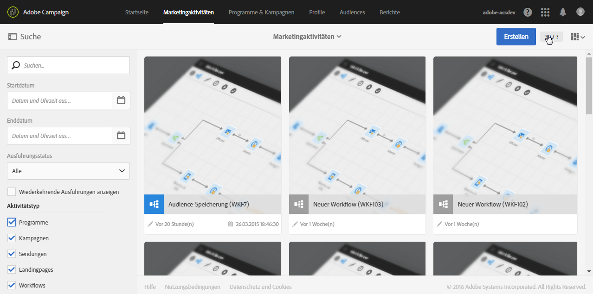

# Benutzeroberfläche{#interface-description}

Adobe Campaign besitzt verschiedene Menüs und Bildschirme zur effektiven Verwaltung Ihrer Kampagnen.

Alle Adobe-Campaign-Bildschirme weisen folgende Elemente auf:

* eine im oberen Bildschirmbereich gelegene Navigationsleiste,
* ein erweitertes Menü zum Zugriff auf spezifische Funktionen und Konfigurationen,
* einen zentralen Arbeitsbereich zur Bearbeitung der verschiedenen Elemente.
* Ein seitliches Fenster, in dem je nach Kontext die angezeigten Elemente gefiltert oder gesucht werden können.

## Startseite   {#home-page}

Die Adobe Campaign-Startseite besteht aus verschiedenen Karten, die einen schnellen Zugriff auf die am häufigsten verwendeten Funktionen bieten. Die Liste der auf der Campaign-Startseite vorhandenen Funktionen hängt von Ihrer Zugriffsberechtigung und den für Ihr Unternehmen konfigurierten Optionen ab.

* Die **[!UICONTROL Create an email]** Karte bringt Sie zum Assistenten zur E-Mail-Erstellung. Sie können insbesondere den E-Mail-Typ bestimmen, die Zielgruppe definieren und den Inhalt erstellen. Weiterführende Informationen finden Sie im Abschnitt [E-Mails erstellen](../../channels/using/creating-an-email.md).
* Die **[!UICONTROL Create an SMS]** Karte bringt Sie zum Assistenten zur SMS-Erstellung. Hier können Sie die Art der SMS festlegen, die Empfänger auswählen und den Inhalt definieren. Weiterführende Informationen finden Sie im Abschnitt [SMS erstellen](../../channels/using/creating-an-sms-message.md).
* Die **[!UICONTROL Create a Direct mail]** Karte bringt Sie zum Assistenten zur Erstellung von Direktnachrichten. Weiterführende Informationen finden Sie im Abschnitt [Push-Benachrichtigungen erstellen](../../channels/using/creating-the-direct-mail.md).
* Die **[!UICONTROL Create a push notification]** Karte bringt Sie zum Assistenten zur Benachrichtigungserstellung. Hier können Sie die Art der Push-Benachrichtigung festlegen, die Empfänger auswählen und den Inhalt definieren. Weiterführende Informationen finden Sie im Abschnitt [Push-Benachrichtigungen erstellen](../../channels/using/preparing-and-sending-a-push-notification.md).
* Mit der **[!UICONTROL Create an InApp message]** Karte gelangen Sie zum InApp-Erstellungsassistenten. Mit diesem Assistenten können Sie den Typ der zu erstellenden In-App-Nachricht auswählen und deren Eigenschaften, Audiences und Inhalte definieren. Weiterführende Informationen finden Sie im Abschnitt [In-App-Nachricht erstellen](../../channels/using/about-in-app-messaging.md).
* The **[!UICONTROL Marketing activities]** card takes you to the complete list of all the activities, programs, and campaigns, particularly emails, SMS, workflows, and landing pages. Die Liste kann nach Name, Datum, Status oder Aktivitätstyp gefiltert werden. Weiterführende Informationen finden Sie im Abschnitt [Liste der Marketingaktivitäten](../../start/using/marketing-activities.md#about-marketing-activities).
* The **[!UICONTROL Programs & campaigns]** card takes you to the list of programs in which you can create, and manage your campaigns. Weiterführende Informationen finden Sie im Abschnitt [Programmliste](../../start/using/programs-and-campaigns.md#about-plans--programs-and-campaigns).
* The **[!UICONTROL Timeline]** card takes you directly to an interactive timeline of your marketing activities, in which you can consult the ongoing programs and their content. Weiterführende Informationen finden Sie im Abschnitt [Planung](../../start/using/timeline.md).
* The **[!UICONTROL Customer profiles]** card takes you directly to the list of profiles. und die Anzeige der jeden einzelnen Kontakt betreffenden Ereignisse. Weiterführende Informationen finden Sie im Abschnitt [Verwaltung von Profilen](../../audiences/using/about-profiles.md).
* Die Karte **[!UICONTROL Audiences]** bietet Zugriff auf die Liste existierender Audiences. Von hier können Sie vorhandene Audiences abrufen und neue erstellen. Weiterführende Informationen finden Sie im Abschnitt [Verwaltung von Audiences](../../audiences/using/about-audiences.md).

## Symbolleiste   {#top-bar}

Die Symbolleiste ist in jedem Bildschirm sichtbar und ermöglicht die Navigation durch die Funktionen von Adobe Campaign sowie den Zugriff auf die Benutzerdaten Ihres Adobe-Benutzerprofils, auf Benachrichtigungen, auf andere Dienste und Lösungen von Adobe Experience Cloud sowie auf die Dokumentation.

Folgende Navigationsprinzipien kommen zur Anwendung:

* The **[!UICONTROL Adobe Campaign]** logo in the top left-hand corner of the page gives you access to the advanced capabilities and configurations. Die angezeigten Menüs hängen von Ihrem Profil und Ihren Zugriffsberechtigungen ab.

   Das erweiterte Menü wird im Abschnitt [erweitertes Menü](#advanced-menu) beschrieben.

* The **[!UICONTROL Home]** link allows you to display the Adobe Campaign home page.
* Über die **[!UICONTROL Marketing activities]**-, **[!UICONTROL Programs & Campaigns]**-, **[!UICONTROL Profiles]**- **[!UICONTROL Audiences]** und **[!UICONTROL Reports]** -Links können Sie auf die mit diesen Funktionen verknüpften Ansichten zugreifen.
* The **[!UICONTROL Help]** button gives access to the product documentation and contextual help, release notes, version numbers, legal notices, as well as the links to the Adobe Experience Cloud community and customer care.

   

* Über das Symbol zur **Lösungsauswahl** können Sie zu einer anderen Adobe Experience Cloud-Lösung sowie zu den Profileinstellungen wechseln.
* Im Symbol **Benachrichtigungen** werden die aktuellen Warnungen oder Informationen angezeigt.
* Das **Benutzer**-Symbol ermöglicht die Anzeige von Informationen zu Ihrem Profil. Es gibt Zugriff auf die **[!UICONTROL Sign out]** Schaltfläche.

## Erweitertes Menü {#advanced-menu}

Verwenden Sie das **Adobe Campaign**-Symbol oben links im Bildschirm, um auf das erweiterte Menü zuzugreifen. Das erweiterte Menü variiert je nach Vertrag und Benutzerberechtigung.

Dieses Menü dient der Navigation zu spezifischen Funktionen und Konfigurationen.

### Marketingpläne   {#marketing-plans}

The **[!UICONTROL Marketing plans]** icon gives you access the following functionalities:

* **[!UICONTROL Marketing activities]** - Weitere Informationen finden Sie im Abschnitt Liste zur [Marketing-Aktivität](../../start/using/marketing-activities.md#about-marketing-activities) .
* **[!UICONTROL Programs & Campaigns]** - Weitere Informationen finden Sie im Abschnitt [Programm Liste](../../start/using/programs-and-campaigns.md#about-plans--programs-and-campaigns) .
* **[!UICONTROL Timeline]** - Weitere Informationen finden Sie im Abschnitt [Zeitschiene](../../start/using/timeline.md) .
* **[!UICONTROL Transactional messages]**, der die Untermenüs enthält **[!UICONTROL Deliveries]** und **[!UICONTROL Event configuration]** - für weitere Informationen, lesen Sie den Abschnitt [Transaktionsnachrichten](../../channels/using/about-transactional-messaging.md) .

### Profile &amp; Audiences {#profiles-e-audiences}

The **[!UICONTROL Profiles & audiences]** icon gives you access to the following functionalities:

* **[!UICONTROL Profiles]** - Weitere Informationen finden Sie im Abschnitt [Verwalten von Profilen](../../audiences/using/about-profiles.md) .
* **[!UICONTROL Test profiles]** - Weitere Informationen finden Sie im Abschnitt [Verwalten von Test-Profilen](../../audiences/using/managing-test-profiles.md) .
* **[!UICONTROL Audiences]** - siehe Abschnitt [Verwaltung von Audiences](../../audiences/using/about-audiences.md).
* **[!UICONTROL Services]** - Weitere Informationen finden Sie im Abschnitt [Erstellen eines Dienstes](../../audiences/using/creating-a-service.md) .

### Ressourcen {#resources}

The **[!UICONTROL Resources]** icon gives you access to the following functionalities:

* **[!UICONTROL Templates]**, der die Untermenüs für jeden Vorlagentyp enthält. Weitere Informationen finden Sie im Abschnitt Vorlagen [verwalten](../../start/using/marketing-activity-templates.md) .
* **[!UICONTROL Content blocks]** - Weitere Informationen finden Sie im Abschnitt [Hinzufügen eines Inhaltsblocks](../../designing/using/personalization.md#adding-a-content-block) .
* **[!UICONTROL Content templates & fragments]** - Weitere Informationen finden Sie im Abschnitt [Inhaltsvorlage](../../designing/using/using-reusable-content.md#content-templates) .

### Administration {#administration}

Über das Symbol **[!UICONTROL Administration]** erhalten Sie Zugriff auf die erweiterten Funktionen, die nur vom funktionalen Administrator ausgeführt werden können. Weiterführende Informationen hierzu finden Sie im Abschnitt [Administration](../../administration/using/about-administrating-adobe-campaign.md).

## Zentraler Bereich   {#central-zone}

Der zentrale Arbeitsbereich der Benutzeroberfläche besteht aus einer dynamischen Zone, die beispielsweise eine Liste von Elementen oder diverse Karten enthält. Hier können die einzelnen Elemente bearbeitet oder neue Ressourcen erstellt werden.

Der Inhalt und das Anzeigeformat des zentralen Arbeitsbereichs kann variieren:

* Eine **Liste** mit verschiedenen Elementen wie Programms, Kampagnen, Profile usw. Diese Elemente können im **[!UICONTROL Card]** oder im **[!UICONTROL List]** Modus angezeigt werden. Die Anzeige der Elemente kann mithilfe der Moduswechsel-Schaltfläche von Karten zu Liste (oder umgekehrt) geändert werden. Jedes Element enthält Indikatoren.

   

   Ein Zähler gibt Auskunft über die Anzahl der vorhandenen Elemente. Bei mehr als 30 Elementen wird die tatsächliche Anzahl durch Klick auf den Zähler angezeigt.

* Er kann die Form eines **Dashboards** annehmen, das die Konfigurationen einer Aktivität zusammenfassend darstellt. In diesem Fall ermöglichen interaktive Kacheln die Trennung und unabhängige Konfiguration der verschiedenen Konzepte.

   

* Er kann - bei Erstellung eines neuen Elements - die Form eines **Auswahlbildschirms** annehmen, der die Auswahl des Elementtyps (Kampagnen, Sendungen etc.) ermöglicht. Der gleiche Auswahlbildschirm steht beim Zugriff auf Berichte zur Verfügung.

   

* Für Workflows und den Abfrageeditor wird der **Arbeitsbereich** um eine Palette ergänzt, die die Konzeption des gewünschten Objekts ermöglicht.

   Die Elemente können aus der Palette in den Arbeitsbereich gezogen und zur Konfiguration des aktuellen Objekts verwendet werden.

   

## Symbolleiste   {#action-bar}

Die im oberen Bildschirmbereich angezeigte Symbolleiste enthält für den aktuellen Bereich verfügbare Aktionsschaltflächen.

Die angezeigten Schaltflächen können allgemeiner Natur sein (Suche, Filter etc.) oder aber spezifisch für den jeweiligen Bildschirm:

* Schaltflächen bezüglich der **Arbeitsbereiche** werden im jeweiligen Abschnitt zur [Symbolleiste](../../automating/using/workflow-interface.md#action-bar) im Workflow-Handbuch erläutert.
* Schaltflächen bezüglich **Dashboards** werden im Abschnitt [Nachrichten-Dashboards](../../channels/using/message-dashboard.md) näher erläutert.
* Schaltflächen bezüglich **Listen** werden unten stehend im Abschnitt [Listen anpassen](../../start/using/customizing-lists.md) erläutert.
