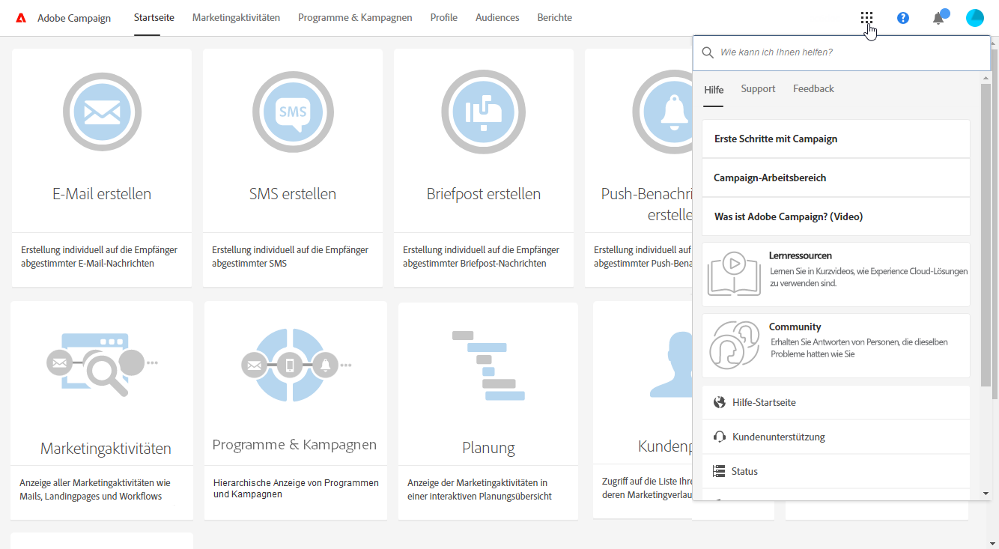

# Beschreibung der Benutzeroberfläche{#interface-description}

Adobe Campaign besitzt verschiedene Menüs und Bildschirme zur effektiven Verwaltung Ihrer Kampagnen.

Alle Adobe-Campaign-Bildschirme weisen folgende Elemente auf:

* eine im oberen Bildschirmbereich gelegene Navigationsleiste,
* ein erweitertes Menü zum Zugriff auf spezifische Funktionen und Konfigurationen,
* einen zentralen Arbeitsbereich zur Bearbeitung der verschiedenen Elemente.
* ein seitliches Panel, in dem je nach Kontext die angezeigten Elemente gefiltert oder gesucht werden können.

## Startseite {#home-page}

Die Adobe Campaign-Startseite besteht aus verschiedenen Karten, die einen schnellen Zugriff auf die am häufigsten verwendeten Funktionen bieten. Die Liste der auf der Campaign-Startseite vorhandenen Funktionen hängt von Ihrer Zugriffsberechtigung und den für Ihr Unternehmen konfigurierten Optionen ab.

* Die Karte **[!UICONTROL E-Mail erstellen]** bietet Zugriff auf einen Assistenten, der Schritt für Schritt durch die Konzeption Ihrer E-Mail führt. Sie können insbesondere den E-Mail-Typ bestimmen, die Zielgruppe definieren und den Inhalt erstellen. Weiterführende Informationen finden Sie im Abschnitt [E-Mails erstellen](../../channels/using/creating-an-email.md).
* Die Karte **[!UICONTROL SMS erstellen]** bietet Zugriff auf einen SMS-Erstellungs-Assistenten. Hier können Sie die Art der SMS festlegen, die Empfänger auswählen und den Inhalt definieren. Weiterführende Informationen finden Sie im Abschnitt [SMS erstellen](../../channels/using/creating-an-sms-message.md).
* Die Karte **[!UICONTROL Briefpost erstellen]** bietet Zugriff auf einen Erstellungsassistenten für Briefpost. Weiterführende Informationen finden Sie im Abschnitt [Push-Benachrichtigungen erstellen](../../channels/using/creating-the-direct-mail.md).
* Die Karte **[!UICONTROL Push-Benachrichtigung erstellen]** bietet Zugriff auf einen Erstellungs-Assistenten für Benachrichtigungen. Hier können Sie die Art der Push-Benachrichtigung festlegen, die Empfänger auswählen und den Inhalt definieren. Weiterführende Informationen finden Sie im Abschnitt [Push-Benachrichtigungen erstellen](../../channels/using/preparing-and-sending-a-push-notification.md).
* Die Karte **[!UICONTROL In-App-Nachricht erstellen]** bietet Zugriff auf einen In-App-Erstellungs-Assistenten. Mit diesem Assistenten können Sie den Typ der zu erstellenden In-App-Nachricht auswählen und deren Eigenschaften, Audiences und Inhalte definieren. Weiterführende Informationen finden Sie im Abschnitt [In-App-Nachricht erstellen](../../channels/using/about-in-app-messaging.md).
* Die Karte **[!UICONTROL Marketingaktivitäten]** bietet Zugriff auf eine Liste aller Programme, Kampagnen und Marketingaktivitäten (E-Mails, SMS, Workflows, Landingpages), unabhängig vom Programm oder der Kampagne, der letztere angehören. Die Liste kann nach Name, Datum, Status oder Aktivitätstyp gefiltert werden. Weiterführende Informationen finden Sie im Abschnitt [Liste der Marketingaktivitäten](../../start/using/marketing-activities.md#about-marketing-activities).
* Die Karte **[!UICONTROL Programme &amp; Kampagnen]** bietet Zugriff auf die Liste aller Programme. Sie können an dieser Stelle insbesondere Kampagnen erstellen und verwalten. Weiterführende Informationen finden Sie im Abschnitt [Programmliste](../../start/using/programs-and-campaigns.md#about-plans--programs-and-campaigns).
* Die Karte **[!UICONTROL Planung]** bietet Zugriff auf eine zeitliche Übersicht Ihrer Marketingaktivitäten. Der Bildschirm bietet die Möglichkeit, aktuelle Programme und deren Inhalt anzuzeigen. Weiterführende Informationen finden Sie im Abschnitt [Planung](../../start/using/timeline.md).
* Die Karte **[!UICONTROL Kundenprofile]** bietet Zugriff auf die Liste aller in der Datenbank gespeicherten Kontakte und die Anzeige der jeden einzelnen Kontakt betreffenden Ereignisse. Weiterführende Informationen finden Sie im Abschnitt [Verwaltung von Profilen](../../audiences/using/about-profiles.md).
* Die Karte **[!UICONTROL Audiences]** bietet Zugriff auf die Liste existierender Audiences. Von hier können Sie vorhandene Audiences abrufen und neue erstellen. Weiterführende Informationen finden Sie im Abschnitt [Verwaltung von Audiences](../../audiences/using/about-audiences.md).

## Symbolleiste {#top-bar}

Die Symbolleiste ist in jedem Bildschirm sichtbar und ermöglicht die Navigation durch die Funktionen von Adobe Campaign sowie den Zugriff auf die Benutzerdaten Ihres Adobe-Benutzerprofils, auf Benachrichtigungen, auf Adobe Experience Cloud-Lösungen sowie auf die Campaign-Dokumentation.

Folgende Navigationsprinzipien kommen zur Anwendung:

* Über das **Adobe**-Logo oben links im Bildschirm haben Sie Zugriff auf erweiterte Funktionen und Konfigurationen. Die angezeigten Menüs hängen von Ihrem Profil und Ihren Zugriffsberechtigungen ab.

   Das erweiterte Menü wird im Abschnitt [erweitertes Menü](#advanced-menu) beschrieben.

* Verwenden Sie den **[!UICONTROL Startseite]**-Link, um die Adobe-Campaign-Startseite anzuzeigen.
* Über die Links **[!UICONTROL Marketingaktivitäten]**, **[!UICONTROL Programme &amp; Kampagnen]**, **[!UICONTROL Profile]**, **[!UICONTROL Audiences]** und **[!UICONTROL Berichte]** gelangen Sie zu den diese Funktionen betreffenden Bildschirmen.
* Mit dem Symbol **Lösungsschalter** können Sie zwischen Ihren Organisationen oder zu einer anderen Anwendung wechseln.
* Das Symbol **[!UICONTROL Hilfe]** wird [unten](#help) beschrieben.
* Im Symbol **Benachrichtigungen** werden die aktuellen Warnungen oder Informationen angezeigt.
* Das **Benutzer**-Symbol ermöglicht die Anzeige von Informationen zu Ihrem Profil. Verwenden Sie dieses Symbol, wenn Sie sich **[!UICONTROL abmelden]** müssen.

### Hilfe {#help}

Über das Symbol **Hilfe** oben rechts können Sie Adobe Experience League aufrufen.

Verwenden Sie das Feld **[!UICONTROL Suchen]**, um Anleitungen zu finden. In den Suchergebnissen finden Sie Dokumentations- und Hilfeartikel, Ergebnisse aus Community-Foren und Videoinhalte, damit Sie weitere Inhalte einfacher aufrufen und die Anwendung optimal nutzen können.

Auf drei Tabs finden Sie Hilfe und Unterstützung:

1. Der Tab **[!UICONTROL Hilfe]** enthält:
   * einen schnellen Zugriff auf die Dokumentation von Adobe Campaign Standard mit kontextbezogenen Links.
   * den Link **[!UICONTROL Lernen]**, über den Sie auf die Adobe Campaign-Kursbibliothek zugreifen können.
   * den Link **[!UICONTROL Community]**, über den Sie auf das Forum zugreifen können, das sich mit Ihren Fragen zu Campaign beschäftigt.
   * einen direkten Zugriff auf: Hilfezentrum, Kundenunterstützung, Experience Cloud-Produktstatus, Entwicklerverbindung, Versionshinweise, Versionsplanung und den Bildschirm **[!UICONTROL Info]**.
1. Mit dem Tab **[!UICONTROL Support]** können Sie einen Support-Fall erstellen und uns per Telefon oder Twitter kontaktieren.
1. Der Tab **[!UICONTROL Feedback]** ermöglicht die Meldung von Problemen oder die Übermittlung von Ideen.

## Erweitertes Menü {#advanced-menu}

Klicken Sie auf das **Adobe Campaign**-Symbol oben links im Bildschirm, um auf das erweiterte Menü zuzugreifen. Das erweiterte Menü variiert je nach Vertrag und Benutzerberechtigung.

Dieses Menü dient der Navigation zu spezifischen Funktionen und Konfigurationen.

### Marketingpläne             {#marketing-plans}

Über das Symbol **[!UICONTROL Marketingpläne]** gelangen Sie zu folgenden Funktionen:

* **[!UICONTROL Marketingaktivitäten]** - siehe Abschnitt [Liste der Marketingaktivitäten](../../start/using/marketing-activities.md#about-marketing-activities).
* **[!UICONTROL Programme &amp; Kampagnen]** - siehe Abschnitt [Programmliste](../../start/using/programs-and-campaigns.md#about-plans--programs-and-campaigns).
* **[!UICONTROL Planung]** - siehe Abschnitt [Planung](../../start/using/timeline.md).
* **[!UICONTROL Transaktionsnachrichten]** mit den Untermenüs **[!UICONTROL Sendungen]** und **[!UICONTROL Ereigniskonfiguration]** – siehe Abschnitt [Transaktionsnachrichtenversand](../../channels/using/getting-started-with-transactional-msg.md).

### Profile &amp; Audiences {#profiles-e-audiences}

Über das Symbol **[!UICONTROL Profile &amp; Audiences]** gelangen Sie zu folgenden Funktionen:

* **[!UICONTROL Profile]** - siehe Abschnitt [Verwaltung von Profilen](../../audiences/using/about-profiles.md).
* **[!UICONTROL Testprofile]** - siehe Abschnitt [Verwaltung von Testprofilen](../../audiences/using/managing-test-profiles.md).
* **[!UICONTROL Audiences]** - siehe Abschnitt [Verwaltung von Audiences](../../audiences/using/about-audiences.md).
* **[!UICONTROL Dienste]** - siehe Abschnitt [Dienst erstellen](../../audiences/using/creating-a-service.md).

### Ressourcen {#resources}

Über das Symbol **[!UICONTROL Ressourcen]** gelangen Sie zu folgenden Funktionen:

* **[!UICONTROL Vorlagen]** mit Untermenüs zu jedem Vorlagentyp - siehe Abschnitt [Marketingaktivitäten-Vorlagen](../../start/using/marketing-activity-templates.md).
* **[!UICONTROL Inhaltsbausteine]** - siehe Abschnitt [Inhaltsbausteine](../../designing/using/personalization.md#adding-a-content-block).
* **[!UICONTROL Inhaltsvorlagen und -fragmente]** - siehe Abschnitt [Inhaltsvorlage](../../designing/using/using-reusable-content.md#content-templates).

### Administration {#administration}

Über das Symbol **[!UICONTROL Administration]** erhalten Sie Zugriff auf die erweiterten Funktionen, die nur vom funktionalen Administrator ausgeführt werden können. Weiterführende Informationen hierzu finden Sie im Abschnitt [Administration](../../administration/using/get-started-campaign-administration.md).

## Zentraler Bereich             {#central-zone}

Der zentrale Arbeitsbereich der Benutzeroberfläche besteht aus einer dynamischen Zone, die beispielsweise eine Liste von Elementen oder diverse Karten enthält. Hier können die einzelnen Elemente bearbeitet oder neue Ressourcen erstellt werden.

Der Inhalt und das Anzeigeformat des zentralen Arbeitsbereichs können variieren:

* Er kann die Form einer **Übersicht** im **[!UICONTROL Karten]**- oder **[!UICONTROL Listen]**-Modus annehmen, die diverse Elemente (beispielsweise Programme, Kampagnen, Profile etc.) enthält. Die Anzeige der Elemente kann mithilfe der Moduswechsel-Schaltfläche von Karten zu Liste (oder umgekehrt) geändert werden. Jedes Element enthält Indikatoren.

   

   Ein Zähler gibt Auskunft über die Anzahl der vorhandenen Elemente. Bei mehr als 30 Elementen wird die tatsächliche Anzahl durch Klick auf den Zähler angezeigt.

* Er kann die Form eines **Dashboards** annehmen, das die Konfigurationen einer Aktivität zusammenfassend darstellt. In diesem Fall ermöglichen interaktive Kacheln die Trennung und unabhängige Konfiguration der verschiedenen Konzepte.

   

* Er kann - bei Erstellung eines neuen Elements - die Form eines **Auswahlbildschirms** annehmen, der die Auswahl des Elementtyps (Kampagnen, Sendungen etc.) ermöglicht. Der gleiche Auswahlbildschirm steht beim Zugriff auf Berichte zur Verfügung.

   

* Für Workflows und den Abfrageeditor wird der **Arbeitsbereich** um eine Palette ergänzt, die die Konzeption des gewünschten Objekts ermöglicht.

   Die Elemente können aus der Palette in den Arbeitsbereich gezogen und zur Konfiguration des aktuellen Objekts verwendet werden.

   

## Symbolleiste             {#action-bar}

Die im oberen Bildschirmbereich angezeigte Symbolleiste enthält für den aktuellen Bereich verfügbare Aktionsschaltflächen.

Die angezeigten Schaltflächen können allgemeiner Natur sein (Suche, Filter etc.) oder aber spezifisch für den jeweiligen Bildschirm:

* Schaltflächen bezüglich der **Arbeitsbereiche** werden im jeweiligen Abschnitt zur [Symbolleiste](../../automating/using/workflow-interface.md#action-bar) im Workflow-Handbuch erläutert.
* Schaltflächen bezüglich **Dashboards** werden im Abschnitt [Nachrichten-Dashboards](../../channels/using/message-dashboard.md) näher erläutert.
* Schaltflächen bezüglich **Listen** werden unten stehend im Abschnitt [Listen anpassen](../../start/using/customizing-lists.md) erläutert.
