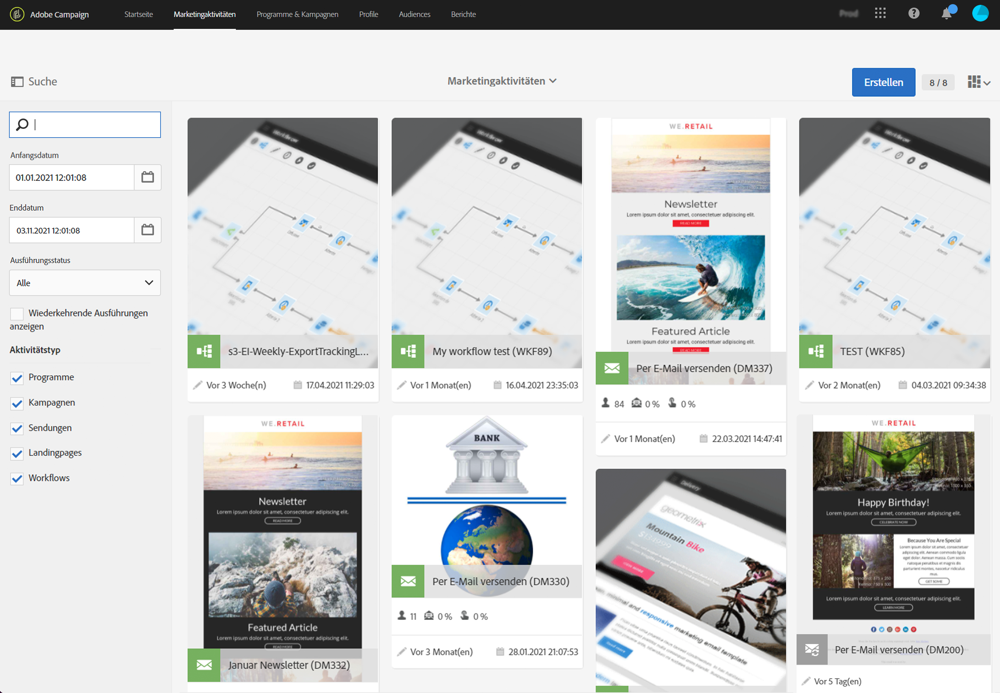
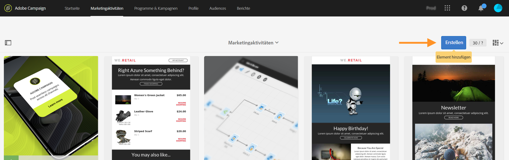
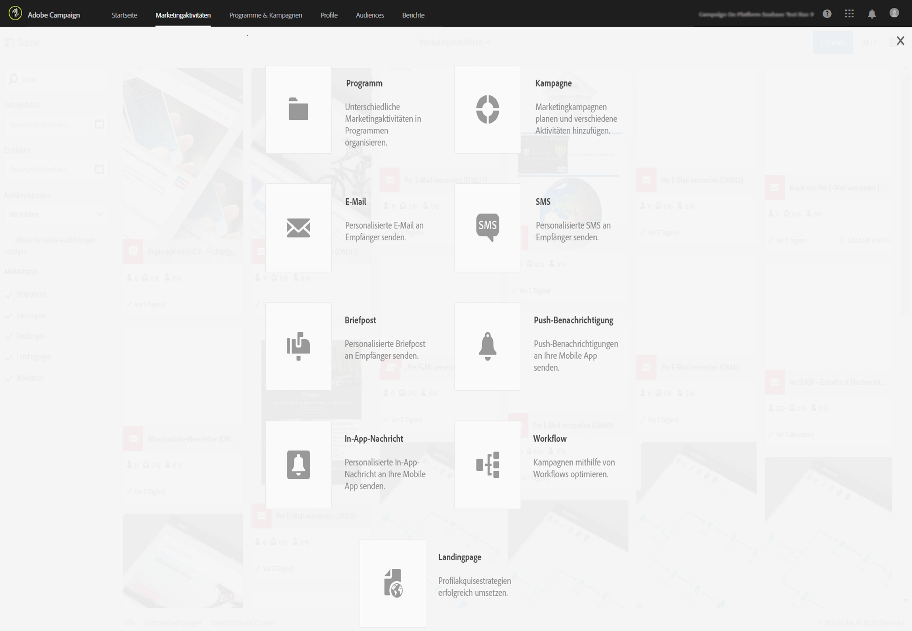

# Marketing-Aktivitäten{#marketing-activities}

## Über Marketing-Aktivitäten {#about-marketing-activities}

Marketingaktivitäten können entweder ausgehend von ihnen übergeordneten Programmen und Kampagnen erstellt und verwaltet werden, oder aber über die Liste der Marketingaktivitäten.

Die Marketingaktivitätenliste enthält alle existierenden Aktivitäten, unabhängig von den Programmen oder Kampagnen, in denen sie erstellt wurden. Programme, Kampagnen, Sendungen (E-Mails, SMS und Push-Benachrichtigungen), Landingpages und Workflows werden ohne Berücksichtigung hierarchischer Strukturen gelistet.

Wählen Sie den Link **[!UICONTROL Marketingaktivitäten]** aus der Symbolleiste am oberen Bildschirmrand aus, um auf die Liste der Marketingaktivitäten zuzugreifen.

>[!NOTE]
>
>Auf die Liste kann ebenfalls von der Startseite ausgehend unter Verwendung der **[!UICONTROL Marketingaktivitäten]**-Karte zugegriffen werden.

Das **[!UICONTROL Suche]**-Menü erlaubt die Filterung der angezeigten Elemente nach unterschiedlichen Kriterien: nach Name (Titel und Kennung), Datum, Status oder Aktivitätstyp. Standardmäßig sind alle Aktivitätstypen, Programme ausgenommen, ausgewählt.

Wählen Sie in der Liste eine Aktivität aus, um auf ihren Inhalt zugreifen zu können.

Mit der Schaltfläche **[!UICONTROL Erstellen]** kann eine neue Aktivität erstellt werden. Lesen Sie diesbezüglich auch den Abschnitt [Marketingaktivitäten erstellen](#creating-a-marketing-activity).

## Symbole und Status von Marketingaktivitäten        {#marketing-activity-icons-and-statuses}

Im Arbeitsbereich wird jeder Aktivitätstyp durch ein repräsentatives Symbol dargestellt:

*  Programm
*  Kampagne
*  E-Mail
*  SMS
*  Push-Benachrichtigung
*  In-App-Nachricht
*  Landingpage
*  Workflow

Die Farbe des Symbols zeigt den Ausführungsstatus der Aktivität in Abhängigkeit von ihrer definierten Gültigkeit und ihrem Status an.

* Grau: Startdatum der Aktivität ist noch nicht erreicht - Status **[!UICONTROL In Bearbeitung]**.
* Blau: Aktivität läuft - Status **[!UICONTROL Gestartet]**.
* Grün: Aktivität ist abgeschlossen - Status **[!UICONTROL Abgeschlossen]**.
* Gelb: Aktivität hat einen Warnhinweis ausgelöst - Status **[!UICONTROL Warnhinweis]**.
* Rot: Aktivität hat einen Fehler ausgelöst - Status **[!UICONTROL Mit Fehlern]**.

## Marketing-Aktivitäten erstellen {#creating-a-marketing-activity}

Ausgehend von einer Kampagne lassen sich unterschiedliche Arten von Nachrichten (**E-Mails**, **SMS**, **Push-Benachrichtigungen** etc.), Workflows und Landingpages erstellen.

Ausgehend von einem Programm lassen sich weitere Programme, Kampagnen, Workflows oder Landingpages erstellen.

>[!NOTE]
>
>Wir empfehlen, Workflows direkt innerhalb einer Kampagne zu erstellen. Wenn Sie einen Workflow innerhalb eines Programms erstellen, können Sie ihn nicht nachträglich in eine Kampagne verschieben.

Weiterführende Informationen zu Programmen und Kampagnen finden Sie im Abschnitt [Programme und Kampagnen](../../start/using/programs-and-campaigns.md).

1. Gehen Sie zur Erstellung einer neuen Marketingaktivität in das Dashboard eines Programms oder einer Kampagne und fügen Sie mithilfe der Schaltfläche **[!UICONTROL Erstellen]** ein Element hinzu.

   

1. Wählen Sie den Aktivitätstyp aus.

   

Je nach Kontext haben Sie verschiedene Möglichkeiten:

* E-Mail erstellen – [Weitere Informationen](../../channels/using/creating-an-email.md)
* SMS erstellen – [Weitere Informationen](../../channels/using/creating-an-sms-message.md)
* Push-Benachrichtigung erstellen – [Weitere Informationen](../../channels/using/preparing-and-sending-a-push-notification.md)
* In-App-Nachricht erstellen – [Weitere Informationen](../../channels/using/about-in-app-messaging.md)
* Workflow erstellen – [Weitere Informationen](../../automating/using/building-a-workflow.md#creating-a-workflow)
* Landingpage erstellen – [Weitere Informationen](../../channels/using/getting-started-with-landing-pages.md)
* Kampagne erstellen – [Weitere Informationen](../../start/using/programs-and-campaigns.md#creating-a-campaign)
* Programm erstellen – [Weitere Informationen](../../start/using/programs-and-campaigns.md#creating-a-program)

>[!NOTE]
>
>Marketingaktivitäten können auch ausgehend von der Liste der Marketingaktivitäten erstellt werden. In diesem Fall können Sie eine beliebige Art von Aktivität erstellen und die Marketingaktivität über die Eigenschaften der Aktivität mit einer übergeordneten Kampagne (oder mit einem übergeordneten Programm, wenn Sie ein Programm erstellen) verknüpfen.
