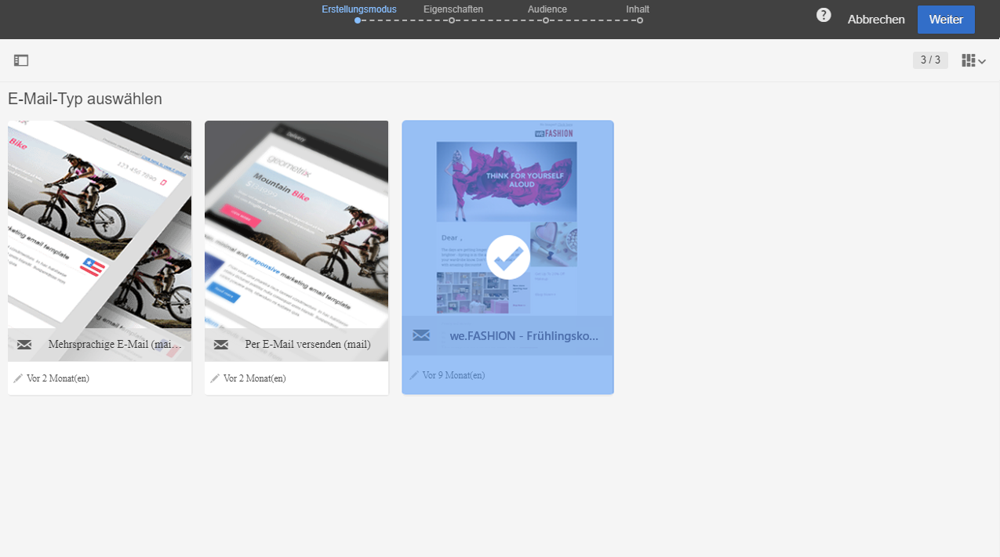
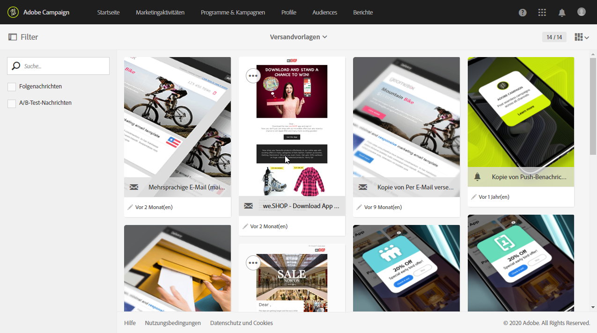
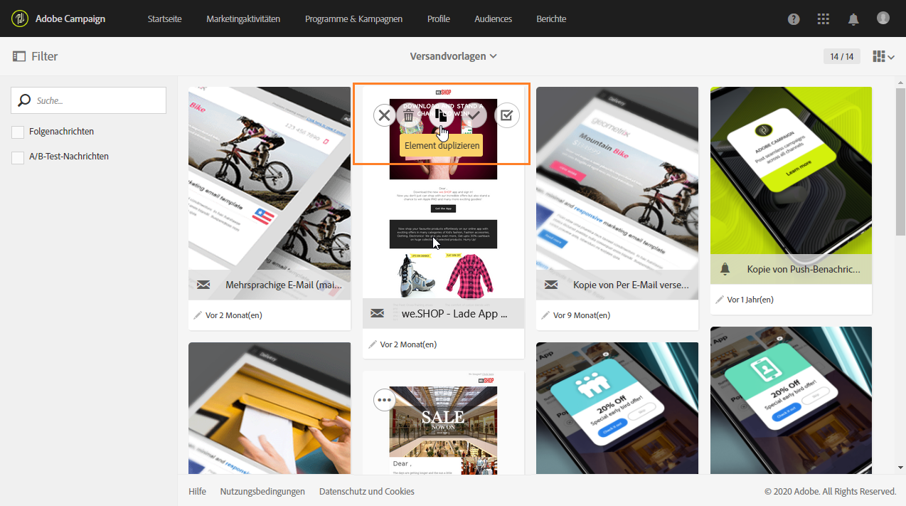
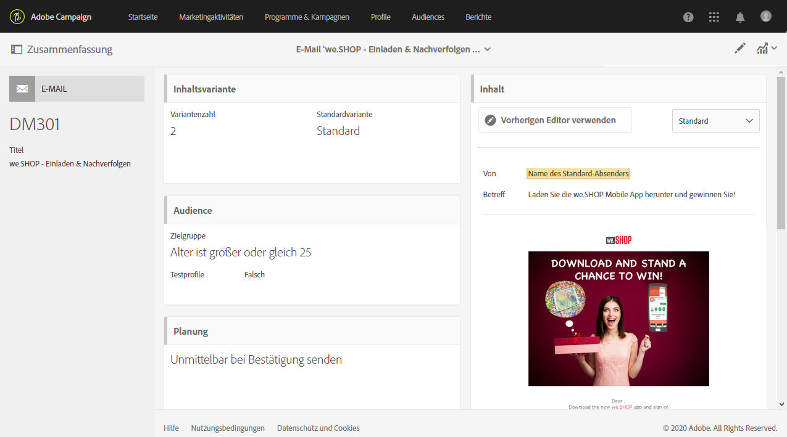
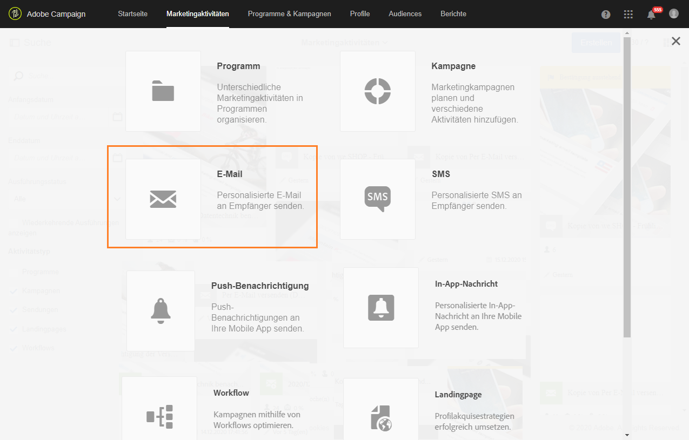
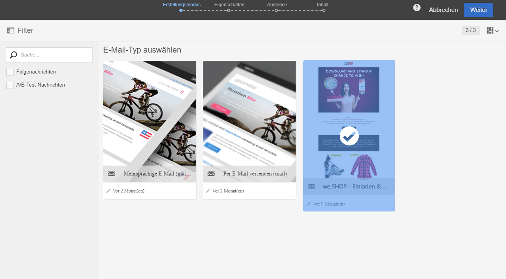
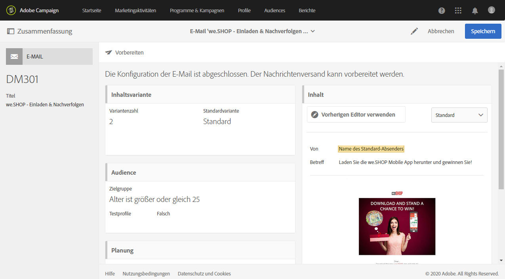

# Vorlagen für Marketing-Aktivitäten {#marketing-activity-templates}

## Über Vorlagen {#about-templates}

Bei der Erstellung einer Marketing-Aktivität ist im ersten Schritt des Assistenten ein Aktivitätstyp auszuwählen. Die verfügbaren Typen basieren jeweils auf einer Vorlage. Diese Vorlagen erlauben es, je nach Bedarf gewisse Parameter im Voraus zu konfigurieren. Vorlagen können vollständig oder nur teilweise konfiguriert sein. Die Vorlagenverwaltung erfolgt durch den funktionalen Administrator.

Der Endbenutzer verfügt über eine vereinfachte Benutzeroberfläche. Zur Erstellung einer neuen Marketing-Aktivität wählt er den gewünschten, auf einer Vorlage basierenden Typ aus. Technische Konfigurationen können ignoriert werden. Dies wurde bereits vom funktionalen Administrator in der Vorlage vorkonfiguriert.

Beispielsweise können Sie im Fall einer E-Mail-Vorlage den HTML-Inhalt, die Zielgruppe und andere Versandparameter automatisch ausfüllen lassen: den Zeitplan, die Testprofile, die allgemeinen Eigenschaften Ihrer Sendungen, die erweiterten Parameter etc. Dadurch sparen Sie Zeit bei der Erstellung einer neuen Aktivität.

Für jede Marketing-Aktivität sind standardmäßig eine oder mehrere minimal konfigurierte Vorlagen in der Anwendung enthalten. Diese vordefinierten Vorlagen können nicht geändert oder gelöscht werden.

Für folgende Marketing-Aktivitäten stehen Vorlagen zur Verfügung:

* Programme
* Kampagnen
* E-Mail-Versand
* SMS-Versand
* Push-Benachrichtigungen 
* Landingpages
* Workflows
* Dienste
* Import
* Transaktionsnachrichten

## Neue Vorlage erstellen {#creating-a-new-template}

Nachrichtenvorlagen können vom funktionalen Administrator der Plattform im Menü **[!UICONTROL Ressourcen > Vorlagen]** verwaltet werden. Vordefinierte Vorlagen können nicht geändert oder gelöscht werden. Zur Erstellung einer neuen Vorlage ist eine existierende Vorlage zu duplizieren.

1. Wählen Sie eine vorhandene Vorlage aus Im vorliegenden Beispiel soll eine **[!UICONTROL Versandvorlage]** konfiguriert werden.

   

1. Bewegen Sie die Maus darüber und wählen Sie dann die Option **[!UICONTROL Element duplizieren]** aus.

   

1. Konfigurieren Sie die gewünschten Einstellungen wie beim [Erstellen einer neuen Marketing-Aktivität](../../start/using/marketing-activities.md#creating-a-marketing-activity).

   

Diese Vorlagen können bei der Erstellung einer Marketing-Aktivität von Benutzern mit Standardberechtigung im ersten Bildschirm des Assistenten ausgewählt werden.

## Vorlagen verwenden {#using-a-template}

Im Folgenden wird die Verwendung einer zuvor erstellten Vorlage dargestellt.

>[!NOTE]
>
>Die Erstellung einer auf Vorlagen basierenden Marketing-Aktivität erfolgt i. d. R. durch Benutzer mit Standardberechtigung.

1. Erstellen Sie eine neue Marketing-Aktivität.

   

1. Wählen Sie im ersten Schritt des Assistenten die Vorlage aus, die Sie verwenden möchten.

   

   Die Marketing-Aktivität übernimmt die in der Vorlage definierten Parameter.

   
