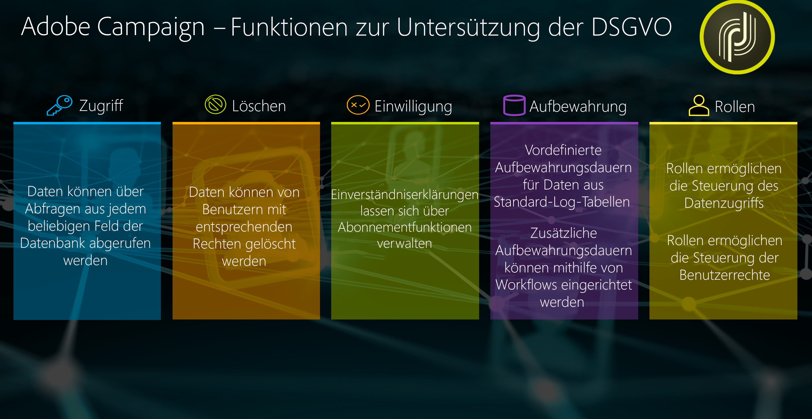
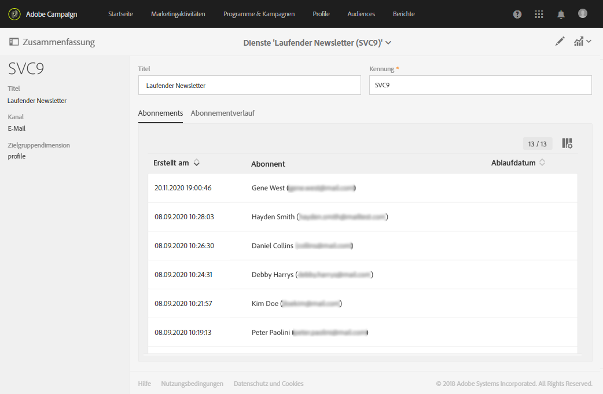
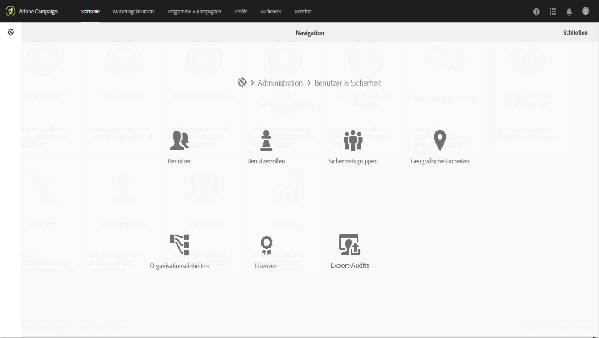

# Datenschutzverwaltung {#privacy-management}

Adobe Campaign bietet eine Reihe von Tools, die Sie bei der Einhaltung der [Datenschutzverordnungen](#privacy-management-regulations) (einschließlich DSGVO, CCPA, PDPA, LGPD) unterstützen.

Hier sind die fünf Hauptfunktionen von Adobe Campaign, um die Unterstützung der DSGVO und anderen Datenschutzbestimmungen sicherzustellen:

* **Recht auf Zugriff**

* **Recht auf Löschen**

Weitere Informationen hierzu finden Sie unter [Recht auf Zugriff und Recht auf Vergessenwerden](#right-access-forgotten).

* **Einverständnisverwaltung**

* **Datenbeibehaltung**

* **Rights Management**

Weitere Informationen hierzu finden Sie unter [Einverständnis, Datenbeibehaltung und Benutzerrollen](#consent-retention-roles).

<!--This section presents general information on what Privacy management is and the features provided by Adobe Campaign to manage the [Right to Access and Right to be Forgotten](#right-access-forgotten).

It also contains information on important features to manage Privacy ([consent, data retention and user roles](#consent-retention-roles)), as well as best practices to help you with your Privacy compliance when using Adobe Campaign.-->

## Verordnungen zur Datenschutzverwaltung {#privacy-management-regulations}

Die Funktionen von Adobe Campaign helfen Ihnen bei der Einhaltung der folgenden Verordnungen:

* Die **DSGVO** ([Datenschutz-Grundverordnung](https://ec.europa.eu/info/law/law-topic/data-protection/reform/what-does-general-data-protection-regulation-gdpr-govern_de)) ist das Datenschutzgesetz der Europäischen Union (EU), in dem die Anforderungen an den Datenschutz in den Ländern der EU harmonisiert und neu geregelt werden. Folgen Sie den unten stehenden Links, um allgemeine Informationen zur DSGVO zu erhalten:

   * https://www.adobe.com/de/privacy/general-data-protection-regulation.html
   * https://www.adobe.com/de/marketing-cloud/campaign/general-data-protection-regulation.html

* Der **CCPA** ([California Consumer Privacy Act](https://leginfo.legislature.ca.gov/faces/codes_displayText.xhtml?lawCode=CIV&amp;division=3.&amp;title=1.81.5.&amp;part=4.&amp;chapter=&amp;article=)) gibt in Kalifornien ansässigen Personen neue Rechte in Bezug auf ihre personenbezogenen Daten und verpflichtet bestimmte in Kalifornien tätige Unternehmen zur Einhaltung von Datenschutzvorschriften.
* Der **PDPA** ([Personal Data Protection Act](https://secureprivacy.ai/thailand-pdpa-summary-what-businesses-need-to-know/)) ist das neue Datenschutzgesetz, in dem die Anforderungen an den Datenschutz in Thailand vereinheitlicht und neu geregelt werden.
* Das **LGPD** ([Lei Geral de Proteção de Dados](https://iapp.org/media/pdf/resource_center/Brazilian_General_Data_Protection_Law.pdf)) gilt ab Frühjahr 2021 für alle Firmen, die personenbezogene Daten in Brasilien erheben oder verarbeiten.

Alle diese Verordnungen gelten für Adobe Campaign-Kunden, die Daten für betroffene Personen mit Wohnsitz in den oben genannten Regionen oder Ländern (EU, Kalifornien, Thailand, Brasilien) besitzen.

>[!NOTE]
>
>Weitere Informationen zu personenbezogenen Daten und zu den verschiedenen Entitäten, die Daten verwalten (Datenverantwortlicher, Auftragsverarbeiter und betroffene Person), finden Sie unter [Personenbezogene Daten und Personas](../../start/using/privacy.md#personal-data).

## Recht auf Zugriff und Recht auf Vergessenwerden {#right-access-forgotten}

Um Sie bei der Einhaltung der Datenschutzverordnungen zu unterstützen, ermöglicht Ihnen Adobe Campaign jetzt die Durchführung von **Zugriffs-** und **Löschanfragen**.

* Das **Recht auf Zugriff** ist das Recht der betroffenen Person, vom Datenverantwortlichen eine Auskunft darüber zu erhalten, ob ihre personenbezogenen Daten verarbeitet werden, wo dies geschieht und zu welchem Zweck. Der Datenverantwortliche muss eine Kopie der personenbezogenen Daten kostenlos in elektronischer Form zur Verfügung stellen.

* Das **Recht auf Vergessenwerden** (Löschungsanfrage), auch Datenlöschung genannt, bedeutet, dass die betroffene Person vom Datenverantwortlichen verlangen kann, ihre personenbezogenen Daten zu löschen, ihre Daten nicht weiter zu verbreiten und mögliche Dritte anzuhalten, die Datenverarbeitung einzustellen.

Weitere Informationen zum Erstellen von **Zugriffs-** und **Löschanfragen** und zur Verarbeitung dieser Anfragen durch Adobe Campaign finden Sie in den [Implementierungsschritten](../../start/using/privacy-requests.md#about-privacy-requests).

[Hier](https://experienceleague.adobe.com/docs/campaign-standard-learn/tutorials/privacy/privacy-overview.html?lang=de#privacy) finden Sie auch Tutorials zur Datenschutzverwaltung in Campaign Standard.

>[!NOTE]
>
>Weitere Informationen zu personenbezogenen Daten und zu den verschiedenen Entitäten, die Daten verwalten (Datenverantwortlicher, Auftragsverarbeiter und betroffene Person), finden Sie unter [Personenbezogene Daten und Personas](../../start/using/privacy.md#personal-data).

## Einverständnis, Datenbeibehaltung und Benutzerrollen {#consent-retention-roles}

Zusätzlich zu den neuen Funktionen für das **Recht auf Zugriff** und das **Recht auf Vergessenwerden** bietet Adobe Campaign weitere für den Datenschutz wichtige Funktionen:

* [Einverständnisverwaltung](#consent-management): Abonnement-Funktion für die Verwaltung von Einstellungen
* [Datenbeibehaltung](../../administration/using/data-retention.md): Fristen für die Datenbeibehaltung für alle Standard-Log-Tabellen; zusätzliche Fristen für die Datenbeibehaltung können mit Workflows eingerichtet werden
* [Berechtigungs-Management](#rights-management): Der Datenzugriff wird über spezifische Berechtigungen verwaltet

### Einverständnisverwaltung {#consent-management}

Einverständnis bedeutet die Zustimmung des Datensubjekts zur Verarbeitung seiner personenbezogenen Daten. Der Datenverantwortliche ist dafür zuständig, das erforderliche Einverständnis für diese Verarbeitung einzuholen. Adobe Campaign stellt zwar Funktionen bereit, die den Kunden bei der Verwaltung der Einverständniserklärungen unterstützen, Adobe ist jedoch nicht für das Einverständnis als solches verantwortlich. Kunden sollten ihre Rechtsabteilung zurate ziehen, um Prozesse und Verfahren für das Einholen des Einverständnisses auszuarbeiten.

Die Funktionen, die bei der Verwaltung bestimmter Aspekte des Einverständnisses helfen, waren bei Adobe Campaign schon immer von zentraler Bedeutung. Im Rahmen der Abonnementverwaltung können Kunden nachverfolgen, welche Empfänger sich für welche Abonnements entschieden haben, ob es sich um Newsletter, tägliche oder wöchentliche Promotions oder andere Marketing-Programme handelt.

Weitere Informationen zur Einverständnisverwaltung finden Sie unter [Informationen zu Abonnements](../../audiences/using/about-subscriptions.md) und [Erste Schritte mit Landingpages](../../channels/using/getting-started-with-landing-pages.md).

Zusätzlich zu den von Adobe Campaign bereitgestellten Tools für die Einverständnisverwaltung können Sie verfolgen, ob ein Benutzer dem Verkauf seiner personenbezogenen Daten widersprochen hat. Siehe [diesen Abschnitt](../../start/using/privacy-requests.md#sale-of-personal-information-ccpa).

### Rights Management {#rights-management}

Adobe Campaign bietet Ihnen die Möglichkeit, die den unterschiedlichen Campaign-Benutzern zugewiesenen Rechte mithilfe von vordefinierten oder benutzerdefinierten spezifischen Rollen zu verwalten.

Ein Vorteil ist, dass Sie damit verwalten können, wer in Ihrer Firma auf verschiedene Datentypen zugreifen kann. So können Sie beispielsweise verschiedene Marketing-Experten für verschiedene geografische Gebiete (Geos) verwenden, und jeder Marketing-Experte kann nur auf Daten aus seinem geografischen Gebiet zugreifen.

Diese Funktion ermöglicht es Ihnen außerdem, verschiedene Funktionen für jeden Benutzer zu konfigurieren, z. B. die Einschränkung, wer Sendungen durchführen darf, oder, was für die Datenschutzverwaltung relevanter ist, wer Daten ändern oder exportieren darf.

Weitere Informationen zur Zugriffsverwaltung finden Sie in [diesem Abschnitt](../../administration/using/about-access-management.md).
