# Verwalten von Datenschutzanfragen {#privacy-requests}

Allgemeine Informationen zum Thema Datenschutzverwaltung finden Sie in [diesem Abschnitt](../../start/using/privacy-management.md).

Diese Informationen gelten für DSGVO, CCPA, PDPA und LGPD. Weitere Informationen zu diesen Verordnungen finden Sie in [diesem Abschnitt](../../start/using/privacy-management.md#privacy-management-regulations).

Die Möglichkeit zum Opt-out aus dem Verkauf von personenbezogenen Daten, die sich speziell auf den CCPA bezieht, wird in [diesem Abschnitt](#sale-of-personal-information-ccpa) erläutert.

<!--Starting 19.4, the use of the Campaign API and interface for Access and Delete requests is deprecated. For any GDPR, CCPA, PDPA, or LGPD Access and Delete requests, you need to use the [Privacy Core Service](#create-privacy-request) integration method.-->

## Datenschutzanfragen {#about-privacy-requests}

Um Sie bei der Einhaltung der Datenschutzverordnungen zu unterstützen, ermöglicht Ihnen Adobe Campaign die Durchführung von Zugriffs- und Löschanfragen. Das **Recht auf Zugriff** und das **Recht auf Vergessenwerden** (Löschanfrage) werden in [diesem Abschnitt](../../start/using/privacy-management.md#right-access-forgotten) beschrieben.

Um diese Anfragen auszuführen, müssen Sie die Integration des **Privacy Core Service** verwenden. Die vom Privacy Core Service an alle Experience Cloud-Lösungen übertragenen Datenschutzanfragen werden von Campaign mithilfe eines speziellen Workflows automatisch verarbeitet.

### Voraussetzungen {#prerequesites}

Adobe Campaign bietet Datenverantwortlichen Tools zum Erstellen und Verarbeiten von Datenschutzanfragen für in Adobe Campaign gespeicherte Daten. Für den Kontakt mit den betroffenen Personen ist jedoch der Datenverantwortliche allein zuständig (über E-Mail, Kundenunterstützung oder ein Web-Portal).

Als Datenverantwortlicher sind Sie daher außerdem verpflichtet, die Identität der betroffenen Person zu überprüfen, die die Anfrage stellt, und sicherzustellen, dass die dem Anfragenden übermittelten Daten zur betroffenen Person gehören.

>[!NOTE]
>
>Weitere Informationen zu personenbezogenen Daten und zu den verschiedenen Entitäten, die Daten verwalten (Datenverantwortlicher, Auftragsverarbeiter und betroffene Person), finden Sie unter [Personenbezogene Daten und Personas](../../start/using/privacy.md#personal-data).

### Namespaces {#namesspaces}

Bevor Sie Datenschutzanfragen erstellen können, müssen Sie den Namespace definieren, den Sie verwenden möchten. Der Namespace ist der Schlüssel, anhand dessen die Identität der betroffenen Person in der Adobe Campaign-Datenbank identifiziert wird. Standardmäßig sind zwei Namespaces verfügbar: E-Mail und Mobiltelefon. Wenn Sie einen anderen Namespace benötigen (z. B. ein benutzerdefiniertes Profilfeld) führen Sie diese Schritte aus.

Weitere Informationen zum Erstellen eines Namespace finden Sie in diesem [Tutorial](https://experienceleague.adobe.com/docs/campaign-standard-learn/tutorials/privacy/namespaces-for-privacy-requests.html?lang=de#privacy).

>[!NOTE]
>
>Wenn Sie mehrere Namespaces verwenden, erstellen Sie pro Namespace eine Datenschutzanfrage.

1. Klicken Sie im Bildschirm oben links auf das Adobe Campaign-Logo und verwenden Sie dann die Schaltflächen **[!UICONTROL Administration]** > **[!UICONTROL Namespaces]**.

   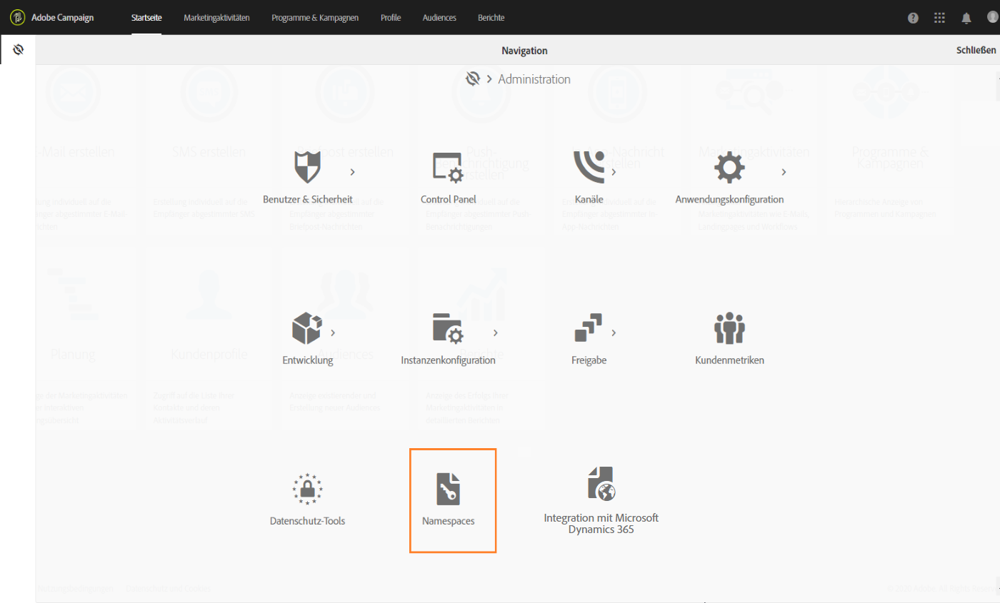

1. Wählen Sie in der Liste der Namespaces die Option **[!UICONTROL Erstellen]** aus.

   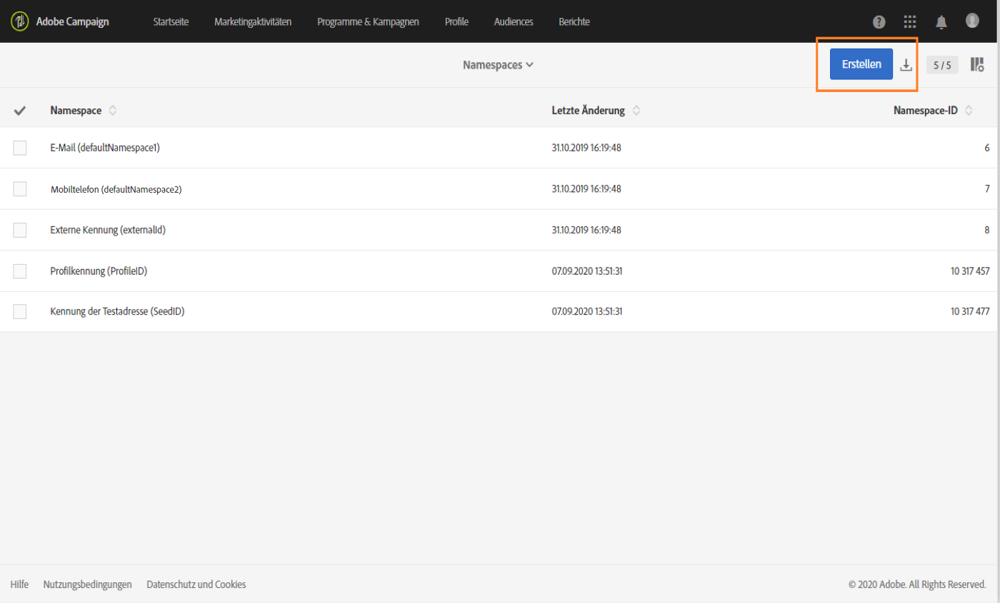

1. Geben Sie einen **[!UICONTROL Titel]** ein.

   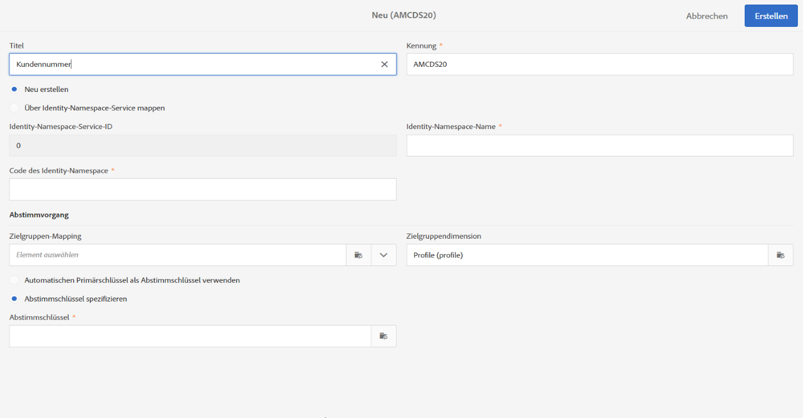

1. Wenn Sie einen vorhandenen Namespace für den Identity Service verwenden möchten, wählen Sie **[!UICONTROL Über Identity-Namespace Service mappen]** und dann einen Namespace im Feld **[!UICONTROL Namespace für Identity Service]**.

   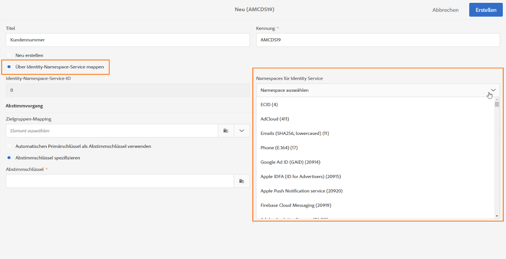

   Wenn Sie einen neuen Namespace im **[!UICONTROL Identity Service]** anlegen und in Campaign zuordnen möchten, wählen Sie **[!UICONTROL Neu erstellen]** aus und geben Sie einen Namen in das Feld **[!UICONTROL Identity-Namespace-Name]** ein.

   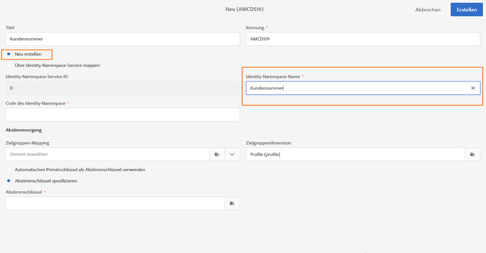

   Weitere Informationen zu Identity-Namespaces finden Sie in der Dokumentation zu [Experience Platform](https://experienceleague.adobe.com/docs/experience-platform/identity/namespaces.html?lang=de).

1. Je ein Identity Service Namespace wird je einem Namespace in Campaign zugeordnet. Dazu müssen Sie angeben, wie der Namespace in Campaign abgestimmt werden soll.

   Wählen Sie ein Zielgruppen-Mapping aus (**[!UICONTROL Empfänger]**, **[!UICONTROL Echtzeit-Ereignis]** oder **[!UICONTROL Abonnements für eine Anwendung]**). Wenn Sie mehrere Zielgruppen-Mappings verwenden möchten, müssen Sie pro Zielgruppen-Mapping einen Namespace erstellen.

   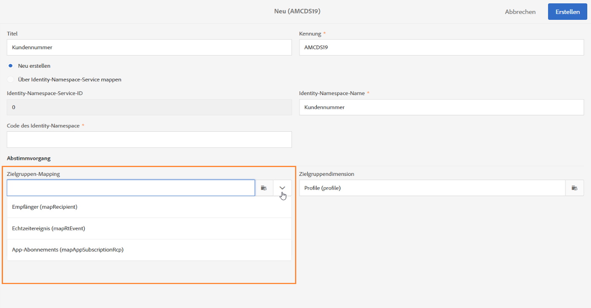

1. Wählen Sie den **[!UICONTROL Abstimmschlüssel]** aus. Das ist das Feld, das zur Identifikation der betroffenen Person in der Adobe Campaign-Datenbank herangezogen wird.

   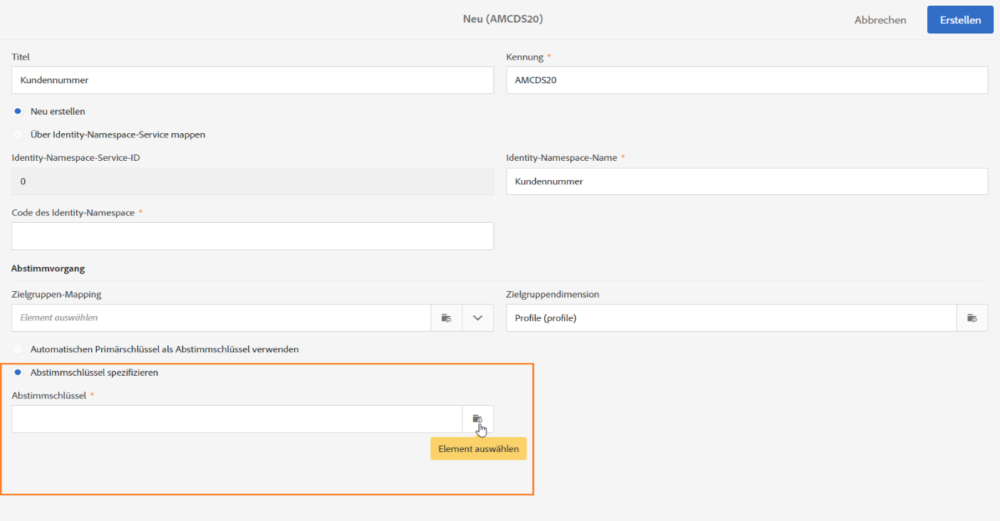

1. Wählen Sie **[!UICONTROL Erstellen]** aus. Jetzt können Sie Datenschutzanfragen basierend auf Ihrem neuen Namespace erstellen. Wenn Sie mehrere Namespaces verwenden, erstellen Sie pro Namespace eine Datenschutzanfrage.

### Erstellen einer Datenschutzanfrage {#create-privacy-request}

<!--Starting 19.4, the use of the Campaign API and interface for Access and Delete requests is deprecated. Use the **Privacy Core Service** for any GDPR, CCPA, PDPA, or LGPD Access and Delete requests.-->

Durch die Integration von Privacy Core Service können Sie Datenschutzanfragen in einer Umgebung mit mehreren Lösungen über nur einen einzigen JSON API-Aufruf automatisieren. Die vom Privacy Core Service an alle Experience Cloud-Lösungen übertragenen Datenschutzanfragen werden von Campaign mithilfe eines speziellen Workflows automatisch verarbeitet.

Weitere Informationen zum Erstellen von Datenschutzanfragen mittels Privacy Core Service finden Sie in der Dokumentation zum [Experience Platform Privacy Service](https://experienceleague.adobe.com/docs/experience-platform/privacy/home.html?lang=de).

>[!IMPORTANT]
>
>Um eine Anfrage mit dem benutzerdefinierten Namespace-Typ einzureichen, nutzen Sie die [JSON-Methode](https://experienceleague.adobe.com/docs/experience-platform/privacy/ui/user-guide.html?lang=de#json){target="_blank"} and add the namespaceId to the request, or use the [API call](https://experienceleague.adobe.com/docs/experience-platform/privacy/api/privacy-jobs.html?lang=de#access-delete){target="_blank"}, um die Anfrage zu stellen.
>
>Verwenden Sie nur die [Datenschutz-Benutzeroberfläche](https://experienceleague.adobe.com/docs/experience-platform/privacy/ui/user-guide.html?lang=de#request-builder){target="_blank"}, um Anfragen mithilfe des standardmäßigen Namespace-Typs einzureichen.

Jeder Privacy Core Service-Vorgang wird in mehrere Datenschutzanfragen in Campaign aufgeteilt, je nachdem, wie viele Namespaces verwendet werden, wobei eine Anfrage einem Namespace entspricht. Außerdem kann ein Vorgang in mehreren Instanzen ausgeführt werden. Daher werden für einen Vorgang mehrere Dateien erstellt. Wenn sich eine Anfrage beispielsweise auf zwei Namespaces bezieht und drei Instanzen betrifft, werden insgesamt sechs Dateien gesendet. Eine Datei pro Namespace und Instanz.

Der Dateiname setzt sich folgendermaßen zusammen: `<InstanceName>-<NamespaceId>-<ReconciliationKey>.xml`.

* **InstanceName**: der Name der Campaign-Instanz
* **NamespaceId**: die Namespace-Kennung des Identity Service für den verwendeten Namespace
* **Abstimmschlüssel**: verschlüsselter Abstimmschlüssel

### Liste der Ressourcen {#list-of-resources}

Bei der Durchführung einer Lösch- oder Zugriffs-Datenschutzanfrage durchsucht Adobe Campaign alle Daten der betroffenen Person auf der Basis des **Abstimmwerts**. Gesucht wird in allen Ressourcen, in denen eine Relation mit der Profilressource besteht (vom Typ &quot;own&quot;).

Dies sind die Ressourcen, die bei der Durchführung von Datenschutzanfragen standardmäßig berücksichtigt werden:

* Profile (recipient)
* Versandlogs der Profile (broadLogRcp)
* Trackinglogs der Profile (trackingLogRcp)
* Versandlogs (App-Abonnements) (broadLogAppSubRcp)
* Trackinglogs (App-Abonnements) (trackingLogAppSubRcp)
* App-Abonnements (appSubscriptionRcp)
* Abonnementverlauf der Profile (subHistoRcp)
* Profilanmeldungen (subscriptionRcp)
* Besucher (visitor)

Wenn Sie benutzerdefinierte Ressourcen erstellt haben, für die eine Relation zur Profilressource (Typ „own“) besteht, werden auch diese berücksichtigt. Wenn Sie beispielsweise eine Transaktionen-Ressource haben, für die eine Relation mit der Profilressource vorhanden ist und eine Transaktionendetails-Ressource, für die eine Relation mit der Transaktionen-Ressource besteht, werden beide berücksichtigt.

Weitere Informationen zum Ändern benutzerdefinierter Ressourcen finden Sie in [diesem Tutorial](https://experienceleague.adobe.com/docs/campaign-standard-learn/tutorials/privacy/custom-resources-for-privacy-requests.html?lang=de#privacy).

Wählen Sie zu diesem Zweck in der benutzerdefinierten Ressource die Option **[!UICONTROL Das Löschen des Zieldatensatzes zieht das Löschen der durch die Relation referenzierten Datensätze nach sich]** aus:

1. Klicken Sie auf das Adobe Campaign-Logo oben links im Bildschirm und anschließend auf **[!UICONTROL Administration]** > **[!UICONTROL Entwicklung]** > **[!UICONTROL Benutzerdefinierte Ressourcen]**.

1. Wählen Sie eine benutzerdefinierte Ressource aus, für die eine Relation zur Profilressource (Typ &quot;own&quot;) besteht.

1. Klicken Sie auf den Bereich **[!UICONTROL Relationen]**.

1. Wählen Sie für jede Relation das Stiftsymbol aus (**[!UICONTROL Eigenschaften bearbeiten]**).

1. Wählen Sie im Bereich **[!UICONTROL Verhalten beim Löschen/Duplizieren]** die Option **[!UICONTROL Das Löschen des Zieldatensatzes zieht das Löschen der durch die Relation referenzierten Datensätze nach sich]** aus.

   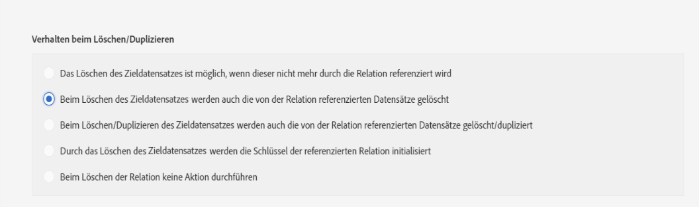

### Status von Datenschutzanfragen {#privacy-request-statuses}

Dies sind die unterschiedlichen Status einer Datenschutzanfrage:

* **[!UICONTROL Neu]** / **[!UICONTROL Erneuter Versuch steht aus]**: Durchführung läuft, der Workflow hat die Anfrage noch nicht verarbeitet.
* **[!UICONTROL Verarbeitung läuft]** / **[!UICONTROL Erneuter Versuch läuft]**: Der Workflow verarbeitet gerade die Anfrage.
* **[!UICONTROL Löschen steht aus]**: Der Workflow hat alle zu löschenden Empfängerdaten identifiziert.
* **[!UICONTROL Löschvorgang läuft]**: Der Workflow führt gerade die Löschung durch.
  <!--**[!UICONTROL Delete Confirmation Pending]** (Delete request in 2-steps process mode): the workflow has processed the Access request. Manual confirmation is requested to perform the deletion. The button is available for 15 days.-->
* **[!UICONTROL Beendet]**: Die Verarbeitung der Anfrage wurde ohne Fehler abgeschlossen.
* **[!UICONTROL Fehler]**: Workflow ist fehlerhaft. Die Spalte **[!UICONTROL Anfragestatus]** in der Liste der Datenschutzanfragen zeigt den Grund an. Beispielsweise bedeutet **[!UICONTROL Fehlerdaten nicht gefunden]**, dass in der Datenbank keine Empfängerdaten gefunden wurden, die dem **[!UICONTROL Abstimmwert]** der betroffenen Person entsprechen.

<!--### Disabling the 2-step process {#disabling-two-step-process}

The Core Privacy Service does not support the 2-step process.

>[!IMPORTANT]
>
>Before using the Core Privacy Service integration to manage your Privacy requests, you must disable the 2-step process for Delete requests from the Campaign Standard interface.

If this option is not disabled, all Delete requests managed with the Privacy Core Service will remain in pending state and will not complete.

By default, the 2-step process is activated.

To change this mode, click **[!UICONTROL Edit properties]**, in the top right corner of the **[!UICONTROL Privacy Requests]** screen, then uncheck the **[!UICONTROL Activate the 2-step process]** option.

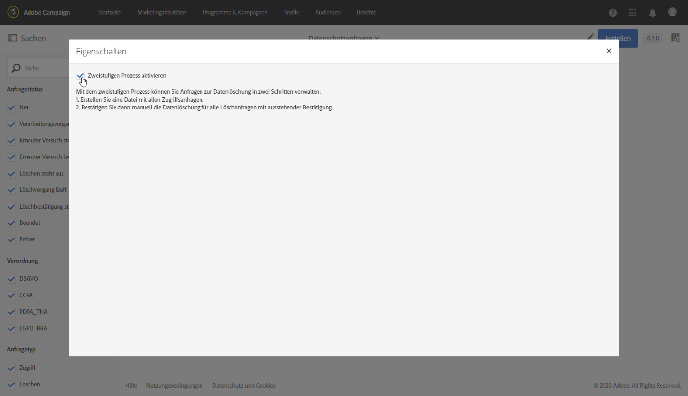-->

## Opt-out aus dem Verkauf von personenbezogenen Daten (CCPA) {#sale-of-personal-information-ccpa}

Der **California Consumer Privacy Act** (CCPA) gibt in Kalifornien ansässigen Personen neue Rechte in Bezug auf ihre personenbezogenen Daten und verpflichtet bestimmte in Kalifornien tätige Unternehmen zur Einhaltung von Datenschutzvorschriften.

Die Konfiguration und Verwendung von Zugriffs- und Löschanfragen sind für DSGVO (GDPR) und CCPA identisch. In diesem Abschnitt wird der Opt-out-Prozess für den Verkauf personenbezogener Daten vorgestellt, der speziell für CCPA gilt.

Zusätzlich zu den von Campaign bereitgestellten Tools für die [Einverständnisverwaltung](../../start/using/privacy-management.md#consent-management) können Sie verfolgen, ob ein Verbraucher dem Verkauf seiner personenbezogenen Daten widersprochen hat.

Wenn Benutzer über Ihr System entscheiden, dass sie den Verkauf ihrer personenbezogenen Daten an Dritte nicht zulassen, können Sie diese Informationen speichern und nachverfolgen.

>[!NOTE]
>
>Sie können den Opt-out-Prozess für den Verkauf personenbezogener Informationen über die Campaign-Benutzeroberfläche und die API nutzen. Sie können ihn nicht über den Privacy Core Service verwenden.

>[!IMPORTANT]
>
>Es liegt in Ihrer Verantwortung als Datenverantwortlicher, die Anfrage der betroffenen Person entgegenzunehmen und die Datumsangaben der Anfrage für CCPA zu verfolgen. Als Technologieanbieter bieten wir nur eine Opt-out-Möglichkeit. Weitere Informationen zu Ihrer Rolle als Datenverantwortlicher finden Sie unter [Personenbezogene Daten und Personas](../../start/using/privacy.md#personal-data).

### Voraussetzungen für benutzerdefinierte Tabellen {#ccpa-prerequisite}

Die Campaign-Benutzeroberfläche und die API verfügen standardmäßig über das Feld **[!UICONTROL CCPA-Opt-out]**. Standardmäßig ist das Feld für die Standard-**[!UICONTROL Profilressource]** verfügbar.

Wenn Sie eine benutzerdefinierte Profilressource verwenden, müssen Sie die Ressource erweitern und das Feld hinzufügen. Es wird empfohlen, einen anderen Namen als das native Feld zu verwenden. Beispiel: **[!UICONTROL Opt-out für CCPA]** (optoutccpa). Wenn ein neues Feld erstellt wird, wird es automatisch von der Campaign-API unterstützt.

Weitere Informationen zum Erweitern der Profilressource finden Sie in [diesem Abschnitt](../../developing/using/extending-the-profile-resource-with-a-new-field.md).

>[!NOTE]
>
>Das Ändern von Ressourcen ist ein sensibler Vorgang, der nur von erfahrenen Benutzern ausgeführt werden darf.

1. Gehen Sie zu **[!UICONTROL Administration]** > **[!UICONTROL Entwicklung]** > **[!UICONTROL benutzerspezifische Ressourcen]**. Klicken Sie auf die benutzerdefinierte Profilressource. Weitere Informationen zum Erweitern einer Ressource finden Sie in [diesem Abschnitt](../../developing/using/creating-or-extending-the-resource.md).

   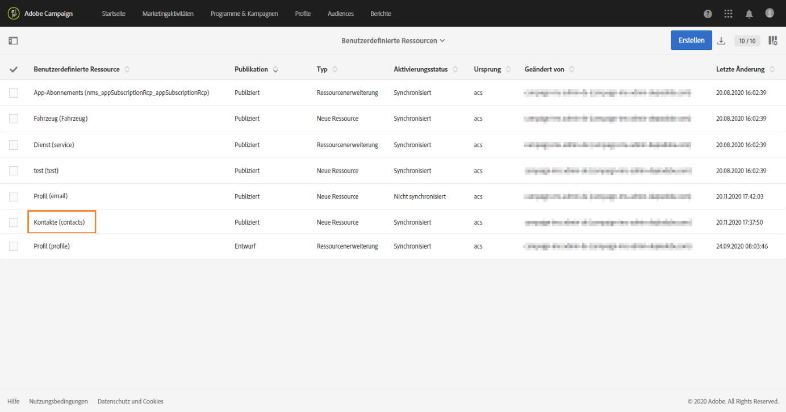

1. Klicken Sie auf **[!UICONTROL Feld hinzufügen]** oder **[!UICONTROL Element erstellen]**, fügen Sie den Titel und die Kennung hinzu und wählen Sie den Typ **[!UICONTROL Boolesch]** aus. Verwenden Sie für den Namen **Opt-out für CCPA**. Verwenden Sie für die Kennung **optOutCcpa**.

   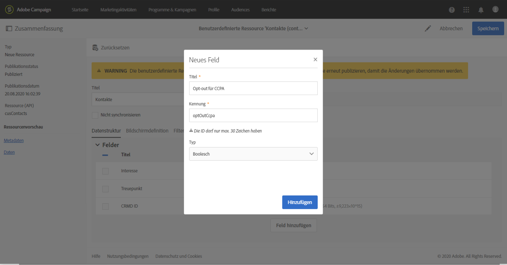

1. Fügen Sie das Feld auf der Registerkarte **[!UICONTROL Bildschirmdefinition]** unter **[!UICONTROL Detaillierte Bildschirmkonfiguration]** hinzu und wählen Sie **[!UICONTROL Eingabefeld]** aus. Dadurch wird das Feld in der Liste der Profile und den Details verfügbar.  Weitere Informationen zum Konfigurieren der Bildschirmdefinition finden Sie in [diesem Abschnitt](../../developing/using/configuring-the-screen-definition.md).

   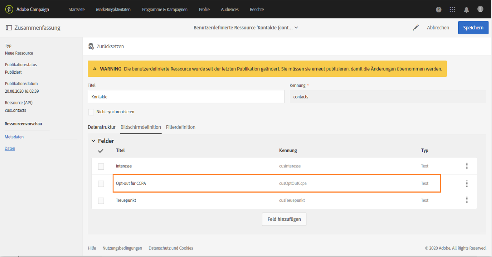

1. Gehen Sie zu **[!UICONTROL Administration]** > **[!UICONTROL Entwicklung]** > **[!UICONTROL Veröffentlichen]**, bereiten Sie die Veröffentlichung vor und veröffentlichen Sie die Änderungen. Weitere Informationen zum Veröffentlichen einer Ressource finden Sie in [diesem Abschnitt](../../developing/using/updating-the-database-structure.md).

   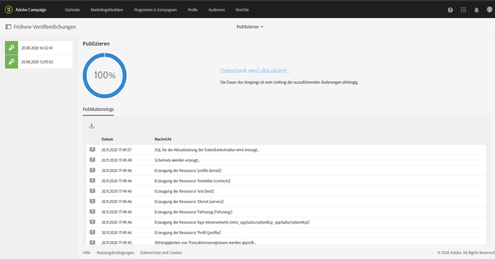

1. Vergewissern Sie sich, dass das Feld in den Details eines Profils verfügbar ist. Weiterführende Informationen hierzu finden Sie in [diesem Abschnitt](#usage).

### Verwendung {#usage}

Der Datenverantwortliche muss dafür sorgen, dass das Feld ausgefüllt wird und die CCPA-Richtlinien und -Regeln bezüglich des Datenverkaufs eingehalten werden.

Um die Werte auszufüllen, können mehrere Methoden verwendet werden:

* Bearbeiten der Details des Empfängers über die Campaign-Benutzeroberfläche (siehe unten)
* Verwenden der Privacy-API von Campaign (siehe die [API-Dokumentation](../../api/using/managing-ccpa-opt-out.md))
* Über einen Workflow zum Datenimport

Sie sollten dann sicherstellen, dass Sie niemals personenbezogene Daten von Profilen, die dies abgewählt haben, an Dritte verkaufen.

1. Bearbeiten Sie auf der Campaign-Benutzeroberfläche ein Profil, um den Opt-out-Status zu ändern.

   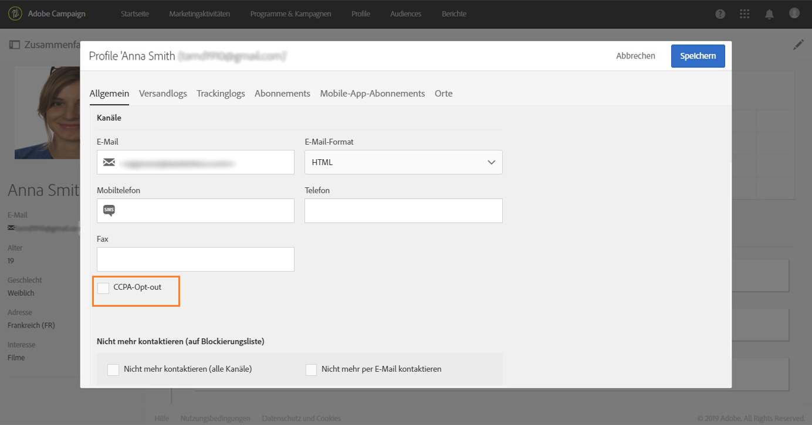

1. Wenn der Wert des Felds **[!UICONTROL Wahr]** lautet, werden die Informationen in den Profildetails angezeigt.

   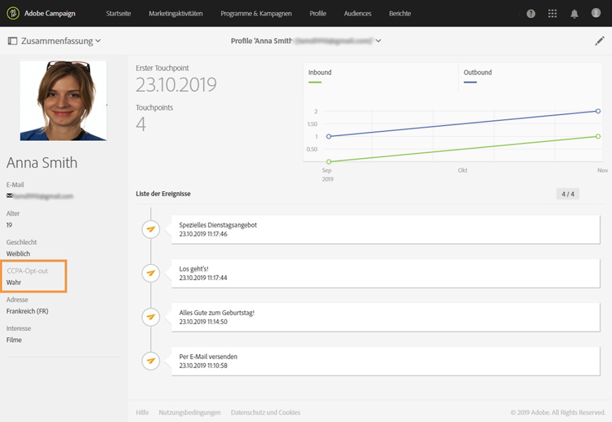

1. Sie können die Profilliste so konfigurieren, dass die Opt-out-Spalte angezeigt wird. Informationen zum Konfigurieren von Listen finden Sie in [diesem Abschnitt](../../start/using/customizing-lists.md).

   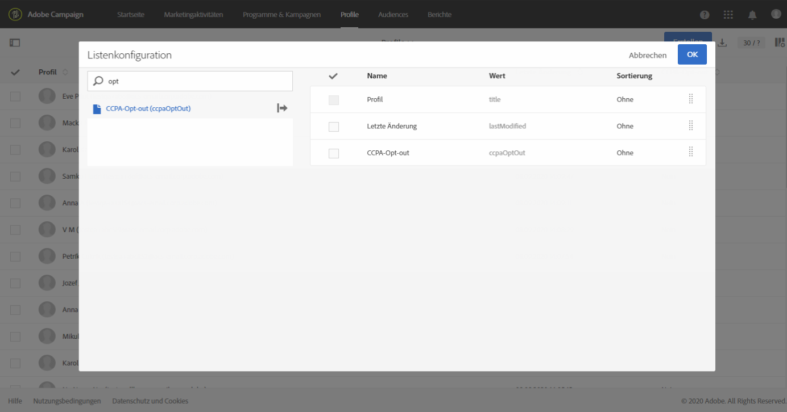

1. Sie können auf die Spalte klicken, um Empfänger gemäß den Opt-out-Informationen zu sortieren.

   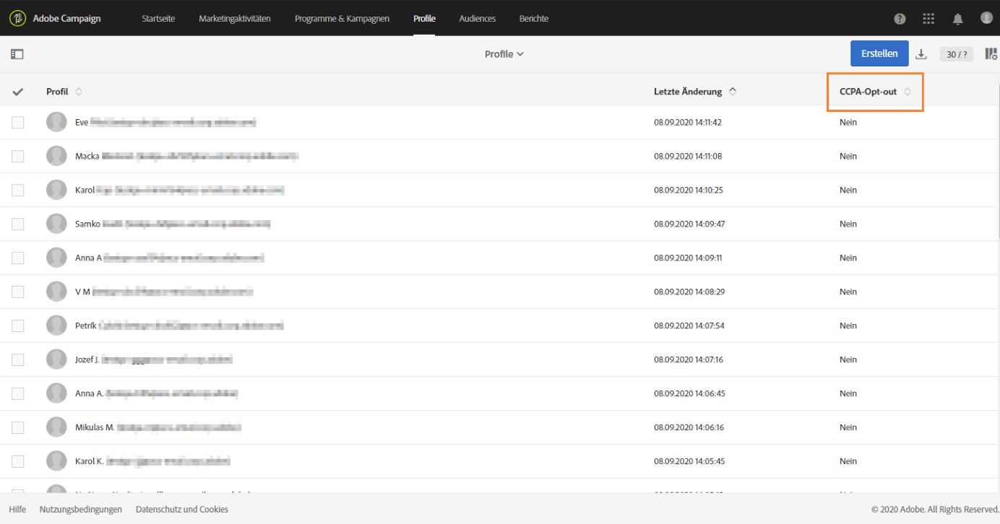
