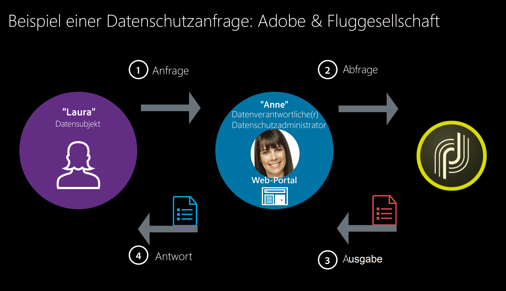

# Datenschutz und Einverständniserklärung {#privacy-and-consent}

## Allgemeine Empfehlungen {#general-recommendations}

Adobe Campaign ist ein leistungsstarkes Tool zur Erfassung und Verarbeitung sehr großer Datenmengen, einschließlich personenbezogener Daten und vertraulicher Informationen. Aus diesem Grund muss der Datenschutz sorgfältig gehandhabt werden.

* Gehen Sie stets verantwortungsvoll und ethisch korrekt mit persönlichen Informationen um.

* Senden Sie keine unerwünschten E-Mails, Push-Benachrichtigungen und SMS-Nachrichten (&quot;Spam&quot;). Adobe glaubt fest an Permission Marketing, um den Kundenlebenszeitwert und die Treue zu fördern, und verbietet daher strikt die Verwendung von Adobe Campaign zum Versenden von unerbetenen Nachrichten.

### Datenschutzbestimmungen {#privacy-regulations}

Um den Datenschutz korrekt zu handhaben und personenbezogene Daten zu verwalten, müssen Sie die für die Region(en) geltenden Gesetze einhalten, in denen Sie tätig sind. Zu diesen Verordnungen gehören:
* [DSGVO](https://ec.europa.eu/info/law/law-topic/data-protection/reform/what-does-general-data-protection-regulation-gdpr-govern_de) (Europäische Datenschutz-Grundverordnung)
* [DPA](https://www.gov.uk/data-protection) (Umsetzung der DSGVO durch das Vereinigte Königreich)
* [Europäische Richtlinie über Datenschutz und elektronische Kommunikation](https://eur-lex.europa.eu/legal-content/DE/TXT/?uri=CELEX:02002L0058-20091219)
* [CAN-SPAM Act](https://www.ftc.gov/tips-advice/business-center/guidance/can-spam-act-compliance-guide-business) (US-Gesetz zur Festlegung der Regeln und Anforderungen für kommerzielle E-Mails)
* [CCPA](https://leginfo.legislature.ca.gov/faces/codes_displayText.xhtml?lawCode=CIV&amp;division=3.&amp;title=1.81.5.&amp;part=4.&amp;chapter=&amp;article=) (kalifornisches Verbraucherschutzgesetz)
* [PDPA](https://secureprivacy.ai/thailand-pdpa-summary-what-businesses-need-to-know/) (thailändisches Gesetz zum Schutz personenbezogener Daten)

>[!NOTE]
>
>For more on how GDPR, CCPA, PDPA, and LGPD apply to Adobe Campaign, see [this section](../../start/using/privacy-management.md#privacy-management-regulations).

### Adobe Experience Cloud – Datenschutz {#experience-cloud-privacy}

Adobe Campaign ist Teil der Adobe Experience Cloud-Lösungen. Die Art und Weise, wie der Datenschutz in Campaign gehandhabt wird, entspricht den allgemeinen Grundsätzen von Adobe Experience Cloud, z. B.:

* **Welche Informationen werden bei Verwendung von Adobe Experience Cloud erfasst?**

   Als Unternehmen, das Adobe Experience Cloud-Lösungen nutzt, entscheiden Sie selbst, welche Informationen erfasst und an Ihr Adobe Experience Cloud-Konto gesendet werden sollen. Beispiele für die Arten von Informationen, die erfasst werden können, sind Webbrowsing-Aktivitäten, IP-Adressen, Standortinformationen von Mobilgeräten, Erfolgsquoten von Kampagnen, gekaufte oder in den Warenkorb gelegte Artikel usw.

   >[!NOTE]
   >
   >Wie bei allen Produkten von Adobe erfasst Campaign Informationen über App- und Website-Benutzer. Weitere Informationen finden Sie in der [Datenschutzerklärung von Adobe](https://www.adobe.com/de/privacy/policy.html).

* **Verwendung von Adobe Experience Cloud zur Erfassung von Informationen**

   * Adobe Experience Cloud-Lösungen verwenden Cookies und ähnliche Technologien, wie Webbeacons (auch als Tags oder Pixel bezeichnet), um die Erfassung von Informationen zu ermöglichen. Weitere Informationen zu Cookies und Tracking-Funktionen mit Adobe Campaign finden Sie in [diesem Abschnitt](#tracking-capabilities).
   * Sie können Adobe Experience Cloud-Technologien auch in Ihren mobilen Apps verwenden. Weitere Informationen zum Versand an Mobilgeräte finden Sie auf [dieser Seite](https://helpx.adobe.com/de/campaign/kb/acs-mobile.html).

* **Datenschutzoptionen Ihrer Benutzer bezüglich Ihrer Verwendung von Adobe Experience Cloud**

   Adobe fordert Sie auf, Ihren Kunden Datenschutzrichtlinien bereitzustellen, in denen Folgendes beschrieben wird:

   * Ihre Datenschutzpraktiken in Verbindung mit Adobe Experience Cloud
   * Die Art und Weise, auf die Benutzer ihre Voreinstellungen für die Erfassung oder Verwendung ihrer Informationen in Verbindung mit Adobe Experience Cloud festlegen können

   >[!NOTE]
   >
   >Wie bei allen Produkten von Adobe können Campaign-Benutzer die Weitergabe von Informationen, die über Apps und Websites erfasst wurden, deaktivieren. Weitere Informationen finden Sie in den [häufig gestellten Fragen zu den Adobe Experience Cloud-Nutzungsinformationen](https://www.adobe.com/de/privacy/experience-cloud-usage-info-faq.html).

Weitere Informationen zum Datenschutz in Adobe Experience Cloud finden Sie auf [dieser Seite](https://www.adobe.com/de/privacy/marketing-cloud.html).

## Persönliche Daten und Personas {#personal-data}

Bei der Verwaltung des Datenschutzes ist es wichtig zu definieren, welche Daten von wem mit Sorgfalt behandelt werden sollen.
* **Personenbezogene Daten** sind Informationen, die eine lebende Person direkt oder indirekt identifizieren können.
* **Vertrauliche personenbezogene Daten** sind Informationen zu Rasse, politischen Ansichten, religiösen Überzeugungen, kriminellem Hintergrund, genetischen Informationen, Gesundheitsdaten, sexuellen Vorlieben, biometrischen Informationen sowie zur Gewerkschaftsmitgliedschaft.

Bei der Integration von Campaign mit anderen Experience Cloud-Lösungen, bei denen Audiences von einem System auf ein anderes übertragen werden können, wie z. B. mit [Audience Destination Service](../../audiences/using/aep-about-audience-destinations-service.md), [Adobe Analytics](../../integrating/using/about-campaign-analytics-integration.md), [Audience Manager oder People Core Service](../../integrating/using/sharing-audiences-with-audience-manager-or-people-core-service.md) oder anderen Lösungen wie [Microsoft Dynamics 365](../../integrating/using/working-with-campaign-standard-and-microsoft-dynamics-365.md), müssen Sie dem Schutz personenbezogener Daten besondere Aufmerksamkeit widmen.

Die [wichtigsten Rechtsvorschriften](#privacy-regulations) beziehen sich auf die verschiedenen Einheiten, die Daten wie folgt verwalten:
* Ein **Datenverantwortlicher** ist die Autorität, die die Mittel und den Zweck der Erfassung, Verwendung und Weitergabe personenbezogener Daten festlegt.
* Ein **Auftragsverarbeiter** ist eine natürliche oder juristische Person, die personenbezogene Daten gemäß den Anweisungen des Datenverantwortlichen erfasst, verwendet oder weitergibt.
* Eine **betroffene Person** ist eine lebende Person, deren personenbezogene Daten erfasst, verwendet oder weitergegeben werden und die direkt oder indirekt anhand dieser personenbezogenen Daten identifiziert werden kann.

Als Unternehmen, das personenbezogene Daten erfasst und weitergibt, sind Sie daher der Datenverantwortliche, Ihre Kunden sind die betroffenen Personen und Adobe Campaign fungiert als Auftragsverarbeiter, wenn wir deren personenbezogenen Daten gemäß Ihren Anweisungen verarbeiten. Beachten Sie, dass es in Ihrer Verantwortung als Datenverantwortlicher liegt, die Beziehung zu den betroffenen Personen zu verwalten, z. B. bei der Verwaltung von [Datenschutzanfragen](#privacy-requests).

### Verwendungsfallszenario {#use-case-scenario}

Um zu veranschaulichen, wie die verschiedenen Personen interagieren, hier ein Beispiel für ein GDPR-Kundenerlebnis auf hoher Ebene.

In diesem Beispiel ist eine Airline-Firma der Adobe Campaign-Kunde. Diese Firma ist der **Data Controller** und alle Clients der Airline-Firma sind **Datensubjekte**. Laura ist in diesem Fall Kunde der Firma der Fluggesellschaft.

Die Personen in unserem Beispiel haben folgende Rollen:

* **Laura** ist das **Datensubjekt**. Sie ist der Empfänger, der Nachrichten von der Airline-Firma erhält. Laura mag eine Vielfliegerin sein, kann aber irgendwann entscheiden, dass sie keine personalisierten Werbe- oder Marketingbotschaften von der Firma der Fluggesellschaft will. Sie wird die Firma der Fluggesellschaft bitten, ihre Vielfliegernummer zu löschen (je nach Vorgang).

* **Anne** ist der **Datenkontrolleur** an der Firma der Fluggesellschaft. Sie erhält Lauras Anfrage, ruft brauchbare IDs ab, die zur Identifizierung des Datenbetreibers angefordert werden, und sendet die Anfrage in Adobe Campaign.

* **Adobe Campaign** ist der **Datenprozessor**.

Dies ist das übliche Verfahren für ein derartiges Szenario:

1. The **Data Subject** (Laura) sends a GDPR request to the **Data Controller**, via email, customer care or a web portal.

1. The **Data Controller** (Anne) pushes the GDPR request to Campaign via the interface or using an API.

1. Once the **Data Processor** (Adobe Campaign) receives the information, it takes action on the GDPR request and sends a response or acknowledgement to the **Data Controller** (Anne).

1. The **Data Controller** (Anne) then reviews the information and sends it back to the **Data Subject** (Laura).

## Datenakquise {#data-acquisition}

Mit Adobe Campaign können Sie Daten, einschließlich persönlicher und vertraulicher Daten, erfassen. Es ist daher unerlässlich, dass Sie das Einverständnis Ihrer Empfänger erhalten und überwachen.

* Fordern Sie die Empfänger immer auf, dem Empfang von Nachrichten zuzustimmen. Dazu müssen Sie Opt-out-Anfragen so schnell wie möglich erfüllen und das Einverständnis durch einen Anmeldeprozess mit zweifacher Bestätigung überprüfen. Weitere Informationen hierzu finden Sie unter [Opt-in- und Opt-out-Verfahren in Campaign](../../audiences/using/managing-opt-in-and-opt-out-in-campaign.md) und unter [Anmeldung mit zweifacher Bestätigung einrichten](../../channels/using/setting-up-a-double-opt-in-process.md).
* Importieren Sie keine betrügerischen Listen und verwenden Sie Fallen, um zu überprüfen, ob Ihre Kundendatei nicht betrügerisch verwendet wird. Weitere Informationen hierzu finden Sie unter [Fallen verwenden](../../sending/using/using-traps.md).
* Mithilfe von Einverständnisverwaltung und Berechtigungs-Management können Sie die Voreinstellungen Ihrer Empfänger erfassen und verwalten, wer in Ihrem Unternehmen auf welche Daten zugreifen kann. Weiterführende Informationen hierzu finden Sie in [diesem Abschnitt](#consent).
* Erleichtern und verwalten Sie Datenschutzanfragen von Ihren Empfängern. Weiterführende Informationen hierzu finden Sie in [diesem Abschnitt](#privacy-requests).

## Datenschutzverwaltung {#privacy-management}

Die Datenschutzverwaltung bezieht sich auf alle Prozesse und Tools, mit denen Sie die Datenschutzbestimmungen (DSGVO, CCPA usw.) einhalten können. Verschaffen Sie sich auf [dieser Seite](../../start/using/privacy-management.md) einen Überblick über die Datenschutzverwaltung.

Adobe Campaign bietet Ihnen verschiedene Funktionen zur Datenschutzverwaltung:
* Einverständnisverwaltung, Datenbeibehaltung und Benutzerrollen. Siehe [diesen Abschnitt](#consent).
* Datenschutzanfragen (Recht auf Zugriff und Recht auf Vergessenwerden). Siehe [diesen Abschnitt](#privacy-requests).
* Abmeldung (Opt-out) vom Verkauf von personenbezogenen Daten (CCPA-spezifisch). Siehe [diesen Abschnitt](https://helpx.adobe.com/de/campaign/kb/acs-privacy.html#ccpa).

Die wichtigsten Datenschutzfunktionen in Campaign und ein Beispiel der beteiligten Rollen werden in [diesem Abschnitt](https://helpx.adobe.com/de/campaign/kb/campaign-privacy-more.html#gdprpersonasandflow) dargestellt.

### Einverständnis, Datenbeibehaltung und Benutzerrollen {#consent}

Zunächst bietet Adobe Campaign wichtige Funktionen, die für den Datenschutz unerlässlich sind:

* **Einverständnisverwaltung**: Mithilfe der Abonnementverwaltung können Sie die Voreinstellungen Ihrer Empfänger verwalten und erfassen, welche Empfänger sich für welche Art von Abonnements entschieden haben. Weitere Informationen finden Sie unter [Abonnements](../../audiences/using/about-subscriptions.md) und [Landingpages](../../channels/using/getting-started-with-landing-pages.md).
* **Datenbeibehaltung**: Alle integrierten standardmäßigen Protokolltabellen in Campaign verfügen über eine vordefinierte Beibehaltungsdauer, die üblicherweise auf maximal sechs Monate begrenzt ist. Mit Workflows können weitere Beibehaltungszeiträume eingerichtet werden. Weitere Informationen hierzu erhalten Sie von den Adobe-Beratern oder technischen Administratoren.
* **Berechtigungs-Management**: Adobe Campaign bietet Ihnen die Möglichkeit, die den unterschiedlichen Campaign-Benutzern zugewiesenen Rechte mithilfe von vordefinierten oder benutzerdefinierten spezifischen Rollen zu verwalten. Damit können Sie festlegen, wer in Ihrem Unternehmen auf unterschiedliche Arten von Daten zugreifen, diese ändern und exportieren kann. Weitere Informationen hierzu finden Sie unter [Über die Zugriffsverwaltung](../../administration/using/about-access-management.md).

Weitere Informationen zu diesen Funktionen und deren Verwaltung in Adobe Campaign finden Sie in [diesem Abschnitt](../../start/using/privacy-management.md#consent-retention-roles).

### Datenschutzanfragen {#privacy-requests}

Adobe Campaign bietet zusätzliche Funktionen, mit denen Sie sich als Datenverantwortlicher auf bestimmte Datenschutzanfragen vorbereiten können:

* Das **Recht auf Zugriff** ist das Recht der betroffenen Person, vom Datenverantwortlichen eine Auskunft darüber zu erhalten, ob und warum personenbezogene Daten über sie verarbeitet werden oder nicht.

* Das **Recht auf Vergessenwerden** (Löschanfrage) berechtigt die betroffene Person dazu, vom Datenverantwortlichen die Löschung ihrer personenbezogenen Daten zu verlangen.

The **Access** and **Delete** requests are presented in [this section](../../start/using/privacy-management.md#right-access-forgotten).

Die Implementierungsschritte zum Erstellen dieser Anfragen werden in [diesem Abschnitt](../../start/using/privacy-requests.md) beschrieben. [Tutorials sind](https://docs.adobe.com/content/help/de-DE/campaign-standard-learn/tutorials/privacy/privacy-overview.html) ebenfalls verfügbar.

## Tracking-Funktionen {#tracking-capabilities}

Über Tracking-Funktionen ermöglicht Adobe Campaign mittels Sitzungs- und permanenten Cookies die Verfolgung des Verhaltens von Versandempfängern. Weitere Informationen zum Tracking finden Sie in [diesem Abschnitt](../../sending/using/tracking-messages.md).

>[!NOTE]
>
>Vorschriften, wie die EU-Datenschutz-Grundverordnung (DSGVO), besagen, dass Unternehmen die Zustimmung der Website-Benutzer benötigen, bevor sie Cookies installieren. Sie müssen Benutzer über eine Autorisierungsanfrage darüber informieren, dass Ihre Websites mit Webtrackingtools ausgestattet sind.

Sie können Ihren Nachrichten auch [getrackte Links](../../designing/using/links.md#about-tracked-urls) hinzufügen, um die Auswirkungen Ihres Versands und das Verhalten der Empfänger im integrierten Bericht [Trackingindikatoren](../../reporting/using/tracking-indicators.md) zu messen, oder Ihre eigenen [dedizierten Berichte](../../reporting/using/about-dynamic-reports.md) erstellen.
