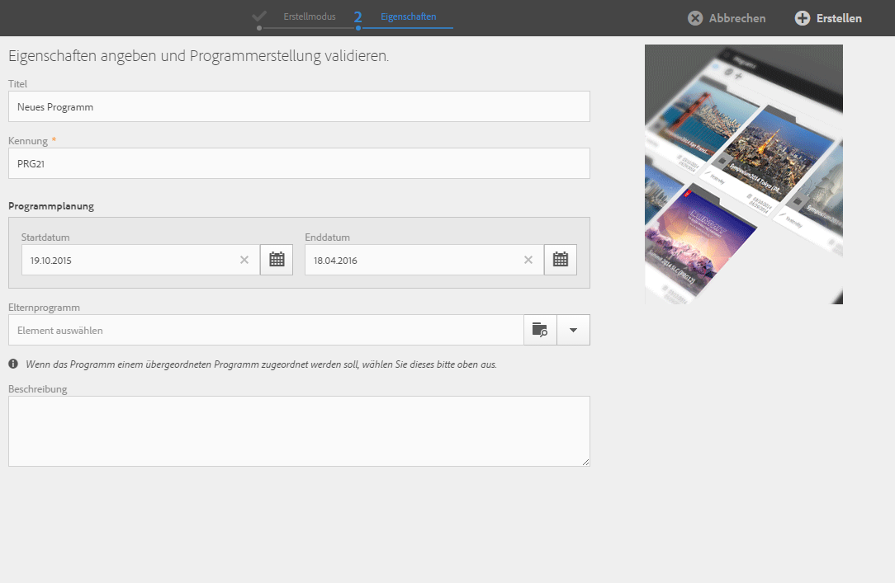

# Programme und Kampagnen{#programs-and-campaigns}

## Über Pläne, Programme und Kampagnen {#about-plans--programs-and-campaigns}

Adobe Campaign ermöglicht die Konzeption von Marketingkampagnen, innerhalb derer Sie verschiedene Aktivitäten wie E-Mails, SMS, Push-Benachrichtigungen, Workflows oder Landingpages erstellen und verwalten können. Kampagnen und deren Inhalte können in Programmen zusammengefasst werden.

Programme und Kampagnen erlauben die Zusammenfassung und übersichtliche Anzeige der ihnen zugeordneten Marketingaktivitäten.

* Ein **Programm** kann weitere Programme, Kampagnen, Workflows oder Landingpages enthalten. Programme werden in der Planung angezeigt und helfen Ihnen, Ihre Marketingaktivitäten zu ordnen: Sie können sie getrennt nach Land, Marke, Einheit etc. anzeigen.
* Mit einer **Kampagne** können Sie alle gewünschten Marketingaktivitäten in einer einzigen Einheit zusammenfassen. Eine Kampagne kann E-Mails, SMS, Push-Benachrichtigungen, Briefpost, Workflows und Landingpages enthalten.

Zur optimalen Organisation Ihrer Marketingpläne empfiehlt Adobe die folgende Hierarchie: Programm &gt; Unterprogramme &gt; Kampagnen &gt; Workflows &gt; Sendungen.

Mithilfe von Berichten lässt sich der Erfolg von Programmen und Kampagnen messen. Sie können beispielsweise Berichte auf Kampagnenebene erstellen, um Daten zu allen in dieser Kampagne enthaltenen Sendungen zu aggregieren.

**Verwandte Themen:**

* [Planung](../../start/using/timeline.md)
* [Über dynamische Berichte](../../reporting/using/about-dynamic-reports.md)

## Programme erstellen {#creating-a-program}

Ein Programm ist die höchste Organisationsebene Es kann Unterprogramme, Kampagnen, Workflows und Landingpages enthalten.

1. Wählen Sie auf der Adobe-Campaign-Startseite die Karte **[!UICONTROL Programme &amp; Kampagnen]aus.**
1. Wählen Sie die **[!UICONTROL Erstellen]-Schaltfläche aus.**
1. Wählen Sie im **[!UICONTROL Erstellmodus]-Bildschirm unter den verfügbaren Vorlagen den gewünschten Programmtyp aus.**

   

   The program types available are based on templates defined in the **[!UICONTROL Resources]** &gt; **[!UICONTROL Templates]** &gt; **[!UICONTROL Program templates]** section. Weiterführende Informationen finden Sie im Abschnitt [Marketingaktivitäten-Vorlagen](../../start/using/about-templates.md).

1. Geben Sie dann im **[!UICONTROL Eigenschaften]-Bildschirm den Titel und die Kennung des Programms ein.**

   

1. Definieren Sie ein Anfangs- und Enddatum für Ihr Programm. Diese Daten gelten nur für das Programm selbst.

   Sie haben die Möglichkeit, das Programm einem übergeordneten Programm zuzuordnen. Wählen Sie dieses unter den bereits existierenden Programmen aus.

1. Wählen Sie **[!UICONTROL Erstellen]aus, um die Erstellung des Programms zu bestätigen.**

Das Programm wird dann erstellt und angezeigt. Verwenden Sie die Schaltfläche **[!UICONTROL Erstellen], um Unterprogramme, Kampagnen, Workflows oder Landingpages hinzuzufügen.**

>[!NOTE]
>
>Programme können auch in der Liste der Marketingaktivitäten erstellt werden.

## Kampagnen erstellen {#creating-a-campaign}

Zu Programmen und Unterprogrammen können Kampagnen hinzugefügt werden. Kampagnen können Marketingaktivitäten wie E-Mails, SMS, Push-Benachrichtigungen, Workflows und Landingpages enthalten.

1. Wählen Sie auf der Adobe-Campaign-Startseite die Karte **[!UICONTROL Programme &amp; Kampagnen]aus und greifen Sie auf ein Programm oder Unterprogramm zu.**
1. Click on the **[!UICONTROL Create]** button and select **[!UICONTROL Campaign]**.
1. Wählen Sie im **[!UICONTROL Erstellmodus]-Bildschirm den gewünschten Kampagnentyp aus.**

   

   The campaign types available are based on templates defined in **[!UICONTROL Resources]** &gt; **[!UICONTROL Templates]** &gt; **[!UICONTROL Campaign templates]**. Weiterführende Informationen finden Sie im Abschnitt [Marketingaktivitäten-Vorlagen](../../start/using/about-templates.md).

1. Geben Sie dann im **[!UICONTROL Eigenschaften]-Bildschirm den Titel und die Kennung der Kampagne ein.**
1. Definieren Sie ein Anfangs- und Enddatum für Ihre Kampagne. Diese Daten gelten nur für die Kampagne selbst.

   

1. Wählen Sie **[!UICONTROL Erstellen]aus, um die Erstellung der Kampagne zu bestätigen.**

Die Kampagne wird dann erstellt und angezeigt. Verwenden Sie die Schaltfläche **[!UICONTROL Erstellen], um Ihrer Kampagne Marketingaktivitäten hinzuzufügen.**

>[!NOTE]
>
>Abhängig von Ihrem Lizenzvertrag stehen Ihnen möglicherweise nur einige der Aktivitäten zur Verfügung.

Kampagnen können auch ausgehend von der Marketingaktivitäten-Liste erstellt werden. Über das Eigenschaften-Fenster der Kampagne können Sie die Marketingaktivität mit einem Elternprogramm oder Unterprogramm verknüpfen.

## Symbole und Status von Programmen und Kampagnen {#programs-and-campaigns-icons-and-statuses}

Jedem Programm und jeder Kampagne der Liste ist eine Miniaturansicht beigefügt sowie ein Symbol, dessen Farbe den Ausführungsstatus anzeigt. Dieser Status hängt von dem für das Programm oder die Kampagne definierten Gültigkeitszeitraum ab.

* Grau: Das Startdatum des Programms/der Kampagne wurde noch nicht erreicht - Status **[!UICONTROL In Bearbeitung].**
* Blau: Das Programm/die Kampagne befindet sich innerhalb seiner/ihrer definierten Gültigkeit - Status **[!UICONTROL Gestartet].**
* Grün: Das Programm/die Kampagne hat sein/ihr Enddatum überschritten - Status **[!UICONTROL Abgeschlossen.]** Standardmäßig entspricht das Gültigkeitsstartdatum automatisch dem aktuellen Datum, und das Enddatum wird in Bezug auf das Startdatum berechnet (**T+186 Tage**). Bei Bedarf können Sie diese Daten in den Eigenschaften des Programms bzw. der Kampagne anpassen.

