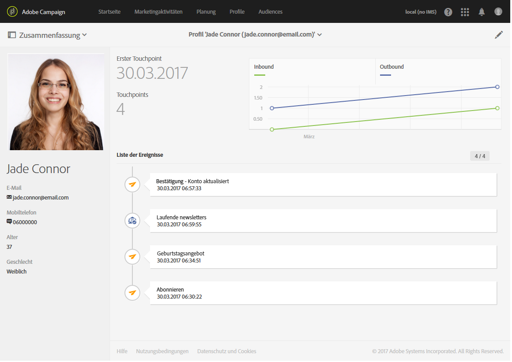

# Segmentierung und Targeting{#segmentation-and-targeting}

## Profile {#profiles}

Mithilfe des flexiblen Datenmodells von Adobe Campaign können Sie Ihre Kundenprofile anreichern und neue Attribute oder Tabellen hinzufügen. Diese Kundenprofile können Sie dann für eine präzisere Segmentierung, Personalisierung und Berichterstattung verwenden.

Die Adobe-Campaign-Profile stellen die Gesamtheit an in der Datenbank gespeicherten Kontakten dar. Jedes Profil entspricht einem Datensatz in der Datenbank, welcher alle nötigen Informationen zu seiner Qualifizierung, Verwendung in Zielgruppen und zum Tracking enthält. Bei einem Profil kann es sich also - je nach in der Organisation verwendeten Bezeichnungen - um Kunden, Interessenten, Newsletter-Abonnenten, Empfänger, Benutzer etc. handeln.

Mit der Kundenprofil-Funktion werden alle Kundendaten an einem zentralen Ort zusammengefasst.

Adobe Campaign bietet mehrere Möglichkeiten der Profilakquise: Online-Datenerfassung über [Landingpages](../../channels/using/getting-started-with-landing-pages.md), manuelle oder [automatische Importmechanismen](../../automating/using/about-data-import-and-export.md), die [direkte Eingabe](../../audiences/using/creating-profiles.md) über die Adobe Campaign-Benutzeroberfläche, im Bulk-Modus über [Campaign-APIs](../../api/using/about-campaign-standard-apis.md).

**Verwandte Themen:**

* Im Abschnitt [Profile](../../audiences/using/about-profiles.md) erfahren Sie über unterschiedliche Typen von Profilen.
* Wenn Sie die Anzahl **aktiver Profile** in Ihrem Unternehmen erfahren möchten, gehen Sie zu [diesem Abschnitt](../../audiences/using/active-profiles.md).
* Hier erfahren Sie, wie Sie mithilfe von [Workflow-Targeting-Funktionen](../../automating/using/about-targeting-activities.md) Ihre Daten anpassen und komplexe Datenverwaltungsaufgaben durchführen, wie z. B. Berechnungen, Aggregate, Deduplizierung und Verbindungen.

## Audiences  {#audiences}

Adobe Campaign vereint fortschrittliche Analyse- und Zielgruppenbestimmungsfunktionen, damit Sie relevante und effiziente Nachrichten versenden und mit Kunden effektiv interagieren können. Workflows und das grafische Abfragetool erlauben die Erstellung von Audiences, die verfügbare Informationen, das Verhalten, die Sprache, die Einstellungen und den Marketingverlauf Ihrer Kontakte berücksichtigen, um Ihre unterschiedlichen Kampagnen perfekt auf die angesprochenen Zielgruppen zuzuschneiden. Sie können beispielsweise angemeldete Profile filtern oder auf einer unbegrenzten Anzahl von Kriterien basierende Zielgruppen erstellen.

Audiences werden [auf dieser Seite](../../audiences/using/about-audiences.md) vorgestellt und im Abschnitt [Audiences](../../audiences/using/creating-audiences.md) näher erklärt.

**Verwandte Themen:**

* Hier erfahren Sie, wie Sie mehrsprachige Audiences in mehreren Regionen ansprechen können, indem Sie [mehrsprachige Push-Benachrichtigungen](../../channels/using/creating-a-multilingual-push-notification.md) oder [mehrsprachige E-Mails](../../channels/using/creating-a-multilingual-email.md) versenden.
* Hier erfahren Sie, wie Sie [Abfragen erstellen](../../audiences/using/creating-audiences.md#creating-query-audiences), um Audiences zu definieren.
* Hier erfahren Sie, wie Sie in einem Workflow [Audiences vom Typ &quot;Liste&quot;](../../audiences/using/creating-audiences.md#creating-list-audiences) erstellen.
* Hier erfahren Sie, wie Sie in einem Workflow [eine Audience aus einer Datei importieren](../../audiences/using/creating-audiences.md#creating-file-audiences).
* Hier erfahren Sie, wie Sie [Audiences](../../audiences/using/creating-audiences.md#creating-experience-cloud-audiences) in Experience Cloud-Lösungen verwenden können.

## Die Datenschutz-Grundverordnung {#general-data-protection-regulation}

Die DSGVO ist die neue Datenschutz-Grundverordnung der Europäischen Union (EU), in der die Anforderungen an den Datenschutz harmonisiert und neu geregelt werden. Die DSGVO gilt für Adobe-Campaign-Kunden, die Daten von Personen erfassen, die in der EU wohnhaft sind. Aus diesem Grund möchten wir als Datenverarbeiter Ihnen als Datenverantwortlichen zusätzlich zu den bereits in Adobe Campaign verfügbaren Datenschutzoptionen (Einverständnisverwaltung, Einstellungen für die Datenbeibehaltung und Benutzerrollen etc.) weitere Funktionen bereitstellen, mit deren Hilfe Sie DSGVO-konformes Verhalten sicherstellen können.

In diesem [Handbuch](https://docs.campaign.adobe.com/doc/standard/getting_started/de/ACS_GDPR.html) erfahren Sie mehr zu den Tools und Funktionen von Adobe Campaign, die Ihnen helfen, die DSGVO gesetzeskonform umzusetzen.

## Ermüdungsverwaltung {#fatigue-management}

Mit Ermüdungsregeln können Marketer globale, kanalübergreifende Geschäftsregeln festlegen, mit denen Profile, die bereits zu oft angesprochen wurden, automatisch von Kampagnen ausgeschlossen werden.

Um Ermüdungsregeln zu implementieren, müssen Sie eine Höchstzahl von Nachrichten pro Profil definieren und einen Zeitraum auswählen, in dem die Regel angewendet werden soll. Bei der Versandvorbereitung werden Profile vom Versand ausgeschlossen, wenn sie bereits eine bestimmte Anzahl an Nachrichten erhalten haben.

**Verwandte Themen:**

* Hier erfahren Sie anhand mehrerer Beispiele, wie Sie [Ermüdungsregeln erstellen](../../sending/using/fatigue-rules.md#examples).
* Hier erfahren Sie, wie Sie [Typologieregeln erstellen](../../sending/using/about-typology-rules.md).
* Mithilfe von [Filterregeln](../../sending/using/filtering-rules.md) können Sie die Audience Ihrer Nachrichten eingrenzen.
