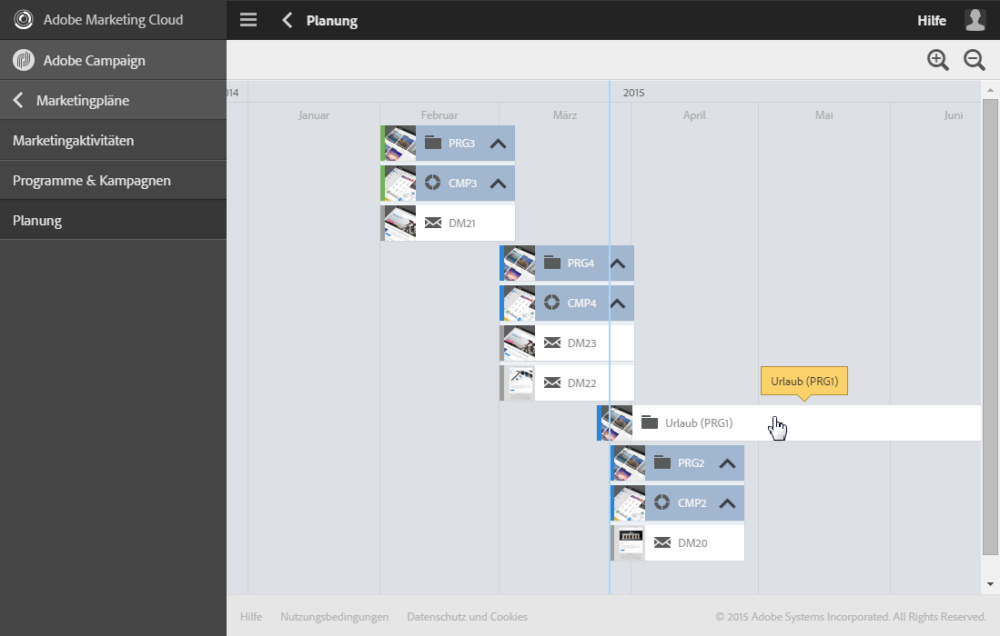
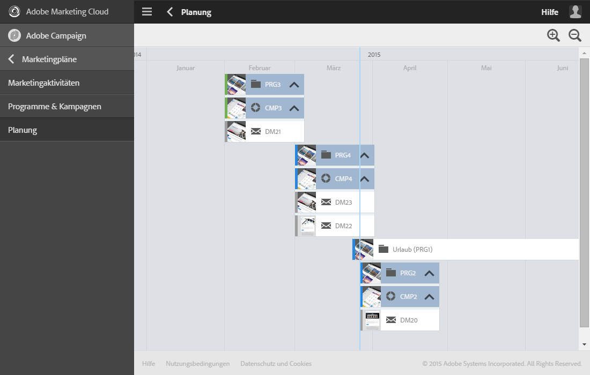
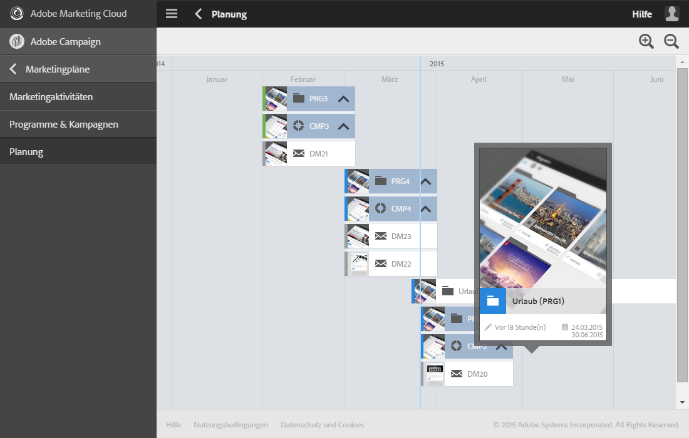

# Planung{#timeline}

Die **[!UICONTROL Planung]** zeigt laufende Programme und ihren Inhalt in einer zeitlichen Übersicht an.

Klicken Sie auf der Startseite auf die entsprechende Karte, um darauf zuzugreifen.

In der Planung erstrecken sich die Programme innerhalb einer Zeitleiste von ihrem Startdatum bis zum definierten Enddatum.

Jedes Programm wird durch einen Balken repräsentiert, der eine Miniaturansicht und den Titel des Programms enthält. Je nach Bildschirmbreite und der Anzahl anzuzeigender Elemente besteht die Möglichkeit, dass anstelle des Titels lediglich die Kennung des Programms angezeigt wird.

Das aktuelle Datum wird durch eine blaue senkrechte Linie symbolisiert, welche sich standardmäßig in der Mitte des Arbeitsbereichs befindet. Es besteht die Möglichkeit, den Arbeitsbereich nach rechts oder links zu verschieben, um andere Zeitabschnitte anzuzeigen.

Verwenden Sie die Symbole, um

*  den Umfang zu reduzieren oder die Detailgenauigkeit für einen begrenzteren Zeitraum zu erhöhen, bis Tage angezeigt werden
*  den Umfang zu vergrößern oder einen größeren Zeitraum anzuzeigen

Klicken Sie auf den Pfeil rechts im Programmbalken, um seine untergeordneten Elemente anzuzeigen. Ein Programm kann Unterprogramme, Kampagnen und Landingpages enthalten. Die Anzeige von Kampagnen lässt sich auf die gleiche Weise erzeugen. Eine Kampagne kann E-Mails, SMS und Landingpages enthalten.

>[!NOTE]
>
>Workflows haben keine zeitliche Dimension, sie werden daher nicht in der Planung abgebildet.

Wenn die in einem Programm oder einer Kampagne enthaltenen Elemente angezeigt werden, wird der entsprechende Balken blau hinterlegt und der Pfeil rechts wechselt seine Ausrichtung. Klicken Sie auf den Pfeil, um die Unterelemente auszublenden.

Jedem Element ist ein den Elementtyp repräsentierendes Symbol beigefügt:

*  Programm
*  Kampagne
*  Landingpage
*  E-Mail
*  SMS
*  Push-Benachrichtigung

Ein farbiger Streifen am linken Rand eines jeden Balkens gibt Hinweis auf den Status des entsprechenden Elements:

* Grau: Das Startdatum des Elements ist noch nicht erreicht.
* Blau: Das Element befindet sich in seiner Gültigkeitsphase.
* Grün: Das Element ist abgeschlossen.

Durch Klick auf ein Programm oder ein beliebiges anderes Element werden Sie zu seiner Karte weitergeleitet. Klicken Sie dann auf die Karte, um direkt auf den Inhalt des Elements zugreifen und ihn bearbeiten zu können.

Durch Klick außerhalb der Karte wird diese ausgeblendet.
