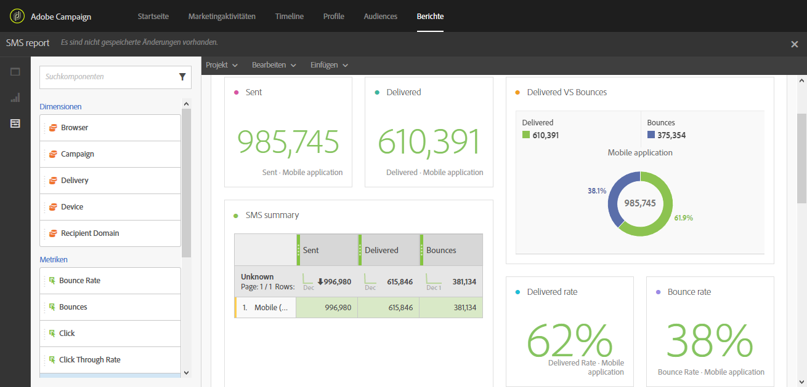

# Tracking, Monitoring und Reporting{#tracking-monitoring-and-reporting}

Adobe Campaign bietet nicht nur leistungsstarke native Reporting-Vorlagen, sondern ermöglicht auch die Erstellung benutzerdefinierter Berichte auf Versand-, Kampagnen-, Benutzer- oder Segmentebene. Verfolgen Sie Ihre Nachrichten und verstehen Sie das Verhalten Ihrer Kunden, indem Sie deren Profile nach und nach mit Daten anreichern. Mithilfe der Reporting- und Analysetools schlagen Sie aus jeder neuen Kampagne Kapital, während Sie Ihre Marketingaktivitäten besser abstimmen und deren Erfolg sowie ihr Kosten-Nutzen-Verhältnis optimieren.

Die Benutzeroberfläche erlaubt einen schnellen und einfachen Zugriff auf die wichtigsten Indikatoren und Versandstatistiken:

Die Benutzeroberfläche für Kampagnenberichte vereinfacht die Erstellung von dynamischen Berichten. Sie können per Drag &amp; Drop Variablen verwenden, um Berichte anzupassen und den Erfolg Ihrer Kampagnen zu analysieren. Je nach der Komplexität Ihrer Abfragen und Berechnungen können Sie die Daten in einer Listenansicht zusammenfassen oder in einem Format darstellen, das die Erstellung von Marketinganalyseberichten vereinfacht.

Weiterführende Informationen zu Berichten finden Sie im Abschnitt [Zugriff auf Berichte](../../reporting/using/about-dynamic-reports.md).

Mit Adobe Campaign können Sie jeden einzelnen Versand beobachten und verfolgen. Im Nachrichten-Dashboard werden spezielle Logs angezeigt, mit deren Hilfe Prozesse und Regeln verfolgt sowie mögliche Fehler und Warnhinweise erkannt werden können. Weiterführende Informationen zur Versandverfolgung finden Sie im Abschnitt [Sendungen beobachten. ](../../sending/using/monitoring-a-delivery.md) Tracking-Prinzipien und -Funktionen werden im Abschnitt [Nachrichten tracken](../../sending/using/tracking-messages.md) beschrieben.
