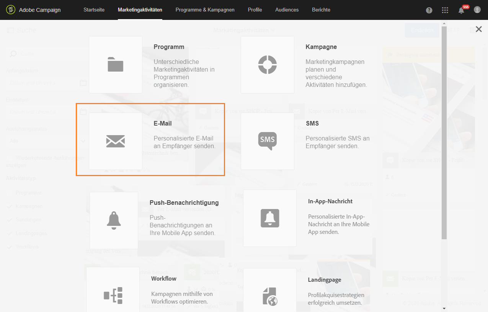
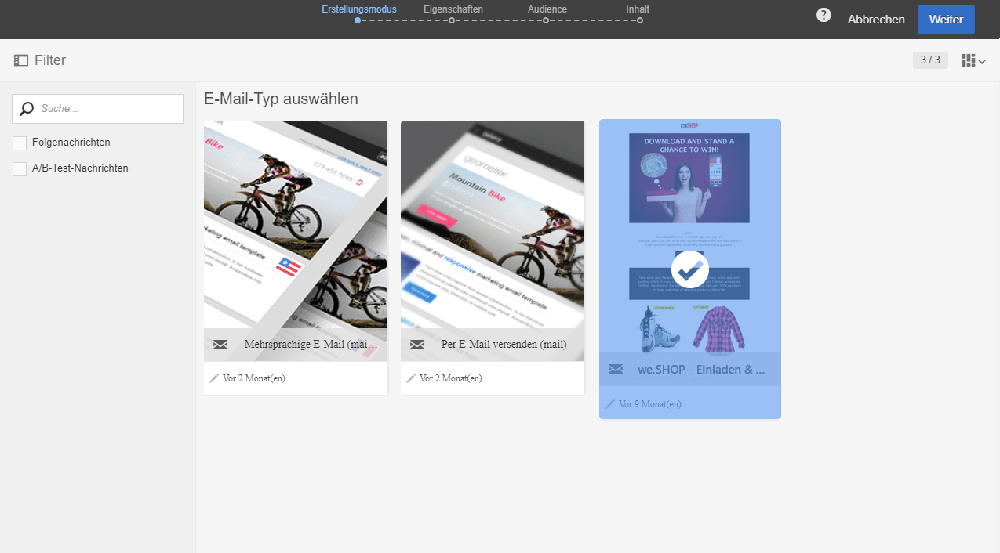

# Vorlagen verwenden{#using-a-template}

Im Folgenden wird die Verwendung der zuvor erstellten Vorlage dargestellt.

>[!NOTE]
>
>Die Erstellung einer auf Vorlagen basierenden Marketingaktivität erfolgt i. d. R. durch Benutzer mit Standardberechtigung.

1. Erstellen Sie eine neue Marketingaktivität.

   

1. Wählen Sie im ersten Schritt des Assistenten die Vorlage aus, die Sie verwenden möchten.

   

   Die Marketingaktivität übernimmt die in der Vorlage definierten Parameter.

   

